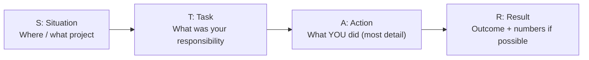

# Personal Interview Preparation

## Introduction

I am **Muhammad Muzammal Safdar**. I have a Bachelor's degree from **Virtual University**. I am currently working as a **Full Stack Developer at Axtra Studios**.

On the frontend, I work with **Tailwind CSS, React JS, Next JS, and TypeScript**. On the backend, I work with **Node JS, Express JS, MongoDB, and PostgreSQL**. I also have experience with **VPS and Cloud services**.

---

# Personal

## Tell me about yourself

Use the **Present → Past → Future** structure. Keep it to 60–90 seconds.

```text
┌───────────────┐    ┌───────────────┐    ┌───────────────┐
│   PRESENT     │ →  │     PAST      │ →  │    FUTURE     │
│ Who I am now  │    │ What I built  │    │ Why this role │
│ Role + stack  │    │ Skills gained │    │ What I want   │
└───────────────┘    └───────────────┘    └───────────────┘
```

1. Hi, I'm **Muhammad Muzammal Safdar**, a Full Stack MERN Developer.
2. I'm currently working at **Axtra Studios**, and I have **2 years of experience**.
3. I mostly work on the frontend using **JavaScript, TypeScript, React.js, Next.js, and Tailwind CSS**, and on the backend using **Node.js and Express.js**.
4. For databases, I work with **MongoDB and PostgreSQL**. For deployment, I have experience with **Vercel** and some **AWS services (EC2, S3, Amplify, Lightsail)**, along with **Docker**.
5. I've worked across the full stack — from building UI components and responsive interfaces to designing REST APIs, managing databases, and deploying applications.
6. Now I'm looking for a role where I can work on larger products and grow further as a full stack engineer.

---

# Why do you want to quit your previous job?

Stay **positive** — talk about what you are moving **towards**, never complain about the current company.

```text
❌ "My manager is bad / salary is low / work is boring"
✅ Grateful for current job → Want more growth → This role offers it
```

I am looking for a place that values hard work, offers a competitive salary, and provides great opportunities for learning, growth, and improving my technical skills.

---

# What are your strengths and weaknesses?

**Strength:** pick one that matters for the job and give proof.

> My strength is that I can work across the full stack. For example, I can build the React UI, write the Express API, and design the MongoDB/PostgreSQL schema for the same feature, so I understand how all the parts connect.

**Weakness:** pick a real but non-critical one, and show what you are doing to improve.

> Earlier, I sometimes spent too long trying to solve a problem alone before asking for help. Now I give myself a time limit, and if I'm stuck after that, I ask a teammate. It saves time for the whole team.

```text
Weakness answer = Real weakness → What I do about it → Result
```

---

# Tell me about a challenging problem you solved (STAR Method)

Use **STAR** for every behavioral question (challenge, failure, conflict, deadline).



**Template:**

- **Situation:** In my project at Axtra Studios, `[a page / API was slow, a bug in production, a tight deadline]`.
- **Task:** I was responsible for `[fixing it / delivering it]`.
- **Action:** I `[found the cause using X, added an index / caching / refactored Y, tested it]`.
- **Result:** `[Load time went from X to Y / bug fixed before release / client happy]`.

**Tip:** prepare 2–3 real stories in advance. One story can answer many questions.

---

# How do you handle conflict with a teammate?

```text
Listen to their view → Focus on the problem, not the person → Use data/facts → Agree on a solution → Escalate only if needed
```

> If I disagree with a teammate on a technical decision, I first listen to their reasoning. Then I explain mine with facts — for example performance numbers or a small proof of concept. Usually we find a middle ground. If we still can't agree, we ask the tech lead and I follow the decision fully.

---

# Why do you want to join our company?

Research the company before the interview. Connect **their product** with **your skills**.

```text
Their product / tech stack  +  My skills  +  My growth goal  =  Good answer
```

> I saw that your company works on `[product]` using `[React / Node / etc.]`. That matches my experience, and I'd like to work on a product with more users and larger scale, where I can learn from an experienced team.

---

# What are your salary expectations?

- Research the market range for your role and city first.
- Give a **range**, not one number, and keep the bottom of the range at a value you'd accept.
- If possible, ask about the full package and the role first.

> Based on my experience and the market for this role, I'm expecting something in the range of `[X – Y]`. But I'm flexible and open to discussing the complete package.

---

# Where do you see yourself in 5 years?

> I see myself as a senior full stack engineer, taking ownership of features end to end, making architecture decisions, and helping junior developers.

---

# Questions to ask the interviewer

Always ask at least one or two. It shows interest.

- What does a typical day look like for this role?
- What tech stack and tools does the team use?
- How is code reviewed and deployed?
- What would success look like in the first 3 months?
- What are the next steps in the hiring process?

---

# Technical Questions Asked in HR / First Round

## Difference Between Unidirectional vs Bidirectional Data Flow

| **Unidirectional Data Flow**                | **Bidirectional Data Flow**            |
| ------------------------------------------- | -------------------------------------- |
| Data flows in one direction only.           | Data can flow in both directions.      |
| Parent → Child                              | Parent ↔ Child                         |
| Easier to understand and debug.             | Can become harder to track and manage. |
| Provides better control over state changes. | State changes can be less predictable. |
| React mainly follows this approach.         | Common in some other frameworks.       |

```text
Unidirectional (React)             Bidirectional (e.g. Angular ngModel)

   Parent (state)                     Parent ◄──────┐
      │ props ▼                          │          │
   Child                              Child ────────┘
      │ calls onChange()                (child updates parent directly)
      └──► Parent updates state
```

**Example:**

* React JS uses **unidirectional data flow** where data is passed from parent components to child components through props. The child sends data back only by calling a function (callback) the parent passed down.

---

## How do you persist state in an application?

State can be persisted using:

1. **Browser Storage**

   * localStorage
   * sessionStorage

2. **Cookies**

3. **IndexedDB**

4. **Backend Database**

   * Store user/application data on the server and retrieve it when needed.

```text
Survives tab close?     sessionStorage ✗   localStorage ✓   cookies ✓   IndexedDB ✓
Shared across devices?  Only backend database ✓
Sent to server?         Only cookies (automatically with each request)
```

---

## Difference Between localStorage and sessionStorage

| **localStorage**                                                           | **sessionStorage**                                                    |
| -------------------------------------------------------------------------- | --------------------------------------------------------------------- |
| Stores data permanently until manually cleared by the user or application. | Stores data only for the current browser session.                     |
| Data remains available even after closing and reopening the browser.       | Data is removed when the browser tab is closed.                       |
| Shared across all tabs of the same origin.                                 | Separate for each tab.                                                |
| Maximum storage is usually around 5-10 MB depending on the browser.        | Maximum storage is usually similar but limited to the active session. |
| Commonly used for preferences and persistent settings.                     | Commonly used for temporary session-related data.                     |

```text
Tab A ─┐                       Tab A ──► sessionStorage A
Tab B ─┼──► one localStorage   Tab B ──► sessionStorage B
Tab C ─┘                       (close tab → its data is gone)
```

---

## Synchronous vs Asynchronous

| **Synchronous (readFileSync)**                       | **Asynchronous (readFile)**                                |
| ---------------------------------------------------- | ---------------------------------------------------------- |
| Executes one task at a time.                         | Can handle other tasks while waiting.                      |
| The next task waits until the current task finishes. | Does not block the execution flow.                         |
| Blocking operation.                                  | Non-blocking operation.                                    |
| Follows a linear execution flow.                     | Uses an event-driven approach.                             |
| Example: Normal function execution.                  | Examples: `setTimeout`, API requests, Promises, callbacks. |

```text
Synchronous:   [Task A ██████] [Task B ████] [Task C ██]      → total = A + B + C

Asynchronous:  [Start A]──waiting──[A done]
               [Task B ████]
               [Task C ██]                                    → B and C run while A waits
```

---

# Summary

I am a Full Stack MERN Developer with experience in building scalable web applications using modern frontend and backend technologies. I have worked with React, Next.js, TypeScript, Node.js, Express.js, MongoDB, PostgreSQL, Docker, and cloud deployment services. I focus on writing clean, maintainable code and continuously improving my technical skills.
