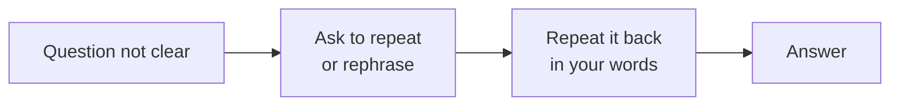

# English Interview

Phrases you will actually use in an interview, with Urdu meaning. Practise saying them out loud.

---

## How to answer any technical question in English

Use the same simple 3-step structure every time. Short sentences are fine — clear is better than fancy.

```text
┌──────────────┐    ┌──────────────┐    ┌───────────────────┐
│ 1. WHAT      │ →  │ 2. WHY / HOW │ →  │ 3. EXAMPLE        │
│ "X is ..."   │    │ "It works by"│    │ "For example, in  │
│ one sentence │    │ "We use it   │    │  my project I ..."│
│              │    │  because..." │    │                   │
└──────────────┘    └──────────────┘    └───────────────────┘
```

Example:

> **What:** A closure is a function that remembers variables from its outer scope.
> **Why:** It is useful because it lets us keep private data.
> **Example:** For example, in my project I used a closure to build a debounce function for a search input.

---

## Starting the interview

| English                                                | Urdu                                             |
| ------------------------------------------------------ | ------------------------------------------------ |
| Good morning / Good afternoon.                         | صبح بخیر / سہ پہر بخیر                            |
| Thank you for having me.                               | مجھے بلانے کا شکریہ                               |
| I'm doing well, thank you. How about you?              | میں ٹھیک ہوں، شکریہ۔ آپ کیسے ہیں؟                   |
| Nice to meet you.                                      | آپ سے مل کر خوشی ہوئی                             |
| Can you hear me clearly? (online interview)            | کیا آپ مجھے صاف سن سکتے ہیں؟                       |

---

## When you don't understand the question

Never guess silently. Asking is normal and professional.



| English                                                  | Urdu                                          |
| -------------------------------------------------------- | --------------------------------------------- |
| Sorry, could you please repeat the question?             | معاف کیجیے، کیا آپ سوال دوبارہ دہرا سکتے ہیں؟     |
| Could you please explain that a little more?             | کیا آپ تھوڑا اور وضاحت کر سکتے ہیں؟              |
| Just to confirm, you are asking about ... , right?       | تصدیق کے لیے، آپ ... کے بارے میں پوچھ رہے ہیں، ٹھیک؟ |
| Do you mean ... or ... ?                                 | آپ کا مطلب ... ہے یا ... ؟                       |

---

## When you need time to think

| English                                                  | Urdu                                     |
| -------------------------------------------------------- | ---------------------------------------- |
| That's a good question. Let me think for a moment.       | اچھا سوال ہے۔ مجھے ایک لمحہ سوچنے دیں      |
| Let me think out loud.                                   | میں بول کر سوچتا ہوں                       |
| Let me start with a simple approach and then improve it. | میں سادہ طریقے سے شروع کر کے بہتر کرتا ہوں  |

---

## When you don't know the answer

Be honest, then show how you would find it.

| English                                                                       | Urdu                                                         |
| ----------------------------------------------------------------------------- | ------------------------------------------------------------ |
| I haven't worked with that directly, but I think it works like this ...        | میں نے براہِ راست اس پر کام نہیں کیا، لیکن میرے خیال میں ...   |
| I'm not 100% sure, but my understanding is ...                                | مجھے پورا یقین نہیں، لیکن میری سمجھ کے مطابق ...                |
| I don't know that yet, but I would check the documentation and learn it quickly. | ابھی مجھے نہیں معلوم، لیکن میں ڈاکیومنٹیشن دیکھ کر جلدی سیکھ لوں گا |

---

## Talking about your work

| English                                                           | Urdu                                                  |
| ----------------------------------------------------------------- | ----------------------------------------------------- |
| I am currently working as a Full Stack Developer at ...           | میں اس وقت ... میں فل اسٹیک ڈویلپر کے طور پر کام کر رہا ہوں |
| I was responsible for building the frontend and the APIs.         | میں فرنٹ اینڈ اور APIs بنانے کا ذمہ دار تھا               |
| I worked with a team of four developers.                          | میں نے چار ڈویلپرز کی ٹیم کے ساتھ کام کیا                |
| The main challenge was ... , and I solved it by ...               | سب سے بڑا چیلنج ... تھا، اور میں نے اسے ... سے حل کیا      |
| As a result, the page became twice as fast.                       | نتیجے میں، صفحہ دو گنا تیز ہو گیا                         |

---

## Ending the interview

| English                                                  | Urdu                                        |
| -------------------------------------------------------- | ------------------------------------------- |
| Yes, I have a few questions, if that's okay.             | جی، اگر اجازت ہو تو میرے چند سوالات ہیں        |
| What are the next steps in the process?                  | اس عمل کے اگلے مراحل کیا ہیں؟                 |
| Thank you for your time. I enjoyed this conversation.    | آپ کے وقت کا شکریہ۔ مجھے یہ گفتگو اچھی لگی     |
| I look forward to hearing from you.                      | آپ کے جواب کا انتظار رہے گا                   |

---

## Common mistakes to avoid

| ❌ Avoid                           | ✅ Say instead                              |
| --------------------------------- | ------------------------------------------ |
| "I am having 2 years experience." | "I have 2 years of experience."            |
| "Listen to me."                   | "If I may explain ..."                     |
| "I did not understood."           | "I did not understand."                    |
| "Myself Ali."                     | "My name is Ali." / "I'm Ali."             |
| "What is your good name?"         | "May I know your name?"                    |
| "Do the needful."                 | "Could you please ..."                     |

---

# Rarely Asked (Lower Priority)

Simple daily sentences for general speaking practice. Not interview-specific.

## Greetings

| English               | Urdu                         |
| --------------------- | ---------------------------- |
| Hello, how are you?   | السلام علیکم، آپ کیسے ہیں؟     |
| I am fine, thank you. | میں ٹھیک ہوں، شکریہ           |
| What is your name?    | آپ کا نام کیا ہے؟             |
| My name is Ali.       | میرا نام علی ہے               |
| Nice to meet you.     | آپ سے مل کر خوشی ہوئی         |
| Where are you from?   | آپ کہاں سے ہیں؟               |
| I am from Pakistan.   | میں پاکستان سے ہوں            |
| How is your day?      | آپ کا دن کیسا ہے؟             |
| My day is good.       | میرا دن اچھا ہے               |
| What are you doing?   | آپ کیا کر رہے ہیں؟            |

## Daily Use Sentences

| English               | Urdu                        |
| --------------------- | --------------------------- |
| I am going to work.   | میں کام پر جا رہا ہوں         |
| I am going to school. | میں اسکول جا رہا ہوں          |
| Are you busy?         | کیا آپ مصروف ہیں؟            |
| Yes, I am busy.       | ہاں، میں مصروف ہوں            |
| No, I am free.        | نہیں، میں فارغ ہوں            |
| Let’s go together.    | آؤ ساتھ چلتے ہیں              |
| Wait for me.          | میرا انتظار کرو               |
| I am coming.          | میں آ رہا ہوں                 |
| Please sit here.      | یہاں بیٹھیں                   |
| Listen to me.         | میری بات سنو                  |

## Asking Questions

| English                | Urdu                              |
| ---------------------- | --------------------------------- |
| What is this?          | یہ کیا ہے؟                         |
| Where are you going?   | آپ کہاں جا رہے ہیں؟                |
| When will you come?    | آپ کب آئیں گے؟                     |
| Why are you late?      | آپ دیر سے کیوں آئے؟                |
| Who is he?             | وہ کون ہے؟                         |
| How do you do this?    | آپ یہ کیسے کرتے ہیں؟               |
| Can you help me?       | کیا آپ میری مدد کر سکتے ہیں؟        |
| Do you understand?     | کیا آپ سمجھتے ہیں؟                 |
| What do you mean?      | آپ کا کیا مطلب ہے؟                 |
| Can you repeat that?   | کیا آپ دوبارہ کہہ سکتے ہیں؟         |

## Giving Answers

| English            | Urdu                     |
| ------------------ | ------------------------ |
| I understand.      | میں سمجھ گیا ہوں           |
| I don’t understand.| میں نہیں سمجھا             |
| Yes, I can.        | ہاں، میں کر سکتا ہوں        |
| No, I can’t.       | نہیں، میں نہیں کر سکتا      |
| I will try.        | میں کوشش کروں گا           |
| I agree.           | میں متفق ہوں               |
| I don’t agree.     | میں متفق نہیں ہوں           |
| That is right.     | یہ درست ہے                 |
| That is wrong.     | یہ غلط ہے                  |
| It is easy.        | یہ آسان ہے                 |

## Polite Sentences

| English              | Urdu                    |
| -------------------- | ----------------------- |
| Please help me.      | براہِ کرم میری مدد کریں   |
| Thank you very much. | بہت شکریہ               |
| You’re welcome.      | کوئی بات نہیں            |
| Excuse me.           | معاف کیجیے              |
| I am sorry.          | مجھے معاف کریں           |
| No problem.          | کوئی مسئلہ نہیں          |
| Please come in.      | اندر آئیں                |
| Please wait.         | انتظار کریں              |
| Take care.           | اپنا خیال رکھیں          |
| See you later.       | پھر ملیں گے              |
