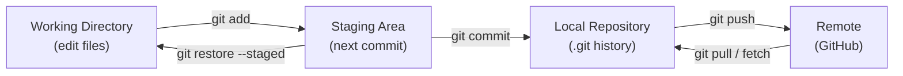
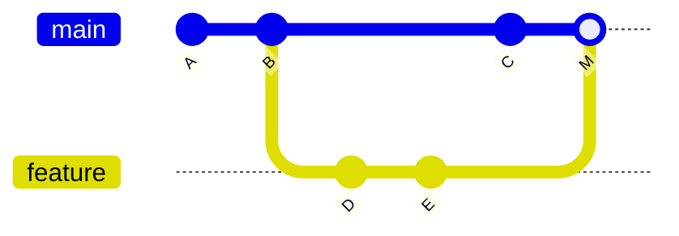
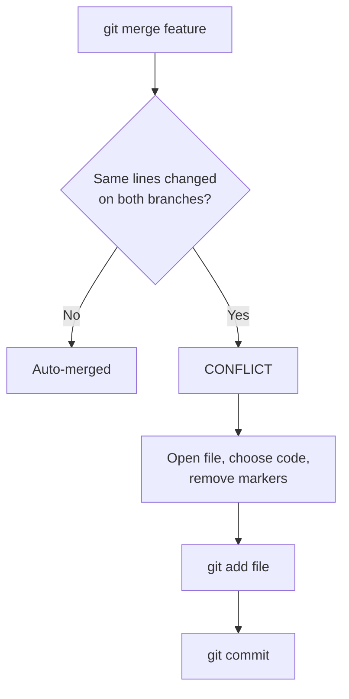
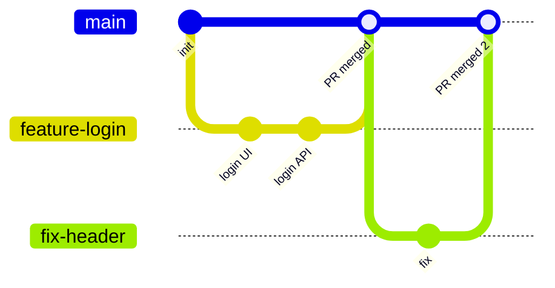

# Git Interview Preparation

---

# Difference Between Git and GitHub

| Git | GitHub |
|---|---|
| Git is a distributed version control system. | GitHub is a platform that hosts Git repositories. |
| Used to track code changes locally. | Used for collaboration and sharing code online. |
| Works on your local machine. | Works as a remote repository hosting service. |
| Example: `git commit`, `git branch` | Example: Pull requests, Issues, Code reviews |

```text
Your laptop (Git)                         GitHub (remote)
┌──────────────────┐   git push   ┌──────────────────────┐
│ full repo +      │ ───────────► │ shared copy of repo  │
│ full history     │ ◄─────────── │ + PRs, Issues, CI    │
└──────────────────┘   git pull   └──────────────────────┘
```

**Distributed** means every developer has the full history locally, so you can commit, branch, and view history without internet.

---

# What are the Three Main Areas/States of Git?



Git has three main areas:

## 1. Working Directory

- Where you create and modify files.
- New files are **untracked** until you `git add` them. Changes to already-tracked files show as **modified**, but they are not part of the next commit until staged.

Example:

```bash
git status
```

---

## 2. Staging Area

- Where you prepare changes before committing.
- Files are added using `git add`.
- Lets you commit only some of your changes.

Example:

```bash
git add file.js
```

---

## 3. Repository

- Where Git permanently stores committed changes (the `.git` folder).

Example:

```bash
git commit -m "Add new feature"
```

---

# What is HEAD?

`HEAD` is a pointer to **where you are right now** — usually the latest commit of the current branch.

```text
A ── B ── C   ← main ← HEAD
```

- `HEAD~1` = one commit before HEAD, `HEAD~2` = two before.
- **Detached HEAD** = HEAD points directly to a commit, not a branch (for example after `git checkout <commit-id>`). New commits there can be lost unless you create a branch.

---

# Difference Between `git merge` and `git rebase`

| `git merge` | `git rebase` |
|---|---|
| Combines two branches together. | Moves (replays) your commits on top of another branch. |
| Keeps the original commit history. | Creates a cleaner linear history. |
| Creates a merge commit. | Rewrites commit history (new commit IDs). |
| Safer for shared branches. | Better for cleaning local branches. |

**Before** — `feature` was created from `main` at B, then both moved on:

```text
          D ── E        feature
         /
A ── B ── C             main
```

**After `git merge feature` (on main)** — a new merge commit M joins them:



**After `git rebase main` (on feature)** — D and E are replayed on top of C as new commits D' and E':

```text
A ── B ── C ── D' ── E'     feature
          ↑
         main
```

**Golden rule:** never rebase commits that are already pushed to a shared branch — it rewrites history that others have.

Example:

### Merge

```bash
git checkout main
git merge feature
```

### Rebase

```bash
git checkout feature
git rebase main
```

---

# Difference Between `git fetch` and `git pull`

| `git fetch` | `git pull` |
|---|---|
| Downloads latest changes from remote repository. | Downloads and applies changes to current branch. |
| Does not modify your working code. | Updates your current working branch. |
| Safer for reviewing changes first. | Faster way to update your branch. |

```text
git pull  =  git fetch  +  git merge   (or + git rebase with --rebase)

Remote ──fetch──► origin/main (remote-tracking branch) ──merge──► main (your branch)
       └──────────────────── pull does both ─────────────────────┘
```

Example:

```bash
git fetch origin
```

```bash
git pull origin main
```

---

# What Does `git stash` Do?

`git stash` temporarily saves uncommitted changes and gives you a clean working directory.

```text
Working dir (dirty) ──git stash──► Stash stack [stash@{0}]   Working dir: clean
                                                              ↓ switch branch, fix bug, come back
Working dir (dirty) ◄──git stash pop── Stash stack
```

## When to use:

- Switching branches without committing unfinished work.
- Temporarily saving changes.
- Working on another task.

Example:

```bash
git stash
git stash list        # see all stashes
```

Restore changes:

```bash
git stash pop         # apply and remove from stash
git stash apply       # apply but keep it in stash
```

**Note:** untracked (new) files are not stashed by default. Use `git stash -u`.

---

# Difference Between `git reset` and `git revert`

| `git reset` | `git revert` |
|---|---|
| Moves the branch back, removing commits from history. | Creates a new commit that reverses changes. |
| Rewrites commit history. | Keeps existing history. |
| Usually used for local commits. | Safer for shared branches. |

```text
Start:        A ── B ── C   (main)

git reset HEAD~1:
              A ── B        (main)          C is gone from history

git revert C:
              A ── B ── C ── C'  (main)     C' undoes C, history kept
```

### The three reset modes

| Mode | Commit removed | Staged changes | Working files |
|---|---|---|---|
| `--soft` | yes | kept (staged) | kept |
| `--mixed` (default) | yes | unstaged | kept |
| `--hard` | yes | deleted | **deleted** |

Example:

### Reset

```bash
git reset HEAD~1          # default --mixed: undo commit, keep changes in files
git reset --hard HEAD~1   # undo commit AND throw away changes (dangerous)
```

### Revert

```bash
git revert commit_id
```

---

# How Do You Resolve a Merge Conflict?

A conflict happens when two branches change **the same lines** of the same file, and Git can't decide which to keep.



Steps:

1. Check conflicted files.

```bash
git status
```

2. Open the conflicted file.

3. Decide which code to keep.

Conflict example:

```text
<<<<<<< HEAD
Your code
=======
Incoming code
>>>>>>> branch-name
```

4. Remove conflict markers:

```text
<<<<<<<
=======
>>>>>>>
```

5. Add the resolved file.

```bash
git add file.js
```

6. Commit changes.

```bash
git commit -m "Resolve merge conflict"
```

To cancel the merge completely: `git merge --abort`.

---

# What is `git cherry-pick`?

Copies **one specific commit** from another branch onto your current branch.

```text
feature:  A ── B ── X ── Y
main:     A ── B ── C

git checkout main
git cherry-pick X

main:     A ── B ── C ── X'     (only X is copied, not Y)
```

**Use case:** a bug fix was committed on a feature branch, and you need only that fix on `main` right now.

```bash
git cherry-pick <commit-id>
```

---

# What is a Branching Strategy? (Git Flow vs Trunk-Based)

A branching strategy is the team's rule for how branches are created and merged.

### Feature branch workflow (most common)



1. Create a branch from `main` for each feature or fix.
2. Push it and open a **Pull Request**.
3. Code review + CI checks pass.
4. Merge into `main`, then deploy.

| Git Flow | Trunk-Based |
|---|---|
| Long-lived `main`, `develop`, `release/*`, `hotfix/*` branches | One main branch (`main` / trunk) |
| Good for scheduled releases | Good for continuous deployment |
| More process, more merges | Short-lived branches, merged daily |

---

# What is `.gitignore`?

A file that tells Git which files and folders **not to track**.

```gitignore
node_modules/
.env
dist/
*.log
.DS_Store
```

```text
project/
├── src/           ✓ tracked
├── node_modules/  ✗ ignored (can be reinstalled)
├── .env           ✗ ignored (secrets!)
└── .gitignore
```

**Note:** `.gitignore` does not affect files that are already tracked. To stop tracking one: `git rm --cached .env`.

---

# What is the Difference Between `origin` and `upstream`?

```text
Original repo (upstream)  ──fork──►  Your GitHub copy (origin)  ──clone──►  Your laptop
          ▲                                                                     │
          └──────────────────── Pull Request ◄──── git push origin ─────────────┘
```

- **origin** — the remote you cloned from (usually your copy).
- **upstream** — the original repo you forked from. Use `git fetch upstream` to stay updated.

---

# What is Squashing Commits?

Combining many small commits into one clean commit before merging.

```text
Before:  A ── "wip" ── "fix typo" ── "fix again" ── "done"
After:   A ── "Add login feature"
```

Most often done with **"Squash and merge"** on a GitHub Pull Request, or locally with `git rebase -i HEAD~4`.

---

# Common Git Commands

| Task | Command |
|---|---|
| Check status | `git status` |
| Initialize repository | `git init` |
| Clone repository | `git clone repository-url` |
| Add files | `git add .` |
| Commit changes | `git commit -m "commit message"` |
| Push changes | `git push origin main` |
| Pull latest changes | `git pull origin main` |
| Create branch | `git branch feature-name` |
| Create and switch branch | `git switch -c feature-name` (or `git checkout -b`) |
| Switch branch | `git switch branch-name` (or `git checkout branch-name`) |
| View commit history | `git log --oneline --graph` |
| See changes | `git diff` |

```text
A typical day:
git pull → git switch -c feature/x → edit → git add . → git commit → git push → open PR
```

---

# Git Interview Topics Checklist

- Git vs GitHub
- Git states (Working Directory, Staging Area, Repository)
- HEAD and detached HEAD
- git merge vs git rebase
- git fetch vs git pull
- git stash
- git reset (soft / mixed / hard) vs git revert
- Merge conflict resolution
- git cherry-pick
- Branching strategy (feature branch, Git Flow, trunk-based)
- .gitignore
- origin vs upstream
- Squashing commits
- Common Git commands

---

# Rarely Asked (Lower Priority)

## Essential First-Time Git Setup

### Set Your Name

```bash
git config user.name "Your Name"
```

Set globally:

```bash
git config --global user.name "Your Name"
```

### Set Your Email

```bash
git config user.email "your.email@example.com"
```

Set globally:

```bash
git config --global user.email "your.email@example.com"
```

```text
--global  → saved in ~/.gitconfig, applies to all repos
(no flag) → saved in this repo's .git/config, overrides global
```

---

## Remove Old GitHub Saved Login (Windows)

Run this command in terminal:

```bash
cmdkey /delete:LegacyGeneric:target=git:https://github.com
```
