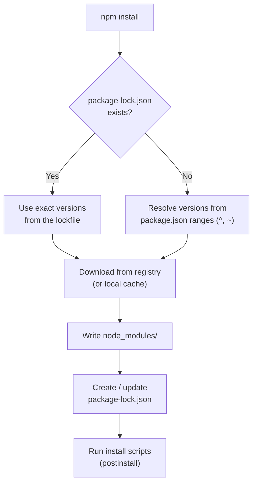

# Node Package Manager (NPM)

## What is NPM?

**NPM (Node Package Manager)** is a package management tool for JavaScript and Node.js projects. It is used through the **CLI (Command Line Interface)** to:

* Install packages
* Update dependencies
* Remove packages
* Manage project dependencies

It also refers to the **npm registry** — the online database (npmjs.com) where packages are published.

```text
npmjs.com registry  ──npm install──►  node_modules/  (your project)
        ▲
        └────────── npm publish ────  your package
```

---

# What happens when you run `npm install`?



---

# package.json

`package.json` is the project's **manifest file** that stores metadata and configuration information about the application.

It contains:

* Project name
* Version
* Scripts
* Dependencies
* DevDependencies
* Other project settings

Example:

```json
{
  "name": "my-app",
  "version": "1.0.0",
  "scripts": {
    "start": "node index.js",
    "dev": "nodemon index.js",
    "test": "jest"
  },
  "dependencies": {
    "express": "^4.19.2"
  },
  "devDependencies": {
    "jest": "^29.7.0"
  }
}
```

Run a script with `npm run dev`. (`start` and `test` also work without `run`: `npm start`, `npm test`.)

---

# package-lock.json

`package-lock.json` is an **automatically generated file** that records the exact versions of all installed packages and their sub-dependencies inside the `node_modules` folder.

```text
package.json         "express": "^4.19.2"     → a RANGE  (any 4.x.x ≥ 4.19.2)
package-lock.json    "express": "4.19.2"      → the EXACT version installed
                     + every sub-dependency, exact version + integrity hash
```

It ensures:

* Consistent installations across different environments
* Exact dependency versions
* Reliable builds in development and production

**Always commit the lockfile.** Never commit `node_modules`.

---

# Difference Between dependencies and devDependencies

```text
                        Needed at runtime in production?
                         ┌───────────┴───────────┐
                        YES                       NO
                         │                        │
                  dependencies             devDependencies
              express, react, axios     jest, eslint, typescript,
                                         nodemon, vite
```

## dependencies

`dependencies` are packages required for the application to run in production.

Examples:

* `express`
* `react`
* `lodash`

Install using:

```bash
npm install package-name
```

---

## devDependencies

`devDependencies` are packages only needed during local development, testing, and building.

Examples:

* `jest`
* `eslint`
* `typescript`

Install using:

```bash
npm install package-name --save-dev
```

`npm install --omit=dev` (or `NODE_ENV=production npm install`) skips devDependencies — used in production servers and Docker images.

---

# What are peerDependencies?

A **peerDependency** says: "I need this package, but **the app that uses me** must install it — don't install a second copy."

Used by **plugins and libraries**, for example a React component library.

```text
Without peerDependencies:            With peerDependencies:

my-app                               my-app
├── react@18                         ├── react@18   ◄── one shared copy
└── ui-lib                           └── ui-lib
    └── react@17   ✗ two Reacts           (peer: react >=17) ✓ uses app's React
                     → bugs
```

```json
{
  "name": "ui-lib",
  "peerDependencies": {
    "react": ">=17"
  }
}
```

---

# Difference Between npm install and npm ci

| Command       | Description                                                                                                                                                      |
| ------------- | ---------------------------------------------------------------------------------------------------------------------------------------------------------------- |
| `npm install` | Reads `package.json` and installs dependencies. It can update `package-lock.json` if newer compatible versions are available.                                    |
| `npm ci`      | Performs a clean installation using only `package-lock.json`. It removes the existing `node_modules` folder and is faster and more reliable for CI/CD pipelines. |

```text
npm install:  package.json ──► resolve ──► node_modules  (+ may rewrite lockfile)
npm ci:       delete node_modules ──► lockfile only ──► node_modules
              (fails if package.json and lockfile don't match)
```

## npm install

* Used during normal development
* Can modify `package-lock.json`
* Installs missing dependencies

## npm ci (Clean Install)

* Used in automated environments
* Strictly follows `package-lock.json`
* Deletes existing `node_modules`
* Never writes to `package-lock.json`; fails if it is out of sync with `package.json`
* Provides faster and predictable installations

---

# Semantic Versioning — Caret (^) and Tilde (~)

Versions follow **MAJOR.MINOR.PATCH**:

```text
     4   .   19   .   2
     │       │        └── PATCH: bug fix, safe
     │       └─────────── MINOR: new feature, backward compatible
     └─────────────────── MAJOR: breaking change
```

Version symbols control which package updates are allowed.

```text
"^1.2.3"  →  1.2.3  ✓  1.2.9  ✓  1.9.0  ✓  2.0.0  ✗     (lock MAJOR)
"~1.2.3"  →  1.2.3  ✓  1.2.9  ✓  1.3.0  ✗              (lock MAJOR.MINOR)
"1.2.3"   →  only 1.2.3                                (exact)
```

## Caret (^)

The **caret (`^`)** allows updates to **minor and patch versions**.

Example:

```json
"express": "^1.2.3"
```

Allows:

```text
1.2.4
1.3.0
```

Does not allow:

```text
2.0.0
```

**Exception for 0.x versions:** `^0.2.3` allows only `0.2.x` (not `0.3.0`), because in 0.x a minor bump can be breaking.

---

## Tilde (~)

The **tilde (`~`)** allows updates only to **patch versions**.

Example:

```json
"express": "~1.2.3"
```

Allows:

```text
1.2.4
```

Does not allow:

```text
1.3.0
```

---

# What is npx?

`npx` **runs** a package's command without installing it globally.

```text
npm  → installs packages
npx  → executes a package binary (downloads temporarily if not installed)
```

```bash
npx create-next-app@latest my-app   # run once, no global install
npx eslint .                        # run the project's local eslint
```

---

# npm vs Yarn vs pnpm vs Bun

Four major and widely used package managers are **npm, Yarn, pnpm, and Bun**.

| Feature           | npm                   | Yarn                    | pnpm                                   | Bun                          |
| ----------------- | --------------------- | ----------------------- | -------------------------------------- | ---------------------------- |
| Comes with Node   | Yes                   | No                      | No                                     | No (separate runtime)        |
| Lockfile          | `package-lock.json`   | `yarn.lock`             | `pnpm-lock.yaml`                       | `bun.lock`                   |
| Disk usage        | Copy per project      | Copy per project (v1)   | One global store + links (saves space) | Copy per project             |
| Speed             | Good                  | Good                    | Fast                                   | Very fast                    |
| Strict deps       | No (flat hoisting)    | No (v1)                 | Yes — can't import undeclared packages | No                           |
| Workspaces        | Yes                   | Yes                     | Yes                                    | Yes                          |

```text
npm / yarn:                         pnpm:

project-A/node_modules/react  ┐     ~/.pnpm-store/react@18  ◄── stored once
project-B/node_modules/react  ┤          ▲         ▲
project-C/node_modules/react  ┘          │ link    │ link
   (3 copies on disk)              project-A    project-B
```

**Rule:** use one package manager per project — don't mix lockfiles.

---

# Global vs Local Install

| Local (default)                    | Global (`-g`)                            |
| ---------------------------------- | ---------------------------------------- |
| Installed in project `node_modules` | Installed once for the whole machine     |
| Listed in `package.json`           | Not listed in any project                |
| Version fixed per project          | Same version everywhere                  |
| Preferred for libraries and tools  | Only for CLIs you use everywhere         |

```bash
npm install express        # local
npm install -g nodemon     # global
```

---

# Summary

| Concept           | Purpose                                                     |
| ----------------- | ----------------------------------------------------------- |
| npm               | Package manager used to install and manage Node.js packages |
| package.json      | Stores project metadata, scripts, and dependencies          |
| package-lock.json | Locks exact dependency versions                             |
| dependencies      | Packages required in production                             |
| devDependencies   | Packages required only for development                      |
| peerDependencies  | Package the host app must provide (plugins, libraries)      |
| npm install       | Flexible dependency installation                            |
| npm ci            | Clean and exact installation for CI/CD                      |
| npx               | Run a package command without a global install              |
| ^                 | Allows minor and patch updates                              |
| ~                 | Allows only patch updates                                   |
