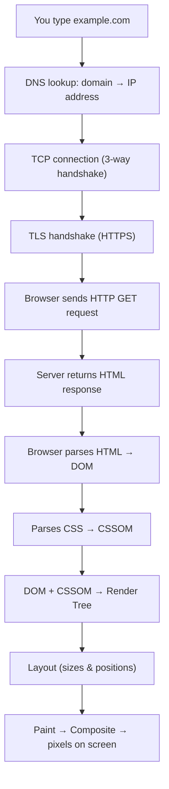

# HTML Interview Preparation

## What is HTML?

HTML (**HyperText Markup Language**) is the standard markup language used to structure web pages. It defines the structure of content using elements and tags.

```text
<p class="intro">Hello</p>
 │    │            │     │
 │    │            │     └── closing tag
 │    │            └──────── content
 │    └───────────────────── attribute (name="value")
 └────────────────────────── opening tag
 └──────────── whole thing = ELEMENT ────────────┘
```

---

# What Happens When You Type a URL and Press Enter?

One of the most asked web questions. Give the overview, then go deeper where the interviewer pushes.



1. **DNS lookup** — browser cache → OS cache → resolver → finds the IP address.
2. **TCP + TLS** — open a connection and agree on encryption (HTTPS).
3. **HTTP request / response** — the server sends back HTML.
4. **Parsing** — HTML becomes the **DOM**, CSS becomes the **CSSOM**. Scripts may pause parsing (see `async` vs `defer`).
5. **Render** — Render Tree → Layout → Paint → Composite.

This last part is called the **Critical Rendering Path**.

---

# Difference Between Semantic and Non-Semantic HTML Elements

| Semantic Elements | Non-Semantic Elements |
|---|---|
| Describe the meaning and purpose of content. | Do not describe the meaning of content. |
| Improve accessibility, SEO, readability, and maintainability. | Mainly used for grouping and styling. |
| Help browsers and developers understand page structure. | Provide no information about the content. |
| Examples: `<header>`, `<nav>`, `<main>`, `<article>`, `<section>`, `<footer>` | Examples: `<div>`, `<span>` |

```text
 Non-semantic                      Semantic
┌──────────────────────┐          ┌──────────────────────┐
│ <div class="top">    │          │ <header>             │
├──────────────────────┤          ├──────────────────────┤
│ <div class="menu">   │          │ <nav>                │
├──────────────────────┤          ├──────────────────────┤
│ <div class="content">│          │ <main>               │
│   <div class="post"> │          │   <article>          │
├──────────────────────┤          ├──────────────────────┤
│ <div class="bottom"> │          │ <footer>             │
└──────────────────────┘          └──────────────────────┘
 Screen reader: "group, group"     Screen reader: "navigation, main, article"
```

---

# What are Semantic Tags?

Semantic tags are HTML elements that clearly describe the purpose of their content.

Examples:

- `<header>` → Page header
- `<nav>` → Navigation links
- `<main>` → Main content (only one per page)
- `<section>` → Group of related content
- `<article>` → Independent content
- `<aside>` → Side content (sidebar)
- `<footer>` → Footer section

```text
┌──────────────────── <body> ────────────────────┐
│ <header>  logo, title                          │
│ <nav>     Home | Blog | About                  │
├──────────────────────────────┬─────────────────┤
│ <main>                       │ <aside>         │
│  ┌── <article> ────────────┐ │  related links  │
│  │ <h1> Post title         │ │                 │
│  │ <section> Intro         │ │                 │
│  │ <section> Details       │ │                 │
│  └─────────────────────────┘ │                 │
├──────────────────────────────┴─────────────────┤
│ <footer>  © 2026                               │
└────────────────────────────────────────────────┘
```

### Benefits:

- Improves accessibility.
- Improves SEO.
- Makes code easier to understand.
- Improves maintainability.

---

# Block vs Inline Elements

| Block Elements | Inline Elements |
|---|---|
| Start from a new line. | Stay in the same line. |
| Take full available width. | Take only required width. |
| Width and height can be set. | Width and height are ignored (except replaced elements like ``). |
| Examples: `<div>`, `<section>`, `<p>`, `<h1>` | Examples: `<span>`, `<a>`, `<strong>`, `` |

```text
Block:
┌──────────────────────────────────────────┐
│ <div> takes the full width               │
└──────────────────────────────────────────┘
┌──────────────────────────────────────────┐
│ <p> starts on a new line                 │
└──────────────────────────────────────────┘

Inline:
Some text [<span>] more text [<a>] and [<strong>] on the same line
```

---

# Difference Between `div` and `span`

| `div` | `span` |
|---|---|
| Block-level element. | Inline-level element. |
| Used for large content grouping. | Used for small text/content grouping. |
| Starts on a new line. | Does not start on a new line. |
| Takes full width. | Takes required width. |

Example:

```html
<div>
  <h1>Hello World</h1>
</div>

<p>
  This is a <span>highlighted</span> text.
</p>
```

```text
┌────────── div ───────────┐
│ Hello World              │
└──────────────────────────┘
This is a [highlighted] text.
          └── span ──┘
```

---

# Difference Between `section` and `article`

| `section` | `article` |
|---|---|
| Used to group related content. | Used for independent content. |
| Part of a larger page structure. | Can exist independently. |
| Example: Services section. | Example: Blog post or news article. |

**Quick test:** "Could this be shared or shown on its own (e.g. in an RSS feed)?" Yes → `article`. No → `section`.

```text
<main>
 ├── <section> Our Services   ← part of this page only
 └── <section> Latest Posts
       ├── <article> Post 1   ← makes sense on its own
       └── <article> Post 2
```

Example:

```html
<section>
  <h2>Our Services</h2>
  <p>We provide web development services.</p>
</section>
```

```html
<article>
  <h2>How to Learn React</h2>
  <p>React is a JavaScript library.</p>
</article>
```

---

# What is Accessibility in HTML?

Accessibility (a11y) means creating websites that can be used by everyone, including users with disabilities (screen readers, keyboard-only users, low vision).

### Accessibility Practices:

- Use semantic HTML (`<button>`, not a clickable `<div>`).
- Add meaningful `alt` attributes (`alt=""` for decorative images).
- Use `<label>` for every form input.
- Support keyboard navigation (Tab, Enter, Space) with a visible focus style.
- Maintain proper heading structure (`h1` → `h2` → `h3`, no skipping).
- Use ARIA only when no native element does the job.

```text
Page ──► Browser builds Accessibility Tree ──► Screen reader speaks it

<button>Save</button>         →  "Save, button"          ✓
<div onclick="save()">Save</div> →  "Save"  (not focusable) ✗
 → "Sleeping cat, image" ✓
           →  "cat.jpg, image"        ✗
```

Example:

```html


<label for="email">Email</label>
<input id="email" type="email">

<button aria-label="Close dialog">✕</button>
```

### What is ARIA?

**ARIA** (Accessible Rich Internet Applications) attributes add meaning that HTML alone cannot express:

- `aria-label` — gives a name to an element with no visible text (icon buttons).
- `aria-hidden="true"` — hides decorative elements from screen readers.
- `aria-expanded` — tells whether a menu/accordion is open.
- `role` — e.g. `role="dialog"`, `role="alert"`.

**First rule of ARIA:** if a native HTML element exists, use it instead of ARIA.

---

# What is the Viewport Meta Tag?

It tells mobile browsers to use the device width instead of a fake 980px desktop width. Without it, responsive CSS / media queries do not work properly on phones.

```html
<meta name="viewport" content="width=device-width, initial-scale=1">
```

```text
Without viewport meta           With viewport meta
┌───────────┐                   ┌───────────┐
│ tiny tiny │  page rendered    │  Readable │  page width =
│ tiny text │  at 980px, then   │  text and │  device width
│ zoomed out│  shrunk to fit    │  layout   │  (e.g. 390px)
└───────────┘                   └───────────┘
```

---

# Forms and Form Validation

A form collects user input and sends it to a server.

```html
<form action="/signup" method="POST">
  <label for="email">Email</label>
  <input id="email" name="email" type="email" required>

  <label for="age">Age</label>
  <input id="age" name="age" type="number" min="18" max="99">

  <label for="pass">Password</label>
  <input id="pass" name="password" type="password" minlength="8" required>

  <button type="submit">Sign up</button>
</form>
```

### Built-in Validation Attributes

| Attribute | Meaning |
|---|---|
| `required` | Field must not be empty. |
| `type="email"` / `"url"` / `"number"` | Checks the format. |
| `min` / `max` | Number or date range. |
| `minlength` / `maxlength` | Text length. |
| `pattern` | Must match a regular expression. |

```text
User clicks Submit
       │
       ▼
Browser checks required / type / pattern
       │
   ┌───┴────┐
 invalid   valid
   │         │
   ▼         ▼
Show error  Send request to server
 message           │
                   ▼
           Server validates AGAIN
           (client validation can be bypassed)
```

**Important:** client-side validation is for user experience only. Always validate on the server too.

---

# localStorage vs sessionStorage vs Cookies

| | localStorage | sessionStorage | Cookies |
|---|---|---|---|
| Size | ~5-10MB | ~5MB | ~4KB |
| Expires | Never (until removed) | When the tab is closed | Set by `Expires` / `Max-Age` |
| Scope | All tabs of the same origin | Only that one tab | Sent per domain/path |
| Sent to server? | No | No | **Yes, with every request** |
| Readable by JS? | Yes | Yes | Yes, unless `HttpOnly` |
| Typical use | Theme, preferences | Multi-step form data | Session / auth token |

```text
              Browser
┌──────────────────────────────────────┐
│ Tab A            Tab B               │
│ sessionStorage   sessionStorage      │ ← separate per tab
│        └──── localStorage ────┘      │ ← shared by all tabs
│        └────── Cookies ───────┘      │
└──────────────────┬───────────────────┘
                   │ every request carries cookies
                   ▼
                 Server
```

Example:

```javascript
localStorage.setItem("theme", "dark");

sessionStorage.setItem("step", "2");

document.cookie = "lang=en; max-age=86400; path=/";
```

**Security note:** do not store auth tokens in localStorage — any XSS script can read it. Prefer an `HttpOnly`, `Secure`, `SameSite` cookie, which JavaScript cannot read.

---

# async vs defer

| async | defer |
|---|---|
| Downloads script while HTML is parsing. | Downloads script while HTML is parsing. |
| Executes immediately after downloading (pauses parsing). | Executes after HTML parsing completes. |
| Execution order is not guaranteed. | Maintains script order. |
| Used for independent scripts (analytics, ads). | Used for scripts that depend on DOM. |

```text
Normal <script>:
HTML  ████████░░░░░░░░░░░░░░████████   (parsing STOPS)
JS            ▓▓▓download▓▓ ▶run

async:
HTML  ██████████████░░░░░███████████
JS      ▓▓▓download▓▓▓ ▶run           (runs as soon as ready)

defer:
HTML  ██████████████████████████████
JS      ▓▓▓download▓▓▓               ▶run  (after parsing)

████ = HTML parsing   ▓▓ = download   ▶ = execute   ░░ = parsing paused
```

Example:

```html
<script async src="analytics.js"></script>

<script defer src="app.js"></script>
```

Modules (`<script type="module">`) are deferred by default.

---

# GET vs POST

| GET | POST |
|---|---|
| Used to retrieve data. | Used to send/create data. |
| Data is in the URL (query string). | Data is in the request body. |
| Visible in URL, history, and server logs — never send passwords. | Not shown in the URL (still needs HTTPS to be secure). |
| Can be cached and bookmarked. | Usually not cached. |
| Idempotent (repeating it changes nothing). | Not idempotent (repeating may create duplicates). |
| Example: Search query. | Example: Login form. |

```text
GET  /search?q=shoes           ← data in URL
     (no body)

POST /login
     Content-Type: application/json
     { "email": "...", "password": "..." }   ← data in body
```

---

# What is DOM?

DOM (**Document Object Model**) represents an HTML document as a tree of objects that JavaScript can read and change.

```html
<html>
  <body>
    <h1 id="title">Hi</h1>
    <ul><li>One</li></ul>
  </body>
</html>
```

```text
document
  └── html
       └── body
            ├── h1#title
            │    └── "Hi"   (text node)
            └── ul
                 └── li
                      └── "One"
```

JavaScript can use DOM to:

- Change HTML content.
- Modify CSS.
- Add/remove elements.
- Handle events.

Example:

```javascript
document.getElementById("title").textContent = "Hello World";
```

Prefer `textContent` for plain text. `innerHTML` parses HTML and can cause XSS if the value comes from a user.

---

# HTML vs HTML5

| HTML | HTML5 |
|---|---|
| Older version of HTML. | Modern version of HTML. |
| Limited multimedia support. | Built-in audio and video support. |
| Fewer semantic elements. | New semantic elements introduced. |
| Requires plugins (e.g. Flash) for some features. | Provides modern browser APIs. |
| Long doctype. | Simple `<!DOCTYPE html>`. |

### HTML5 Features:

```text
                 HTML5
   ┌──────────┬────┴─────┬───────────┐
Semantic   Media      Graphics     APIs
tags       <audio>    <canvas>     localStorage
<header>   <video>    <svg>        Geolocation
<nav>                              Web Workers
<article>                          Drag & Drop
```

---

# Best Practices for Clean HTML

- Use semantic elements.
- Maintain proper indentation.
- Use correct nesting.
- Add meaningful `alt` text.
- Use labels for forms.
- Avoid unnecessary wrappers.
- Follow heading hierarchy.
- Keep markup simple and readable.
- Validate HTML regularly.

---

# HTML Interview Topics Checklist

- What happens when you type a URL
- Semantic vs Non-Semantic HTML
- Block vs Inline Elements
- div vs span
- section vs article
- Accessibility and ARIA
- Viewport meta tag
- Forms and validation
- localStorage vs sessionStorage vs Cookies
- async vs defer
- GET vs POST
- DOM
- HTML5 Features
- Clean HTML Practices

---

# Rarely Asked (Lower Priority)

## What is iframe?

An `iframe` is used to embed another webpage or document inside the current page.

Common uses:

- YouTube videos
- Google Maps
- External applications

```text
┌──────── your page ────────┐
│ text ...                  │
│ ┌──── <iframe> ────────┐  │
│ │ another website,     │  │
│ │ its own document     │  │
│ └──────────────────────┘  │
└───────────────────────────┘
```

Example:

```html
<iframe src="https://example.com" title="Example site"></iframe>
```

Give every iframe a `title` for screen readers.

---

## Void Elements in HTML

Void elements are HTML elements that cannot have content, so they have no closing tag.

Examples:

```html

<br>
<hr>
<meta>
<input>
<link>
```

Example:

```html


<input type="text">
```
