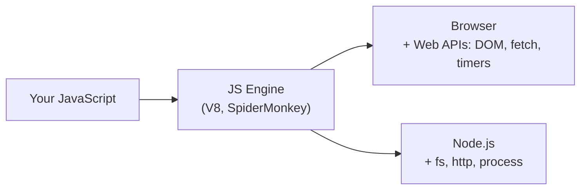
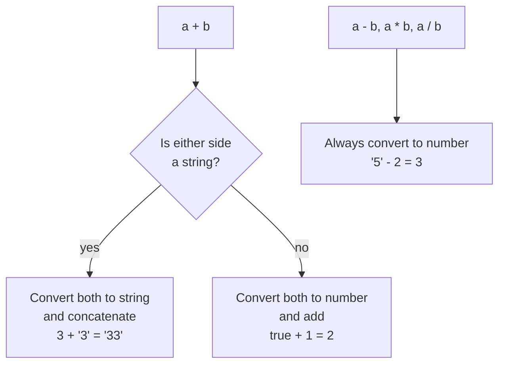
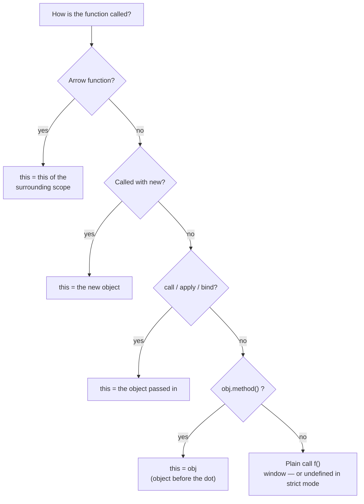
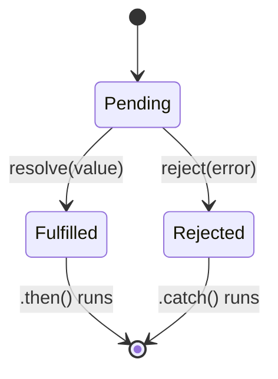
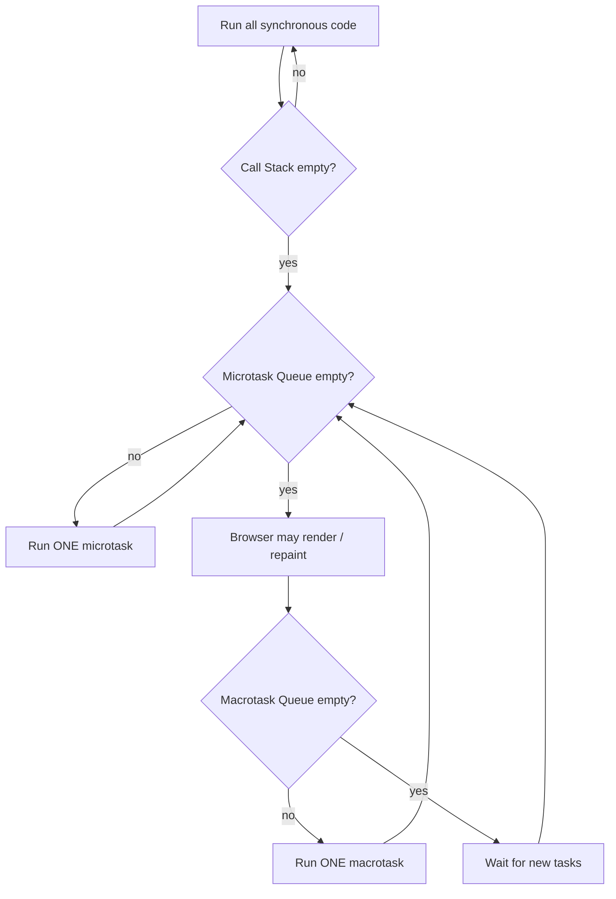

# JavaScript Interview Questions

---

## What is JavaScript?

JavaScript is a high-level, single-threaded, dynamically typed programming language that adds interactivity, logic, and dynamic behaviors to websites. With Node.js it also runs on the server.



The language is the same; the **runtime** (browser or Node) decides which extra APIs you get.

## What are the different data types present in javascript?
JavaScript has two types of data:

### 1. Primitive Types

- **String**: A series of characters
- **Number**: Can be written with or without decimals
- **BigInt**: For large integers (add "n" to the end)
- **Boolean**: true or false
- **Undefined**: Declared but not assigned
- **Null**: Non-existent or invalid value
- **Symbol**: Unique value (ES6)

### 2. Non-Primitive Types

- **Object**: Collection of data in key-value pairs. **Arrays, functions, dates, Maps and Sets are all objects.**

```text
                    JavaScript values
                          │
          ┌───────────────┴───────────────┐
      Primitive (7)                  Object (reference)
   immutable, copied by value       mutable, copied by reference
          │                               │
 string  number  bigint             {}  []  function
 boolean undefined null symbol      Date  Map  Set
```

```javascript
typeof 'hi';       // "string"
typeof 42;         // "number"
typeof [];         // "object"   ← use Array.isArray([]) instead
typeof null;       // "object"   ← famous bug from JS v1
typeof function(){}; // "function" (still an object)
```

## Hoisting

- Hoisting means declarations are processed **before** the code runs, so they behave as if they were moved to the top of their scope. (Nothing actually moves — the engine just registers them first.)
- Only declarations are hoisted, not initializations.
- Function **declarations** are hoisted completely (you can call them before they appear).
- `var` is hoisted and set to `undefined`.
- `let` and `const` are hoisted but stay in the **Temporal Dead Zone** until their line runs.
- Strict mode does **not** turn off hoisting.

```text
What you write                 How the engine sees it (creation phase)

console.log(a);                var a = undefined;      ← hoisted + initialized
var a = 10;                    let b;  (TDZ)           ← hoisted, NOT initialized
console.log(b);                function greet() {...}  ← hoisted fully
let b = 20;
greet();                       console.log(a);  // undefined
function greet() {...}         a = 10;
                               console.log(b);  // ReferenceError
```

### Temporal Dead Zone (TDZ)

The TDZ is the period between entering a scope and initializing a `let` or `const` variable. Accessing the variable during this period throws a `ReferenceError`.

```text
{                                   ─┐
  console.log(b); // ReferenceError  │  TDZ for b
  ...                                │
  let b = 20;                       ─┘  b is ready from here
  console.log(b); // 20
}
```

```javascript
console.log(a); // undefined  (var is initialized as undefined)
var a = 10;

console.log(b); // ReferenceError: Cannot access 'b' before initialization
let b = 20;
```

## Function Declaration vs Function Expression

```javascript
sayHi();   // ✓ "Hi" — declaration is fully hoisted
function sayHi() { console.log('Hi'); }

sayBye();  // ✗ TypeError: sayBye is not a function (it is undefined here)
var sayBye = function () { console.log('Bye'); };
```

```text
Creation phase memory:
  sayHi  → function sayHi() {...}   ✓ callable
  sayBye → undefined                ✗ calling undefined → TypeError
```

| Declaration | Expression |
| ----------- | ---------- |
| `function f() {}` | `const f = function () {}` / arrow |
| Hoisted with its body | Follows variable hoisting rules |
| Can be called before its line | Cannot be called before its line |

## var vs let vs const

| Feature        | var | let       | const     |
| -------------- | --- | --------- | --------- |
| Global Scope   | yes | yes       | yes       |
| Function Scope | yes | yes       | yes       |
| Block Scope    | no  | yes       | yes       |
| Reassigned     | yes | yes       | no        |
| Redeclared     | yes | no        | no        |
| Hoisted        | yes (as `undefined`) | yes (TDZ) | yes (TDZ) |
| Becomes `window.x` at top level | yes | no | no |

```text
function test() {           ┌─ function scope ─────────────┐
  if (true) {               │  ┌─ block scope ──────────┐  │
    var a = 1;              │  │  a → leaks out ───────────┼─► visible in function
    let b = 2;              │  │  b → stays inside        │  │
    const c = 3;            │  │  c → stays inside        │  │
  }                         │  └──────────────────────────┘  │
  console.log(a); // 1      │                                │
  console.log(b); // Error  └────────────────────────────────┘
}
```

`const` stops **reassignment**, not mutation: `const arr = []; arr.push(1)` works.

## Coercion
Automatic conversion of value from one data type to another. It handles type coercion in two distinct ways.

- **Implicit coercion:** done automatically by the engine
- **Explicit coercion:** done intentionally by the developer (`Number('5')`, `String(5)`, `Boolean(0)`)



### String Coercion
Occurs most often with the + operator. If any operand is a string, JavaScript converts the others to strings and concatenates them.

```javascript
var x = 3;
var y = '3';
x + y; // Returns "33"
```

### Number Coercion
- Occurs with arithmetic operators like -, *, /, and comparison operators like >.
- JavaScript attempts to convert strings or booleans into numbers.
- Example: "5" - 2 results in 3.

### Boolean Coercion
- Occurs in logical contexts like if statements or logical operators (&&, ||).
- Values are coerced to either "truthy" or "falsy".

There are only **8 falsy values**; everything else is truthy (including `[]`, `{}`, and `'0'`):

```text
false   0   -0   0n   ""   null   undefined   NaN
```

```javascript
var x = 0;
var y = 23;
if (x) {
  console.log(x);
} // Not run (Falsy)
if (y) {
  console.log(y);
} // Runs (Truthy)

// Logical operators return one of the operands, not true/false
x || y; // Returns 23 (first truthy value)
x && y; // Returns 0  (first falsy value — x is falsy so && stops there)
```

### Equality Coercion

```javascript
var a = 12;
var b = '12';
a == b;  // Returns true (coercion happens)
a === b; // Returns false (no coercion)
```

- `==`: Compares values after type coercion
- `===`: Compares values AND types (no coercion) — use this by default

```text
12 == '12'
   │
   ▼  types differ → convert string to number
12 == 12  → true

12 === '12'
   │
   ▼  types differ → stop
false
```

## NaN Property

NaN = "Not-a-Number". It is the result of a failed number operation, and it is the only value not equal to itself.

```javascript
typeof NaN; // Returns "number"
NaN === NaN; // false

isNaN('Hello'); // Returns true  (global isNaN coerces first)
isNaN(345); // Returns false
isNaN('1'); // Returns false (converted to 1)
isNaN(true); // Returns false (converted to 1)
isNaN(undefined); // Returns true

Number.isNaN('Hello'); // false — no coercion, only true for real NaN ✓ prefer this
Number.isNaN(NaN);     // true
```

```text
isNaN('Hello')         Number.isNaN('Hello')
   │                        │
Number('Hello') → NaN       is it the value NaN? no
   │                        │
 true                     false
```

## null vs undefined

| null                            | undefined                        |
| ------------------------------- | -------------------------------- |
| Means intentionally no value    | Means a value has not been assigned |
| Usually assigned by the developer | Usually happens automatically   |
| Example: `user = null`          | Example: `let user;`             |
| `typeof` → `"object"` (JS quirk) | `typeof` → `"undefined"`        |

```text
let a;          a ──► [ undefined ]   "box exists, nothing put in yet"
let b = null;   b ──► [   null    ]   "box exists, deliberately emptied"
```

```javascript
null == undefined;  // true  (loose equality treats them as equal)
null === undefined; // false (different types)
```

## Passed by Value vs Passed by Reference
- **Primitive types**: Copied by value (a copy of the actual data)
- **Non-primitive types**: Copied by reference (a copy of the memory address of the same object)

```javascript
// Primitive - copied by value
var y = 234;
var z = y;   // z gets its own copy: 234
z = 5411;    // only z changes
console.log(y); // 234
console.log(z); // 5411

// Non-primitive - copied by reference
var obj = { name: 'Vivek' };
var obj2 = obj;
obj.name = 'Akki';
console.log(obj2); // Returns {name: "Akki"}
```

```text
Primitives (stack)            Objects (heap)

y │ 234  │                    obj  ─┐
z │ 5411 │  separate copies          ├──► { name: 'Akki' }   one object
                              obj2 ─┘     two arrows point to it
```

---

## Execution Context and Call Stack

Every time JavaScript runs code, it creates an **execution context**. It has two phases:

1. **Creation (memory) phase** — variables and functions are registered (this is where hoisting happens).
2. **Execution (code) phase** — code runs line by line and values are assigned.

```javascript
var n = 2;
function square(num) {
  return num * num;
}
var result = square(n);
```

```text
Global Execution Context
┌───────────────────────────┬──────────────────────────────┐
│ Memory (creation phase)   │ Code (execution phase)       │
├───────────────────────────┼──────────────────────────────┤
│ n      : undefined → 2    │ n = 2                        │
│ square : function {...}   │ result = square(n) ──┐       │
│ result : undefined → 4    │                      │       │
└───────────────────────────┴──────────────────────┼───────┘
                                                   ▼
                     square() Execution Context (new, then destroyed)
                     ┌──────────────────┬──────────────────┐
                     │ num : 2          │ return 2 * 2 = 4 │
                     └──────────────────┴──────────────────┘
```

The **call stack** tracks which context is running:

```text
 call square()        square returns        program ends

 ┌──────────┐
 │ square() │
 ├──────────┤         ┌──────────┐
 │  global  │         │  global  │          (empty)
 └──────────┘         └──────────┘
```

Too many nested calls (e.g. infinite recursion) → **"Maximum call stack size exceeded"** (stack overflow).

---

## Immediately Invoked Function (IIFE)

A function that runs as soon as it is defined. Used to create a private scope (common before ES modules).

```javascript
(function () {
  // Do something;
})();
```

**How it works:**

1. First set of parentheses: Tells compiler it's a function expression, not declaration
2. Second set of parentheses: Invokes the function

```text
( function () { ... } )  ( )
└──────── 1 ──────────┘  └2┘
  turn it into an          call it
  expression               immediately
```

---

## Strict Mode

In ECMAScript 5, strict mode makes JavaScript throw errors for silent failures. ES modules and classes are always strict.

```javascript
'use strict';
// x = 23; // Error: x is not defined
var x;
```

**Characteristics:**

- No duplicate arguments allowed
- Cannot use JavaScript keyword as parameter/function name
- Cannot create global variables by accident
- `this` inside a plain function call is `undefined` (not `window`)
- Makes debugging easier

```text
x = 23  (x never declared)
   │
   ├── sloppy mode → silently creates window.x   ✗ hidden bug
   └── strict mode → ReferenceError              ✓ caught early
```

---

## Higher Order Functions

Functions that operate on other functions (take them as arguments or return them). This works because functions are **first-class** values in JavaScript — they can be stored in variables, passed, and returned.

```javascript
function higherOrder(fn) {
  fn();
}
higherOrder(function () {
  console.log('Hello world');
});

function higherOrder2() {
  return function () {
    return 'Do something';
  };
}
var x = higherOrder2();
x(); // Returns "Do something"
```

```text
           ┌──────────────────────┐
 fn ──────►│  higher-order func   │──────► new fn
 (input)   └──────────────────────┘        (output)

 Built-in examples: map, filter, reduce, setTimeout, addEventListener
```

---

## "this" Keyword

`this` is decided by **how a function is called**, not where it is written (except arrow functions).



```javascript
function doSomething() {
  console.log(this);
}
doSomething(); // window in a browser (undefined in strict mode)
```

**Rule:** Check the object before the dot.

```javascript
var obj = {
  name: 'vivek',
  getName: function () {
    console.log(this.name);
  },
};
obj.getName(); // "vivek"

var getName = obj.getName;
var obj2 = { name: 'akshay', getName };
obj2.getName(); // "akshay"

getName(); // undefined — no object before the dot, `this` is lost
```

---

## call(), apply(), bind()

All three set `this` manually.

```text
fn.call(obj, a, b)      → runs NOW,  args one by one
fn.apply(obj, [a, b])   → runs NOW,  args as an array
fn.bind(obj, a, b)      → runs LATER, returns a new function
```

### call()

Invokes a method by specifying the owner object.

```javascript
function sayHello() {
  return 'Hello ' + this.name;
}
var obj = { name: 'Sandy' };
sayHello.call(obj); // "Hello Sandy"

// With arguments
var person = {
  getAge: function () {
    return this.age;
  },
};
var person2 = { age: 54 };
person.getAge.call(person2); // 54

function saySomething(message) {
  return this.name + ' is ' + message;
}
var person4 = { name: 'John' };
saySomething.call(person4, 'awesome'); // "John is awesome"
```

### apply()

Same as call() but takes arguments as an array.

```javascript
saySomething.apply(person4, ['awesome']); // "John is awesome"
```

### bind()

Returns a new function with bound value of "this".

```javascript
var bikeDetails = {
  displayDetails: function (registrationNumber, brandName) {
    return this.name + ', bike details: ' + registrationNumber + ', ' + brandName;
  },
};
var person1 = { name: 'Vivek' };
var detailsOfPerson1 = bikeDetails.displayDetails.bind(person1, 'TS0122', 'Bullet');
detailsOfPerson1(); // "Vivek, bike details: TS0122, Bullet"
```

### Polyfill for bind (common interview task)

```javascript
Function.prototype.myBind = function (context, ...boundArgs) {
  const fn = this; // the function myBind was called on
  return function (...args) {
    return fn.apply(context, [...boundArgs, ...args]);
  };
};
```

---

## Currying

Transforms a function of n arguments to n functions of one or fewer arguments.

```javascript
function add(a) {
  return function (b) {
    return a + b;
  };
}
add(3)(4); // Returns 7

// Converting multiply(a,b) to curried form
function multiply(a, b) {
  return a * b;
}
function currying(fn) {
  return function (a) {
    return function (b) {
      return fn(a, b);
    };
  };
}
var curriedMultiply = currying(multiply);
curriedMultiply(4)(3); // Returns 12
```

```text
add(3)(4)
  │
  ├─ add(3)  → returns  function (b) { return 3 + b }   ← closure remembers a = 3
  │
  └─ (4)     → 3 + 4 = 7
```

Useful for creating pre-configured functions: `const addTax = multiply(1.17)` style helpers.

---

## Scope and Scope Chain

### Types of Scope:

1. **Global Scope**: Variables declared in global namespace

   ```javascript
   var globalVariable = 'Hello world';
   function sendMessage() {
     return globalVariable;
   }
   ```

2. **Function/Local Scope**: Variables declared inside a function

   ```javascript
   function awesomeFunction() {
     var a = 2;
     var multiplyBy2 = function () {
       console.log(a * 2);
     };
   }
   // console.log(a); // Reference error
   ```

3. **Block Scope**: Variables declared with let/const inside {}
   ```javascript
   {
     let x = 45;
   }
   // console.log(x); // Reference error
   ```

### Scope Chain

When a variable is not found in local scope, JavaScript looks in outer scope, then global scope. It only looks **outward**, never inward.

```javascript
var y = 24;
function favFunction() {
  var x = 667;
  var anotherFavFunction = function () {
    console.log(x); // 667
  };
  var yetAnotherFavFunction = function () {
    console.log(y); // 24 (from global)
  };
  anotherFavFunction();
  yetAnotherFavFunction();
}
```

```text
┌─ Global ───────────────────────────────────────┐
│ y = 24                                         │
│  ┌─ favFunction ─────────────────────────────┐ │
│  │ x = 667                                    │ │
│  │  ┌─ yetAnotherFavFunction ──────────────┐ │ │
│  │  │ console.log(y)                        │ │ │
│  │  │   1. look here      → not found       │ │ │
│  │  │   2. favFunction    → not found  ─────┼─┘ │
│  │  │   3. Global         → y = 24 ✓  ──────┼───┘
│  │  └───────────────────────────────────────┘
```

This lookup is decided by **where the code is written** (lexical scope), not where it is called.

---

## Closures

An ability of a function to remember variables from its outer scope even after the outer function has finished executing.

```javascript
function randomFunc() {
  var obj1 = { name: 'Vivian', age: 45 };
  return function () {
    console.log(obj1.name + ' is awesome');
  };
}
var initialiseClosure = randomFunc();
initialiseClosure(); // "Vivian is awesome"
```

```text
randomFunc() runs and returns ─────────────────┐
randomFunc's execution context is gone         │
                                               ▼
                         ┌──────────────────────────────────┐
initialiseClosure ─────► │ function () {...}                │
                         │   [[Closure]] ──► obj1 = {Vivian} │  ← kept alive
                         └──────────────────────────────────┘
```

### Practical use: private counter

```javascript
function createCounter() {
  let count = 0;               // private — nothing outside can touch it
  return {
    increment: () => ++count,
    get: () => count,
  };
}
const c = createCounter();
c.increment(); // 1
c.increment(); // 2
c.count;       // undefined
```

### Classic question: closure in a loop

```javascript
for (var i = 1; i <= 3; i++) {
  setTimeout(() => console.log(i), 1000);
}
// 4 4 4

for (let i = 1; i <= 3; i++) {
  setTimeout(() => console.log(i), 1000);
}
// 1 2 3
```

```text
var — ONE shared i                let — a NEW i per iteration

callback1 ─┐                      callback1 ──► i = 1
callback2 ─┼──► i  (loop ends     callback2 ──► i = 2
callback3 ─┘        at 4)         callback3 ──► i = 3
After 1s: 4 4 4                   After 1s: 1 2 3
```

**Uses of closures:** data privacy, function factories, currying, memoization, debounce/throttle, event handlers.

---

## Object Prototypes and Prototypal Inheritance

All JavaScript objects have a hidden link (`[[Prototype]]`, accessible via `__proto__` or `Object.getPrototypeOf`) to another object. When a property is not found on the object, JavaScript looks up this chain.

```javascript
var arr = [];
arr.push(2);
console.log(arr); // [2]
```

Array objects inherit from Array prototype. The JavaScript engine looks for methods in the prototype chain.

```text
arr.push(2)

arr ──────────────► Array.prototype ──────► Object.prototype ──────► null
{ 0: 2, length }    { push, map, filter }   { toString, hasOwnProperty }
   │                    │
 "push" here? no ──► found here ✓
```

```javascript
const animal = { eats: true };
const dog = Object.create(animal); // dog.__proto__ === animal
dog.barks = true;

dog.barks; // true  (own property)
dog.eats;  // true  (found on the prototype)
dog.hasOwnProperty('eats'); // false
```

`class ... extends` uses exactly this mechanism under the hood.

---

## Callbacks

A function passed as an argument to another function, to be called later.

```javascript
function divideByHalf(sum) {
  console.log(Math.floor(sum / 2));
}

function multiplyBy2(sum) {
  console.log(sum * 2);
}

function operationOnSum(num1, num2, operation) {
  var sum = num1 + num2;
  operation(sum);
}

operationOnSum(3, 3, divideByHalf); // 3
operationOnSum(5, 5, multiplyBy2); // 20
```

### Callback Hell

```text
getUser(id, user =>
  getOrders(user, orders =>
    getItems(orders, items =>
      getPrice(items, price =>
        console.log(price)       ◄── "pyramid of doom"
      )
    )
  )
)
```

Hard to read, and error handling must be repeated at every level. Promises and async/await fix this.

---

## Types of Errors in JavaScript

```text
            Errors
              │
   ┌──────────┼───────────────┐
 Syntax     Runtime         Logical
 (won't     (crashes while  (runs fine,
  parse)     running)        wrong result)
              │
   ReferenceError  TypeError  RangeError
```

| Error | Example |
| ----- | ------- |
| `SyntaxError` | `let x = ;` |
| `ReferenceError` | Using a variable that doesn't exist |
| `TypeError` | `undefined.name`, calling a non-function |
| `RangeError` | `new Array(-1)`, infinite recursion |
| Logical error | `total = price - tax` instead of `+` — no message at all |

```javascript
try {
  null.name;
} catch (err) {
  console.log(err.name);    // "TypeError"
  console.log(err.message); // "Cannot read properties of null..."
} finally {
  console.log('always runs');
}
```

---

## Memoization

Caching return values based on parameters, so an expensive call with the same input is computed only once.

```javascript
function memoizedAddTo256() {
  var cache = {};
  return function (num) {
    if (num in cache) {
      console.log('cached value');
      return cache[num];
    } else {
      cache[num] = num + 256;
      return cache[num];
    }
  };
}
var memoizedFunc = memoizedAddTo256();
memoizedFunc(20); // Normal return
memoizedFunc(20); // Cached return
```

```text
memoizedFunc(20)
   │
   ▼
 20 in cache? ──no──► compute 276 ──► cache = { 20: 276 } ──► return 276
   │
  yes (second call)
   ▼
 return cache[20] ⚡ no computation
```

---

## Recursion

A technique where a function calls itself until it reaches a **base case**.

```javascript
function add(number) {
  if (number <= 0) {
    return 0;
  } else {
    return number + add(number - 1);
  }
}
add(3); // 3 + 2 + 1 + 0 = 6
```

```text
add(3)                                 returns 6
 └─ 3 + add(2)                         ▲ 3 + 3
         └─ 2 + add(1)                 ▲ 2 + 1
                 └─ 1 + add(0)         ▲ 1 + 0
                         └─ 0  (base case)
```

No base case → infinite calls → stack overflow.

---

## Constructor Function

Used to create multiple objects with similar properties.

```javascript
function Person(name, age, gender) {
  this.name = name;
  this.age = age;
  this.gender = gender;
}

var person1 = new Person('Vivek', 76, 'male');
var person2 = new Person('Courtney', 34, 'female');
```

What `new` does:

```text
new Person('Vivek', 76, 'male')
  1. create an empty object             {}
  2. link its prototype                 {}.__proto__ = Person.prototype
  3. run Person with this = new object  { name, age, gender }
  4. return the object (automatically)
```

---

## DOM (Document Object Model)

A programming interface for HTML and XML documents. The DOM represents the page as a **tree** of nodes that JavaScript can read and change.

```text
<html>                         document
  <body>                          │
    <h1>Hi</h1>                 <html>
    <ul>                          │
      <li>A</li>                <body>
      <li>B</li>              ┌───┴───┐
    </ul>                    <h1>    <ul>
  </body>                     │     ┌──┴──┐
</html>                     "Hi"  <li>  <li>
```

```javascript
const title = document.querySelector('h1');
title.textContent = 'Hello';
document.querySelector('ul').append(document.createElement('li'));
```

---

# JavaScript ES6+ Features

## Arrow Functions

Introduced in ES6, provides shorter syntax.

```javascript
// Traditional
var add = function (a, b) {
  return a + b;
};

// Arrow
var arrowAdd = (a, b) => a + b;

// Single parameter
var arrowMultiplyBy2 = num => num * 2;
```

**Key difference: `this` binding**

```javascript
var obj1 = {
  valueOfThis: function () {
    return this;
  },
};
var obj2 = {
  valueOfThis: () => {
    return this;
  },
};
obj1.valueOfThis(); // Returns obj1
obj2.valueOfThis(); // Returns the outer `this` (window in a browser script), NOT obj2
```

| Regular function | Arrow function |
| ---------------- | -------------- |
| Own `this` (depends on how it's called) | No own `this` — uses the surrounding one |
| Has `arguments` | No `arguments` (use `...args`) |
| Can be used with `new` | Cannot be a constructor |
| Good for object methods | Good for callbacks (`map`, `setTimeout`) |

---

## Rest Parameter

Collects multiple arguments into an array.

```javascript
function extractingArgs(...args) {
  return args[1];
}
extractingArgs(8, 9, 1); // Returns 9

function addAllArgs(...args) {
  let sum = 0;
  for (let i = 0; i < args.length; i++) {
    sum += args[i];
  }
  return sum;
}
addAllArgs(6, 5, 7, 99); // Returns 117
```

**Note:** Must be the last parameter.

---

## Spread Operator

Spreads an array or object literals.

```javascript
function addFourNumbers(num1, num2, num3, num4) {
  return num1 + num2 + num3 + num4;
}
let fourNumbers = [5, 6, 7, 8];
addFourNumbers(...fourNumbers); // Spreads as 5,6,7,8

// Clone array
let array1 = [3, 4, 5, 6];
let clonedArray1 = [...array1];

// Merge objects
let obj1 = { x: 'Hello', y: 'Bye' };
let obj2 = { z: 'Yes', a: 'No' };
let mergedObj = { ...obj1, ...obj2 };
```

### Rest vs Spread

Same `...` syntax, opposite jobs:

```text
REST   — gathers many → one array        function f(...args)   1,2,3  ──► [1,2,3]
SPREAD — expands one array → many        f(...[1,2,3])        [1,2,3] ──► 1,2,3
```

---

## Classes in JavaScript

Syntactic sugar for constructor functions and prototypes (ES6).

```javascript
// ES6 Class
class Student {
  constructor(name, rollNumber, grade, section) {
    this.name = name;
    this.rollNumber = rollNumber;
    this.grade = grade;
    this.section = section;
  }

  getDetails() {
    return `Name: ${this.name}, Roll no: ${this.rollNumber}`;
  }
}

let student = new Student('Vivek', 354, '6th', 'A');
student.getDetails();
```

**Key points:**

- Classes are hoisted but stay in the TDZ (you can't use them before the declaration)
- Can inherit using extends
- Strict mode by default

```javascript
class Animal {
  constructor(name) { this.name = name; }
  speak() { return `${this.name} makes a sound`; }
}
class Dog extends Animal {
  speak() { return `${super.speak()} — woof`; }
}
new Dog('Rex').speak(); // "Rex makes a sound — woof"
```

```text
rex ──► Dog.prototype ──► Animal.prototype ──► Object.prototype
         { speak }         { speak }
```

---

## Object Destructuring

Extract elements from objects.

```javascript
const classDetails = {
  strength: 78,
  benches: 39,
  blackBoard: 1,
};

// Before ES6
const strength = classDetails.strength;

// ES6 Destructuring
const { strength, benches, blackBoard } = classDetails;
const { strength: classStrength } = classDetails; // Rename
const { teacher = 'Unknown' } = classDetails;      // Default value
```

```text
{ strength: 78, benches: 39, blackBoard: 1 }
      │             │             │
      ▼             ▼             ▼
const { strength,  benches,  blackBoard } = classDetails
```

---

## Array Destructuring

```javascript
const arr = [1, 2, 3, 4];
const [first, second, ...rest] = arr; // 1, 2, [3, 4]

// Swap two variables without a temp
let a = 1, b = 2;
[a, b] = [b, a]; // a = 2, b = 1
```

```text
[ 1,     2,      3, 4 ]
  │      │       └─┬─┘
first  second    rest
```

---

## Template Literals

Strings using backticks.

```javascript
const name = 'Justin';
console.log(`Hello, ${name}`);

// Multi-line
const text = `This is line one
This is line two`;
```

---

## ES Modules

Official standard for packaging JavaScript code.

```javascript
// utils.js
export const add = (a, b) => a + b;
export const multiply = (a, b) => a * b;
export default function greet(name) {
  return `Hello, ${name}`;
}

// app.js
import greet, { add, multiply } from './utils.js';
add(2, 3); // 5
greet('Jasmin'); // "Hello, Jasmin"
```

```text
utils.js                              app.js
┌────────────────────────┐
│ export default greet ──┼──────────► import greet          (any name)
│ export const add ──────┼──────────► import { add }        (exact name)
│ export const multiply ─┼──────────► import { multiply }
└────────────────────────┘
```

| Named export | Default export |
| ------------ | -------------- |
| Many per file | One per file |
| Imported with `{ }` and the exact name | Imported without `{ }`, any name |

---

## Optional Chaining (?.)

Safely access nested properties. Stops and returns `undefined` if the value before `?.` is `null` or `undefined`.

```javascript
const user = {
  profile: {
    address: {
      city: 'Mumbai',
    },
  },
};
console.log(user.profile.address?.city); // "Mumbai"
console.log(user.profile.address?.country); // undefined
console.log(user.settings?.theme);         // undefined (no error)
user.logout?.();                           // call only if it exists
```

```text
user.settings?.theme
       │
  settings is undefined ──► stop, return undefined   (no TypeError)
```

---

## Nullish Coalescing (??)

Returns right-hand side only if left is null/undefined.

```javascript
const name = null;
console.log(name ?? 'Guest'); // "Guest"

const config = { port: 0 };
console.log(config.port ?? 3000); // 0 (unlike || which returns 3000)
```

```text
value        value || 'default'      value ?? 'default'
0            'default'               0
''           'default'               ''
false        'default'               false
null         'default'               'default'
undefined    'default'               'default'
```

`||` falls back on any **falsy** value; `??` only on `null`/`undefined`.

---

## Promises

A Promise is an object representing a value that will be available **later** (or an error).

```javascript
function sumOfThreeElements(...elements) {
  return new Promise((resolve, reject) => {
    if (elements.length > 3) {
      reject('Only three elements or less');
    } else {
      let sum = 0;
      elements.forEach(e => (sum += e));
      resolve('Sum: ' + sum);
    }
  });
}

sumOfThreeElements(4, 5, 6)
  .then(result => console.log(result))
  .catch(error => console.log(error));
```

A promise is always in one of three states: **pending**, **fulfilled**, or **rejected**. Once settled, it never changes again.



### Promise chaining

Each `.then()` returns a **new** promise, so you can chain them. Whatever you return goes to the next `.then()`.

```text
fetchUser()
  .then(user  => fetchOrders(user))   ── returns promise ──┐
  .then(orders => orders.length)      ◄────────────────────┘ ── returns 3 ─┐
  .then(count => console.log(count))  ◄───────────────────────────────────┘
  .catch(err  => ...)                 ◄── any error above jumps straight here
```

---

## Promise.all vs allSettled vs race vs any

Very common interview question.

```javascript
const p1 = Promise.resolve(1);
const p2 = Promise.reject('error');
const p3 = new Promise(r => setTimeout(() => r(3), 100));

Promise.all([p1, p3]);        // [1, 3] — waits for all
Promise.all([p1, p2, p3]);    // rejects with 'error' — fails fast
Promise.allSettled([p1, p2]); // [{status:'fulfilled',value:1}, {status:'rejected',reason:'error'}]
Promise.race([p1, p3]);       // 1 — first to SETTLE (success or failure)
Promise.any([p2, p3]);        // 3 — first to SUCCEED
```

```text
               p1 ✓(1)   p2 ✗(err)   p3 ✓(3, slow)

all          ─ waits all ─ ✗ rejects as soon as p2 fails
allSettled   ─ waits all ─ ✓ [ {✓1}, {✗err}, {✓3} ]  never rejects
race         ─ first to finish (either way) wins
any          ─ first SUCCESS wins; rejects only if ALL fail
```

| Method | Resolves when | Rejects when | Use for |
| ------ | ------------- | ------------ | ------- |
| `all` | All succeed | Any one fails | Load user + orders + settings together |
| `allSettled` | All finish | Never | Bulk jobs where some may fail |
| `race` | First settles | First settles with error | Timeouts |
| `any` | First success | All fail | Try several mirrors/servers |

### Polyfill for Promise.all (common interview task)

```javascript
function promiseAll(promises) {
  return new Promise((resolve, reject) => {
    const results = [];
    let done = 0;
    if (promises.length === 0) return resolve(results);
    promises.forEach((p, i) => {
      Promise.resolve(p)
        .then(value => {
          results[i] = value;          // keep the original order
          done++;
          if (done === promises.length) resolve(results);
        })
        .catch(reject);                // first failure rejects everything
    });
  });
}
```

---

## Async/Await

Cleaner way to handle promises.

```javascript
async function getData() {
  try {
    const response = await fetch('https://api.example.com/data');
    const data = await response.json();
    console.log(data);
  } catch (error) {
    console.log('Error:', error);
  }
}
```

- An `async` function **always returns a promise**.
- `await` pauses only **this function**, not the whole program. The rest of the function continues later as a microtask.

```text
async function f() {
  console.log('A');          ← runs synchronously
  await something;           ← f pauses here, control returns to the caller
  console.log('B');          ← resumes later as a microtask
}
f();
console.log('C');

Output: A  C  B
```

---

## Callbacks vs Promises vs Async/Await

Async/await is built on Promises — it is syntax, not a different mechanism.

| Callback                       | Promise                   | Async/Await                          |
| ------------------------------ | ------------------------- | ------------------------------------ |
| Can become deeply nested       | Chained with `.then()`    | Looks like normal synchronous code   |
| Can cause callback hell        | Cleaner than callbacks    | Usually the easiest to read          |
| Error handling is awkward      | `.catch()`                | `try` / `catch`                      |
| Least readable for complex flows | More readable           | Most readable                        |

```javascript
// Callback
getUser(function (user) {
  getOrders(user, function (orders) {
    console.log(orders);
  });
});

// Promise
getUser()
  .then((user) => getOrders(user))
  .then((orders) => console.log(orders))
  .catch((error) => console.log(error));

// Async/Await
async function getData() {
  try {
    const user = await getUser();
    const orders = await getOrders(user);
    console.log(orders);
  } catch (error) {
    console.log(error);
  }
}
```

**Tip:** independent `await` calls run one after another. Use `Promise.all()` to run them in parallel.

```text
Sequential (await one by one)          Parallel (Promise.all)

getUser   ███                          getUser   ███
getPosts     ███                       getPosts  ███
getFriends      ███                    getFriends███
          ─────────── 3s                         ───── 1s
```

```javascript
// ✗ 3 seconds
const user = await getUser();
const posts = await getPosts();

// ✓ 1 second
const [user2, posts2] = await Promise.all([getUser(), getPosts()]);
```

---

# JavaScript Advanced Concepts

## Event Loop

JavaScript is single-threaded. The Event Loop is what lets it handle asynchronous work without blocking.

### Runtime Components

| Component           | Role                                                                          |
| ------------------- | ----------------------------------------------------------------------------- |
| **V8 Engine**       | The brain — contains the single Call Stack and the Heap (memory)              |
| **Web APIs**        | Background workers provided by the browser (timers, fetch, DOM events) that run outside the main thread |
| **Queues**          | Two lines — the high-priority Microtask Queue and low-priority Macrotask (Task) Queue |
| **Event Loop**      | Traffic cop — when the Call Stack is empty, moves tasks from the queues into it |

### The Big Picture

```text
┌──────────────── JS Engine (V8) ────────────────┐      ┌──────── Web APIs ────────┐
│                                                │      │                          │
│   Call Stack            Heap                   │      │  setTimeout timer        │
│  ┌───────────┐                                 │ ───► │  fetch / XHR             │
│  │           │                                 │      │  DOM events (click)      │
│  │           │                                 │      │                          │
│  └───────────┘                                 │      └────────────┬─────────────┘
└───────▲────────────────────────────────────────┘                   │ when done
        │                                                            ▼
        │           ┌─────────────────────────────────────────────────────────┐
        │           │ Microtask Queue  (VIP)  : .then, await, queueMicrotask   │
        │           ├─────────────────────────────────────────────────────────┤
        │           │ Macrotask Queue (normal): setTimeout, setInterval, events│
        │           └─────────────────────────────────────────────────────────┘
        │                                    │
        └────────────  EVENT LOOP  ◄─────────┘
         "Is the stack empty? → run ALL microtasks → then ONE macrotask → repeat"
```

### Execution Phases (Chronological Order)

**1. Synchronous code runs first**

Code runs top to bottom. Synchronous code goes straight onto the Call Stack and executes immediately.

**2. Async work is handed off**

When the engine hits something async it doesn't block — it hands the work elsewhere:

| Async Type                 | Goes To                                                          |
| -------------------------- | ---------------------------------------------------------------- |
| `setTimeout` / `setInterval` | Web API (timer runs) → then → **Macrotask Queue**              |
| `fetch()`                  | Web API (network) → when the response arrives, its `.then` → **Microtask Queue** |
| `Promise.then()` on an already-resolved promise | Directly → **Microtask Queue**                |

**3. Once the Call Stack is empty, the Event Loop takes over**

- **First** → drain the **entire** Microtask Queue, running every microtask one by one until it is completely empty (not just one).
- **Then** → take **ONE** task from the Macrotask Queue, push it to the Call Stack, and run it.
- After that macrotask finishes, check the Microtask Queue again and drain it fully (new microtasks may have been added), then run the next macrotask, and so on.



### Microtasks vs Macrotasks

| Microtasks                                | Macrotasks                                        |
| ----------------------------------------- | ------------------------------------------------- |
| Higher priority                           | Run after microtasks                              |
| Execute right after the current sync code | Execute after the microtask queue is cleared      |
| `Promise.then()`, `queueMicrotask()`, `await` | `setTimeout()`, `setInterval()`, I/O, UI events |
| The Event Loop clears **all** of them     | The Event Loop takes **one**, then rechecks microtasks |

### Example 1 — Step by Step

```javascript
console.log('1');
setTimeout(() => console.log('2'), 0);
Promise.resolve().then(() => console.log('3'));
console.log('4');
// Output: 1, 4, 3, 2
```

```text
STEP 1 — console.log('1')  (sync)
  Call Stack: [ log('1') ]     Micro: [ ]          Macro: [ ]        Output: 1

STEP 2 — setTimeout(cb, 0)  → handed to Web API timer, 0ms later cb moves to Macro
  Call Stack: [ ]              Micro: [ ]          Macro: [ log2 ]   Output: 1

STEP 3 — Promise.then(cb)   → promise is already resolved, cb goes to Micro
  Call Stack: [ ]              Micro: [ log3 ]     Macro: [ log2 ]   Output: 1

STEP 4 — console.log('4')  (sync)
  Call Stack: [ log('4') ]     Micro: [ log3 ]     Macro: [ log2 ]   Output: 1 4

── Sync code finished. Call Stack is empty. Event Loop starts. ──

STEP 5 — drain ALL microtasks
  Call Stack: [ log3 ]         Micro: [ ]          Macro: [ log2 ]   Output: 1 4 3

STEP 6 — run ONE macrotask
  Call Stack: [ log2 ]         Micro: [ ]          Macro: [ ]        Output: 1 4 3 2
```

**Why does `setTimeout(fn, 0)` not run immediately?** `0` means "at least 0ms" — it still has to wait for the stack to empty **and** for all microtasks to finish.

### Example 2 — async/await (very common)

```javascript
console.log('A');

setTimeout(() => console.log('B'), 0);

async function run() {
  console.log('C');
  await null;
  console.log('D');
}
run();

Promise.resolve().then(() => console.log('E'));

console.log('F');
// Output: A C F D E B
```

```text
Sync phase:
  'A'               → printed
  setTimeout        → Macro: [ B ]
  run() → 'C'       → printed (code before await is synchronous)
  await null        → rest of run() goes to Micro: [ D ]
  .then(E)          → Micro: [ D, E ]
  'F'               → printed                       Output: A C F

Microtasks (in order they were queued):
  D → printed
  E → printed                                       Output: A C F D E

Macrotask:
  B → printed                                       Output: A C F D E B
```

**Key rule:** everything inside an `async` function **before** the first `await` runs synchronously.

### Example 3 — microtask inside a macrotask

```javascript
setTimeout(() => {
  console.log('T1');
  Promise.resolve().then(() => console.log('P1'));
}, 0);
setTimeout(() => console.log('T2'), 0);
// Output: T1, P1, T2
```

```text
Macro: [ T1, T2 ]
Run T1 → prints T1, queues P1      Micro: [ P1 ]   Macro: [ T2 ]
Drain micro → prints P1            Micro: [ ]      Macro: [ T2 ]
Run T2 → prints T2
```

Microtasks are drained **after every single macrotask**, not just once at the start.

**Warning:** a microtask that keeps queueing more microtasks blocks the macrotask queue forever — the page freezes.

---

## Debouncing

Delays execution until the user **stops** triggering the event for a set time.

```javascript
function debounce(fn, delay) {
  let timeoutId;
  return function () {
    const context = this;
    const args = arguments;
    clearTimeout(timeoutId);
    timeoutId = setTimeout(function () {
      fn.apply(context, args);
    }, delay);
  };
}
```

```text
delay = 300ms

Keystrokes:   j   a   v   a          (pause)
Time:         0  100 200 300 ────────────── 600
Timer:        ✗   ✗   ✗   ⏱ reset ──300ms──► fn("java")  ✓ one API call
              each key cancels the previous timer
```

---

## Throttling

Limits a function to run **at most once** per time interval.

```javascript
function throttle(fn, limit) {
  let inThrottle;
  return function () {
    const context = this;
    const args = arguments;
    if (!inThrottle) {
      fn.apply(context, args);
      inThrottle = true;
      setTimeout(() => (inThrottle = false), limit);
    }
  };
}
```

```text
limit = 200ms

Scroll events: ││││││││││││││││││││││││││││││
Time:          0      200     400     600
fn runs:       ✓       ✓       ✓       ✓       ← steady, once per 200ms
```

---

## Debouncing vs Throttling

Both control how often a function runs, especially for search, scroll, and resize events.

| Debouncing                                | Throttling                          |
| ----------------------------------------- | ----------------------------------- |
| Runs after the user stops triggering the event | Runs at most once in a fixed time |
| Waits until the activity stops            | Runs at regular intervals           |
| Good for search input                     | Good for scrolling                  |
| User types → wait → one API call          | User scrolls → runs every 200ms     |

```text
Events:     ● ● ● ● ● ● ● ●           ● ● ●
Debounce:                     ✓                  ✓      (only after the pause)
Throttle:   ✓       ✓       ✓         ✓     ✓          (regular beats)
```

---

## Event Bubbling vs Capturing

When you click an element, the event travels in **three phases**:

```text
            window
              │  ▲
   1. CAPTURE │  │ 3. BUBBLE
     (down)   ▼  │   (up)
           document
              │  ▲
              ▼  │
            <div>
              │  ▲
              ▼  │
           <button>  ◄── 2. TARGET (you clicked here)
```

- **Bubbling**: Event propagates from child to parent (default)
- **Capturing**: Event propagates from parent to child

```javascript
// Bubbling (default)
element.addEventListener('click', handler);

// Capturing
element.addEventListener('click', handler, true);

// Stop the event from travelling further
element.addEventListener('click', e => e.stopPropagation());
```

| Method | What it does |
| ------ | ------------ |
| `e.stopPropagation()` | Stops bubbling/capturing to other elements |
| `e.preventDefault()` | Stops the browser's default action (form submit, link navigation) |

---

## Event Delegation

Attach one listener to the parent instead of many children. It works **because of bubbling**.

```javascript
ul.addEventListener('click', function (e) {
  if (e.target.tagName === 'LI') {
    console.log(e.target.textContent);
  }
});
```

```text
✗ Without delegation              ✓ With delegation

<ul>                              <ul>  ◄── 1 listener
  <li> 👂                           <li>  ─┐
  <li> 👂   1000 listeners          <li>  ─┼── clicks bubble up to <ul>
  <li> 👂                           <li>  ─┘   e.target tells which <li>
```

Benefits: less memory, and it works for `<li>` elements added **later** too.

---

## Shallow Copy vs Deep Copy

### Shallow Copy

Only top-level properties are copied. Nested objects are still shared.

```javascript
const user = { name: 'Alice', address: { city: 'Mumbai' } };
const copy = { ...user };
copy.address.city = 'Delhi';
// Both user and copy show "Delhi" (shared nested object)
```

### Deep Copy

Completely independent clone.

```javascript
const user = { name: 'Alice', address: { city: 'Mumbai' } };
const deepCopy = structuredClone(user);
// Or: JSON.parse(JSON.stringify(user))

deepCopy.address.city = 'Delhi';
// Original user unchanged
```

```text
Shallow { ...user }                     Deep structuredClone(user)

user ─► { name:'Alice', address ─┐      user     ─► { name, address ─► {city:'Mumbai'} }
                                 ├─► { city }
copy ─► { name:'Alice', address ─┘      deepCopy ─► { name, address ─► {city:'Delhi'} }
         one shared nested object                    two separate nested objects
```

**JSON method limits:** loses functions, `undefined`, and `Symbol`s; turns `Date` into a string; fails on circular references. `structuredClone` handles dates and circular references but not functions.

---

## map vs forEach vs filter vs reduce

```javascript
const nums = [1, 2, 3, 4];

nums.forEach(n => console.log(n));       // returns undefined — just loops
nums.map(n => n * 2);                    // [2, 4, 6, 8]   — same length
nums.filter(n => n % 2 === 0);           // [2, 4]         — same or shorter
nums.reduce((sum, n) => sum + n, 0);     // 10             — single value
```

```text
           [ 1,  2,  3,  4 ]
map(x2)    [ 2,  4,  6,  8 ]     transform each
filter     [     2,      4 ]     keep some
reduce     0 →1 →3 →6 →10        combine into one

reduce step by step:
  acc=0, n=1 → 1
  acc=1, n=2 → 3
  acc=3, n=3 → 6
  acc=6, n=4 → 10
```

| `forEach` | `map` |
| --------- | ----- |
| Returns `undefined` | Returns a **new array** |
| For side effects (logging, saving) | For transforming data |
| Can't chain | Can chain `.map().filter()` |

Neither can be stopped with `break` — use `for...of` or `some()` / `find()` if you need to stop early.

### Polyfill for map (common interview task)

```javascript
Array.prototype.myMap = function (callback) {
  const result = [];
  for (let i = 0; i < this.length; i++) {
    result.push(callback(this[i], i, this));
  }
  return result;
};
```

---

## Mutating vs Non-Mutating Array Methods

```text
MUTATE the original              RETURN a new array (original safe)
push  pop  shift  unshift        map  filter  slice  concat
splice  sort  reverse  fill      toSorted  toReversed  toSpliced  (ES2023)
```

### slice vs splice

```javascript
const a = [1, 2, 3, 4, 5];
a.slice(1, 3);   // [2, 3]   a is unchanged
a.splice(1, 2);  // [2, 3]   a is now [1, 4, 5]
```

```text
slice(1, 3)  → copy index 1 up to (not incl.) 3       original untouched
[1, 2, 3, 4, 5]
    └──┘

splice(1, 2) → REMOVE 2 items starting at index 1     original changed
[1, ✂2, ✂3, 4, 5]  →  [1, 4, 5]
```

### The sort() trap

```javascript
[10, 1, 5, 100].sort();               // [1, 10, 100, 5]  ✗ sorts as strings
[10, 1, 5, 100].sort((a, b) => a - b); // [1, 5, 10, 100]  ✓
```

---

## for...in vs for...of

```javascript
const arr = ['a', 'b', 'c'];
for (const i in arr) console.log(i);   // "0" "1" "2"   — keys
for (const v of arr) console.log(v);   // "a" "b" "c"   — values

const obj = { x: 1, y: 2 };
for (const k in obj) console.log(k);   // "x" "y"
// for (const v of obj) → TypeError: obj is not iterable
```

```text
           index:  0    1    2
           value: 'a'  'b'  'c'
for...in  ──────► keys ▲
for...of  ──────────────── values ▲
```

| `for...in` | `for...of` |
| ---------- | ---------- |
| Loops over **keys** | Loops over **values** |
| Works on objects | Works on iterables (arrays, strings, Map, Set) |
| Also walks inherited keys | Only the iterable's values |

---

## Map vs Object, Set vs Array

```javascript
const map = new Map();
map.set({ id: 1 }, 'object as key'); // any type can be a key
map.size; // 1

const set = new Set([1, 2, 2, 3]);    // duplicates removed
[...set]; // [1, 2, 3]

// Remove duplicates from an array — very common
const unique = [...new Set([1, 1, 2, 3, 3])]; // [1, 2, 3]
```

| Object | Map |
| ------ | --- |
| Keys are strings / symbols | Keys can be **anything** (objects too) |
| No `.size` (use `Object.keys().length`) | `.size` |
| Not directly iterable | Iterable, keeps insertion order |
| Good for fixed records (`user`) | Good for frequent add/remove, lookups |

```text
Array [1, 2, 2, 3]  ──► new Set() ──► {1, 2, 3}   only unique values
```

---

## Object.freeze vs const

```javascript
const user = { name: 'Ali' };
user.name = 'Sara';   // ✓ allowed — const only stops reassigning `user`
// user = {};         // ✗ TypeError

const frozen = Object.freeze({ name: 'Ali', address: { city: 'Lahore' } });
frozen.name = 'Sara';           // ✗ ignored (TypeError in strict mode)
frozen.address.city = 'Karachi'; // ✓ works — freeze is SHALLOW
```

```text
const    → locks the VARIABLE (arrow can't move)     user ──X──► new object
freeze   → locks the OBJECT's top-level properties    { name 🔒, address ──► {city ✏️} }
```

---

## Shallow Equality: == / === on Objects

```javascript
[] === [];             // false — two different objects
const a = [];
const b = a;
a === b;               // true — same reference
```

```text
[] ──► 0x01            a ──┐
[] ──► 0x02  0x01≠0x02     ├──► 0x01   same address → true
                       b ──┘
```

Objects are compared by **reference** (address), never by content.

---

## Pure Functions and Side Effects

A **pure function** always returns the same output for the same input and changes nothing outside itself.

```javascript
// ✓ Pure
const add = (a, b) => a + b;

// ✗ Impure — depends on / changes outside state
let total = 0;
const addToTotal = n => (total += n);
```

```text
Pure:    input ──► [ function ] ──► output        nothing else touched
Impure:  input ──► [ function ] ──► output
                        │
                        └──► changes DB / global / DOM / console  (side effect)
```

React reducers, `map` callbacks and memoized functions should be pure.

---

## Memory Leaks in JavaScript

A memory leak is memory that is no longer needed but cannot be freed because something still references it.

**Common causes:**

- Global variables
- Forgotten timers/setInterval
- Event listeners not removed
- Detached DOM nodes (removed from the page but still referenced in JS)
- Closures holding large objects longer than needed

```text
setInterval(() => update(bigData), 1000)   // never cleared
      │
      └── keeps callback alive ──► keeps bigData alive ──► memory grows forever

Fix: const id = setInterval(...);  later → clearInterval(id)
```

**Detection:** Browser DevTools → Memory tab → compare heap snapshots.

---

## Garbage Collection in V8

JavaScript frees memory automatically. V8 uses **mark-and-sweep**: anything that cannot be reached from the roots (global object, current call stack) is garbage.

1. Marks all reachable objects from roots
2. Sweeps unmarked objects
3. Compacts memory (moves objects together to reduce fragmentation)

```text
Roots (global, stack)
   │
   ├──► objA ✓ ──► objB ✓        reachable → kept
   │
   objC ✗ ◄──► objD ✗            not reachable from roots → freed
                                 (even though they reference each other)
```

V8 also splits memory by age: a **young generation** (short-lived objects, cleaned often and quickly) and an **old generation** (objects that survived, cleaned less often).

---

# Common JavaScript Methods

## Array Methods

```javascript
// map() - transform each element
[1, 2, 3].map(x => x * 2); // [2, 4, 6]

// filter() - keep elements passing condition
[1, 2, 3, 4].filter(x => x % 2 === 0); // [2, 4]

// reduce() - reduce to single value
[1, 2, 3, 4].reduce((acc, x) => acc + x, 0); // 10

// forEach() - iterate (no return)
[1, 2, 3].forEach(x => console.log(x));

// find() - first matching element
[1, 2, 3].find(x => x > 1); // 2

// findIndex() - index of first match
[1, 2, 3].findIndex(x => x > 1); // 1

// includes() - does it contain the value?
[1, 2, 3].includes(2); // true

// some() / every() - check conditions
[1, 2, 3].some(x => x > 2); // true
[1, 2, 3].every(x => x > 0); // true

// flat() - flatten nested arrays
[1, [2, [3, [4]]]].flat(Infinity); // [1, 2, 3, 4]
```

```text
Which method?
  Need a new array of the same length?   → map
  Need fewer items?                      → filter
  Need ONE value (sum, object, max)?     → reduce
  Need the first match?                  → find / findIndex
  Need true/false?                       → some / every / includes
  Just doing something for each?         → forEach / for...of
```

## String Methods

```javascript
'Hello'.toUpperCase(); // "HELLO"
'Hello'.toLowerCase(); // "hello"
'Hello'.indexOf('l'); // 2
'Hello'.slice(1, 4); // "ell"
'Hello'.split(''); // ["H", "e", "l", "l", "o"]
'  Hello  '.trim(); // "Hello"
'Hello'.includes('ell'); // true
'a-b-c'.replaceAll('-', '+'); // "a+b+c"

// Reverse a string — very common
'hello'.split('').reverse().join(''); // "olleh"
```

```text
'hello' ─split('')─► ['h','e','l','l','o'] ─reverse()─► ['o','l','l','e','h'] ─join('')─► 'olleh'
```

## Object Methods

```javascript
const obj = { name: 'John', age: 30 };
Object.keys(obj); // ["name", "age"]
Object.values(obj); // ["John", 30]
Object.entries(obj); // [["name", "John"], ["age", 30]]
Object.assign({}, obj); // Shallow clone
Object.fromEntries([['a', 1]]); // { a: 1 }
```

```text
{ name: 'John', age: 30 }
   │
   ├─ keys    → ['name', 'age']
   ├─ values  → ['John', 30]
   └─ entries → [['name','John'], ['age',30]]  ─ fromEntries ─► back to object
```

---

# JavaScript MCQ Quick Review

| Question          | Answer                       |
| ----------------- | ---------------------------- |
| typeof null       | "object"                     |
| typeof undefined  | "undefined"                  |
| typeof NaN        | "number"                     |
| typeof []         | "object"                     |
| 0.1 + 0.2 === 0.3 | false (0.30000000000000004)  |
| [] == []          | false (different references) |
| [] === []         | false                        |
| {} == {}          | false                        |
| NaN === NaN       | false (use Number.isNaN())   |
| '5' + 3           | "53"                         |
| '5' - 3           | 2                            |
| true + true       | 2                            |
| [] + []           | "" (empty string)            |
| null + 1          | 1                            |
| undefined + 1     | NaN                          |

---

# Quick Fire Questions

- **Is JavaScript single-threaded?** Yes, but async operations use Web APIs / libuv and the event loop
- **What is closure?** Function that remembers its outer scope
- **What is hoisting?** Declarations are registered before code runs
- **Difference between let and var?** Block scope vs function scope
- **What is Promise?** Object representing a future value of an async operation
- **What is async/await?** Syntactic sugar for promises
- **What is DOM?** Document Object Model — the page as a tree of nodes
- **What is event delegation?** Single listener on a parent for many children
- **What is memoization?** Caching function results
- **What is currying?** Converting multi-arg function to unary chain
- **Microtask or macrotask first?** All microtasks first, then one macrotask
- **`==` or `===`?** `===` — no type coercion
- **`map` or `forEach`?** `map` returns a new array; `forEach` returns undefined
- **How to remove duplicates?** `[...new Set(arr)]`
- **How to deep copy?** `structuredClone(obj)`

---

# Rarely Asked (Lower Priority)

## exec() vs test()

- **exec()**: Searches for pattern, returns a match array or null
- **test()**: Tests for pattern match, returns true/false

```javascript
var regex = /hello/;
regex.exec('hello world'); // Returns ["hello"]
regex.test('hello world'); // Returns true
```

---

## External JavaScript

JavaScript code in a separate file with .js extension, linked in HTML.

**Advantages:**

- Collaboration between designers and developers
- Code reusability
- Better code readability
- The browser can cache the file

---

## Advantages of JavaScript

- Runs on client-side AND server-side (Node.js)
- Simple language to learn
- Fast execution
- Rich interfaces
- Versatile (web, mobile, servers, games)

---

## charAt()

Retrieves a character at a certain index.

```javascript
var str = 'Hello World';
str.charAt(0); // "H"
str.charAt(4); // "o"
str[0];        // "H" — the usual way today
```

---

## BOM (Browser Object Model)

Allows interaction with the browser. The initial object is `window`.

```javascript
window.document;
window.history;
window.screen;
window.navigator;
window.location;
```

---

## Client-Side vs Server-Side JavaScript

- **Client-side**: JavaScript runs in the browser (in HTML pages)
- **Server-side**: JavaScript runs on the server (Node.js)

---

## Generator Functions

Can be stopped midway and continue from where they stopped.

```javascript
function* genFunc() {
  yield 3;
  yield 4;
}
genFunc(); // Returns Object [Generator] {}

var iterator = genFunc();
iterator.next(); // {value: 3, done: false}
iterator.next(); // {value: 4, done: false}
iterator.next(); // {value: undefined, done: true}
```

---

## WeakSet

Collection of unique objects with weak references (does not stop them from being garbage collected).

```javascript
let obj1 = { message: 'Hello world' };
const newSet = new WeakSet([obj1]);
newSet.has(obj1); // true

// Only objects, no primitives
// Methods: add(), delete(), has()
```

---

## WeakMap

Similar to Map but keys must be objects, and are held weakly.

```javascript
let obj = { name: 'Vivek' };
const map = new WeakMap();
map.set(obj, { age: 23 });
map.get(obj); // { age: 23 }
```

---

## Tagged Templates

Function that processes template literals.

```javascript
function tag(strings, ...values) {
  console.log(strings); // parts
  console.log(values); // interpolated values
}
tag`Hello ${'Justin'}, you have ${3} messages`;
```

---

## JavaScript Design Patterns

### Creational

- Constructor
- Factory
- Singleton

### Structural

- Adapter
- Decorator

### Behavioral

- Observer
- Module
- Iterator
