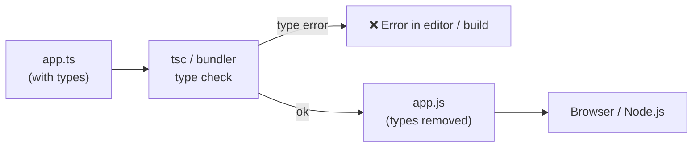
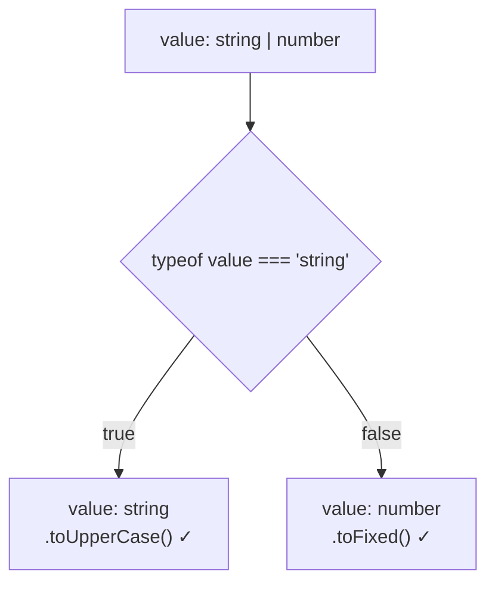

# TypeScript Interview

---

# What is TypeScript and how is it different from JavaScript?

**TypeScript** is a superset of JavaScript that adds **static typing** and other features to JavaScript. TypeScript code is compiled into JavaScript before execution.



Types exist **only at compile time**. At runtime it is plain JavaScript — TypeScript cannot validate API responses or user input by itself.

| **JavaScript (JS)**          | **TypeScript (TS)**                               |
| ---------------------------- | ------------------------------------------------- |
| Dynamically typed            | Statically typed                                  |
| Types are checked at runtime | Types are checked during development/compile time |
| No type definitions required | Supports type definitions                         |
| Runs directly in browsers and Node.js | Requires compilation                     |
| Easier to start              | Better for large-scale applications               |
| Uses `.js` files             | Uses `.ts` files                                  |
| Example: `let age = 25`      | Example: `let age: number = 25`                   |

---

# Difference Between `any`, `unknown`, and `never` — Why is `unknown` Safer?

```text
                 any   ← turns OFF type checking (escape hatch)

               unknown ← top type: holds ANY value, but you must check before using it
          ┌──────┼───────┬────────┐
       string  number  boolean  object ...
          └──────┼───────┴────────┘
                never  ← bottom type: NO value can ever be this
```

Both `any` and `unknown` can store values of any type, but `unknown` provides better type safety.

| **any**                                 | **unknown**                           | **never**                                  |
| --------------------------------------- | ------------------------------------- | ------------------------------------------ |
| Can contain any value                   | Can contain any value                 | Contains no value                          |
| Allows operations without type checking | Requires type checking before use     | Used for impossible cases                  |
| Less safe                               | More safe                             | Function that throws / never returns       |
| TypeScript provides fewer protections   | TypeScript prevents unsafe operations | Exhaustive `switch` checks                 |

Example:

```ts
let value: any = "Hello";

value.toUpperCase(); // Allowed
value.foo.bar();     // Also allowed — crashes at runtime!
```

```ts
let value: unknown = "Hello";

value.toUpperCase(); // Error

if (typeof value === "string") {
  value.toUpperCase(); // Allowed
}
```

```ts
function fail(message: string): never {
  throw new Error(message);
}
```

---

# Difference Between `interface` and `type`

An **interface** is mainly used to define the structure of objects and can be extended.

A **type** is more flexible because it can define objects, unions, primitives, tuples, and complex combinations.

For simple object structures, interfaces are commonly used. For unions and advanced type combinations, types are preferred.

| **interface**                           | **type**                                             |
| --------------------------------------- | ---------------------------------------------------- |
| Mainly used to define object structures | Can define objects, unions, primitives, tuples, etc. |
| Can be extended using `extends`         | Can create combinations using `&`                    |
| Supports declaration merging            | Does not support declaration merging                 |
| Common for object-oriented designs      | More flexible                                        |

```text
interface → objects only           type → anything
┌─────────────────┐                ┌───────────────────────────────┐
│ { name; age }   │                │ { name; age }                 │
│ extends         │                │ "admin" | "user"   (union)    │
│ merging ✓       │                │ [string, number]   (tuple)    │
└─────────────────┘                │ A & B              (intersect)│
                                   └───────────────────────────────┘
```

Example:

### Interface

```ts
interface User {
  name: string;
  age: number;
}

interface Admin extends User {
  role: string;
}

// Declaration merging — both declarations combine
interface User {
  email: string;
}
```

### Type

```ts
type User = {
  name: string;
  age: number;
};

type Admin = User & {
  role: string;
};

type Status = "active" | "inactive"; // only possible with type
```

---

# What are Generics and Why are They Useful?

Generics allow us to write **reusable and type-safe code** that works with different types.

Instead of using `any`, we use a generic type like `T` to preserve type information.

```text
identity<T>  is like a box with a label slot:

  "Hello" ──► [ identity<string> ] ──► string
    100   ──► [ identity<number> ] ──► number

With any:   "Hello" ──► [ identity(any) ] ──► any   (type information lost)
```

Example:

```ts
function identity<T>(value: T): T {
  return value;
}

identity<string>("Hello");
identity(100); // T inferred as number
```

### Generic constraints (`extends`)

```ts
function getLength<T extends { length: number }>(item: T): number {
  return item.length;
}

getLength("hello");   // ✓ string has length
getLength([1, 2, 3]); // ✓ array has length
getLength(10);        // ✗ number has no length
```

### Real-world example — typed API response

```ts
interface ApiResponse<T> {
  data: T;
  error: string | null;
}

const res: ApiResponse<User[]> = await fetchUsers();
```

Benefits:

* Reusable code
* Better type safety
* Avoids using `any`
* Maintains the original type information

---

# What is Type Narrowing and How Do You Achieve It?

**Type narrowing** means reducing a union type into a more specific type so TypeScript can understand what operations are safe.



Ways to achieve type narrowing:

* `typeof`
* `instanceof`
* `in`
* Equality checks
* Custom type guards
* Discriminated unions

Example:

```ts
function print(value: string | number) {
  if (typeof value === "string") {
    console.log(value.toUpperCase());
  } else {
    console.log(value.toFixed(2));
  }
}
```

### Custom type guard (`is`)

```ts
interface Cat { meow(): void }
interface Dog { bark(): void }

function isCat(animal: Cat | Dog): animal is Cat {
  return "meow" in animal;
}

if (isCat(pet)) {
  pet.meow(); // pet is Cat here
}
```

### Discriminated union (most useful pattern)

Each member has a common literal field (`status`) that tells TypeScript which shape it is.

```ts
type Result =
  | { status: "success"; data: string }
  | { status: "error"; message: string };

function handle(result: Result) {
  switch (result.status) {
    case "success":
      return result.data;    // TS knows: data exists
    case "error":
      return result.message; // TS knows: message exists
    default: {
      const check: never = result; // error if a new status is not handled
      return check;
    }
  }
}
```

---

# Difference Between Union (`|`) and Intersection (`&`) Types

| **Union (`\|`)** | **Intersection (`&`)** |
|---|---|
| Means **OR** | Means **AND** |
| Value can be one of the types | Value must contain all types |
| Example: `string \| number` | Example: `User & Admin` |

```text
Union  A | B                        Intersection  A & B  (for object types)
"either shape"                      "both shapes combined"

 ┌───────┐   ┌───────┐               { name }  +  { role }
 │   A   │ OR│   B   │                      ↓
 └───────┘   └───────┘               { name, role }   ← must have ALL properties
```

Example:

### Union Type

```ts
let id: string | number;

id = "ABC";
id = 123;
```

### Intersection Type

```ts
type User = {
  name: string;
};

type Admin = {
  role: string;
};

type AdminUser = User & Admin; // { name: string; role: string }
```

---

# How Do You Type a Function's Parameters and Return Value?

In TypeScript, parameter types are defined after parameter names, and the return type is defined after the function parameters.

```text
function add( a: number , b: number ): number { ... }
              └─param─┘   └─param─┘   └return┘
```

Example:

```ts
function add(a: number, b: number): number {
  return a + b;
}

// Optional and default parameters
function greet(name: string, greeting: string = "Hello", suffix?: string): string {
  return `${greeting}, ${name}${suffix ?? ""}`;
}

// Arrow function type
const multiply: (a: number, b: number) => number = (a, b) => a * b;
```

Explanation:

* `a: number` → first parameter must be a number
* `b: number` → second parameter must be a number
* `: number` → function returns a number
* `suffix?` → optional parameter

---

# What are Utility Types?

Built-in generic types that **transform an existing type** so you don't rewrite it.

```text
interface User { id: number; name: string; email: string; password: string }

Partial<User>            → { id?; name?; email?; password? }     all optional
Required<User>           → all required
Readonly<User>           → all readonly
Pick<User, "id"|"name">  → { id; name }                           keep some
Omit<User, "password">   → { id; name; email }                    remove some
Record<"a"|"b", number>  → { a: number; b: number }                key → value map
```

| Utility             | Use case                                          |
| ------------------- | ------------------------------------------------- |
| `Partial<T>`        | Update payloads (PATCH) — every field optional    |
| `Pick<T, K>`        | Public user shape with only some fields           |
| `Omit<T, K>`        | Remove `password` before sending to the client    |
| `Record<K, V>`      | Lookup objects, e.g. `Record<string, number>`     |
| `ReturnType<F>`     | Get the return type of a function                 |
| `Awaited<T>`        | Unwrap a Promise type                             |

```ts
function updateUser(id: number, changes: Partial<User>) { /* ... */ }

type PublicUser = Omit<User, "password">;
```

---

# Enums vs Union of String Literals

```ts
// Enum — creates a real JavaScript object at runtime
enum Role {
  Admin = "ADMIN",
  User = "USER",
}

// Union literal — types only, removed at compile time
type Role2 = "ADMIN" | "USER";
```

| Enum                                    | Union literal                         |
| --------------------------------------- | ------------------------------------- |
| Exists at runtime (adds JS code)        | Zero runtime code                     |
| Can loop over values (`Object.values`)  | Just a type                           |
| Must import `Role.Admin` to use         | Plain string `"ADMIN"` works          |
| Numeric enums allow any number (unsafe) | Only listed values allowed            |

```text
Compiled output:
enum Role       →  var Role = { Admin: "ADMIN", User: "USER" }   (real object)
type Role2      →  (nothing)
```

**Common answer:** most modern codebases prefer **union literals** (or an `as const` object) unless they need runtime values.

```ts
const ROLES = ["ADMIN", "USER"] as const;
type Role3 = (typeof ROLES)[number]; // "ADMIN" | "USER", and ROLES exists at runtime
```

---

# What are `keyof` and `typeof` in TypeScript?

```text
typeof  : value  ──►  type        (get the type of a variable)
keyof   : type   ──►  union of its keys
```

```ts
const config = { port: 3000, host: "localhost" };

type Config = typeof config;   // { port: number; host: string }
type ConfigKey = keyof Config; // "port" | "host"

function getValue<T, K extends keyof T>(obj: T, key: K): T[K] {
  return obj[key];
}

getValue(config, "port");  // number ✓
getValue(config, "debug"); // ✗ "debug" is not a key
```

---

# What is Type Assertion (`as`)?

Telling TypeScript "trust me, I know the type". It does **not** convert or check the value at runtime.

```ts
const input = document.getElementById("email") as HTMLInputElement;
input.value;
```

```text
as     → compile-time only, no runtime check   (can be wrong!)
narrow → real runtime check (typeof / in / instanceof)   (safe)
```

Prefer narrowing. Use `as` only when you truly know more than the compiler. `!` (non-null assertion) is the same idea: `user!.name`.

---

# What do `readonly` and optional (`?`) properties mean?

```ts
interface User {
  readonly id: number; // cannot be reassigned after creation
  name: string;
  phone?: string;      // may be missing → type is string | undefined
}

const u: User = { id: 1, name: "Ali" };
u.id = 2;              // ✗ Error: readonly
u.phone?.length;       // ✓ safe access
```

---

# What is `tsconfig.json` and what does `strict` do?

`tsconfig.json` configures the TypeScript compiler for the project.

```json
{
  "compilerOptions": {
    "target": "ES2022",
    "module": "ESNext",
    "strict": true,
    "outDir": "dist"
  },
  "include": ["src"]
}
```

`"strict": true` turns on a group of safety checks:

| Flag                    | What it catches                                    |
| ----------------------- | -------------------------------------------------- |
| `noImplicitAny`         | Parameters without a type silently becoming `any`  |
| `strictNullChecks`      | Using a value that might be `null` / `undefined`   |
| `strictFunctionTypes`   | Unsafe function parameter types                    |
| `strictPropertyInitialization` | Class properties never initialized          |
| `useUnknownInCatchVariables` | `catch (e)` — `e` is `unknown`, not `any`     |

```text
strict: false   let name: string = null;   ✓ compiles → crashes later
strict: true    let name: string = null;   ✗ error now
```

**Always use `strict: true` in new projects.**

---

# TypeScript Summary

| Concept              | Description                                 |
| -------------------- | ------------------------------------------- |
| TypeScript           | Superset of JavaScript with static typing   |
| Static typing        | Types checked during compile time           |
| `any`                | Allows anything but removes type safety     |
| `unknown`            | Safer alternative that requires type checks |
| `never`              | A value that can never happen               |
| `interface`          | Defines object structures                   |
| `type`               | Flexible type definitions                   |
| Generics             | Reusable type-safe code                     |
| Type narrowing       | Converts broad types into specific types    |
| Union (`\|`)         | OR — one of multiple types                  |
| Intersection (`&`)   | AND — combines multiple types               |
| Utility types        | Transform types: `Partial`, `Pick`, `Omit`  |
| `keyof` / `typeof`   | Keys of a type / type of a value            |
| `strict`             | Enables the full set of safety checks       |
