# React Interview Questions and Answers

React is an open-source JavaScript library developed by Meta (Facebook) for building user interfaces, especially single-page applications (SPAs). It updates only the changed parts of the UI, which improves performance.

### Main Features

- **Virtual DOM** — efficiently updates the UI without reloading the whole page
- **JSX** — write HTML-like UI code inside JavaScript
- **Component-Based Architecture** — the UI is broken into small, isolated, reusable pieces
- **One-Way Data Binding** — unidirectional data flow, so updates are predictable
- **Hooks** — use state and lifecycle features in function components
- **Declarative UI** — describe what the UI should look like, not how to update it

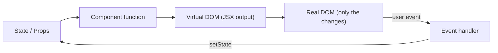

## Core Concepts

### Virtual DOM

The Virtual DOM is a lightweight, in-memory copy of the actual DOM.

#### How It Works

On state change, React builds a new Virtual DOM tree and, during reconciliation (scheduled by Fiber), diffs it against the previous one to find exactly what changed. Then, in the commit phase, it applies only those minimal changes to the real DOM.

**1. Trigger (State/Props Change)**

Something asks React to update: the first mount, a `setState` call, or a parent re-rendering. React does not mutate the existing Virtual DOM.

**2. Render Phase (Fiber Architecture)**

React calls your components and builds a **brand new** Virtual DOM tree representing the updated UI. At this point there are two trees: the previous one and the new one. **Fiber** is React's internal reconciliation architecture that lets React schedule, prioritize, pause, and resume this work.

**3. Reconciliation (Diffing Engine)**

- **Reconciliation** = the overall process of comparing the previous and new trees to determine what changed, including figuring out component identity using `key`. It is scheduled and prioritized by Fiber.
- **Diffing** = the algorithm used _within_ reconciliation that compares the two trees node by node to find exactly what changed.

**4. Commit (Real DOM Updates)**

Once React knows what changed, it applies only those specific changes to the real DOM, instead of re-rendering the entire UI. Effects run after this.

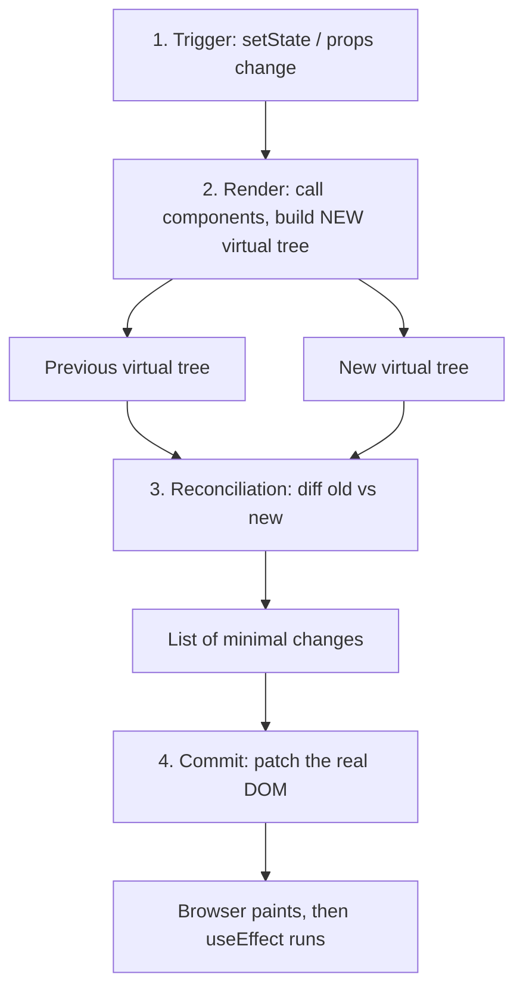

#### Virtual DOM vs Real DOM

| Aspect              | Virtual DOM                                      | Real DOM                                           |
| ------------------- | ------------------------------------------------ | -------------------------------------------------- |
| What it is          | Lightweight JS object copy of the UI             | Actual browser DOM structure                       |
| Update speed        | Fast (in-memory)                                 | Slow (triggers layout / reflow / repaint)          |
| Update process      | Batches changes, then updates only what's needed | Each change applies immediately and can trigger layout/repaint |
| Direct manipulation | Not visible to the user                          | Directly visible to the user                       |
| Cost                | Cheap to create and discard                      | Expensive to manipulate frequently                 |

#### Is the Virtual DOM always faster than direct DOM manipulation?

**No.** Hand-written, targeted DOM updates can beat it. The Virtual DOM's advantage shows up in complex UIs with frequent, unpredictable updates across many elements — and in developer experience, since you describe the result instead of the steps.

#### Does the Virtual DOM eliminate all DOM manipulation?

**No** — it minimizes it, but the final updates still touch the real DOM. It optimizes **how much** and **how often**, not **whether**.

---

### Render Phase vs Commit Phase

React does its work in two phases. Only the commit phase touches the real DOM.

| Render Phase                                   | Commit Phase                                   |
| ---------------------------------------------- | ---------------------------------------------- |
| Calls your component functions                 | Applies changes to the real DOM                |
| Pure — no side effects allowed                 | Side effects are allowed here (refs, effects)  |
| Can be paused, restarted, or thrown away       | Runs synchronously, cannot be interrupted      |
| May run more than once (Strict Mode, concurrent) | Runs once per update                          |

```text
setState()
   │
   ▼
┌──────────── RENDER PHASE (pure, interruptible) ────────────┐
│  call App() → call Child() → build new virtual tree → diff │
└────────────────────────────────────────────────────────────┘
   │
   ▼
┌──────────── COMMIT PHASE (sync, touches DOM) ──────────────┐
│  update DOM → attach refs → useLayoutEffect → paint        │
└────────────────────────────────────────────────────────────┘
   │
   ▼
useEffect runs (after paint)
```

**Why it matters:** because render can run more than once, never put side effects (API calls, subscriptions, mutations) directly in the component body — put them in `useEffect` or event handlers.

---

### JSX

JSX stands for **JavaScript XML**. It lets you write HTML-like elements directly inside JavaScript.

Browsers cannot read JSX directly — a compiler like **Babel** transpiles it into `React.createElement()` calls (or the modern JSX runtime).

```jsx
const el = <h1 className="title">Hello</h1>;

// becomes roughly:
const el = React.createElement('h1', { className: 'title' }, 'Hello');
```

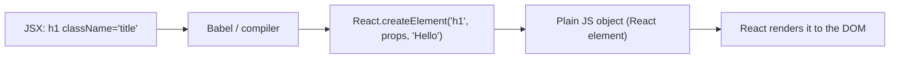

---

### Functional vs Class Components

**Functional Components**

- Plain JS functions
- Manage state with `useState` and handle lifecycle through `useEffect`
- Simpler to read, easier to test, smaller bundle size

**Class Components**

- ES6 class syntax, rely on the `this` keyword
- Require a `render()` method and separate lifecycle methods like `componentDidMount`, `componentDidUpdate`, and `componentWillUnmount`

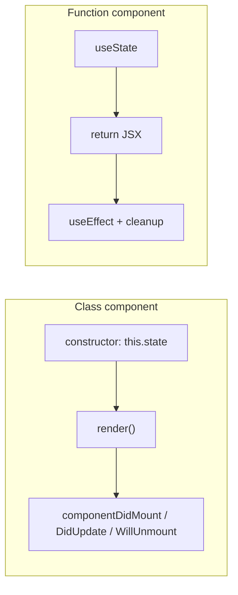

---

### Controlled vs Uncontrolled Components

| Controlled                                           | Uncontrolled                                 |
| ---------------------------------------------------- | -------------------------------------------- |
| Data stored in React state                           | Data stored directly in the DOM              |
| Value read from a state variable                     | Value read via a ref (`useRef`) when needed  |
| Re-renders on every keystroke                        | Typing does not re-render the component      |
| Enables real-time, character-by-character validation | Validation usually happens at submit time    |

```jsx
// Controlled
const [name, setName] = useState('');
<input value={name} onChange={(e) => setName(e.target.value)} />;

// Uncontrolled
const inputRef = useRef(null);
<input ref={inputRef} defaultValue="" />;
```

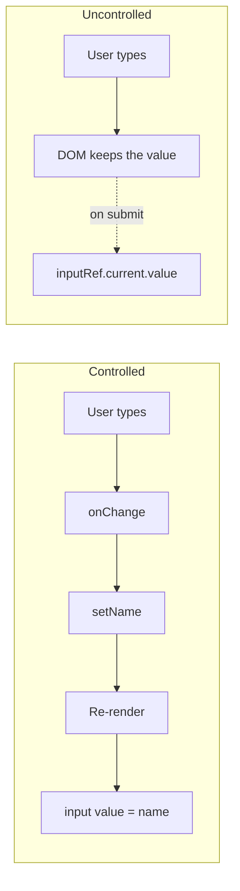

---

### Conditional Rendering

Rendering different UI depending on a condition.

```jsx
// if / else
if (loading) return <Spinner />;

// Ternary
{isLoggedIn ? <Dashboard /> : <Login />}

// Logical &&
{hasError && <ErrorMessage />}
```

**Careful with `&&`:** a number like `0` renders as `0` instead of nothing. Use `count > 0 && <List />` rather than `count && <List />`.

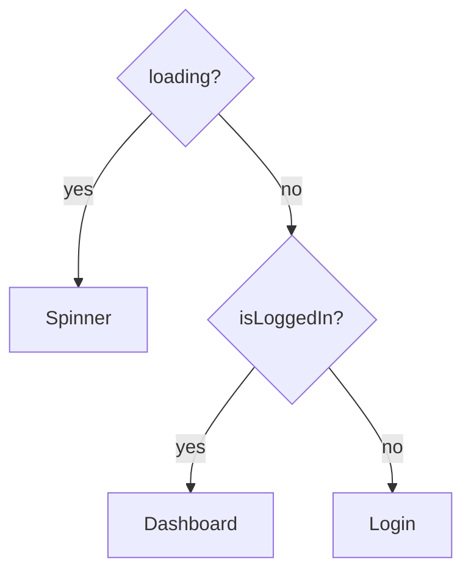

---

### State vs Props

| State                                  | Props                                             |
| -------------------------------------- | ------------------------------------------------- |
| Data managed inside a component        | Data passed from parent → child                   |
| Can be updated by the component itself | Read-only (immutable) for the receiving component |

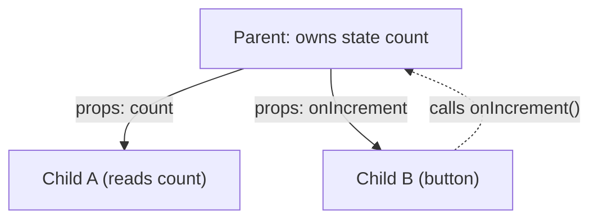

Data flows **down** as props; changes flow **up** as callback calls.

---

### Lists and Keys

Lists are rendered by mapping an array to JSX. Each item needs a stable, unique `key` so React can match old and new items during reconciliation.

```jsx
{todos.map((todo) => (
  <TodoItem key={todo.id} todo={todo} />
))}
```

**Why not use the array index as key?** If items are inserted, deleted, or reordered, the index of each item changes, so React matches the wrong components — state (like an input's text or a checkbox) sticks to the wrong row.

```text
Before:  key=0 "Milk" [✓]   key=1 "Eggs" [ ]
Insert "Bread" at top, keys = index:
After:   key=0 "Bread" [✓]  ← React reused key=0, so the ✓ moved to the wrong item!
         key=1 "Milk"  [ ]
         key=2 "Eggs"  [ ]

With key = todo.id:
After:   key=b "Bread" [ ]  ← new component
         key=m "Milk"  [✓]  ← same component, state kept
         key=e "Eggs"  [ ]
```

Index as key is fine **only** when the list is static (never reordered, filtered, or inserted into).

---

### Fragments

Fragments group several elements without adding an extra DOM node.

```jsx
return (
  <>
    <td>Name</td>
    <td>Age</td>
  </>
);

// Use the long form when you need a key
<React.Fragment key={item.id}>...</React.Fragment>
```

```text
With <div> wrapper:          With Fragment:
<tr>                         <tr>
  <div>   ← invalid in a table <td>Name</td>
    <td>Name</td>              <td>Age</td>
    <td>Age</td>             </tr>
  </div>
</tr>
```

---

### Lifting State Up

Moving local state from child components up to their closest common parent, so multiple children can share, sync, and update the same data.

```jsx
function Parent() {
  const [value, setValue] = useState('');
  return (
    <>
      <SearchInput value={value} onChange={setValue} />
      <ResultsList query={value} />
    </>
  );
}
```

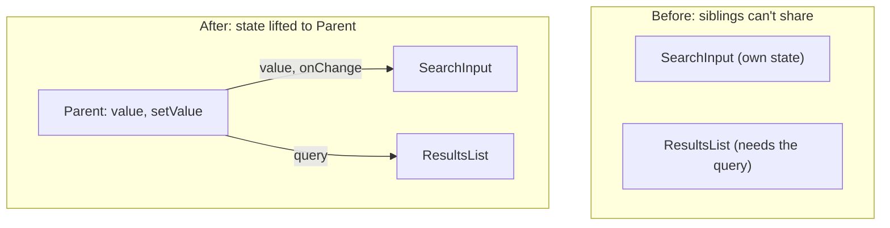

---

### Prop Drilling

Passing data through multiple components that don't actually need the data themselves.

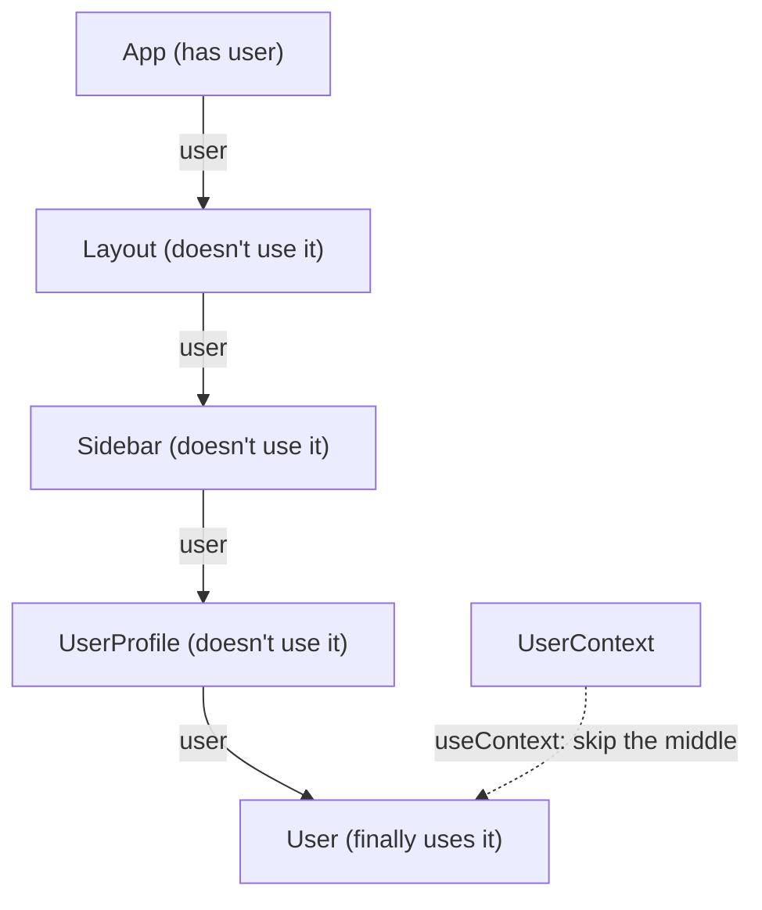

Solutions:

- Component composition (pass JSX as `children`)
- Context
- State-management libraries
- Better component architecture

**Note:** prop drilling isn't automatically bad. Passing props through one or two levels is often perfectly fine.

---

### Client State vs Server State

| Client State (UI State)                      | Server State (Remote State)                                 |
| -------------------------------------------- | ----------------------------------------------------------- |
| Lives in the UI / browser                    | Lives in the database / backend API                         |
| Synchronous and predictable                  | Asynchronous and unpredictable                              |
| Lost on page refresh                         | Persistent across sessions and devices                      |
| Concerns: scoping, re-renders, prop drilling | Concerns: caching, deduplication, revalidation, concurrency |
| `useState`, Zustand, Redux, Jotai            | TanStack Query, SWR, RTK Query                              |

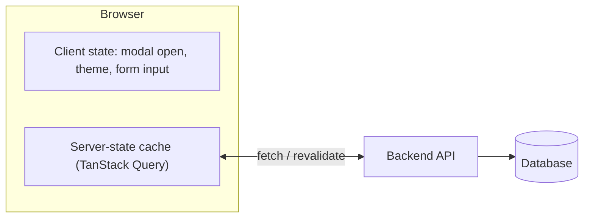

---

### Persisting State

- Browser storage (`localStorage`, `sessionStorage`)
- Cookies
- IndexedDB
- URL / query params (good for filters and pagination)

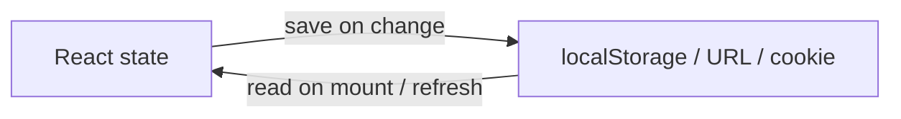

---

### Immutability: Why Not Mutate State Directly?

React decides whether to re-render by comparing the old and new state **by reference** (`Object.is`). If you mutate the same object, the reference doesn't change, so React thinks nothing happened.

```jsx
// ❌ Wrong — same array reference, no re-render
items.push(newItem);
setItems(items);

// ✅ Right — new array reference
setItems([...items, newItem]);

// ✅ Objects
setUser({ ...user, name: 'Ali' });
```

```text
Mutate:     items ──► [a, b, c]  (push d)  ──► [a, b, c, d]
            old ref === new ref  → React: "same" → skips render ❌

Copy:       old ──► [a, b, c]
            new ──► [a, b, c, d]   (different object)
            old ref !== new ref → React re-renders ✅
```

---

### What Happens When a Component Re-renders?

1. The component function runs again (or `render()` for class components)
2. React generates a new Virtual DOM tree
3. React diffs it against the previous tree
4. React calculates the minimal set of changes (reconciliation)
5. Only the changed nodes are updated in the real DOM (commit phase)

**A re-render doesn't always mean the real DOM changes.** If the output is identical, React skips the DOM update.

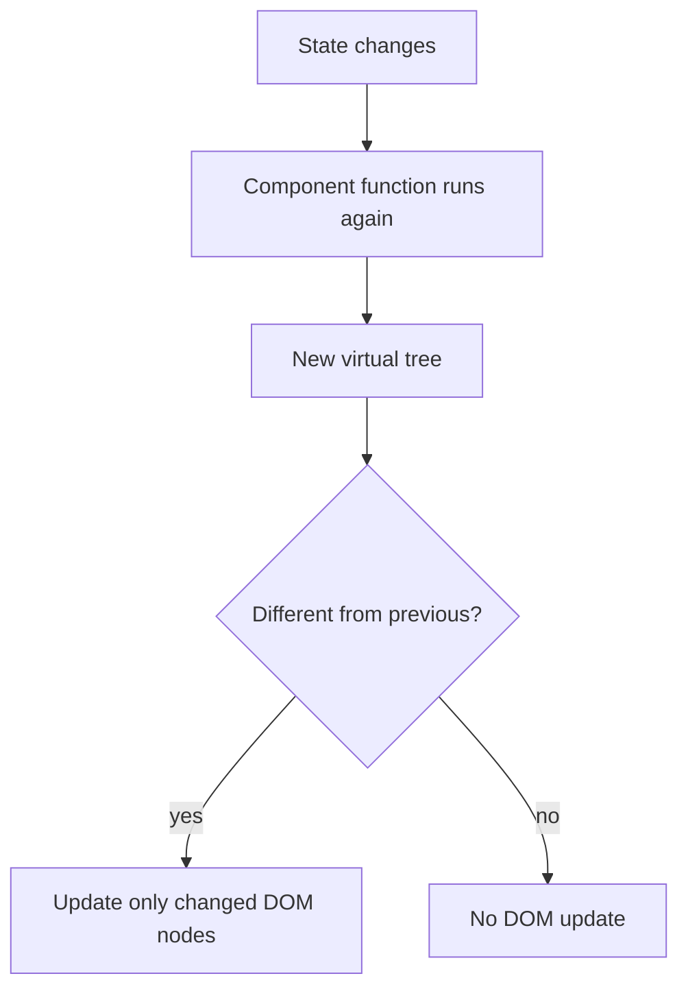

#### Does a state change always update the real DOM?

**No.**

- State change → triggers a re-render (Virtual DOM recalculated)
- The real DOM is updated **only if** diffing detects an actual difference

React also **bails out entirely** if you set state to the same value it already has (compared with `Object.is`), so sometimes not even the re-render happens.

---

## Hooks

### What are Hooks, and what are the Rules of Hooks?

Hooks are functions that let function components use state, lifecycle, refs, context, and other React features.

**Rules:**

1. Call hooks only at the **top level** — never inside conditions, loops, or nested functions.
2. Call hooks only from **React components or custom hooks**.

**Why?** React doesn't store hooks by name. It stores them in a list, in call order, per component. If a hook is skipped on one render, every hook after it reads the wrong slot.

```text
Render 1 (isLoggedIn = true)     Render 2 (isLoggedIn = false)
slot 0: useState('Ali')          slot 0: useState('Ali')
slot 1: useState(0)  ← in if     slot 1: useEffect(...)   ← reads count's slot! 💥
slot 2: useEffect(...)
```

```jsx
// ❌ Breaks the order
if (isLoggedIn) {
  const [count, setCount] = useState(0);
}

// ✅ Always call the hook, put the condition inside
const [count, setCount] = useState(0);
```

---

### useState

Lets a function component store state.

```jsx
const [count, setCount] = useState(0);
```

For updates based on the previous state, prefer the updater form:

```jsx
setCount((prev) => prev + 1);
```

Each render sees a **snapshot** of state. Inside one event handler, `count` is a fixed value, so calling `setCount(count + 1)` twice queues "set to 1" twice — it only increments once. The updater form receives the latest queued value instead.

```text
count = 0

setCount(count + 1);   // queue: "replace with 0 + 1"
setCount(count + 1);   // queue: "replace with 0 + 1"
→ result: 1

setCount(p => p + 1);  // queue: 0 → 1
setCount(p => p + 1);  // queue: 1 → 2
→ result: 2
```

#### Why doesn't state update immediately?

`setState` doesn't change the variable in the current render — it schedules a re-render. The new value is visible in the **next** render.

```jsx
const handleClick = () => {
  setCount(count + 1);
  console.log(count); // still the old value
};
```

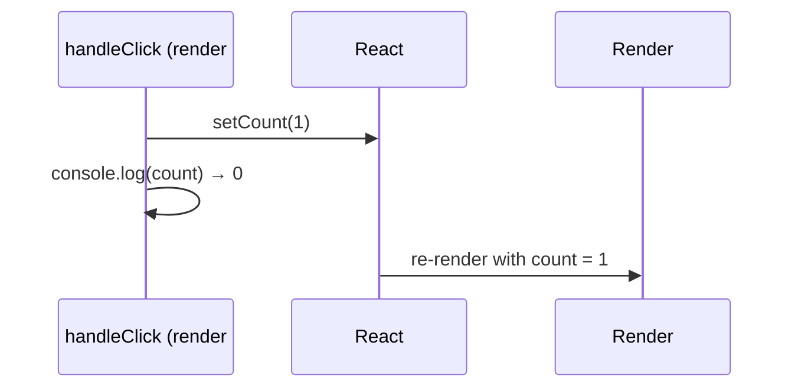

---

### Automatic Batching

React groups multiple state updates into **one re-render**. Since React 18 this happens everywhere — event handlers, `setTimeout`, promises, and native event handlers.

```jsx
function handleClick() {
  setCount((c) => c + 1);
  setFlag((f) => !f);
  setName('Ali');
  // → only ONE re-render, not three
}
```

```text
Without batching:  setCount → render   setFlag → render   setName → render   (3 renders)
With batching:     setCount ┐
                   setFlag  ├─► one render
                   setName  ┘
```

---

### useEffect

Lets a component synchronize with external systems: API subscriptions, event listeners, timers, browser APIs, WebSocket connections.

```jsx
useEffect(() => {
  document.title = `Count: ${count}`;
}, [count]);
```

#### Dependency Array

```jsx
useEffect(() => {
  // after every render
});

useEffect(() => {
  // after the initial mount only
}, []);

useEffect(() => {
  // whenever userId changes
}, [userId]);
```

React compares dependencies between renders (with `Object.is`) and re-runs the effect when one changes.

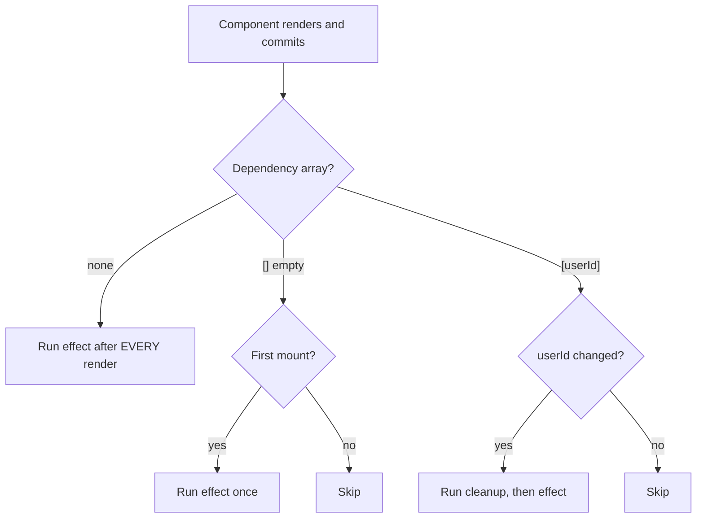

#### Cleanup

Effects can return a cleanup function.

```jsx
useEffect(() => {
  const handleResize = () => console.log(window.innerWidth);

  window.addEventListener('resize', handleResize);

  return () => {
    window.removeEventListener('resize', handleResize);
  };
}, []);
```

Cleanup runs when:

- The component unmounts
- Before the effect runs again because a dependency changed

It prevents memory leaks, duplicate subscriptions, stray listeners, and timers that keep firing after unmount.

```text
Mount              → effect(userId=1)
userId changes 1→2 → cleanup(userId=1) → effect(userId=2)
userId changes 2→3 → cleanup(userId=2) → effect(userId=3)
Unmount            → cleanup(userId=3)
```

**Note:** in Strict Mode during development, React mounts, unmounts, and remounts components once — so effects run twice. This is intentional, to surface missing cleanup.

#### Fetching data in useEffect (race conditions)

If `userId` changes quickly, an older request can finish **after** a newer one and overwrite the correct data. Ignore or abort stale responses in the cleanup.

```jsx
useEffect(() => {
  const controller = new AbortController();

  fetch(`/api/users/${userId}`, { signal: controller.signal })
    .then((res) => res.json())
    .then(setUser)
    .catch((err) => {
      if (err.name !== 'AbortError') setError(err);
    });

  return () => controller.abort();
}, [userId]);
```

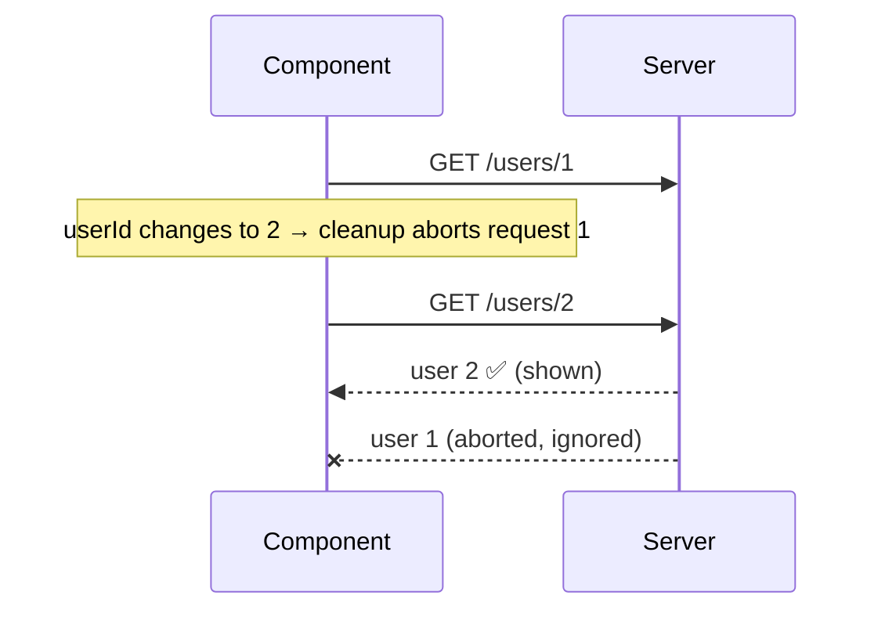

In real apps, a data library (TanStack Query, SWR) or framework loader handles this for you.

---

### useEffect vs useLayoutEffect

| useEffect                                  | useLayoutEffect                                       |
| ------------------------------------------ | ----------------------------------------------------- |
| Runs **after** the browser paints          | Runs **before** the browser paints                    |
| Does not block the screen update           | Blocks paint until it finishes                        |
| Default choice: fetching, subscriptions    | Measuring the DOM (size/position) to avoid a flicker  |

```text
render → commit DOM → useLayoutEffect → 🖌️ paint → useEffect
```

Use `useLayoutEffect` only when the user would otherwise see a flicker (for example, positioning a tooltip based on its measured size).

---

### useMemo vs useCallback

```jsx
// useMemo → memoize a VALUE
const expensiveValue = useMemo(() => calculateSomething(data), [data]);

// useCallback → memoize a FUNCTION reference
const handleClick = useCallback(() => doSomething(id), [id]);
```

`useCallback(fn, deps)` is just shorthand for `useMemo(() => fn, deps)`.

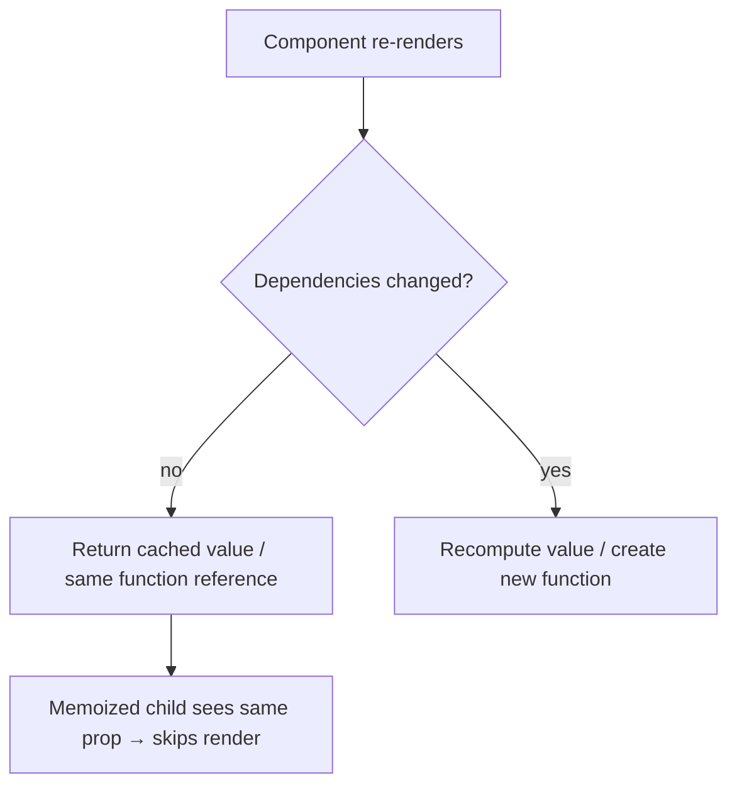

**When to use them:** for genuinely expensive calculations, or to keep a stable reference for a `React.memo` child or an effect dependency. Wrapping everything adds cost without benefit.

---

### useRef

Stores a mutable value that persists between renders **without** causing a re-render when changed.

```jsx
const inputRef = useRef(null);

<input ref={inputRef} />;

inputRef.current.focus();
```

Unlike state, `ref.current = value` does not trigger a render. Use it for DOM nodes, timer IDs, and previous values.

#### useRef vs useState

| useState                         | useRef                                  |
| -------------------------------- | --------------------------------------- |
| Changing it re-renders           | Changing it does **not** re-render      |
| Value shown in the UI            | Value kept "behind the scenes"          |
| Updated via setter (scheduled)   | Updated directly (`ref.current = x`)     |

```text
state:  setCount(5)        → 🔄 re-render → UI shows 5
ref:    ref.current = 5    → no render    → UI unchanged, value saved for later
```

---

### useContext

Lets a component consume data from React Context without passing props through every intermediate level.

Common use cases: theme, authentication info, locale, app configuration.

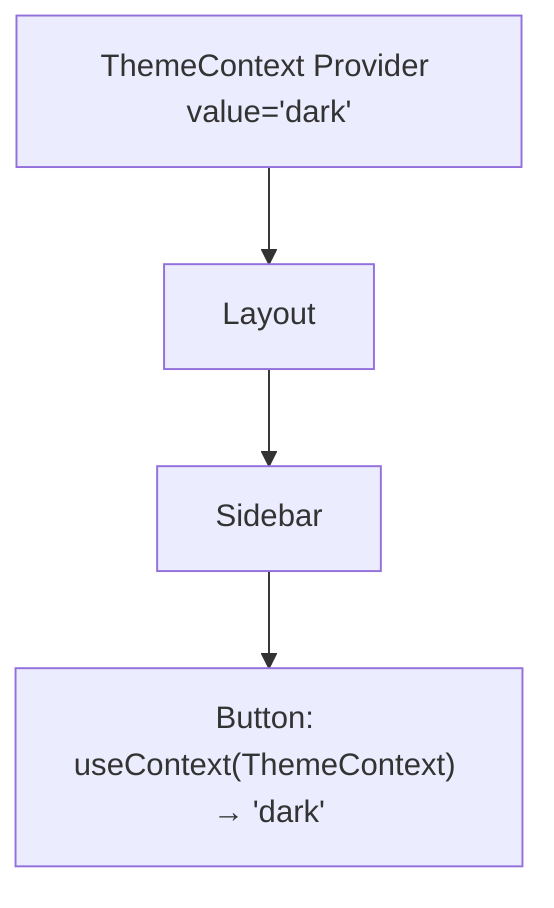

---

### useReducer

Useful for more complex state transitions.

```jsx
const [state, dispatch] = useReducer(reducer, initialState);

function reducer(state, action) {
  switch (action.type) {
    case 'increment':
      return { ...state, count: state.count + 1 };
    default:
      return state;
  }
}
```

Think: **State + Action → Reducer → New State**

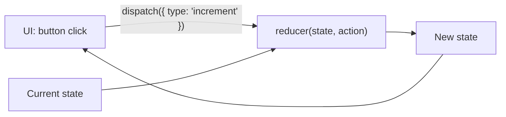

**useState vs useReducer:** use `useState` for simple independent values; use `useReducer` when the next state depends on several values or many actions update the same state.

---

### Custom Hooks

A reusable function that uses React Hooks to share **stateful logic** between components.

```jsx
function useOnlineStatus() {
  const [isOnline, setIsOnline] = useState(navigator.onLine);

  useEffect(() => {
    const goOnline = () => setIsOnline(true);
    const goOffline = () => setIsOnline(false);
    window.addEventListener('online', goOnline);
    window.addEventListener('offline', goOffline);
    return () => {
      window.removeEventListener('online', goOnline);
      window.removeEventListener('offline', goOffline);
    };
  }, []);

  return isOnline;
}
```

Custom hooks share logic, **not state** — each component that calls one gets its own independent state.

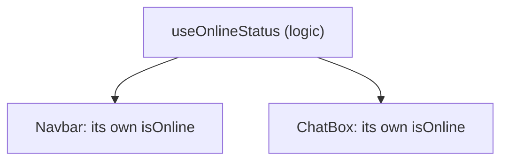

---

## Performance

### Why Does a Component Re-render?

A component re-renders when:

- Its **state** changes
- Its **parent re-renders** — by default every child re-renders too, even if its props are the same
- A consumed **context** value changes

Props changing is not a separate trigger — new props only arrive because the parent re-rendered. To skip a child's re-render when its props are unchanged, wrap it in `React.memo`.

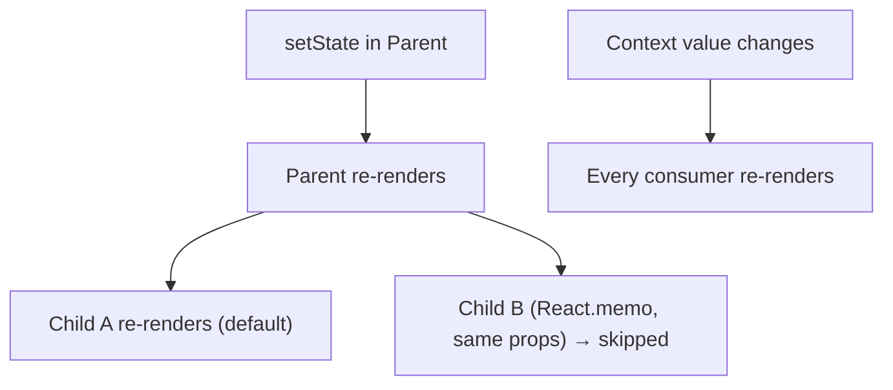

Optimization techniques:

- `React.memo`, `useMemo`, `useCallback`
- Proper component structure
- Avoiding unnecessary state
- Keeping state close to where it's used
- Virtualizing very large lists
- Code splitting
- Avoiding unnecessary effects

**Profile first, then optimize.** Identify the actual bottleneck with React DevTools before adding memoization.

---

### React.memo

Prevents a component from re-rendering when its props haven't changed, according to a shallow comparison.

```jsx
const UserCard = React.memo(function UserCard({ user }) {
  return <div>{user.name}</div>;
});
```

It can still re-render when:

- Its own state changes
- A consumed context value changes
- Its parent passes a different prop value (a new object or inline function counts as different)

```text
Parent renders:
  <UserCard user={user} />                   same reference → skip ✅
  <UserCard user={{ name: 'Ali' }} />        new object each render → re-render ❌
  <UserCard onClick={() => select(id)} />    new function each render → re-render ❌
  <UserCard onClick={handleSelect} />        handleSelect from useCallback → skip ✅
```

Don't use it everywhere — it's an optimization tool, and the comparison itself has a cost.

---

### Code Splitting / Lazy Loading

Loading JavaScript only when it's needed, instead of shipping the whole app up front.

```jsx
const Dashboard = lazy(() => import('./Dashboard'));

<Suspense fallback={<Loading />}>
  <Dashboard />
</Suspense>;
```

This reduces the initial bundle and improves first load.

```mermaid
sequenceDiagram
    participant U as User
    participant A as App (main bundle)
    participant N as Network
    U->>A: opens /dashboard
    A->>A: show Suspense fallback (Loading...)
    A->>N: download Dashboard chunk
    N-->>A: Dashboard.js
    A->>U: render Dashboard
```

---

## Patterns and APIs

### Higher-Order Components (HOC)

A function that takes a component and returns an enhanced component.

```jsx
function withAuth(Component) {
  return function ProtectedComponent(props) {
    if (!isAuthenticated) {
      return <Login />;
    }
    return <Component {...props} />;
  };
}
```

HOCs were common before Hooks. Today most use cases are better handled with custom hooks, composition, or context.

```mermaid
flowchart LR
    A["Dashboard"] --> W["withAuth()"]
    W --> B["ProtectedDashboard"]
    B --> Q{"isAuthenticated?"}
    Q -->|yes| D["render Dashboard"]
    Q -->|no| L["render Login"]
```

---

### Component Lifecycle

Three conceptual phases:

- **Mount** — the component is added to the UI
- **Update** — props or state change and React renders again
- **Unmount** — the component is removed from the UI

In function components this is handled with hooks, mainly `useEffect`.

```mermaid
flowchart LR
    M["Mount"] --> U["Update (repeats)"]
    U --> U
    U --> X["Unmount"]
    M -.- M1["useEffect(fn, []) runs / componentDidMount"]
    U -.- U1["useEffect(fn, [deps]) runs / componentDidUpdate"]
    X -.- X1["cleanup runs / componentWillUnmount"]
```

---

### Event Bubbling

An event triggered on a child propagates upward through its ancestors.

```jsx
<div onClick={() => console.log('parent')}>
  <button onClick={() => console.log('button')}>Click</button>
</div>
```

Clicking the button logs `button` then `parent`. Stop it with:

```jsx
event.stopPropagation();
```

```text
click on <button>
   │  logs "button"
   ▼ bubbles up
<div> logs "parent"
   ▼
document / root
```

---

### Synthetic Events

React wraps native browser events in a **SyntheticEvent** object that behaves the same in every browser. React attaches listeners at the **root** container (event delegation) instead of on each element.

```mermaid
flowchart LR
    B["Native click on button"] --> R["React root listener"]
    R --> S["Creates SyntheticEvent"]
    S --> H["Calls your onClick handler"]
```

---

### Context API

Makes data available to a component subtree without passing props through every level.

```jsx
const ThemeContext = createContext('light');

// Provide (React 19+)
<ThemeContext value="dark">
  <App />
</ThemeContext>;

// React 18 and earlier
<ThemeContext.Provider value="dark">
  <App />
</ThemeContext.Provider>;

// Consume
const theme = useContext(ThemeContext);
```

The Context API is the overall mechanism of creating, providing, and consuming context. `useContext()` is how function components consume it.

**Caveat:** when the context value changes, every consumer re-renders. Split contexts or memoize the value object to limit this.

```mermaid
flowchart TD
    C["createContext('light')"] --> P["Provider value='dark'"]
    P --> A["App"]
    A --> X["Header (not a consumer)"]
    A --> Y["ThemeButton: useContext → 'dark'"]
    A --> Z["Footer: useContext → 'dark'"]
```

---

### Error Boundaries

Catch errors during rendering and show fallback UI instead of crashing the whole tree.

```jsx
<ErrorBoundary fallback={<ErrorPage />}>
  <Dashboard />
</ErrorBoundary>
```

They catch errors in rendering, lifecycle methods, and constructors of descendant components.

They do **not** catch errors in event handlers, async code, server-side rendering, or the boundary itself. Error boundaries must be class components (or use a library like `react-error-boundary`).

```mermaid
flowchart TD
    App --> EB["ErrorBoundary"]
    EB --> D["Dashboard"]
    D --> W["Widget throws during render 💥"]
    W -.->|"error bubbles up"| EB
    EB --> F["Shows ErrorPage; rest of App keeps working"]
```

---

### Strict Mode

A development-only wrapper that helps find bugs. It does nothing in production.

In development it:

- Renders components **twice** to catch impure render logic
- Runs effects **mount → unmount → mount** to catch missing cleanup
- Warns about deprecated APIs

```text
<StrictMode> in development:
render() → render() again     (results must be identical)
effect() → cleanup() → effect()  (cleanup must undo the effect)
```

**"Why does my console.log / API call run twice?"** — Strict Mode in development. It is not a bug, and it doesn't happen in production.

---

### Client-Side vs Server-Side Routing

**Client-Side Routing** — navigation happens in the browser without a full page reload.

- Fast navigation
- Preserves client state
- More app-like experience

**Server-Side Routing** — the browser requests a URL from the server.

The server decides what to return for that route.

```mermaid
flowchart LR
    subgraph Client-side
        L1["Click Link"] --> H1["History API changes URL"] --> R1["Router swaps component, no reload"]
    end
    subgraph Server-side
        L2["Click link"] --> S2["Request to server"] --> P2["New HTML page, full reload"]
    end
```

---

## Interview Questions

### Q2. Why is ReactJS used?
React is used to build fast, interactive UIs with reusable components, predictable one-way data flow, and efficient rendering through Virtual DOM.

### Q6. What are the advantages of ReactJS?
- Fast updates
- Reusable components
- Clean declarative code
- Strong ecosystem and tooling
- Easy integration with other libraries

### Q15. Explain React Fragments.
Fragments group elements without adding extra DOM nodes. See [Fragments](#fragments).

### Q18. What is state in React?
State is component-local data that changes over time and triggers re-renders when updated.

```text
state changes → component re-renders → UI shows new value
```

### Q21. What are props in React?
Props are read-only inputs passed from parent to child components.

```text
<Greeting name="Ali" />   →   function Greeting({ name }) { ... }   // name = "Ali"
```

### Q91. Declarative vs Imperative UI?

- **Imperative:** you write the steps — find the element, change its text, add a class.
- **Declarative (React):** you describe what the UI should look like for a given state, and React works out the steps.

```text
Imperative:  btn.textContent = 'Liked'; btn.classList.add('active');
Declarative: <button className={liked ? 'active' : ''}>{liked ? 'Liked' : 'Like'}</button>
```

### Q92. What is the `children` prop / component composition?

`children` is whatever you put between a component's opening and closing tags. Composition (passing components as children) is a common way to avoid prop drilling.

```jsx
function Card({ children }) {
  return <div className="card">{children}</div>;
}

<Card>
  <h2>Title</h2>
  <p>Body</p>
</Card>
```

```mermaid
flowchart TD
    Card["Card (layout only)"] --> Ch["children"]
    Ch --> H["h2 Title"]
    Ch --> P["p Body"]
```

### Q93. Should you copy props into state (derived state)?

Usually **no**. If a value can be calculated from props or other state, calculate it during render. Copying it into state creates two sources of truth that drift apart.

```jsx
// ❌ Goes stale when items changes
const [count, setCount] = useState(items.length);

// ✅ Derive during render
const count = items.length;
```

```text
props.items changes → ❌ state copy still holds old value
props.items changes → ✅ derived value recalculated on render
```

---

## React.js Interview Questions for Intermediate

### Q36. What is Strict Mode in React?
A development-only helper that surfaces unsafe patterns and side effects. See [Strict Mode](#strict-mode).

### Q32. Common side effects in React components?
Data fetching, subscriptions, timers, DOM operations, analytics, and storage interactions. They belong in `useEffect` or event handlers, never in the render body.

```mermaid
flowchart LR
    R["Render (pure)"] -->|"after commit"| E["useEffect"]
    E --> F["fetch"]
    E --> S["subscribe"]
    E --> T["setInterval"]
```

### Q45. Types of React hooks?
Core hooks include `useState`, `useEffect`, `useContext`, `useRef`, `useMemo`, `useCallback`, `useReducer`, and concurrent hooks like `useTransition` and `useDeferredValue`.

```mermaid
flowchart TD
    H["Hooks"] --> St["State: useState, useReducer"]
    H --> Ef["Effects: useEffect, useLayoutEffect"]
    H --> Rf["Refs: useRef"]
    H --> Cx["Context: useContext"]
    H --> Pf["Performance: useMemo, useCallback"]
    H --> Cc["Concurrent: useTransition, useDeferredValue"]
```

---

## React.js Interview Questions for Experienced Professionals

### B. Routing and State Management

### Q49. Components of React Router?
`BrowserRouter`, `HashRouter`, `Routes`, `Route`, `Link`, `NavLink`, `Outlet`, and hooks like `useNavigate`, `useParams`, `useLocation`, `useSearchParams`.

```mermaid
flowchart TD
    BR["BrowserRouter"] --> RS["Routes"]
    RS --> R1["Route / → Home"]
    RS --> R2["Route /users → UsersLayout"]
    R2 --> O["Outlet"]
    O --> R3["Route :id → UserDetail (useParams)"]
```

### Q50. What is Redux?
A predictable state management library using store, actions, reducers, and immutable updates.

### Q51. Components of Redux?
Store, actions, reducers, dispatch, and subscribers/selectors.

```mermaid
flowchart LR
    UI["Component"] -->|"dispatch(action)"| Store["Store"]
    Store --> Red["Reducer(state, action)"]
    Red -->|"new state"| Store
    Store -->|"useSelector"| UI
```

### Q54. Context API vs Redux?
Context is lightweight for shared state; Redux is stronger for complex large-scale workflows.

| Context API                                | Redux (Toolkit)                                  |
| ------------------------------------------ | ------------------------------------------------ |
| Built into React                           | External library                                 |
| Every consumer re-renders on value change  | Components subscribe to slices via selectors     |
| Good for theme, auth, locale               | Good for large, frequently changing global state |
| No devtools / middleware                   | Devtools, middleware, time-travel debugging      |

---

## React.js Interview Questions on Advanced Concepts

### A. Architecture, Performance, and Concurrent React

### Q59. SSR vs CSR vs React Server Components?
- SSR: HTML generated on server, better SEO and initial load.
- CSR: UI rendered in browser, strong SPA experience.
- RSC: Some components run on server to reduce client bundle and improve performance.

```mermaid
flowchart TD
    subgraph CSR
        A1["Browser gets empty HTML + JS"] --> A2["JS runs, fetches data"] --> A3["UI appears"]
    end
    subgraph SSR
        B1["Server renders full HTML"] --> B2["Browser shows HTML fast"] --> B3["JS hydrates → interactive"]
    end
    subgraph RSC
        C1["Server components render on server, ship no JS"] --> C2["Client components ship JS for interactivity"]
    end
```

### Q61. Common performance bottlenecks and mitigations?
- Unnecessary re-renders -> memoization
- Large bundles -> code splitting
- Long lists -> virtualization
- Heavy sync work -> offload/chunk tasks

```text
Long list (10,000 rows) without virtualization:  10,000 DOM nodes
With virtualization (react-window):              ~20 visible rows in the DOM
┌──────────────┐
│ row 41       │ ← only rows inside the viewport exist
│ row 42       │
│ ...          │
│ row 60       │
└──────────────┘
```

### Q62. How to implement optimistic UI updates, and trade-offs?
Update UI immediately, rollback on error, and refetch to sync. Trade-off: complexity around rollback and conflict handling.

```mermaid
sequenceDiagram
    participant U as User
    participant UI as UI
    participant S as Server
    U->>UI: click Like
    UI->>UI: show liked immediately
    UI->>S: POST /like
    alt success
        S-->>UI: 200 OK (keep)
    else failure
        S-->>UI: error
        UI->>UI: roll back to not liked
    end
```

### Q63. React Server Components vs client components?
RSC run on server (lighter client bundles), while client components handle interactivity in the browser.

| Server Component                     | Client Component (`'use client'`)    |
| ------------------------------------ | ------------------------------------ |
| Runs only on the server              | Runs in the browser (and SSR)        |
| Can read DB / filesystem directly    | Can use state, effects, event handlers |
| Sends zero JS for itself             | Its JS is sent to the browser        |

### Q64. Explain concurrent rendering.
React can prioritize urgent updates and pause/resume lower-priority rendering work.

```text
Typing in search box (urgent)       ██ ██ ██ ██      ← always responsive
Filtering 10k results (transition)    ░░  ░░░  ░░░░  ← paused/resumed in between
```

```jsx
const [isPending, startTransition] = useTransition();

function handleChange(e) {
  setQuery(e.target.value); // urgent
  startTransition(() => {
    setFilter(e.target.value); // can wait
  });
}
```

### Q65. What is `useDeferredValue` and when to use it?
Defers non-urgent updates to keep typing/search UI responsive.

```jsx
const deferredQuery = useDeferredValue(query);
const results = useMemo(() => filterItems(items, deferredQuery), [items, deferredQuery]);
```

```text
query:          "r" → "re" → "rea" → "reac"     (input updates instantly)
deferredQuery:  "r" ──────────────► "reac"       (list catches up when idle)
```

### Q66. How does Suspense work for data fetching and code splitting?
Suspense shows fallback UI while async code/data resolves, then renders the target subtree.

```mermaid
flowchart TD
    S["Suspense fallback=Spinner"] --> C["Child component"]
    C --> Q{"Code / data ready?"}
    Q -->|no| F["Show Spinner"]
    F -.->|"promise resolves"| C
    Q -->|yes| R["Render child"]
```

### Q68. How does automatic batching improve performance?
React groups multiple updates in one render cycle, reducing render count and DOM work. See [Automatic Batching](#automatic-batching).

### Q69. What are React Portals and what do they solve?
Portals render outside parent DOM hierarchy, useful for modals/tooltips and z-index/overflow issues.

```jsx
return createPortal(<Modal />, document.body);
```

```text
React tree:              DOM tree:
App                      <div id="root">
 └─ Card                   └─ <div class="card" style="overflow:hidden">
     └─ Modal (portal)   <body>
                           └─ <div class="modal">   ← rendered here, not clipped
```

Events from a portal still bubble through the **React** tree (to `Card`), not the DOM tree.

---

## React State Management Interview Questions (Zustand)

### Q70. What is Zustand and why is it used?
A lightweight React state library for simple global state with low boilerplate.

```jsx
const useCartStore = create((set) => ({
  items: [],
  addItem: (item) => set((state) => ({ items: [...state.items, item] })),
}));

const items = useCartStore((state) => state.items);
```

```mermaid
flowchart LR
    Store["Zustand store"] -->|"selector: items"| A["CartIcon"]
    Store -->|"selector: addItem"| B["ProductCard"]
    B -->|"addItem()"| Store
```

### Q71. Zustand vs Context API vs Redux?
Zustand offers simpler setup than Redux and finer subscriptions than basic Context in many cases.

### Q72. When should you choose Zustand?
When you need shared state beyond local component scope but want minimal setup and good performance.

---

## Next.js vs React Interview Questions

### Q76. Main difference between React and Next.js?
React is a UI library; Next.js is a React framework with routing, SSR/SSG, APIs, and production features.

```mermaid
flowchart TD
    N["Next.js"] --> R["React (UI)"]
    N --> Ro["File-based routing"]
    N --> SS["SSR / SSG / ISR"]
    N --> API["Route handlers / server actions"]
    N --> Opt["Image, font, bundle optimization"]
```

### Q77. When should you use Next.js instead of React?
Use Next.js for SEO-sensitive, content-heavy, or full-stack apps requiring SSR/SSG.

---

## React Testing Interview Questions (Jest and React Testing Library)

### Q78. What is Jest and how is it used?
A test runner/framework for unit, integration, mocking, and snapshot testing.

### Q79. What is React Testing Library and why is it preferred?
It tests user-visible behavior rather than implementation details, producing more resilient tests.

```jsx
render(<Counter />);
await userEvent.click(screen.getByRole('button', { name: /increment/i }));
expect(screen.getByText('Count: 1')).toBeInTheDocument();
```

```text
render component → find by role/text (like a user) → interact → assert what the user sees
```

---

## React TypeScript Interview Questions

### Q81. Why is TypeScript used with React?
It adds static typing, catches errors early, and improves maintainability/team collaboration.

```tsx
interface ButtonProps {
  label: string;
  onClick: () => void;
}

function Button({ label, onClick }: ButtonProps) {
  return <button onClick={onClick}>{label}</button>;
}

<Button label="Save" />; // ❌ compile error: onClick is missing
```

---

## React Security Interview Questions (XSS and Sanitization)

### Q84. How does React protect applications from XSS attacks?
React escapes interpolated JSX content by default.

```text
const name = '';
<p>{name}</p>   →  shown as plain text, not executed ✅
```

### Q85. What is `dangerouslySetInnerHTML`, and why is it risky?
It injects raw HTML and can introduce XSS unless content is strictly sanitized (for example with DOMPurify).

```mermaid
flowchart LR
    U["Untrusted HTML"] --> S["Sanitize (DOMPurify)"] --> D["dangerouslySetInnerHTML"]
    U -.->|"skip sanitizing"| X["XSS 💥"]
```

### Q86. Best practices for securing React apps?
Sanitize untrusted input, avoid raw HTML injection, secure auth flows, and keep dependencies updated.

---

## React System Design Interview Questions (Large Applications)

### Q87. How do you structure a large-scale React app?
Use feature modules, shared packages, strict boundaries, testing, and scalable state architecture.

```text
src/
├── app/            # routing, providers, layout
├── features/
│   ├── auth/       # components, hooks, api, types for auth
│   ├── cart/
│   └── products/
├── shared/
│   ├── ui/         # Button, Modal, Input
│   ├── hooks/
│   └── lib/        # api client, formatters
└── main.tsx
```

Features import from `shared/`, never from each other.

### Q88. How do you handle performance in large React apps?
Profile first, reduce unnecessary renders, split bundles, virtualize lists, and optimize data/state flow.

### Q89. How do you choose state management for large apps?
Use local state first, Context for light sharing, Zustand for medium complexity, Redux Toolkit for complex workflows.

```mermaid
flowchart TD
    Q1{"Used by one component?"} -->|yes| L["useState / useReducer"]
    Q1 -->|no| Q2{"Comes from the server?"}
    Q2 -->|yes| TQ["TanStack Query / SWR"]
    Q2 -->|no| Q3{"Rarely changes? (theme, auth)"}
    Q3 -->|yes| C["Context"]
    Q3 -->|no| Q4{"Large app, complex flows?"}
    Q4 -->|no| Z["Zustand"]
    Q4 -->|yes| RTK["Redux Toolkit"]
```

---

## Quick Revision (TL;DR)

- Learn core React + hooks + reconciliation first.
- Practice forms, routing, memoization, and error boundaries.
- Understand SSR/CSR/RSC and performance optimization.
- Know when to use Context, Zustand, and Redux.
- Write user-focused tests with Jest + React Testing Library.

---

# Rarely Asked (Lower Priority)

### Q8. How do lists work in React?
Lists are rendered by mapping arrays to JSX elements. Each item should have a stable unique `key`. (Covered in [Lists and Keys](#lists-and-keys).)

### Q9. Why use keys in lists?
Keys help React track insertions, deletions, and reordering efficiently, preventing incorrect UI updates. (Covered in [Lists and Keys](#lists-and-keys).)

### Q12. What is the use of `render()` in React?
In class components, `render()` returns JSX and defines what appears in the UI.

### Q13. How can you embed multiple components in one?
Compose them in a parent component and return them under one parent wrapper.

### Q16. What are forms in ReactJS?
React forms manage user input, usually with controlled components where input values are tied to state.

### Q17. How do you create forms in React?
Use state to control input values, `onChange` to update state, and `onSubmit` to process data.

### Q19. How do you implement state in React?
Use `useState` in functional components or `this.state` and `setState` in class components.

### Q20. How do you update component state?
- Functional: state setter from `useState`
- Class: `this.setState(...)`

### Q22. How do you pass props between components?
Pass values as JSX attributes in parent and read them via `props` in child.

### Q25. What are synthetic events in React?
Cross-browser wrapper objects around native browser events. (Covered in [Synthetic Events](#synthetic-events).)

### Q26. What is an arrow function and how is it used in React?
A concise function syntax often used for components and event handlers.

### Q27. How do we avoid binding in ReactJS?
Use functional components/hooks or class fields with arrow methods.

### Q28. What do the three dots (`...`) mean in React?
Spread syntax. In JSX, it spreads an object as props.

### Q30. State limitations of React.
React focuses on UI only, so full app architecture often needs additional tools (routing, state, data layers).

### Q35. Lifecycle methods in updating phase (class components)?
`getDerivedStateFromProps`, `shouldComponentUpdate`, `render`, `getSnapshotBeforeUpdate`, `componentDidUpdate`.

### Q38. What are React Hooks?
Functions that let functional components use state, lifecycle, refs, and other React features. (Covered in [Hooks](#what-are-hooks-and-what-are-the-rules-of-hooks).)

### Q39. Rules of React Hooks?
- Call hooks only at top level.
- Call hooks only in React components or custom hooks.

(Covered with a diagram in [Hooks](#what-are-hooks-and-what-are-the-rules-of-hooks).)

### Q47. Functions/uses of higher-order components?
Code reuse, cross-cutting concerns, conditional rendering, and prop enhancement.

### Q48. What is a dispatcher?
In Flux architecture, a central unit that dispatches actions to stores.

### Q52. What is Flux?
A unidirectional architecture: Action -> Dispatcher -> Store -> View.

### Q53. Redux vs Flux?
Redux simplifies Flux by using one store, pure reducers, and no explicit dispatcher.

### Q55. React vs React Native?
React targets web UI; React Native uses React concepts to build native mobile apps.

### Q56. React vs Angular?
React is a UI library with flexible tooling; Angular is a full framework with more built-in opinions.

### Q58. How to structure a large-scale React app?
Use feature-based folders, separation of concerns, strong state boundaries, shared UI packages, and code splitting. (Covered in Q87.)

### Q80. How does testing improve React application quality?
It catches regressions early, increases confidence in refactors, and stabilizes large codebases.

### Q82. How does TypeScript improve component development?
Typed props/state/interfaces create clear contracts and safer refactoring.

### Q83. How does TypeScript work with React hooks?
Type inference and explicit generics help ensure state/action correctness with hooks.

### Q90. How popular is React compared to other frontend frameworks today?
React remains one of the most adopted frontend technologies in industry hiring and production use, with broad ecosystem support and strong demand.
