# Next.js Interview

---

# What is Next.js?

**Next.js** is a React framework built on top of React that provides additional features like:

* Server-Side Rendering (SSR)
* Static Site Generation (SSG)
* Incremental Static Regeneration (ISR)
* File-based routing
* API routes (Route Handlers)
* Image optimization
* Automatic code splitting
* TypeScript support
* Built-in CSS support
* Performance and SEO optimization

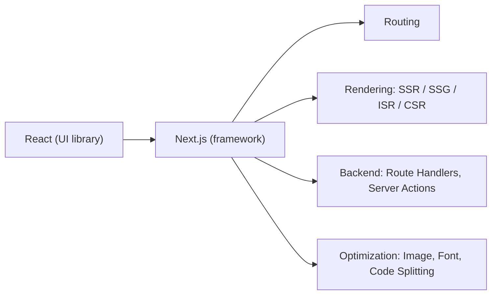

---

# Difference Between Next.js and React

React is a **UI library** used for building user interfaces.

Next.js is a **full-stack React framework** that provides routing, rendering strategies, optimization, and server-side features.

| Feature       | React JS                     | Next.js                        |
| ------------- | ---------------------------- | ------------------------------ |
| Type          | UI Library                   | React Framework                |
| Rendering     | Mainly Client-Side Rendering | SSR, SSG, ISR, CSR             |
| SEO           | Requires extra setup         | Better SEO support             |
| Routing       | Uses React Router DOM        | Built-in file-based routing    |
| Performance   | Manual optimization          | Automatic optimization         |
| API           | No built-in API routes       | Built-in Route Handlers        |
| Data Fetching | External solutions required  | Built-in data fetching support |

```text
React app (CSR)                     Next.js app (SSR/SSG)
───────────────                     ─────────────────────
Browser gets empty <div id=root>    Browser gets full HTML
        │                                   │
Download JS → render → content      Content visible → JS hydrates
(search engine sees little)         (search engine sees everything)
```

---

# Main Rendering Patterns in Next.js

Next.js supports multiple rendering strategies.

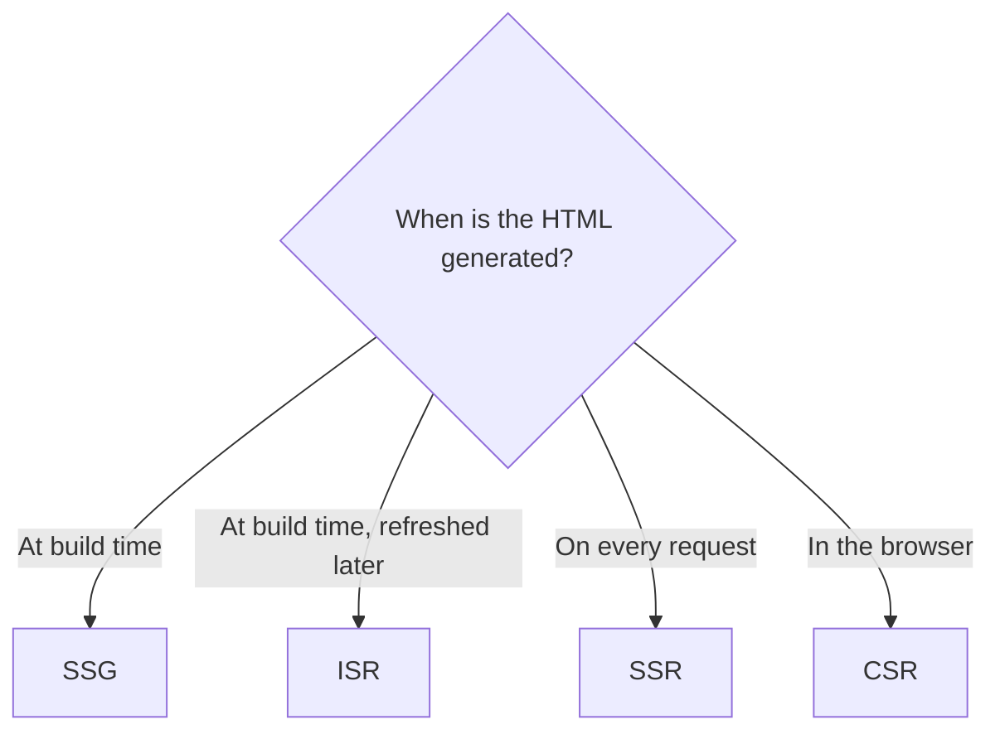

| Pattern | HTML generated        | Data freshness       | Speed      | Example                  |
| ------- | --------------------- | -------------------- | ---------- | ------------------------ |
| SSG     | Build time            | Stale until rebuild  | Fastest    | Blog, docs               |
| ISR     | Build + background    | Refreshed every N s  | Very fast  | Product pages, news      |
| SSR     | Every request         | Always fresh         | Slower     | Dashboard, personalized  |
| CSR     | In the browser        | Fetched by client    | Slow first load | Highly interactive app |

---

## 1. Server-Side Rendering (SSR)

HTML is generated on the server for **every request** before being sent to the browser.

### Best for:

* Dynamic pages
* Personalized dashboards
* Real-time data

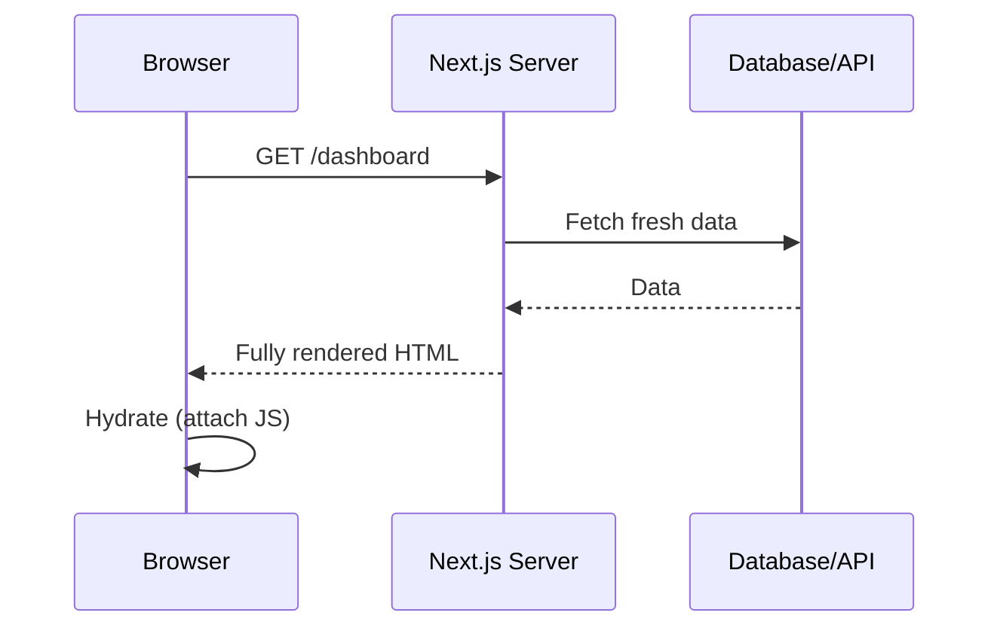

Benefits:

* Fresh data on every request
* Better SEO
* Faster first paint than CSR (content arrives in the HTML)

In the App Router, a page becomes dynamic (SSR) when it uses request data such as `cookies()`, `headers()`, `searchParams`, or opts out with `export const dynamic = "force-dynamic"`.

---

## 2. Static Site Generation (SSG)

HTML is generated **once during build time** and reused for all users.

### Best for:

* Blogs
* Documentation websites
* Marketing pages

```text
next build ──► fetch data ──► generate HTML ──► upload to CDN
                                                    │
                     User 1, User 2, User 3 ◄───────┘  (same HTML for everyone)
```

Benefits:

* Very fast
* CDN friendly
* Good SEO

---

## 3. Incremental Static Regeneration (ISR)

ISR allows static pages to be updated in the background after deployment without rebuilding the entire application. It works as **stale-while-revalidate**.

### Best for:

* Product pages
* News websites
* Content websites

```tsx
// app/products/[id]/page.tsx
export const revalidate = 60; // regenerate at most once every 60 seconds
```

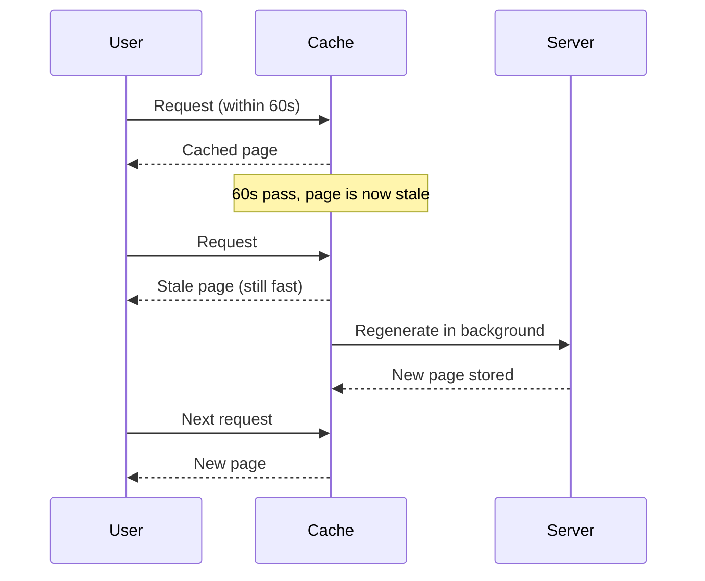

---

## 4. Client-Side Rendering (CSR)

Traditional React rendering where the browser downloads JavaScript and renders the UI on the client.

### Best for:

* Highly interactive applications
* User dashboards behind a login (no SEO needed)

```text
Browser ──► empty HTML ──► download JS ──► React runs ──► fetch data ──► UI renders
            (blank page until here ─────────────────────────────────┘)
```

---

# App Router vs Pages Router

| Pages Router                                   | App Router                                      |
| ---------------------------------------------- | ----------------------------------------------- |
| Older routing system                           | Modern routing system (Next 13+)                |
| Uses `pages` directory                         | Uses `app` directory                            |
| Uses `getServerSideProps` and `getStaticProps` | Uses Server Components and `async` components    |
| No Server Components — every page is pre-rendered and then hydrated in full | Server Components by default; only `"use client"` parts ship JS |
| `_app.tsx` / `_document.tsx` for shared shell  | Nested `layout.tsx` files                       |
| API routes in `pages/api`                      | Route Handlers in `route.ts`                    |

```text
pages/                        app/
 ├── _app.tsx                  ├── layout.tsx       (root layout)
 ├── index.tsx      → /        ├── page.tsx         → /
 ├── about.tsx      → /about   ├── about/page.tsx   → /about
 └── api/hello.ts   → /api/hello └── api/hello/route.ts → /api/hello
```

---

# Server Components vs Client Components (App Router)

| Server Component                      | Client Component                  |
| ------------------------------------- | --------------------------------- |
| Runs only on the server               | Pre-rendered on the server, then hydrated and run in the browser |
| Adds no JavaScript to the bundle      | Adds JavaScript to browser bundle |
| Can fetch data directly (`async`)     | Used for interactive UI           |
| Can access backend resources securely (DB, secrets) | Uses hooks and browser APIs |
| Cannot use state, effects, or event handlers | Supports state, events, and hooks |
| Default in the `app` directory        | Opt in with `"use client"`        |

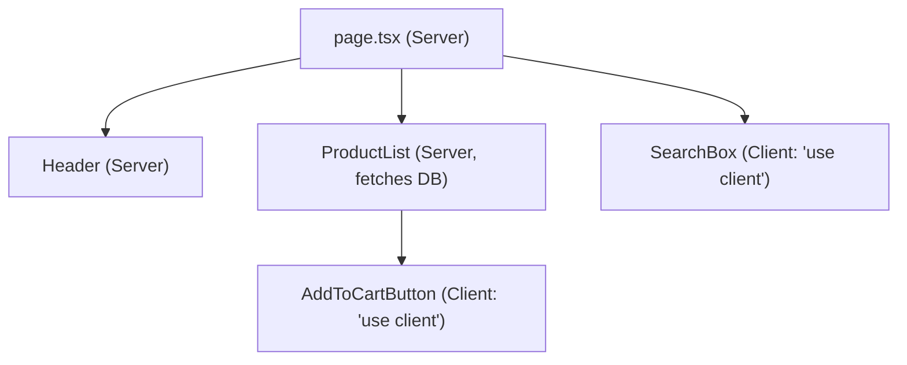

**Rule:** keep components on the server by default, and push `"use client"` down to the smallest interactive leaf.

---

# Server Component

Features:

* Runs only on the server
* Fetches data securely
* Sends HTML plus a serialized **RSC payload** to the browser — its own code never reaches the browser
* Cannot use:

  * `useState`
  * `useEffect`
  * Event handlers

Example:

```tsx
async function UsersPage() {
  const res = await fetch("https://api.example.com/users");
  const users: { id: string; name: string }[] = await res.json();

  return (
    <ul>
      {users.map((user) => (
        <li key={user.id}>{user.name}</li>
      ))}
    </ul>
  );
}
```

```text
Server: run component ──► fetch data ──► render ──► HTML + RSC payload ──► Browser
                                                     (0 KB of this component's JS)
```

---

# Client Component

Used when a component needs:

* User interaction
* Browser APIs
* React hooks
* State management

Example:

```tsx
"use client";

import { useState } from "react";

export default function Counter() {
  const [count, setCount] = useState(0);

  return (
    <button onClick={() => setCount(count + 1)}>
      {count}
    </button>
  );
}
```

```text
Server: pre-render HTML "<button>0</button>" ──► Browser shows it
Browser: download Counter JS ──► hydrate ──► click works
```

---

# Passing Data From Server Component to Client Component

Data is passed using **props**. Props must be **serializable** (plain objects, strings, numbers, arrays, Dates) — you cannot pass functions, class instances, or DB connections.

Example:

```tsx
// Server Component

export default async function Page() {
  const data = await getData();

  return <ClientComponent data={data} />;
}
```

```tsx
// Client Component

"use client";

export default function ClientComponent({ data }: { data: { name: string } }) {
  return <div>{data.name}</div>;
}
```

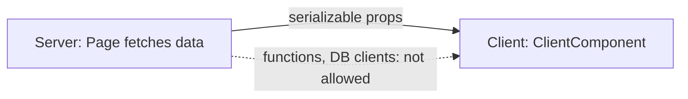

---

# What Causes Hydration Errors?

**Hydration** is when React attaches event handlers to the HTML the server already sent. Hydration errors occur when the HTML generated on the server does not match what React renders on the first client render.

Common causes:

* Reading `window` / `localStorage` during render
* Reading `document` during render
* Using `new Date()` or `Date.now()` during render
* Random values (`Math.random()`) during render
* Invalid HTML nesting (e.g. `<div>` inside `<p>`)
* Browser extensions that modify the DOM

```text
Server render:  <p>10:00:01</p>
Client render:  <p>10:00:03</p>     ✗ mismatch → hydration error
```

---

# How to Fix Hydration Errors?

Solutions:

### 1. Use `useEffect`

Run client-only code after hydration.

```tsx
const [date, setDate] = useState<Date | null>(null);

useEffect(() => {
  setDate(new Date());
}, []);
```

### 2. Disable SSR for Specific Components

Use dynamic imports. In the App Router, `ssr: false` is only allowed inside a **Client Component**.

```tsx
"use client";

import dynamic from "next/dynamic";

const Component = dynamic(
  () => import("./Component"),
  { ssr: false }
);
```

### 3. Suppress an unavoidable mismatch

For a single element like a timestamp: `<time suppressHydrationWarning>{time}</time>`.

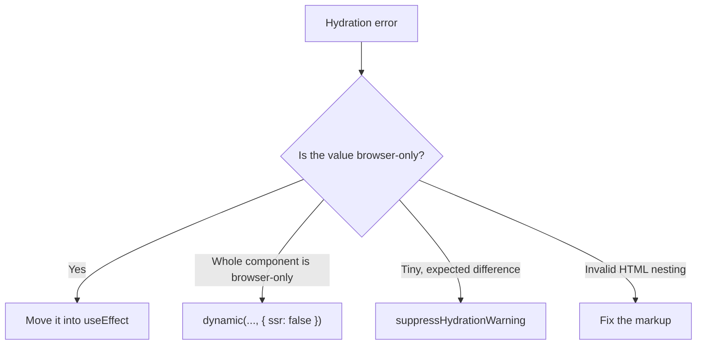

---

# File-Based Routing in Next.js

Next.js uses file-based routing.

Folders inside the `app` directory become URL segments, and a `page.tsx` file makes that segment publicly reachable.

Example:

```text
app/
 ├── page.tsx
 ├── about/
 │    └── page.tsx
 └── products/
      └── page.tsx
```

Routes:

```text
/
/about
/products
```

No manual router configuration is required.

---

# Special Files: layout, page, loading, error, not-found

| File            | Purpose                                                   |
| --------------- | --------------------------------------------------------- |
| `layout.tsx`    | Shared UI that wraps child pages and **keeps state** across navigation |
| `page.tsx`      | The unique UI of a route                                  |
| `loading.tsx`   | Instant loading UI (wraps the page in a `<Suspense>`)     |
| `error.tsx`     | Error boundary for the segment (must be a Client Component) |
| `not-found.tsx` | UI for `notFound()` or unknown URLs                       |
| `template.tsx`  | Like layout, but re-mounts on every navigation            |

```text
<Layout>
  <ErrorBoundary fallback={<Error />}>
    <Suspense fallback={<Loading />}>
      <Page />
    </Suspense>
  </ErrorBoundary>
</Layout>
```

```tsx
// app/dashboard/layout.tsx
export default function DashboardLayout({ children }: { children: React.ReactNode }) {
  return (
    <section>
      <nav>Sidebar</nav>
      {children}
    </section>
  );
}
```

```tsx
// app/dashboard/error.tsx
"use client";

export default function Error({ error, reset }: { error: Error; reset: () => void }) {
  return (
    <div>
      <p>Something went wrong.</p>
      <button onClick={() => reset()}>Try again</button>
    </div>
  );
}
```

---

# Dynamic Routes and Catch-All Routes

## Dynamic Routes

Dynamic routes use square brackets.

Example:

```text
app/blog/[slug]/page.tsx
```

Routes:

```text
/blog/hello-world
/blog/nextjs-guide
```

The value is available as a parameter. **From Next.js 15, `params` and `searchParams` are Promises and must be awaited.**

```tsx
// app/blog/[slug]/page.tsx
export default async function BlogPost({
  params,
}: {
  params: Promise<{ slug: string }>;
}) {
  const { slug } = await params;
  return <h1>{slug}</h1>;
}
```

```text
URL: /blog/hello-world
         │      │
         │      └──► params = Promise<{ slug: "hello-world" }>
         └─────────► app/blog/[slug]/page.tsx
```

---

## Catch-All Routes

Catch-all routes use three dots.

Example:

```text
app/docs/[...slug]/page.tsx
```

Matches:

```text
/docs/react                   → slug = ["react"]
/docs/react/hooks             → slug = ["react", "hooks"]
/docs/react/hooks/use-state   → slug = ["react", "hooks", "use-state"]
```

The value is received as an array. An **optional** catch-all `[[...slug]]` also matches `/docs` itself.

---

# Data Fetching Methods

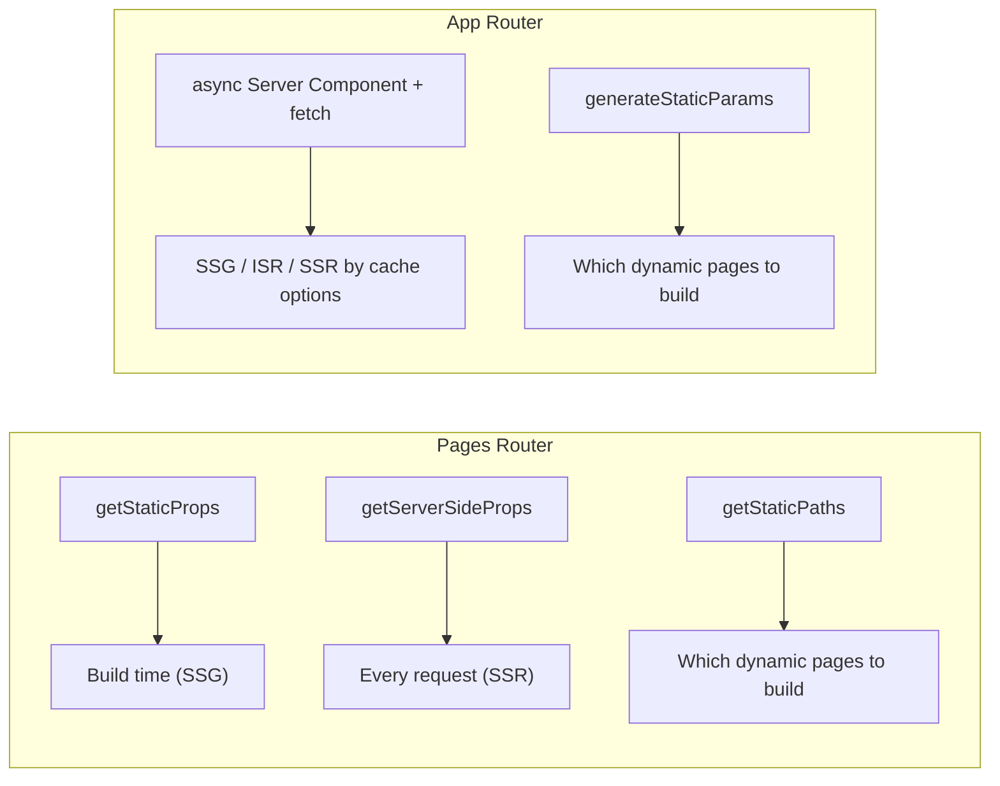

## getStaticProps (Pages Router)

Fetches data during build time.

Used for:

* Static pages
* Blogs
* Documentation

---

## getServerSideProps (Pages Router)

Fetches data on every request.

Used for:

* Dynamic data
* User-specific pages

---

## generateStaticParams (App Router)

Replacement for `getStaticPaths`.

Generates dynamic routes at build time.

Example:

```tsx
export async function generateStaticParams() {
  return [
    { id: "1" },
    { id: "2" }
  ];
}
```

```text
next build ──► generateStaticParams() → [{id:"1"},{id:"2"}]
                    │
                    ├──► /products/1  (static HTML)
                    └──► /products/2  (static HTML)
```

---

# How Do You Fetch Data in the App Router?

Make the Server Component `async` and fetch directly — no `useEffect`, no API route needed.

```tsx
async function getData() {
  const res = await fetch("https://api.example.com/posts");
  if (!res.ok) throw new Error("Failed to fetch posts");
  return res.json();
}

export default async function Page() {
  const data = await getData();
  return <pre>{JSON.stringify(data, null, 2)}</pre>;
}
```

Run independent requests in parallel:

```tsx
const [user, posts] = await Promise.all([getUser(), getPosts()]);
```

```text
Sequential (slow)          Parallel (fast)
getUser  ████              getUser  ████
getPosts     ████          getPosts ████
total    ████████          total    ████
```

---

# Caching and Revalidation

**Next.js 15 change:** `fetch` requests are **not cached by default** anymore (Next 14 cached them by default). You opt in.

| Option                                   | Behaviour                     |
| ---------------------------------------- | ----------------------------- |
| `fetch(url)`                             | Not cached (Next 15 default)  |
| `fetch(url, { cache: "force-cache" })`   | Cached → static (SSG)         |
| `fetch(url, { next: { revalidate: 60 } })` | Cached, refreshed every 60s (ISR) |
| `fetch(url, { next: { tags: ["posts"] } })` | Cached, refreshed on `revalidateTag("posts")` |
| `export const revalidate = 60`           | Route-level ISR               |
| `revalidatePath("/posts")`               | Purge a route on demand (e.g. after a mutation) |

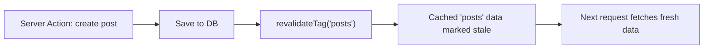

---

# Server Actions

Server Actions are `async` functions marked with `"use server"` that run on the server but can be called directly from a form or a Client Component. They replace many "write an API route just to handle a form" cases.

```tsx
// app/actions.ts
"use server";

import { revalidatePath } from "next/cache";

export async function createTodo(formData: FormData) {
  const title = String(formData.get("title") ?? "").trim();
  if (!title) return { ok: false, error: "Title is required" };

  await db.todo.create({ data: { title } });
  revalidatePath("/todos");
  return { ok: true };
}
```

```tsx
// app/todos/page.tsx
import { createTodo } from "../actions";

export default function Page() {
  return (
    <form action={createTodo}>
      <input name="title" />
      <button type="submit">Add</button>
    </form>
  );
}
```

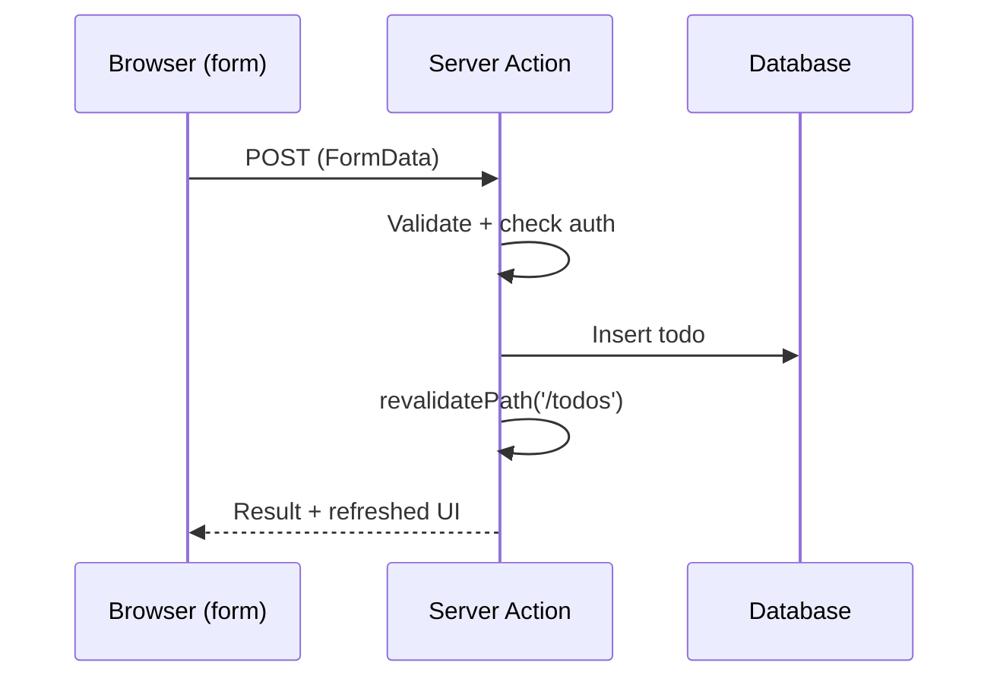

**Important:** a Server Action is a public POST endpoint. Always validate input and check authentication inside it.

---

# Route Handlers (API Routes in the App Router)

A `route.ts` file exports functions named after HTTP methods. Use them when something **outside** your React UI calls you: webhooks, mobile apps, third-party clients.

```ts
// app/api/users/route.ts
import { NextResponse } from "next/server";

export async function GET() {
  const users = await getUsers();
  return NextResponse.json(users);
}

export async function POST(request: Request) {
  const body = await request.json();
  const user = await createUser(body);
  return NextResponse.json(user, { status: 201 });
}
```

```text
GET  /api/users  ──► app/api/users/route.ts → GET()
POST /api/users  ──► app/api/users/route.ts → POST()
```

| Server Action                      | Route Handler                         |
| ---------------------------------- | ------------------------------------- |
| Called from your own forms/components | Called over HTTP by anyone         |
| No URL you design                  | You design the URL and method         |
| Best for mutations from the UI     | Best for webhooks, public APIs, mobile |

---

# Middleware

`middleware.ts` at the project root runs **before** a request reaches a route. Used for auth redirects, i18n, A/B tests, and rewriting URLs. It runs on the Edge runtime by default, so keep it light (no heavy DB calls).

```ts
// middleware.ts
import { NextResponse, type NextRequest } from "next/server";

export function middleware(request: NextRequest) {
  const token = request.cookies.get("token");
  if (!token) {
    return NextResponse.redirect(new URL("/login", request.url));
  }
  return NextResponse.next();
}

export const config = {
  matcher: ["/dashboard/:path*"],
};
```

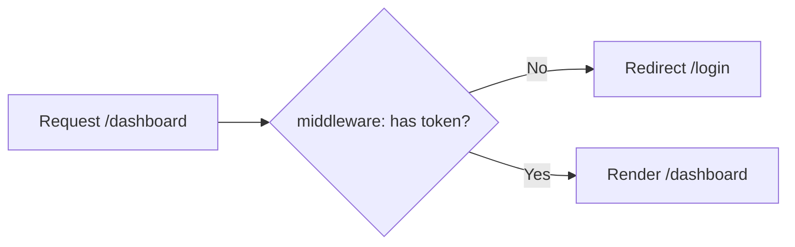

---

# Navigation: Link, useRouter, and Prefetching

* `<Link href="/about">` — client-side navigation, no full page reload. Visible links are **prefetched** in production.
* `useRouter()` from `next/navigation` (App Router) — programmatic navigation in Client Components: `router.push("/home")`.
* `redirect("/login")` — redirect from a Server Component or Server Action.

```text
Full reload (<a>)                Client navigation (<Link>)
Browser ──► server ──► new HTML  Browser ──► fetch only new segment
everything re-downloads          layout + state are kept
```

**Common mistake:** importing `useRouter` from `next/router` in the App Router — that is the Pages Router API.

---

# Image and Font Optimization

### `next/image`

* Resizes and serves modern formats (WebP/AVIF)
* Lazy-loads by default
* Requires `width`/`height` (or `fill`) so the space is reserved → **no layout shift (CLS)**
* Use `priority` for the above-the-fold hero image (LCP)

```tsx
import Image from "next/image";

<Image src="/hero.png" alt="Hero" width={1200} height={600} priority />
```

### `next/font`

* Downloads Google fonts at **build time** and self-hosts them — no request to Google from the browser
* Prevents layout shift from font swapping

```tsx
import { Inter } from "next/font/google";
const inter = Inter({ subsets: ["latin"] });

<body className={inter.className}>...</body>
```

```text
              <Image ...>
4 MB PNG, full size              resized → 80 KB WebP
loads immediately                lazy-loaded
page jumps when it loads         space reserved, no jump
```

---

# Environment Variables and `NEXT_PUBLIC_`

* Variables in `.env.local` are available **on the server only** (`process.env.DB_URL`).
* Prefix with `NEXT_PUBLIC_` to expose a variable to the browser. It is **inlined into the JS bundle at build time**.
* Never put a secret behind `NEXT_PUBLIC_` — anyone can read it in DevTools.

```text
.env.local
 ├── DATABASE_URL=...          ──► server only   ✓ safe for secrets
 └── NEXT_PUBLIC_API_URL=...   ──► server + browser bundle   ✗ never a secret
```

---

# Metadata and SEO

Export `metadata` (static) or `generateMetadata` (dynamic) from a `page.tsx` or `layout.tsx`.

```tsx
export async function generateMetadata({
  params,
}: {
  params: Promise<{ slug: string }>;
}) {
  const { slug } = await params;
  const post = await getPost(slug);
  return { title: post.title, description: post.summary };
}
```

```text
generateMetadata() ──► <head>
                         ├── <title>Post title</title>
                         └── <meta name="description" ...>
```

---

# Streaming with Suspense

Instead of waiting for the slowest query before sending anything, Next.js can send the page shell first and **stream** slow parts in later.

```tsx
import { Suspense } from "react";

export default function Page() {
  return (
    <>
      <Header />
      <Suspense fallback={<p>Loading reviews...</p>}>
        <Reviews /> {/* slow async Server Component */}
      </Suspense>
    </>
  );
}
```

```text
Time ─────────────────────────────►
t=0   Header + "Loading reviews..."  sent
t=2s  Reviews HTML streamed in, replaces the fallback
```

---

# Automatic Code Splitting

Next.js automatically splits JavaScript bundles.

Benefits:

* Each page loads only required JavaScript
* Faster page loading
* Better performance

```text
Visit /about  ──► shared.js + about.js
Visit /blog   ──► shared.js (cached) + blog.js
(dashboard.js is never downloaded unless you visit /dashboard)
```

---

# Next.js Interview Summary

| Topic            | Explanation                               |
| ---------------- | ----------------------------------------- |
| Next.js          | React framework with server-side features |
| SSR              | Generates HTML on every request           |
| SSG              | Generates HTML at build time              |
| ISR              | Updates static pages after deployment     |
| CSR              | Renders UI in browser                     |
| Server Component | Runs on server, no hooks/events           |
| Client Component | Pre-rendered on server, hydrated in browser; supports hooks/events |
| Routing          | File-based routing                        |
| Dynamic Routes   | `[slug]`, `params` is a Promise in Next 15 |
| Catch-All Routes | `[...slug]`                               |
| Caching          | `fetch` not cached by default in Next 15  |
| Server Action    | `"use server"` function for mutations     |
| Route Handler    | `route.ts` HTTP endpoint                  |
| Middleware       | Runs before the route, e.g. auth redirect |
| App Router       | Modern Next.js architecture               |
| Pages Router     | Older routing system                      |

---

# Rarely Asked (Lower Priority)

## next.config.ts

`next.config.ts` is the configuration file for Next.js.

Used for:

* Environment variables
* Image configuration
* Redirects
* Rewrites
* Experimental features

Example (`images.domains` is deprecated — use `remotePatterns`):

```ts
import type { NextConfig } from "next";

const nextConfig: NextConfig = {
  images: {
    remotePatterns: [{ protocol: "https", hostname: "example.com" }],
  },
};

export default nextConfig;
```
