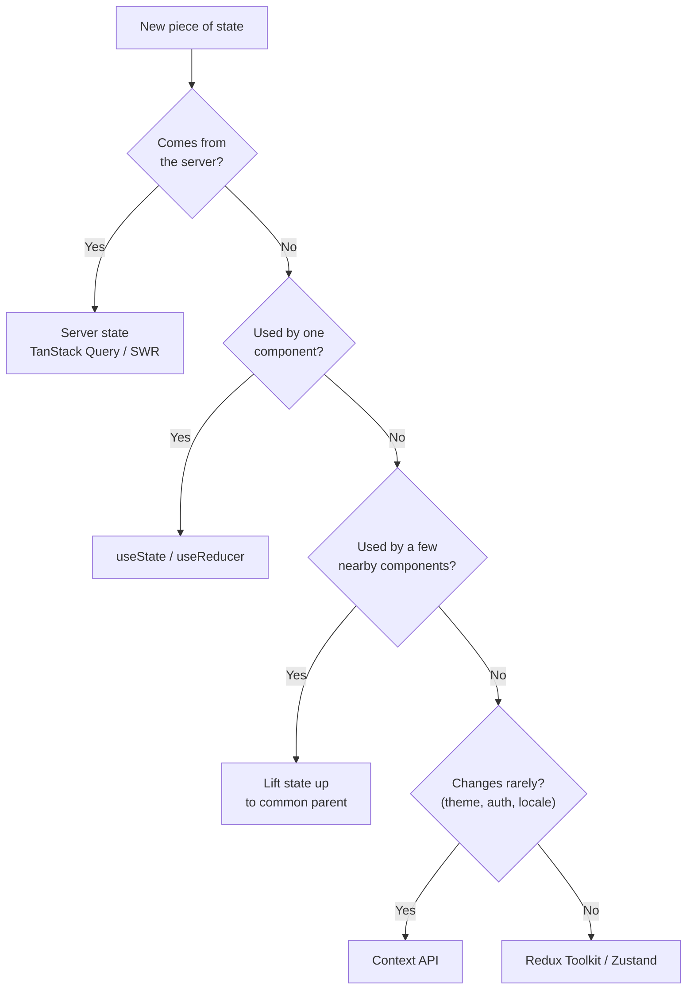
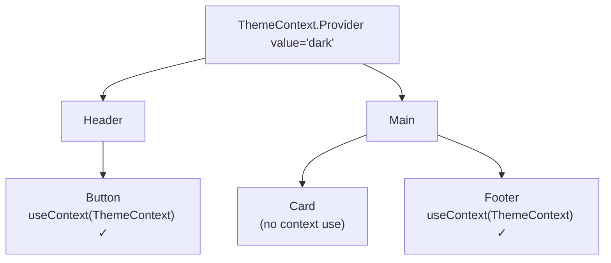
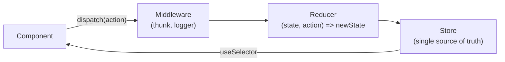
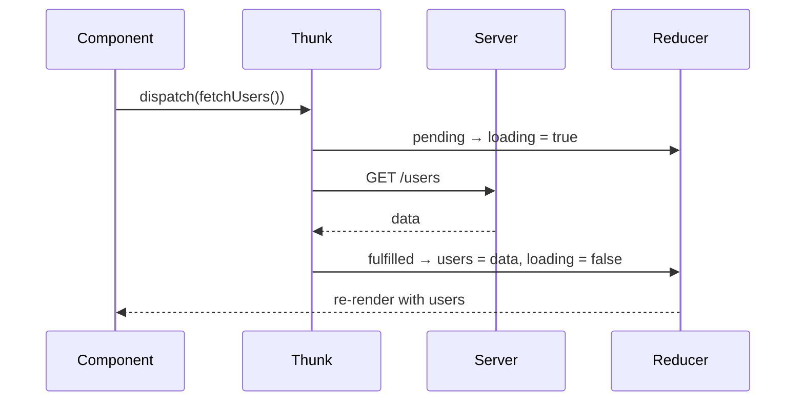
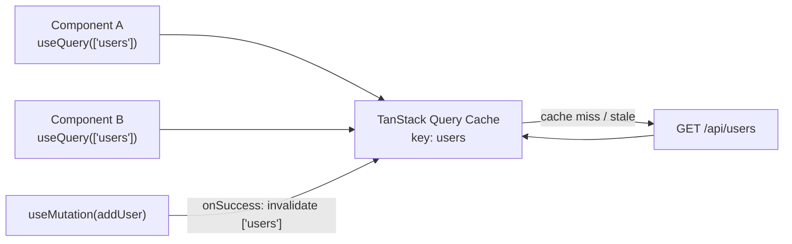

# State Management Interview

State management is how we store, update, and share data across components.

```text
Types of state in a React app

┌────────────────────┬──────────────────────────┬────────────────────────────────┐
│ Local state        │ Global (client) state    │ Server state                   │
├────────────────────┼──────────────────────────┼────────────────────────────────┤
│ One component      │ Many components          │ Data that lives on the server  │
│ input, modal open  │ theme, auth user, cart   │ products, users, orders (API)  │
│ useState/useReducer│ Context, Redux, Zustand  │ TanStack Query, SWR, RTK Query │
└────────────────────┴──────────────────────────┴────────────────────────────────┘
```

---

## Q1. What is state management, and why do we need it in React apps?

State management is the way we store, update, and share data in a React application. We need it to keep application data organized and make it easier for different components to access and update shared data.

Without it, shared data must be passed through many layers of props — called **prop drilling**:

```text
Prop drilling                           With global state

App (user)                              App
 └─ Layout (user)   ← doesn't need it    └─ Layout
     └─ Sidebar (user) ← doesn't need it     └─ Sidebar
         └─ Avatar (user) ✓ needs it             └─ Avatar ──► reads user from store ✓
```

---

## Q2. Difference between local state and global state?

| Local State                                   | Global State                             |
| --------------------------------------------- | ---------------------------------------- |
| Used by one component or a small part of the UI | Shared across many components            |
| Usually managed with `useState` / `useReducer` | Usually managed with Redux, Zustand, Context, etc. |
| Example: input value, modal open/close        | Example: logged-in user, theme, cart     |
| Easier to manage                              | More complex to manage                   |

**Rule:** start with local state. Lift it up to the nearest common parent when two siblings need it. Use global state only when many distant components need it.



---

## Q3. What is the Context API?

Context lets you pass a value deep into the tree **without prop drilling**.

Used for theme, authentication, and other global values that **change rarely**.



```jsx
const ThemeContext = createContext('light');

function App() {
  const [theme, setTheme] = useState('dark');
  return (
    <ThemeContext.Provider value={theme}>
      <Page />
    </ThemeContext.Provider>
  );
}

function Button() {
  const theme = useContext(ThemeContext);
  return <button className={theme}>Click</button>;
}
```

**Note**: When the Context value changes, **every component that consumes that context** re-renders — even if it only uses one part of the value. Components that don't call `useContext` are not re-rendered by the context itself.

**Tip:** split large contexts (for example `AuthContext` and `ThemeContext` separately) and memoize the value object with `useMemo` to avoid unnecessary re-renders.


---

## Q4. How does Redux manage state, and what are its core concepts?

Redux is used for complex, frequently updated shared state, with middleware support.

Redux stores shared state in a central store. A component dispatches an action, the reducer handles that action and updates the state, and the component gets the updated state through a selector.



| Concept  | Simple Meaning                    |
| -------- | --------------------------------- |
| Store    | Holds the application state (single central store) |
| Action   | Describes what happened, e.g. `{ type: 'cart/add', payload: item }` |
| Reducer  | Pure function: current state + action → new state |
| Dispatch | Sends an action to Redux          |
| Selector | Reads data from the store         |

When state changes, only components whose **selected value** changed re-render.


### Three principles of Redux

1. **Single source of truth** — one store.
2. **State is read-only** — change it only by dispatching actions.
3. **Changes are made with pure reducers** — no side effects, no mutation (Redux Toolkit lets you write "mutating" code safely via Immer).

---

## Q5. What is Redux Toolkit (RTK) and why use it?

Redux Toolkit is the **official, recommended** way to write Redux. It removes the boilerplate of classic Redux.

```text
Classic Redux:  action types + action creators + switch reducer + store setup + thunk setup
Redux Toolkit:  createSlice()  ──► actions + reducer generated together
                configureStore() ──► DevTools + thunk included
```

```js
import { createSlice, configureStore } from '@reduxjs/toolkit';

const cartSlice = createSlice({
  name: 'cart',
  initialState: { items: [] },
  reducers: {
    addItem(state, action) {
      state.items.push(action.payload); // safe: Immer makes it immutable
    },
  },
});

export const { addItem } = cartSlice.actions;
export const store = configureStore({ reducer: { cart: cartSlice.reducer } });

// In a component
const items = useSelector((state) => state.cart.items);
const dispatch = useDispatch();
dispatch(addItem({ id: 1, name: 'Shoes' }));
```

---

## Q6. How do you handle async logic (API calls) in Redux?

Reducers must be pure, so async work goes in **middleware** — usually `createAsyncThunk`.



```js
export const fetchUsers = createAsyncThunk('users/fetch', async () => {
  const res = await fetch('/api/users');
  return res.json();
});
```

For API data, many teams now use **RTK Query** or **TanStack Query** instead of writing thunks by hand (see Q8).

---

## Q7. What is Zustand? Context vs Redux vs Zustand

**Zustand** is a small global state library — a store is just a hook, with no Provider and very little boilerplate.

```js
import { create } from 'zustand';

const useCartStore = create((set) => ({
  items: [],
  addItem: (item) => set((state) => ({ items: [...state.items, item] })),
}));

// In a component — re-renders only when `items` changes
const items = useCartStore((state) => state.items);
```

| Feature     | Context API                        | Redux (Toolkit)              | Zustand                          |
| ----------- | ---------------------------------- | ---------------------------- | -------------------------------- |
| Use Case    | Simple global values (theme, auth) | Large apps, complex updates  | Small–large apps, simple API     |
| Performance | Re-renders all consumers on change | Selective (selectors)        | Selective (selectors)            |
| Provider    | Required                           | Required                     | Not required                     |
| Middleware  | No middleware support              | Supports middleware          | Supports middleware (persist, devtools) |
| Boilerplate | Simpler, less code                 | More setup code              | Least code                       |
| DevTools    | React DevTools only                | Redux DevTools for debugging | Redux DevTools via middleware    |
| Install     | Built into React                   | Extra package                | Extra package (very small)       |

### Context API vs Redux in one line

Context is a **way to pass data**; Redux is a **state management system**. Context is good for simple shared data, but when its value changes, all consumers re-render. Redux lets components subscribe to only the data they need, so fewer components re-render. That's why Redux is better for large and complex applications.

---

## Q8. What is server state, and why use TanStack Query (React Query)?

**Server state** is data owned by the backend (users, products). It can become stale, needs loading/error handling, caching, and refetching. Storing it in Redux by hand means writing all of that yourself.



```jsx
import { useQuery } from '@tanstack/react-query';

function Users() {
  const { data, isLoading, error } = useQuery({
    queryKey: ['users'],
    queryFn: () => fetch('/api/users').then((res) => res.json()),
    staleTime: 60_000,
  });

  if (isLoading) return <p>Loading...</p>;
  if (error) return <p>Something went wrong</p>;
  return data.map((user) => <p key={user.id}>{user.name}</p>);
}
```

What you get for free:

- Caching and **deduplication** (two components, one request)
- Loading and error states
- Background refetching (on window focus, reconnect)
- Retries
- Pagination and infinite scroll helpers
- Cache invalidation after mutations

**Modern pattern:** TanStack Query for server state + `useState` / Context / Zustand for the small amount of client state left.

---

## Q9. When should you NOT use global state?

- **Form input values** — keep them local (or in a form library like React Hook Form).
- **UI state used by one component** — modal open, dropdown open, active tab.
- **API data** — use TanStack Query / RTK Query, not a hand-written global store.
- **Values you can derive** — don't store `totalPrice` if you can compute it from `items`.
- **URL state** — filters, page number, search query belong in the URL (search params), so they survive refresh and can be shared.

```text
Too much global state → every change touches the store → harder to debug, more re-renders
Keep state as close as possible to where it is used.
```

---

## Q10. How do you persist global state across page refreshes?

```text
Store ──subscribe──► localStorage.setItem('cart', JSON.stringify(state))
Page load ──► read localStorage ──► initial store state
```

- Zustand: `persist` middleware.
- Redux: `redux-persist` or a manual `store.subscribe`.
- Never persist sensitive data (tokens, personal data) in `localStorage` — prefer `httpOnly` cookies for auth.
