# Node.js & Express Interview

## What is Node.js?

- **Runtime environment** that allows JavaScript to run outside the browser (typically on a server)
- Built on Chrome's **V8 engine** to execute JavaScript
- **Event-driven, non-blocking** architecture (handles multiple simultaneous connections)
- Fast due to event loop + non-blocking I/O

### Node.js adds server-side capabilities

- File system access (`fs`)
- Networking (`http`, `net`)
- Process management (`process`)
- Modules and package management via npm

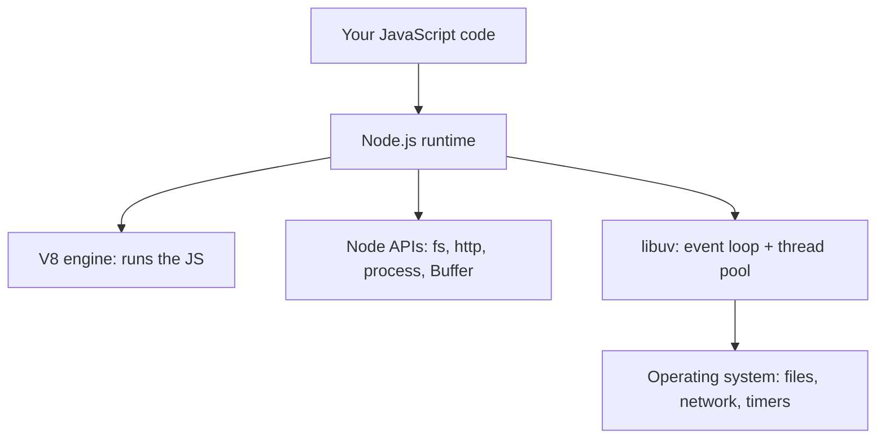

---

## What is the V8 engine?

- Open-source JavaScript engine developed by Google
- Used in Google Chrome and Node.js
- Converts JavaScript into machine code that the processor can execute directly

### What is the relationship between Node.js and V8?

- **Node.js** = runtime environment
- **V8** = JavaScript engine inside Node.js

Node.js uses V8 to execute JavaScript outside the browser. Node adds file system (fs), networking (http), and OS-level features.

So: V8 executes JS, Node.js provides environment + APIs. Node.js cannot run without V8 — it is built on it.

### How V8 compiles JavaScript

V8 uses **Just-In-Time (JIT) compilation** — code is compiled during execution, not ahead of time like C++.

1. **Parsing**: JS code → Abstract Syntax Tree (AST)
2. **Ignition (Interpreter)**: AST → Bytecode, and runs it
3. **TurboFan (Optimizer)**: hot (frequently used) code → optimized machine code
4. **Deoptimization**: if assumptions break (e.g. a type changes), V8 falls back to bytecode

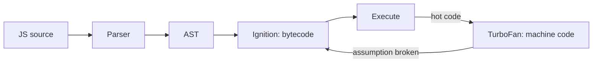

---

## Node.js vs Browser Runtime

| Feature       | Browser Runtime                        | Node.js Runtime                    |
| ------------- | -------------------------------------- | ---------------------------------- |
| Environment   | Runs JS in browser, interacts with DOM | Runs JS on server, no DOM          |
| APIs          | document, window, fetch, localStorage  | fs, http, path, process, Buffer    |
| Global object | window (`globalThis`)                  | global (`globalThis`)              |
| Async engine  | Browser Web APIs                       | libuv                              |
| Use case      | Frontend, UI, client-side logic        | Backend services, servers, scripts |

```text
Browser                         Node.js
┌──────────────────┐            ┌──────────────────┐
│ V8 / JS engine   │            │ V8               │
│ DOM, window      │            │ fs, http, process│
│ Web APIs         │            │ libuv            │
└──────────────────┘            └──────────────────┘
   UI in a tab                     Server / CLI
```

---

## Why is Node.js single-threaded?

- Node.js uses a **single main thread** (event loop thread) to run JavaScript
- Uses the **event loop + callback queues** to handle concurrency

When an I/O operation (like reading a file) is requested, Node offloads it to the libuv thread pool or the OS kernel. The event loop continues with other work, and when the operation completes its callback is queued for the main thread.

"Single-threaded" means **your JS runs on one thread**. Node itself uses extra threads (libuv thread pool, V8 GC threads).

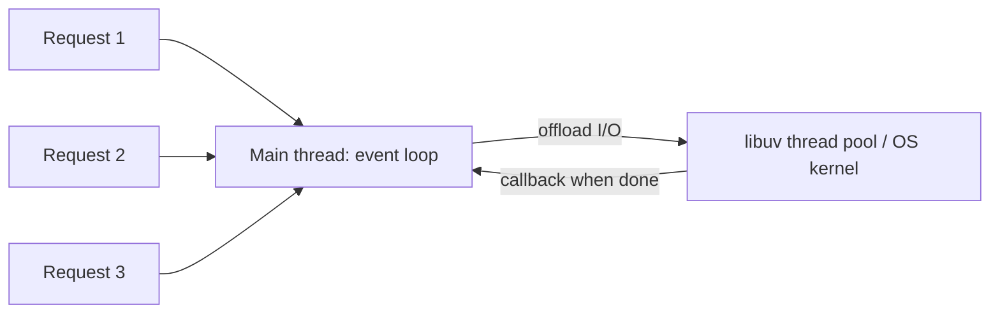

### Why not for CPU-heavy tasks?

- A long computation blocks the single thread, so **every** other request waits
- Offload them with `worker_threads` or `cluster` instead

---

## Blocking vs Non-Blocking

- **Blocking**: the main thread waits until the operation finishes. Nothing else runs.
- **Non-blocking**: the operation is handed off; the thread keeps serving other work and a callback/promise handles the result later.

| Blocking                     | Non-Blocking                               |
| ---------------------------- | ------------------------------------------ |
| Stops execution              | Runs in background                         |
| `fs.readFileSync()`          | `fs.readFile()` / `fs.promises.readFile()` |
| OK in startup scripts / CLIs | Use inside request handlers                |

```javascript
// Blocking
const data = fs.readFileSync('big.txt');
console.log('after read'); // waits for the file

// Non-blocking
fs.readFile('big.txt', (err, data) => console.log('file ready'));
console.log('after read'); // prints first
```

```text
Blocking (sync)                     Non-blocking (async)
Thread: [read file.......][next]    Thread: [start read][next][other req][callback]
                                    Pool:          [read file.......]
```

---

## What is the Event Loop?

The event loop is the mechanism that lets Node perform non-blocking, asynchronous operations despite running JavaScript on one thread.

### How it works

- **First,** synchronous code executes line-by-line on the Call Stack.
- **Second,** async tasks (timers, file reads, network calls) are handed off to **libuv** / the OS (in Node there are no "Web APIs" — that is the browser).
- **Third,** when those tasks finish, their callbacks are queued in the matching phase.
- **Finally,** when the Call Stack is empty, the event loop walks through its phases and runs the queued callbacks.

### Event Loop Phases

Handled by **libuv**. Each phase has its own callback queue.

| #   | Phase             | What it handles                                    |
| --- | ----------------- | -------------------------------------------------- |
| 1   | Timers            | `setTimeout` and `setInterval` callbacks           |
| 2   | Pending callbacks | Deferred system/TCP errors                         |
| 3   | Idle, prepare     | Internal use only                                  |
| 4   | Poll              | New I/O events — network, files, database, streams |
| 5   | Check             | `setImmediate` callbacks                           |
| 6   | Close callbacks   | `socket.on('close')`, stream closures              |

```text
          ┌───────────────────────────┐
     ┌───>│ 1. timers                 │  setTimeout, setInterval
     │    └─────────────┬─────────────┘
     │          [nextTick → promises]
     │    ┌─────────────▼─────────────┐
     │    │ 2. pending callbacks      │  deferred TCP errors
     │    └─────────────┬─────────────┘
     │    ┌─────────────▼─────────────┐
     │    │ 3. idle, prepare          │  internal
     │    └─────────────┬─────────────┘
     │    ┌─────────────▼─────────────┐
     │    │ 4. poll                   │  I/O callbacks (fs, net, db)
     │    └─────────────┬─────────────┘
     │          [nextTick → promises]
     │    ┌─────────────▼─────────────┐
     │    │ 5. check                  │  setImmediate
     │    └─────────────┬─────────────┘
     │          [nextTick → promises]
     │    ┌─────────────▼─────────────┐
     └────┤ 6. close callbacks        │  socket.on('close')
          └───────────────────────────┘

[nextTick → promises] = drained after EVERY single callback, in every phase
```

### Microtasks and process.nextTick()

After **every callback** (since Node 11 — not only between phases), Node drains two extra queues before moving on:

1. **`process.nextTick()` queue** — highest priority (managed by Node)
2. **Promise microtask queue** — `.then()`, `.catch()`, `.finally()`, code after `await` (managed by V8)

```text
Synchronous code
   ↓
process.nextTick queue  (all of it)
   ↓
Promise microtask queue (all of it)
   ↓
Next callback / next event loop phase (timers, poll, check, ...)
```

- `process.nextTick()` schedules a callback to fire immediately after the current operation completes, **before** the event loop continues.
- Macrotasks (timers, I/O, `setImmediate`) are lower priority and are scheduled by libuv.

**Warning:** recursive `process.nextTick()` calls starve the event loop — the loop never reaches the next phase. Use `setImmediate()` when you want to yield.

### Worked example: guess the output

```javascript
const fs = require('fs');

console.log('A: sync');

fs.readFile(__filename, () => {
  console.log('E: poll — readFile callback');
  setTimeout(() => console.log('H: timers — setTimeout'), 0);
  setImmediate(() => console.log('G: check — setImmediate'));
  process.nextTick(() => console.log('F: nextTick'));
});

process.nextTick(() => console.log('C: nextTick'));
Promise.resolve().then(() => console.log('D: promise'));

console.log('B: sync');

// Output: A, B, C, D, E, F, G, H
```

```text
Step  What runs                  Why
────  ─────────────────────────  ──────────────────────────────────────────
 1    A, B                       synchronous code runs first
 2    C                          nextTick queue drains before promises
 3    D                          then the promise microtask queue
 4    (loop starts, file read in thread pool...)
 5    E                          poll phase: readFile finished
 6    F                          nextTick drains right after E's callback
 7    G                          check phase comes right after poll
 8    H                          timers phase is in the NEXT loop iteration
```

---

## process.nextTick() vs setImmediate() vs setTimeout()

| API                   | Runs when                                     | Priority |
| --------------------- | --------------------------------------------- | -------- |
| `process.nextTick()`  | Right after the current operation, before promises | Highest |
| `Promise.then()`      | After the nextTick queue                      | High     |
| `setTimeout(fn, 0)`   | Timers phase (minimum ~1ms delay)             | Lower    |
| `setImmediate()`      | Check phase (right after poll)                | Lower    |

**setTimeout vs setImmediate ordering:**

- In the **main module** the order is **not guaranteed** (depends on process performance).
- Inside an **I/O callback**, `setImmediate` **always** runs first (check comes right after poll).

```javascript
setTimeout(() => console.log('timeout'), 0);
setImmediate(() => console.log('immediate'));
// Main module: either order is possible
```

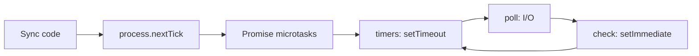

---

## Modules

### What is npm?

Package manager to install and manage dependencies.

### What are modules in Node.js?

Reusable blocks of code — each file is treated as a module with its own scope.

### Types of Modules

- **Built-in**: fs, http, path, os, events, stream, util, crypto
- **Custom**: Your local files
- **Third-party**: Installed via npm

### Key Functions

- `require()`: Import modules (synchronous). Loads module, executes it, caches it, returns exported object.
- `module.exports`: Export data from a module. Whatever you assign to module.exports is what `require()` returns.

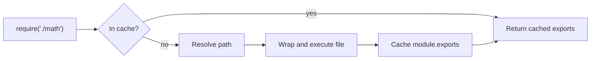

### Core Modules of Node.js

Built-in modules (no installation needed):

- **fs**: File system operations
- **http**: Create HTTP servers/clients
- **path**: File path manipulation
- **os**: Operating system information
- **events**: Event handling
- **stream**: Data streaming
- **util**: Utility functions
- **crypto**: Cryptographic operations
- **Buffer**: Binary data handling (global)
- **process**: Process management (global)

---

## CommonJS vs ES Modules

| Feature       | CommonJS                        | ES Modules                         |
| ------------- | ------------------------------- | ---------------------------------- |
| Syntax        | `require()`                     | `import/export`                    |
| Export        | `module.exports`                | `export` / `export default`        |
| Loading       | Synchronous, at runtime         | Asynchronous, statically analyzed  |
| File type     | `.js` (default) or `.cjs`       | `.mjs` or `"type": "module"`       |
| Top-level await | No                            | Yes                                |
| `__dirname`   | Available                       | Not available (use `import.meta.dirname` / `import.meta.url`) |
| Tree-shaking  | Hard                            | Easy (static imports)              |

```javascript
// CommonJS
const { add } = require('./math');
module.exports = { add };

// ES Modules
import { add } from './math.js'; // extension required
export { add };
```

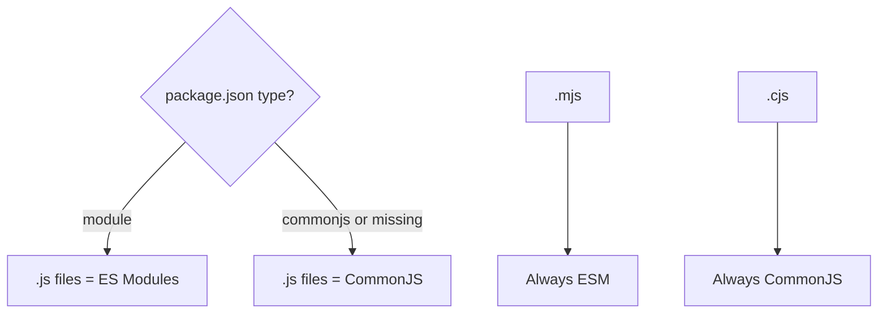

---

## Streams

Objects used to handle data piece-by-piece (chunks) instead of loading everything into memory.

### Types of Streams

1. **Readable**: Read data (e.g., `fs.createReadStream`, `req` in a server)
2. **Writable**: Write data (e.g., `fs.createWriteStream`, `res` in a server)
3. **Duplex**: Read + write (e.g., TCP sockets)
4. **Transform**: Modify data while reading/writing (e.g., `zlib.createGzip()`)

### Stream Events

Streams are based on EventEmitter:

- **Readable**: `data` (chunk available), `end` (no more data), `error`, `close`
- **Writable**: `finish` (writing completed), `drain` (ready for more data), `error`, `close`

### Piping

Connect streams together — data flows automatically from one stream to another:

```javascript
const fs = require('fs');
const zlib = require('zlib');
const { pipeline } = require('stream/promises');

// pipeline() handles errors and cleanup — prefer it over .pipe()
await pipeline(
  fs.createReadStream('input.txt'),
  zlib.createGzip(),
  fs.createWriteStream('input.txt.gz')
);
```


### Why streams? (memory)

```text
readFile (1 GB file)              createReadStream (1 GB file)
Memory: [██████████ 1 GB]          Memory: [█ 64 KB] → [█ 64 KB] → ...
Whole file loaded at once          One chunk at a time
```

---

## What is Backpressure?

Backpressure happens when the **writer is slower than the reader** (e.g. fast disk read → slow network). Without handling it, chunks pile up in memory.

- `writable.write(chunk)` returns `false` when the internal buffer is full (`highWaterMark`).
- The reader should **pause** until the writable emits `drain`.
- `.pipe()` and `pipeline()` handle this automatically.

```javascript
readable.on('data', (chunk) => {
  const ok = writable.write(chunk);
  if (!ok) {
    readable.pause();
    writable.once('drain', () => readable.resume());
  }
});
```

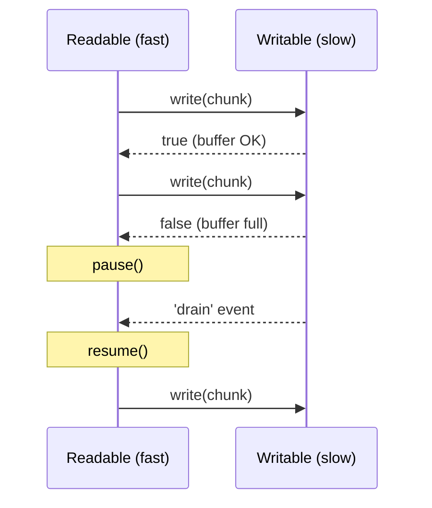

---

## Buffer

Temporary storage for raw binary data when dealing with files, network data, streams. A Buffer is a fixed-size chunk of memory allocated outside the V8 heap.

### Why use Buffers instead of binary strings?

- **Memory Efficiency**: Buffers store raw bytes directly, strings require encoding/decoding
- **Performance**: Buffers work closer to system memory, faster for I/O operations
- **No Encoding Issues**: Strings depend on encoding (UTF-8, etc.), Buffers handle pure binary data
- **Fixed Size**: Buffers have fixed length → predictable memory usage

```javascript
const buf = Buffer.from('Hi');
console.log(buf);            // <Buffer 48 69>
console.log(buf.toString()); // "Hi"
```

```text
String "Hi"  ──encode UTF-8──>  Buffer [ 0x48 | 0x69 ]
                                         'H'    'i'
```

---

## libuv and Core Architecture

| Component        | What it is                                                                        |
| ---------------- | --------------------------------------------------------------------------------- |
| Main Thread      | The single execution path where V8 runs JS and libuv drives the event loop        |
| Call Stack       | LIFO structure tracking active function calls                                     |
| V8 Engine        | Compiles and executes JS into machine code                                        |
| libuv            | C library providing the event loop, thread pool, and OS async integration         |
| C++ Bindings     | Layer bridging JS APIs (`fs`, `crypto`) to Node's C++ / libuv code                |

### What is libuv?

libuv is the C library that gives Node its **event loop**, its **thread pool**, and its access to **OS kernel** async facilities (epoll, kqueue, IOCP). It is what makes Node's non-blocking I/O possible.

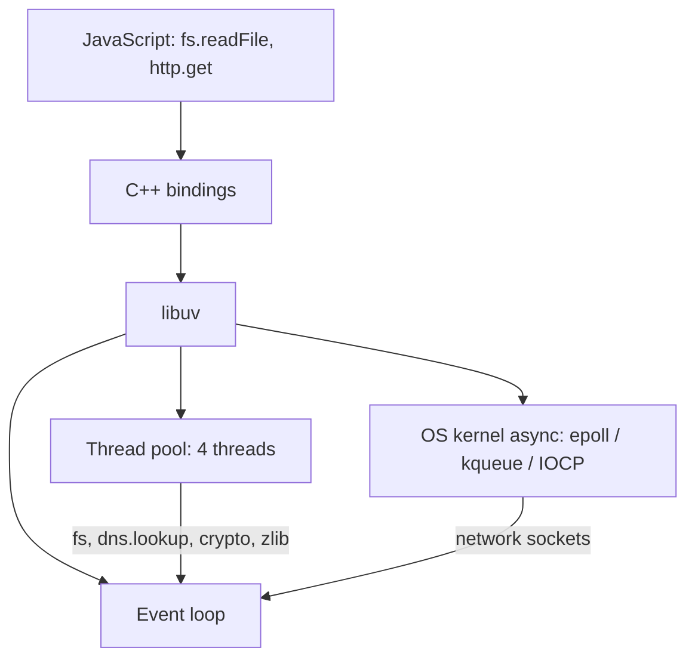

---

## How Does Node Handle Heavy Work if It Is Single-Threaded?

### 1. libuv Thread Pool — heavy background I/O

- Used for file system tasks (`fs.readFile`), `dns.lookup`, `crypto` (pbkdf2, scrypt), and `zlib` compression
- Default size is **4 threads** (change with `UV_THREADPOOL_SIZE`, max 1024)
- If 5 heavy tasks start at once, the 5th waits for a free thread

```text
Tasks:  [crypto1] [crypto2] [crypto3] [crypto4] [crypto5]
Pool:   T1:crypto1  T2:crypto2  T3:crypto3  T4:crypto4
Queue:  crypto5 waits ──────────────> runs when a thread frees up
```

### 2. OS Kernel — network tasks

- Used for network/socket work (`http`, `net`)
- The kernel handles these asynchronously, so no thread pool is needed

### 3. Worker Threads — heavy CPU tasks in the same app

- The `worker_threads` module runs isolated JS on separate threads **inside one process**
- Each worker has its own V8 instance and event loop
- Can share memory via `SharedArrayBuffer`; communicates with `postMessage`
- Good for heavy math, image resizing, large file parsing

```javascript
const { Worker } = require('worker_threads');
const worker = new Worker('./heavy-task.js', { workerData: 42 });
worker.on('message', (result) => console.log(result));
```

### 4. Cluster — scaling the whole app

- Forks the entire server into separate Node processes (usually one per CPU core)
- The primary process distributes incoming connections across worker processes
- **No shared memory** between workers (use Redis / DB for shared state)

```javascript
const cluster = require('cluster');
const os = require('os');

if (cluster.isPrimary) {
  os.cpus().forEach(() => cluster.fork());
} else {
  require('./server'); // each worker runs the app
}
```

---

## Cluster vs Worker Threads

| Worker Threads                    | Cluster                              |
| --------------------------------- | ------------------------------------ |
| Threads inside one process        | Separate processes                   |
| Can share memory                  | No shared memory                     |
| For CPU-heavy computation         | For scaling an HTTP server across CPU cores |
| One crash can affect the process  | One worker crash doesn't kill others |

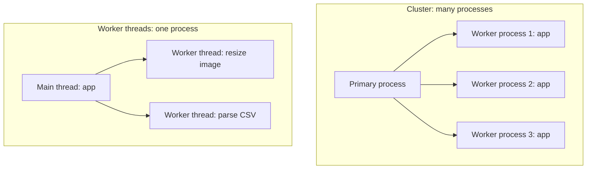

In production, process managers (PM2) or containers (Kubernetes replicas) often replace hand-written cluster code.

### Scaling

- **Vertical**: increase the power of one server (more CPU/RAM)
- **Horizontal**: run multiple servers behind a load balancer

---

## Creating a Web Server with the HTTP Module

Use `http.createServer()` to create the server and `server.listen()` to start it on a port.

```javascript
const http = require('http');

const server = http.createServer((req, res) => {
  res.writeHead(200, { 'Content-Type': 'application/json' });
  res.end(JSON.stringify({ message: 'Hello' }));
});

server.listen(3000, () => {
  console.log('Server running on port 3000');
});
```

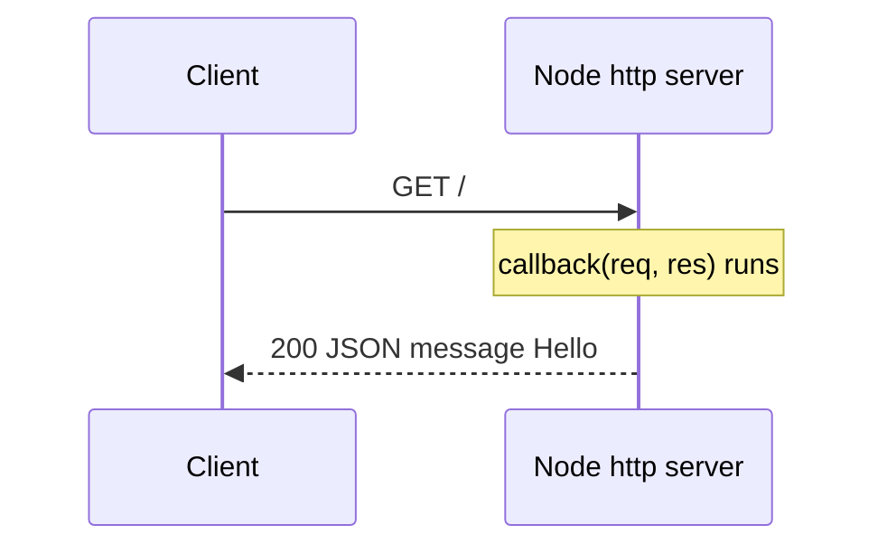

---

## Event-Driven Programming

Program execution is driven by events and event handlers. Node uses this model heavily (streams, servers, sockets are all EventEmitters).

### EventEmitter

`EventEmitter` lets one part of your code send a signal with `.emit()` while another part listens with `.on()` and reacts.

```javascript
const EventEmitter = require('events');
const emitter = new EventEmitter();

emitter.on('order', (id) => {
  console.log('Order received:', id);
});

emitter.emit('order', 42); // Order received: 42
```

**Key methods:** `on()`, `once()`, `emit()`, `off()`

Listeners are called **synchronously**, in the order they were registered.

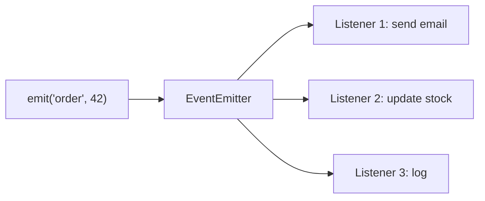

---

## Environment Variables and Config

- Config that changes per environment (DB URL, API keys, port) lives in **environment variables**, never in code.
- Read with `process.env.NAME`. Locally, load a `.env` file with `dotenv` or Node 20.6+'s `node --env-file=.env app.js`.
- Commit `.env.example`, **never** commit `.env`.
- Validate config at startup (fail fast if a variable is missing).

```javascript
// config.js — single place that reads process.env
require('dotenv').config();

const config = {
  port: Number(process.env.PORT) || 3000,
  dbUrl: process.env.DATABASE_URL,
};

if (!config.dbUrl) throw new Error('DATABASE_URL is required');
module.exports = config;
```


---

## Graceful Shutdown

When the server is stopped (deploy, scale-down, Ctrl+C), it should **finish in-flight requests** and close connections cleanly instead of dying mid-request.

1. Listen for `SIGTERM` / `SIGINT`
2. Stop accepting new connections (`server.close()`)
3. Wait for in-flight requests to finish
4. Close DB / Redis / queue connections
5. Exit; force-exit after a timeout if something hangs

```javascript
process.on('SIGTERM', () => {
  console.log('Shutting down...');
  server.close(async () => {
    await db.close();
    process.exit(0);
  });
  setTimeout(() => process.exit(1), 10_000).unref(); // force exit
});
```

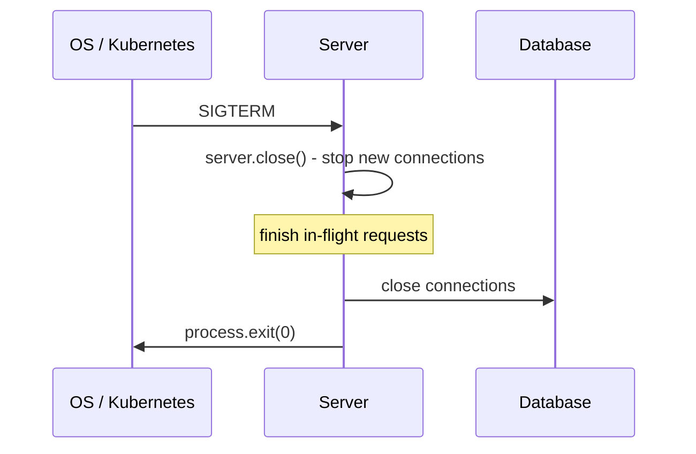

### uncaughtException and unhandledRejection

```javascript
process.on('unhandledRejection', (reason) => { console.error(reason); process.exit(1); });
process.on('uncaughtException', (err) => { console.error(err); process.exit(1); });
```

After an uncaught exception the process is in an unknown state — **log and exit**, and let a process manager (PM2, Docker, Kubernetes) restart it. Do not keep serving.

---

## Child Processes

Child processes let Node execute another program.

| Method       | Use                                                       |
| ------------ | --------------------------------------------------------- |
| `spawn()`    | Launch a new process and stream its output                |
| `exec()`     | Run a shell command and buffer the full output            |
| `execFile()` | Run an executable directly, without a shell               |
| `fork()`     | Spawn a new **Node** process with a built-in message channel |

### spawn() vs fork()

| `spawn()`                       | `fork()`                                  |
| ------------------------------- | ----------------------------------------- |
| Runs any executable             | Runs a Node.js module                     |
| Communicates through streams    | Has built-in IPC (`send` / `on('message')`) |
| Good for long-running commands  | Good for Node worker processes            |

`fork()` is a special case of `spawn()`.

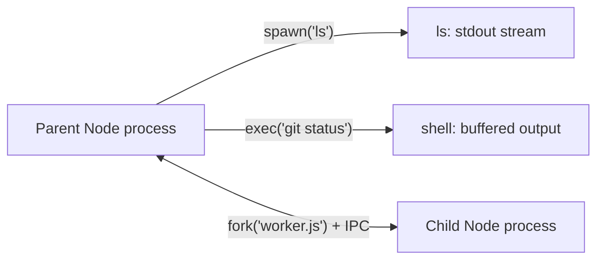

---

# Express.js

## What is Express.js?

Minimal web framework for Node.js to build APIs and web apps. It adds routing, middleware, and request/response helpers on top of the `http` module.

```javascript
const express = require('express');
const app = express();
const port = 3000;

app.use(express.json());

app.get('/', (req, res) => {
  res.send('Hello World!');
});

app.listen(port, () => {
  console.log(`Server running on port ${port}`);
});
```

### Key Features of Express.js

- **Minimalist & Flexible**: Lightweight with minimal core features
- **Routing**: Simple and powerful URL routing
- **Middleware**: Request/response processing pipeline
- **Template Engines**: Dynamic HTML rendering (EJS, Pug, Handlebars)
- **Error Handling**: Built-in error-handling middleware
- **HTTP Helpers**: `res.json()`, `res.status()`, `res.redirect()`

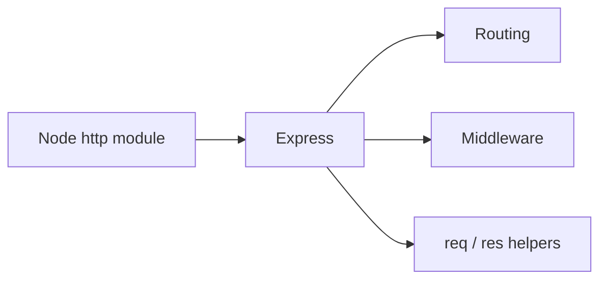

---

## Middleware in Express.js

Functions that run between receiving the request and sending the response. Each one can read/modify `req` and `res`, end the request, or call `next()`.

```javascript
app.use((req, res, next) => {
  console.log(req.method, req.url);
  next();
});
```

### Middleware Parameters

- `req`: Request object (data from client)
- `res`: Response object (send data to client)
- `next()`: Pass control to next middleware

### Role of next() in Express Middleware

- `next()` passes control to the next matching middleware/route
- If `next()` is not called **and** no response is sent, the request hangs
- `next('route')` skips the remaining callbacks of the current route (only in `app.METHOD()` / `router.METHOD()`)
- `next(err)` skips to the error-handling middleware

### Types of Middleware

- **Application-level**: `app.use()`, `app.get()`
- **Router-level**: `router.use()`
- **Built-in**: `express.json()`, `express.static()`, `express.urlencoded()`
- **Third-party**: cors, morgan, helmet, multer
- **Error-handling**: 4 parameters `(err, req, res, next)`

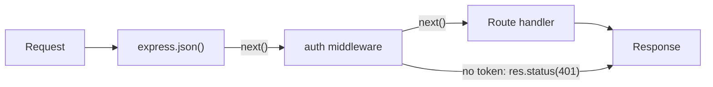

### app.use() vs app.METHOD()

- `app.use(path?, fn)`: Runs for **every HTTP method**, on any path that **starts with** `path` (default `/` = all requests)
- `app.METHOD(path, fn)`: Runs only for that HTTP method (GET, POST, PUT, DELETE) and an exact path match

---

## Middleware Order

Express runs middleware **in the order it was registered**, top to bottom. Order matters:

- Body parsers (`express.json()`) must come **before** routes that read `req.body`
- Auth middleware must come **before** the routes it protects
- The 404 handler goes **after** all routes
- The error handler goes **last**

```javascript
app.use(helmet());            // 1. security headers
app.use(cors());              // 2. CORS
app.use(express.json());      // 3. parse body
app.use(morgan('dev'));       // 4. logging
app.use('/api', apiRouter);   // 5. routes
app.use(notFound);            // 6. 404
app.use(errorHandler);        // 7. errors — always last
```

```text
Request ─> helmet ─> cors ─> json ─> morgan ─> /api routes ─> 404 ─> errorHandler
                                                   │                       ▲
                                                   └──── next(err) ────────┘
```

---

## Express Request Lifecycle

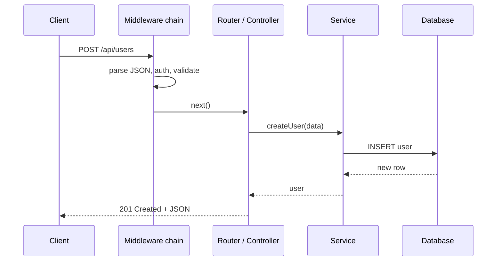

---

## HTTP Methods and Status Codes

### HTTP Methods

| Method | Purpose                      | Idempotent? |
| ------ | ---------------------------- | ----------- |
| GET    | Fetch data                   | Yes         |
| POST   | Create data                  | No          |
| PUT    | Replace a resource entirely  | Yes         |
| PATCH  | Update part of a resource    | Not guaranteed |
| DELETE | Remove data                  | Yes         |

### Common Status Codes

| Code | Meaning                                 |
| ---- | --------------------------------------- |
| 200  | OK                                      |
| 201  | Created                                 |
| 204  | No Content                              |
| 400  | Bad Request (validation failed)         |
| 401  | Unauthorized (not logged in)            |
| 403  | Forbidden (logged in, but not allowed)  |
| 404  | Not Found                               |
| 409  | Conflict (e.g. duplicate email)         |
| 429  | Too Many Requests                       |
| 500  | Internal Server Error                   |

```text
2xx = success   3xx = redirect   4xx = client's fault   5xx = server's fault
```

---

## req.params vs req.query vs req.body

- `req.params`: URL path parameters (e.g., `/users/:id`)
- `req.query`: Query strings (e.g., `/users?page=1`)
- `req.body`: Request body data (requires `express.json()`)
- `req.headers`, `req.method`, `req.url`: headers, HTTP method, URL

```javascript
// PUT /users/42?notify=true   body: { "name": "Ali" }
app.put('/users/:id', (req, res) => {
  req.params.id;     // "42"
  req.query.notify;  // "true"  (always a string)
  req.body.name;     // "Ali"
});
```

```text
PUT  /users/42  ?notify=true        { "name": "Ali" }
           │          │                    │
     req.params.id  req.query.notify   req.body.name
```

### Response (res)

- `res.send()`: Send a response (string, Buffer, or object; sets Content-Type)
- `res.json()`: Send a JSON response
- `res.status()`: Set HTTP status code (chainable: `res.status(201).json(...)`)
- `res.redirect()`: Redirect to another URL
- `res.render()`: Render a template
- `res.download()`: Send file for download

---

## Error Handling in Express

### 404 handler

Placed **after** all routes — it only runs when nothing else matched.

```javascript
app.use((req, res) => {
  res.status(404).json({ error: 'Not Found' });
});
```

### Error-handling middleware

Must have **4 parameters** `(err, req, res, next)` — that is how Express recognizes it. Register it **last**.

```javascript
app.use((err, req, res, next) => {
  console.error(err.stack);
  const status = err.status || 500;
  res.status(status).json({
    error: status === 500 ? 'Internal Server Error' : err.message,
  });
});
```

Never send the stack trace to the client.

### Async errors

- **Express 4**: errors thrown inside `async` handlers are **not** caught automatically — wrap with `try/catch` and call `next(err)`.
- **Express 5**: rejected promises from handlers are forwarded to the error handler automatically.

```javascript
// Express 4
app.get('/async', async (req, res, next) => {
  try {
    const data = await someAsyncOperation();
    res.json(data);
  } catch (err) {
    next(err);
  }
});
```

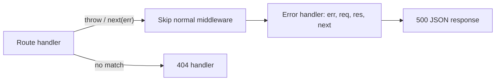

---

## MVC / Layered Structure in Express

- **Model**: Data (database schemas)
- **View**: UI (templates) — in a JSON API, the JSON response
- **Controller**: Handles the request/response (thin)
- **Service**: Business logic (common addition to MVC)

```text
src/
├── routes/        user.routes.js      → URL → controller
├── controllers/   user.controller.js  → read req, call service, send res
├── services/      user.service.js     → business logic
├── models/        user.model.js       → DB schema
├── middlewares/   auth.js, error.js
└── app.js
```

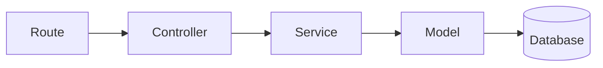

---

## What is CORS?

**Cross-Origin Resource Sharing** — a **browser** security rule. A page on `https://app.com` can't read responses from `https://api.com` unless the API says it's allowed via response headers.

- Origin = protocol + domain + port
- It is enforced by the browser only — Postman/curl ignore it
- For non-simple requests (e.g. `PUT`, JSON body, custom headers) the browser first sends a **preflight** `OPTIONS` request

```javascript
const cors = require('cors');
app.use(cors({ origin: 'https://app.com', credentials: true }));
```

```mermaid
sequenceDiagram
    participant B as Browser (app.com)
    participant A as API (api.com)
    B->>A: OPTIONS /users (preflight)
    A-->>B: Access-Control-Allow-Origin: https://app.com
    B->>A: PUT /users (real request)
    A-->>B: 200 + CORS headers
    Note over B: Browser lets the page read the response
```

---

## JWT Authentication

**JSON Web Token** — a signed token the server gives after login. The client sends it on every request, so the server doesn't need to store a session.

### Structure

```text
xxxxx.yyyyy.zzzzz
  │      │      └─ Signature: HMAC(header + payload, secret)
  │      └──────── Payload: { userId, role, exp }  (base64url — NOT encrypted)
  └─────────────── Header:  { alg: "HS256", typ: "JWT" }
```

- The payload is **readable by anyone** — never put passwords or secrets in it.
- The signature only proves it **wasn't tampered with**.

### Flow

```mermaid
sequenceDiagram
    participant C as Client
    participant S as Server
    C->>S: POST /login (email, password)
    S->>S: verify password, sign JWT
    S-->>C: access token (+ refresh token in httpOnly cookie)
    C->>S: GET /profile, Authorization: Bearer token
    S->>S: verify signature + expiry
    S-->>C: 200 profile
    Note over C,S: access token expired
    C->>S: POST /refresh (cookie)
    S-->>C: new access token
```

```javascript
const jwt = require('jsonwebtoken');

// Login
const token = jwt.sign({ userId: user.id }, process.env.JWT_SECRET, { expiresIn: '15m' });

// Auth middleware
function auth(req, res, next) {
  const token = req.headers.authorization?.split(' ')[1];
  if (!token) return res.status(401).json({ error: 'No token' });
  try {
    req.user = jwt.verify(token, process.env.JWT_SECRET);
    next();
  } catch {
    res.status(401).json({ error: 'Invalid token' });
  }
}
```

### Best practices

- Short-lived **access token** (5–15 min) + longer **refresh token**
- Store the refresh token in an **httpOnly, Secure cookie** (JS can't read it → safer against XSS)
- JWTs can't easily be revoked before expiry — keep them short or keep a denylist

### JWT vs Session

| Session (cookie)                 | JWT                                  |
| -------------------------------- | ------------------------------------ |
| Server stores session (Redis/DB) | Stateless — server stores nothing    |
| Easy to revoke (delete session)  | Hard to revoke before expiry         |
| Needs shared store when scaling  | Scales easily across servers         |

### Authentication vs Authorization

- **Authentication** — *who are you?* (login, verify token) → failure = **401**
- **Authorization** — *what are you allowed to do?* (roles, ownership) → failure = **403**

---

## Rate Limiting

Prevents too many requests from one client (brute-force, abuse).

```javascript
const rateLimit = require('express-rate-limit');

const limiter = rateLimit({
  windowMs: 15 * 60 * 1000, // 15 minutes
  max: 100, // limit each IP to 100 requests per windowMs
  message: 'Too many requests',
});

app.use('/api', limiter);
```

With multiple servers, store the counters in **Redis** so all servers share the same limit.

```mermaid
flowchart LR
    C["Client"] --> RL{"Requests in window under 100?"}
    RL -->|"yes"| API["Route handler"]
    RL -->|"no"| E["429 Too Many Requests"]
```

---

## Security Best Practices

- Helmet (secure HTTP headers)
- Authentication (JWT / sessions) and authorization checks on every protected route
- Rate limiting (especially on login)
- Input validation (Joi, Zod)
- HTTPS/TLS
- Strict CORS configuration
- Sanitize inputs and escape output (prevent XSS, NoSQL/SQL injection)
- Hash passwords with bcrypt/argon2 — never store plain text
- Keep secrets in env vars; keep dependencies updated (`npm audit`)

```mermaid
flowchart LR
    REQ["Request"] --> H["helmet"]
    H --> RL["rate limit"]
    RL --> CO["CORS"]
    CO --> AU["auth"]
    AU --> V["validate input"]
    V --> HANDLER["handler"]
```

---

## Performance Optimization

- Caching (Redis)
- Clustering / multiple instances (use all CPU cores)
- Load balancing
- Use streams for large files
- Database connection pooling and indexes
- Compression (gzip / brotli)
- Avoid sync (`*Sync`) calls inside request handlers
- Move CPU-heavy work to worker threads or a job queue
- Use a CDN for static files

```mermaid
flowchart LR
    U["User"] --> CDN["CDN: static files"]
    U --> LB["Load balancer"]
    LB --> N1["Node instance 1"]
    LB --> N2["Node instance 2"]
    N1 --> RC[("Redis cache")]
    N2 --> RC
    RC -->|"cache miss"| DB[("Database with pool")]
```

---

# Rarely Asked (Lower Priority)

## Can Node.js use engines other than V8?

Officially: No. Node.js is tightly coupled with V8. There were experimental efforts (e.g., node-chakracore with Microsoft's ChakraCore), but those projects are discontinued. In production, Node.js always uses V8.

---

## What are Hidden Classes in V8?

Hidden classes (also called "shapes" or "maps") are internal structures used by V8 to optimize object property access.

JavaScript objects are dynamic:

```javascript
let obj = {};
obj.name = 'Ali';
obj.age = 25;
```

V8 creates hidden classes to track object shape. Objects with the same properties **added in the same order** share the same hidden class. This enables faster property access (like C++ objects) and optimization.

```text
{}  ──add name──>  Shape1 {name}  ──add age──>  Shape2 {name, age}
```

### How V8 optimizes JavaScript

1. **JIT Compilation**: Converts hot code into machine code
2. **Inline Caching**: Remembers object property access patterns
3. **Hidden Classes**: Makes dynamic objects behave like static ones
4. **Garbage Collection**: Automatically frees memory
5. **TurboFan Optimizer**: Aggressively optimizes frequently used functions

---

## require.resolve()

Returns the full path of a module without loading it. Useful for debugging module paths.

---

## Buffer Methods

- `Buffer.from()`: Create buffer from string/array
- `Buffer.alloc()`: Allocate zero-filled memory
- `Buffer.allocUnsafe()`: Allocate memory without initialization (faster, may contain old data)
- `buf.toString()`: Convert to string
- `buf.write()`: Write string to buffer
- `buf.subarray()`: Return a portion of the buffer that **shares the same memory** (`buf.slice()` does the same but is deprecated)

---

## net vs dgram modules

- **net module**: TCP (Transmission Control Protocol) networking. Create TCP servers/clients. Reliable, ordered delivery.
- **dgram module**: UDP (User Datagram Protocol). Fast communication where delivery isn't guaranteed (games, streaming, DNS).

---

## Control Flow

Control flow is the order in which instructions, lines of code, and function calls execute.

- **Synchronous** — each line finishes before the next starts, blocking the thread
- **Asynchronous** — work is offloaded and a callback runs later, keeping the thread free

Async control flow evolved: callbacks → Promises → `async`/`await`.

---

## REPL

**Read-Eval-Print-Loop** — run JavaScript line by line directly in the terminal by typing `node` with no arguments.

- **Read** the input
- **Eval**uate it
- **Print** the result
- **Loop** back for the next input

---

## tls Module

The `tls` module provides encrypted communication over TCP using TLS/SSL.

It provides:

- **Encryption** — data cannot be read in transit
- **Authentication** — certificates prove server identity
- **Data integrity** — tampering is detectable

`https` uses `tls` underneath.

---

## Common Third-Party Middleware

| Middleware  | Purpose               |
| ----------- | --------------------- |
| cors        | Enable CORS           |
| helmet      | Secure HTTP headers   |
| morgan      | Logging               |
| multer      | File upload           |
| dotenv      | Environment variables (not middleware — a config loader) |
| body-parser | Request body parsing (built into Express 4.16+ as `express.json()` / `express.urlencoded()`) |

---

## Key Express Concepts (Quick List)

- `process.env`: Environment variables
- `__dirname`: Current folder path (CommonJS only)
- `app.route()`: Chain handlers for one path: `app.route('/users').get(...).post(...)`
- `res.send()` vs `res.json()`: `send` handles strings/Buffers/objects; `json` always sends JSON
- Default port: 3000 (or `process.env.PORT`)
