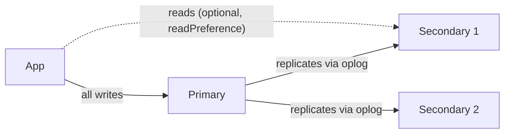
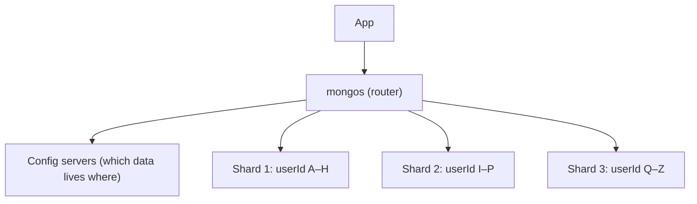

# MongoDB Interview

- **NoSQL and Non-relational** document-oriented database
- Store data in **BSON (Binary JSON)** format
- Often prefers **embedding (denormalization)** for read performance — "data that is read together is stored together"

## Structure

- **Database**: Container for collections
- **Collection**: Group of documents (like table)
- **Document**: Single record (like rows)
- **Field**: Key-value pair in document

```text
SQL world              MongoDB world
─────────              ─────────────
Database      ───►     Database
Table         ───►     Collection
Row           ───►     Document   { _id, name, address: {...}, tags: [...] }
Column        ───►     Field
JOIN          ───►     Embedding  or  $lookup / populate()
```

## Features

- Flexible schema
- High performance
- Horizontal Scalability
- Support nested and unstructured data

```text
One document can hold nested objects and arrays — no extra table needed:

{
  _id: ObjectId("..."),
  name: "Ali",
  address: { city: "Lahore", zip: "54000" },   ← nested object
  skills:  ["node", "react"]                    ← array
}
```

## Difference Between BSON and JSON

| BSON                       | JSON                   |
| -------------------------- | ---------------------- |
| Binary                     | Text                   |
| Faster (Machine Readable)  | Slower                 |
| Support more types         | Limited Types          |
| Used internally by MongoDB | Used for data exchange |

```text
Client (JSON)  ──►  Driver encodes  ──►  BSON stored on disk
Client (JSON)  ◄──  Driver decodes  ◄──  BSON read from disk
```

## Embedding vs Referencing (Normalization vs Denormalization)

This is the most important MongoDB design question.

| Normalization                      | Denormalization                             |
| ---------------------------------- | ------------------------------------------- |
| Use references                     | Use embedding                               |
| Store data in separate collections | Store related data together (same document) |
| Data duplication avoided           | Data redundancy for fast access             |
| Use IDs to link documents          | No joins needed                             |
| Better for frequent updates        | Better for frequent reads                   |

```text
EMBEDDING (one read)                    REFERENCING (two reads / $lookup)

users                                   users                  orders
{                                       {                      { _id: 501,
  _id: 1,                                 _id: 1,                userId: 1,  ──► points to users._id
  name: "Ali",                            name: "Ali"            total: 300 }
  address: {                            }                      { _id: 502,
    city: "Lahore"                                               userId: 1,
  }                                                              total: 120 }
}
```

**Embed when:** the data belongs to the parent, is read together, and is small/bounded (address, profile settings).

**Reference when:** the data is large, grows without limit, is shared by many documents, or changes independently (orders, comments, products).

### Data Redundancy

Embedding stores duplicate data in multiple documents — improves read performance but can cause inconsistency (for example, a product name copied into 10,000 orders must be updated everywhere if it changes).

## Schema Design for One-to-Many

Pick the pattern based on **how many** children there are.

| Relationship       | Example                     | Pattern                                  |
| ------------------ | --------------------------- | ---------------------------------------- |
| One-to-few         | User → addresses (2–3)      | **Embed** the array in the parent        |
| One-to-many        | Product → parts (hundreds)  | **Array of references** in the parent    |
| One-to-squillions  | Server → log entries (millions) | **Parent reference** in each child   |

```text
One-to-few (embed)        One-to-many (child refs)       One-to-squillions (parent ref)

user {                    product {                      host { _id: "h1" }
  addresses: [              parts: [ObjectId(p1),
    { city: "A" },                  ObjectId(p2), ...]   log { hostId: "h1", msg: "..." }
    { city: "B" }         }                              log { hostId: "h1", msg: "..." }
  ]                                                      log { hostId: "h1", msg: "..." }
}                                                        ... millions, each points UP
```

**Rule:** never let an array grow without limit — a document has a **16 MB** maximum size, and huge arrays make every update slow.

## Indexing

Store a small portion of data in a sorted structure (a **B-tree**) to make queries faster.

- **Without indexing**: Full collection scan (`COLLSCAN`)
- **With indexing**: Direct lookup (`IXSCAN`)

```text
WITHOUT index — COLLSCAN, O(n)              WITH index on email — IXSCAN, O(log n)

┌──────┬──────┬──────┬──────┬──────┐                    [ m ]
│ doc1 │ doc2 │ doc3 │ .... │ docN │                  /       \
└──────┴──────┴──────┴──────┴──────┘             [ d ]         [ s ]
   ▲      ▲      ▲             ▲                 /    \        /    \
   check every document one by one            a–c    e–l    n–r    t–z
                                                       │
                                                       ▼
                                             pointer to the matching doc
```

### Index Types

- **Single Index**: One field
- **Compound Index**: More than one field
- **Unique Index**: Unique values only, prevent duplicates
- **Multi Key Index**: For array fields (created automatically when you index an array field)
- **Text Index**: For text search
- **Geospatial Index**: For location based queries
- **Hashed Index**: Used for hashed sharding (spreads data evenly); supports equality matches only, not ranges
- **TTL Index**: Auto-delete documents after specific time (sessions, logs, temp data)

```js
db.users.createIndex({ email: 1 }, { unique: true });          // unique
db.orders.createIndex({ userId: 1, createdAt: -1 });           // compound
db.sessions.createIndex({ createdAt: 1 }, { expireAfterSeconds: 3600 }); // TTL
```

### How Indexing Improves Performance

- Reduce search space
- Avoid full collection scan
- Speed up read operations and sorts
- Less CPU and disk I/O per query (but the index itself uses RAM and disk)

### Disadvantage of Indexing

- Slow down writes because indexes also need to be updated
- Take extra RAM and disk space — indexes should fit in memory to be fast

```text
insertOne(doc)
   │
   ├──► write document
   ├──► update index #1
   ├──► update index #2      ← every extra index = extra work on every write
   └──► update index #3
```

## Compound Index Order (ESR Rule)

The **order of fields** in a compound index matters. Follow the **ESR rule**: **E**quality → **S**ort → **R**ange.

```js
// Query
db.users.find({ status: "active", age: { $gt: 18 } }).sort({ createdAt: -1 });

// Best index:  Equality   Sort           Range
db.users.createIndex({ status: 1, createdAt: -1, age: 1 });
```

### Prefix Rule

An index on `{ a: 1, b: 1, c: 1 }` can be used by queries on its **left-most prefixes**:

```text
Index: { a, b, c }

Query filters on      Uses index?
──────────────────    ───────────
a                     ✔ yes
a, b                  ✔ yes
a, b, c               ✔ yes
b                     ✘ no   (skips the first field)
b, c                  ✘ no
a, c                  ~ partly (only "a" narrows the search)
```

## Aggregation Pipeline

Process data in stages where each stage transforms the output of the previous one.

```js
db.orders.aggregate([
  { $match: { status: "paid" } },
  { $group: { _id: "$userId", total: { $sum: "$amount" } } },
  { $sort: { total: -1 } },
  { $limit: 5 },
]);
```

```text
orders (10,000 docs)
   │
   ▼
$match  { status: "paid" }               ──►  4,000 docs
   │
   ▼
$group  by userId, sum(amount)           ──►    800 docs  (one per user)
   │
   ▼
$sort   { total: -1 }                    ──►    800 docs  (biggest first)
   │
   ▼
$limit  5                                ──►      5 docs  = top 5 customers
```

### Pipeline Stages

- `$match` → Filter documents
- `$group` → Group and aggregate
- `$project` → Select fields
- `$sort` → Sort results (`1` = ascending, `-1` = descending)
- `$skip` → Skip documents
- `$limit` → Limit results
- `$count` → Count total

### Pipeline Operators

- `$filter`: Filter array
- `$facet`: Parallel processing - run multiple independent aggregation pipelines on same documents
- `$lookup`: Join data from another collection (returns array)
- `$unwind`: Deconstruct array into individual documents

```text
$unwind on { name: "Ali", skills: ["node", "react"] }

        ┌──► { name: "Ali", skills: "node"  }
input ──┤
        └──► { name: "Ali", skills: "react" }
```

## $lookup (Join in MongoDB)

`$lookup` does a **left outer join** with another collection inside an aggregation. The matches come back as an **array**.

```js
db.orders.aggregate([
  {
    $lookup: {
      from: "users",          // collection to join
      localField: "userId",   // field in orders
      foreignField: "_id",    // field in users
      as: "user",             // output array field
    },
  },
  { $unwind: "$user" },       // turn [user] into user
]);
```

```text
orders                         users
{ _id: 501, userId: 1 }  ───►  { _id: 1, name: "Ali" }

result
{ _id: 501, userId: 1, user: [ { _id: 1, name: "Ali" } ] }
                              └──────── array ─────────┘
after $unwind
{ _id: 501, userId: 1, user: { _id: 1, name: "Ali" } }
```

**Tip:** index `foreignField` (`users._id` already is), otherwise `$lookup` scans the other collection for every input document.

## Cluster

Multiple MongoDB servers working together for performance, scalability, and reliability.

### Types

1. **Replica Set**: Same data on multiple servers
   - Primary (writes)
   - Secondary (copies, can read)
   - If primary down, secondary becomes primary

2. **Sharded Cluster**: Split data across multiple servers
   - Each server stores specific part of data

## Replication (Replica Set)

Duplicate data across multiple servers for **high availability**.



```text
Failover (automatic election)

 Primary ✖ crashes
     │
     ▼
 Secondaries notice missing heartbeats (~10s)
     │
     ▼
 Election → majority votes → Secondary 1 becomes NEW Primary
     │
     ▼
 Driver reconnects automatically, writes continue
```

- Use an **odd number** of voting members (usually 3) so a majority can always be formed.
- Reads from secondaries can be slightly **stale** (replication lag).

## Sharding

Horizontal data split across multiple servers — each shard holds a subset of the data.



### Choosing a Shard Key

The **shard key** decides which shard a document goes to. A bad key cannot be fixed easily later.

| Good shard key                             | Bad shard key                                   |
| ------------------------------------------ | ----------------------------------------------- |
| High cardinality (many distinct values)    | Low cardinality (e.g. `country`, `status`)      |
| Spreads writes evenly                      | Always increasing (e.g. `createdAt`, ObjectId) with range sharding |
| Used in most queries (targeted queries)    | Not in queries → every query hits every shard   |

```text
Range sharding on createdAt (always increasing)

Shard 1  [old data]        idle
Shard 2  [old data]        idle
Shard 3  [newest data] ◄── ALL new writes  = "hot shard"

Fix: hashed shard key → hash(createdAt) spreads writes across all shards
```

## Transaction

Ensures multiple database operations either all succeed or all fail together. Sequence of operations executed as a single unit.

- A **single-document** write is always atomic, even without a transaction — another reason to embed.
- **Multi-document** transactions need a **replica set** (MongoDB 4.0+) or a sharded cluster (4.2+). They do not work on a standalone server.

```js
const session = await mongoose.startSession();
await session.withTransaction(async () => {
  await Account.updateOne({ _id: from }, { $inc: { balance: -100 } }, { session });
  await Account.updateOne({ _id: to },   { $inc: { balance:  100 } }, { session });
});
session.endSession();
```

```text
startTransaction
   │
   ├── debit  account A  -100
   ├── credit account B  +100
   │
   ├── all OK?  ──► commit  ──► both changes visible
   └── error?   ──► abort   ──► nothing changed
```

## Mongoose

**Object Data Model (ODM)** for MongoDB.

- Schema-based
- Built-in validation, middleware, and query helpers

### Key Concepts

- **Schema**: Blueprint of documents (fields, data types, validations)
- **Model**: Interact with database using defined schema
- **Middleware**: Pre hook (before) and Post hook (after)

```text
Schema (rules) ──► Model (User) ──► Document (one user)
                                       │
                         save() ──► pre('save') ──► validate ──► MongoDB ──► post('save')
```

```js
userSchema.pre("save", async function () {
  if (this.isModified("password")) {
    this.password = await bcrypt.hash(this.password, 10);
  }
});
```

## Operations

| Operation      | Description                     |
| -------------- | ------------------------------- |
| `find()`       | Return multiple documents       |
| `findOne()`    | Return only one document        |
| `findById()`   | Find by ID, return one document |
| `updateOne()`  | Update first matched document   |
| `updateMany()` | Update all matched documents    |
| `deleteOne()`  | Delete first matched document   |
| `deleteMany()` | Delete all matched documents    |
| `insertOne()`  | Insert single document          |
| `insertMany()` | Insert multiple documents       |
| `{ upsert: true }` | Option on update methods — update if exists, create if not (there is no `upsert()` method) |
| `create()`     | Create and save in one step (Mongoose) |
| `save()`       | Save after creating/modifying (Mongoose) |

```js
db.users.updateOne(
  { email: "a@b.com" },
  { $set: { name: "Ali" } },
  { upsert: true }   // insert if no match
);
```

```text
upsert: true
   find match? ── yes ──► update it
        │
        no
        ▼
   insert new document
```

## Populate()

Find related documents from another collection by replacing ObjectId references with actual data (Mongoose).

```js
const orderSchema = new mongoose.Schema({
  user: { type: mongoose.Schema.Types.ObjectId, ref: "User" },
  total: Number,
});

const orders = await Order.find().populate("user", "name email");
```

```text
Before populate                       After populate
{ _id: 501,                           { _id: 501,
  user: ObjectId("u1"),     ──►         user: { _id: "u1", name: "Ali", email: "..." },
  total: 300 }                          total: 300 }

How it works:
 query 1: Order.find()                         → orders
 query 2: User.find({ _id: { $in: [u1,u2..] }}) → users   (ONE extra query, not one per order)
 Mongoose stitches them together in Node.js
```

**populate() vs $lookup:** `populate()` runs extra queries and joins in your app; `$lookup` joins inside the database in one aggregation. For heavy reports use `$lookup`.

## aggregate() and Cursor

In the MongoDB shell and native driver, `aggregate()` returns a **cursor** — it streams data instead of loading everything at once.

In **Mongoose**, `Model.aggregate()` returns an `Aggregate` object; `await` gives you a full **array**. Call `.cursor()` to stream instead.

### Cursor

- Pointer/iterator
- Retrieves documents in batches, one by one for your code
- Doesn't load all data into memory

```text
MongoDB  ──batch 1 (101 docs)──►  cursor  ──► for await (const doc of cursor) { ... }
         ──batch 2 ────────────►
         ──batch 3 ────────────►   memory stays small
```

## Difference Between lean() and mongoose Documents

| lean()              | mongoose Query           |
| ------------------- | ------------------------ |
| Return plain object | Return mongoose document |
| Faster              | Slower                   |
| Less memory         | More memory              |
| No methods          | Has methods (`save()`, getters, virtuals) |

```text
User.find()          ──► MongoDB ──► raw data ──► wrap in Mongoose Document (heavy) ──► you
User.find().lean()   ──► MongoDB ──► raw data ──────────────────────────────────────► you (plain JS object)
```

## Handling Large Dataset

- Sharding
- Cursors
- Batch Operations (`bulkWrite`, `insertMany`)
- Aggregation pipelines
- Range-based pagination (see Q11)

## Optimizing MongoDB Queries

- Proper indexing (follow the ESR rule)
- Return only required fields (projection)
- Use aggregations
- Use lean() for heavy reads
- Limit results
- Check with `explain("executionStats")`

```text
Slow query?
   │
   ▼
explain("executionStats")
   │
   ├── COLLSCAN?                      ──► add an index
   ├── docsExamined >> nReturned?     ──► index is wrong / reorder fields (ESR)
   ├── SORT stage in memory?          ──► add sort field to the index
   └── returning huge documents?      ──► use projection + lean()
```

## Common Questions

### Q1. How does MongoDB store data?

MongoDB stores documents in **BSON (Binary JSON)** format. BSON supports extra data types that JSON does not, such as `Date`, `ObjectId`, `Decimal128`, and binary data.

```text
Database
 └── Collection (users)
      ├── Document { _id: ..., name: "Ali" }      ← stored as BSON
      └── Document { _id: ..., name: "Sara" }
```

### Q2. What is the `_id` field and the structure of an ObjectId?

`_id` uniquely identifies a document in a collection. If you don't provide one, MongoDB generates an **ObjectId**, which is **12 bytes**:

| Part         | Size    | Meaning                          |
| ------------ | ------- | -------------------------------- |
| Timestamp    | 4 bytes | Creation time (seconds)          |
| Random value | 5 bytes | Unique per machine/process       |
| Counter      | 3 bytes | Incrementing counter             |

```text
ObjectId("65a1f2c3  9b8e7d6c5a  4f3e2d")
          └──┬───┘  └────┬───┘  └─┬──┘
         timestamp    random    counter
          4 bytes     5 bytes   3 bytes
```

Because the first 4 bytes are a timestamp, sorting by `_id` roughly sorts by creation time.

### Q3. How does MongoDB handle relationships?

| Embedded Documents (Denormalization)     | Referenced Documents (Normalization)            |
| ---------------------------------------- | ----------------------------------------------- |
| Store related data inside the same document | Store related data in separate documents      |
| Good for data that belongs together      | Good for data shared by multiple documents      |
| Faster to read together (no join)        | Useful for large or frequently changing data    |
| Example: User → Address                  | Example: User → Orders                          |

References are resolved with `populate()` in Mongoose or `$lookup` in aggregation. See [Embedding vs Referencing](#embedding-vs-referencing-normalization-vs-denormalization) for the diagram.

### Q4. What is indexing and why does it matter for performance?

An index stores a small part of a collection's data in an easy-to-search sorted order. It improves query performance by letting MongoDB find documents **without scanning the entire collection**.

See the [Indexing](#indexing) section above for the diagram and supported types.

### Q5. How do you analyze the performance of a slow query?

Use `explain("executionStats")` to see how MongoDB executes the query.

- Check the winning plan — is it using an index (`IXSCAN`) or a full collection scan (`COLLSCAN`)?
- Check `executionTimeMillis` — how long it took.
- Compare `totalDocsExamined` with `nReturned` — if MongoDB examined 100,000 documents to return 10, the index is missing or wrong.
- Create or improve an index based on the query's filter, sort, and projected fields.

```js
db.users.find({ email: "a@b.com" }).explain("executionStats");
```

```text
BAD                                   GOOD
winningPlan: COLLSCAN                 winningPlan: IXSCAN → FETCH
totalDocsExamined: 100000             totalDocsExamined: 1
nReturned: 1                          nReturned: 1
executionTimeMillis: 850              executionTimeMillis: 1
```

### Q6. What is a covered query?

A covered query is a query MongoDB can answer **entirely from an index**, without reading the actual documents from disk or cache.

This happens when all fields in the query **and** all fields returned are part of the index (and `_id` is excluded if not indexed).

```js
db.users.createIndex({ email: 1, name: 1 });
db.users.find({ email: "a@b.com" }, { _id: 0, name: 1 }); // covered
```

```text
Normal query:   index ──► find pointer ──► read document ──► return
Covered query:  index ──► return  (answer is already inside the index)
```

Covered queries are very fast because no document lookup is needed.

### Q7. Explain the Aggregation Framework and common pipeline stages.

The Aggregation Framework processes and transforms data to get useful results. It works like a **pipeline**: data passes through multiple stages, and each stage performs one operation on the output of the previous one.

| Stage      | Simple Meaning                            |
| ---------- | ----------------------------------------- |
| `$match`   | Filter documents                          |
| `$group`   | Group documents and calculate values      |
| `$project` | Select or change fields                   |
| `$sort`    | Sort documents                            |
| `$limit`   | Limit the number of documents             |
| `$skip`    | Skip documents                            |
| `$unwind`  | Convert array elements into separate documents |
| `$lookup`  | Join data from another collection         |

**Tip:** put `$match` and `$limit` as early as possible so later stages work on fewer documents, and so `$match` can use an index. See the [Aggregation Pipeline](#aggregation-pipeline) diagram.

### Q8. How does Mongoose schema validation work?

You define a schema with field types, required fields, defaults, enums, and custom validators. Mongoose validates the data **before** saving it to the database.

```js
const userSchema = new mongoose.Schema({
  name:  { type: String, required: true, trim: true },
  email: { type: String, required: true, unique: true, lowercase: true },
  age:   { type: Number, min: 18, max: 100 },
  role:  { type: String, enum: ["user", "admin"], default: "user" },
  phone: {
    type: String,
    validate: {
      validator: (v) => /^\d{11}$/.test(v),
      message: "Invalid phone number",
    },
  },
});
```

```text
user.save()
   │
   ▼
Mongoose validation ── fails ──► ValidationError (nothing sent to DB)
   │
 passes
   ▼
MongoDB write ── duplicate email ──► E11000 duplicate key error (from the unique INDEX)
```

**Note:** validation runs on `save()` and `create()`. Update operations like `findOneAndUpdate()` skip it unless you pass `{ runValidators: true }`. Also, `unique: true` is **not a validator** — it creates a unique index, and the error comes from MongoDB.

### Q9. Difference between Replication and Sharding?

These two models solve different scaling problems.

| Feature           | Replication (Replica Set)                        | Sharding                                        |
| ----------------- | ------------------------------------------------ | ----------------------------------------------- |
| Purpose           | High availability and data redundancy            | Horizontal scalability                          |
| Data Distribution | Every node holds an identical copy of the data   | Data is partitioned and split across shards     |
| Nodes             | 1 Primary (writes) + multiple Secondaries (reads) | Shards + Config Servers + router (`mongos`)     |
| Solves            | Server failure, read load                        | Data too large for one server, write load       |

```text
Replication: same data, many copies       Sharding: different data, many servers

[A B C D]  [A B C D]  [A B C D]           [A B]   [C D]   [E F]
 primary    secondary  secondary          shard1  shard2  shard3
```

In production they are used **together** — each shard is itself a replica set.

### Q10. When should you embed and when should you reference?

| Question to ask                                  | Embed | Reference |
| ------------------------------------------------ | ----- | --------- |
| Is it always read together with the parent?      | ✔     |           |
| Is the list small and bounded?                   | ✔     |           |
| Can it grow without limit (comments, logs)?      |       | ✔         |
| Is it shared by many parents (product, author)?  |       | ✔         |
| Is it updated often on its own?                  |       | ✔         |

```text
Blog post with comments

Few comments, always shown with the post  ──►  embed comments in post
Thousands of comments, paginated          ──►  comments collection with postId
```

### Q11. How do you paginate large collections efficiently?

`skip()` gets slower as the page number grows, because MongoDB still walks over all skipped documents.

```js
// Offset pagination — slow on page 10,000
db.posts.find().sort({ _id: -1 }).skip(200000).limit(20);

// Range (cursor) pagination — always fast, uses the _id index
db.posts.find({ _id: { $lt: lastSeenId } }).sort({ _id: -1 }).limit(20);
```

```text
skip(200000).limit(20)
[■■■■■■■■■■■■■■■■■■■■■■■■■ walk 200,000 docs ■■■■■■■■■■■■■■■■■■■■■][20 returned]

_id < lastSeenId .limit(20)
jump straight to lastSeenId via index ──► [20 returned]
```

Trade-off: range pagination cannot jump to "page 57" directly — it suits infinite scroll and "Next" buttons.

### Q12. What happens when a document grows beyond 16 MB?

The write fails. A single document cannot exceed **16 MB**. Usually this means an array was allowed to grow without limit — move that data into its own collection with a reference (see [Schema Design for One-to-Many](#schema-design-for-one-to-many)). For storing large files, use **GridFS** or object storage like S3.

```text
post { comments: [ c1, c2, c3, ... c500000 ] }   ✘ hits 16 MB, slow updates

post { _id: 1 }                                  ✔
comments { postId: 1, ... }  × 500,000
```

---

# Rarely Asked (Lower Priority)

## MongoDB Data Types

### Common

- String
- Number
- Boolean
- Array
- Object
- Date
- ObjectId
- Null
- Binary

### Special

- Timestamp
- Decimal128

## Sort Order

- `1` = Ascending (small to big, A to Z)
- `-1` = Descending (big to small, Z to A)

## Difference between `insert()`, `insertOne()`, and `save()`?

- **`insertOne()` / `insertMany()`** — explicitly insert a new document or documents. Throws a duplicate key error if the `_id` already exists.
- **`insert()`** — the old shell method that could insert one document or an array. **Deprecated**, use `insertOne()` / `insertMany()`.
- **`save()`** — in the old shell it acted as an **upsert**: with an existing `_id` it overwrote the document, without an `_id` it inserted. Also deprecated and removed from modern drivers.

**In Mongoose**, `save()` is different — it's a **document method**. It inserts the document if it's new, otherwise it updates only the modified fields and runs validators and middleware.

```js
const user = new User({ name: "Ali" });
await user.save();    // insert

user.name = "Ahmed";
await user.save();    // update
```
