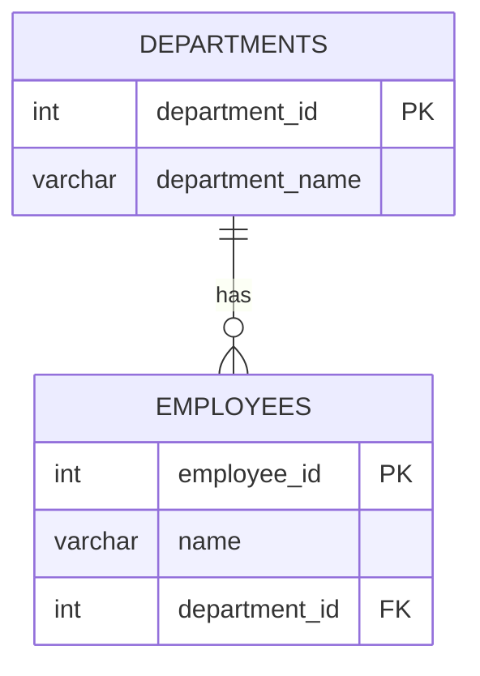

# SQL Interview

## SQL (Structured Query Language)

- **Relational database**: Data organized in tables with relationships
- Manage structured data
- Data stored in **Tables (Rows and Columns)**
- **Fixed schema** (predefined structure)
- Traditionally scaled **vertically** (bigger server). Horizontal scaling is possible with read replicas and sharding, but it is harder than in most NoSQL databases.
- Examples: MySQL, PostgreSQL

```text
Table: employees
                  columns
           ┌──────────┴──────────┐
┌─────────┬───────┬────────┬─────────┐
│ id (PK) │ name  │ salary │ dept_id │
├─────────┼───────┼────────┼─────────┤
│ 1       │ Ali   │ 9000   │ 10      │  ◄── row (record)
│ 2       │ Sara  │ 8000   │ 20      │
│ 3       │ Omar  │ 7000   │ NULL    │
└─────────┴───────┴────────┴─────────┘
```

## SQL vs NoSQL

| Feature        | SQL (PostgreSQL, MySQL)                   | NoSQL (MongoDB, Redis, Cassandra)            |
| -------------- | ----------------------------------------- | -------------------------------------------- |
| Data model     | Tables with rows and columns              | Documents, key-value, wide-column, graph     |
| Schema         | Fixed, defined up front                   | Flexible, can change per record              |
| Relationships  | Foreign keys and JOINs                    | Embedding or references                      |
| Scaling        | Mostly vertical (+ replicas)              | Built for horizontal (sharding)              |
| Transactions   | Strong ACID, multi-table                  | Varies (MongoDB supports multi-document ACID) |
| Best for       | Payments, orders, complex queries/reports | Fast-changing schema, huge scale, caching    |

```text
Which one?

Data highly related + need JOINs + money/consistency?  ──►  SQL
Schema changes often + nested data + huge scale?         ──►  NoSQL (document)
Just need fast key lookups / cache / sessions?           ──►  Redis (key-value)
```

**Interview answer:** it is not "which is better" — pick based on data shape, consistency needs, and query patterns. Many systems use both.

## Composite Key

Multiple columns together as a unique identifier. Each column alone may repeat, but the **combination** must be unique.

Example: in an `order_items` table, one order has many products, and one product appears in many orders — but the same product appears only once per order.

```sql
CREATE TABLE order_items (
   order_id   INT,
   product_id INT,
   quantity   INT,
   PRIMARY KEY (order_id, product_id)
);
```

```text
order_items
┌──────────┬────────────┬──────────┐
│ order_id │ product_id │ quantity │
├──────────┼────────────┼──────────┤
│ 1        │ 100        │ 2        │
│ 1        │ 200        │ 1        │   order_id repeats      ✔
│ 2        │ 100        │ 5        │   product_id repeats    ✔
│ 1        │ 100        │ 3        │   (1,100) again         ✘ rejected
└──────────┴────────────┴──────────┘
```

## ACID

Properties ensuring reliable database transactions:

- **Atomicity**: All operations succeed or all fail (no partial updates)
- **Consistency**: Data remains valid after transactions (constraints, foreign keys, checks still hold)
- **Isolation**: Concurrent transactions don't interfere
- **Durability**: Committed data is permanently saved (survives a crash — written to the WAL first)

```text
Transfer 100 from A to B

 A: 500   B: 200
   │
   ├── A = A - 100   → 400
   │       ✖ server crashes here
   │
   ▼
 Atomicity   → rollback, A back to 500 (money never disappears)
 Consistency → balance >= 0 CHECK is never broken
 Isolation   → another user never sees A=400 while B is still 200
 Durability  → once COMMIT returns, A=400 B=300 survives a power cut
```

## Isolation Levels and Anomalies

When transactions run at the same time, these problems (anomalies) can happen:

| Anomaly             | What happens                                                              |
| ------------------- | ------------------------------------------------------------------------- |
| Dirty read          | You read data another transaction has **not committed** yet               |
| Non-repeatable read | You read the same row twice and get **different values** (someone updated it) |
| Phantom read        | You run the same query twice and get **new/missing rows** (someone inserted) |

| Isolation Level    | Dirty Read | Non-repeatable Read | Phantom Read |
| ------------------ | ---------- | ------------------- | ------------ |
| Read Uncommitted   | possible   | possible            | possible     |
| Read Committed     | ✘          | possible            | possible     |
| Repeatable Read    | ✘          | ✘                   | possible (standard) — ✘ in PostgreSQL |
| Serializable       | ✘          | ✘                   | ✘            |

```text
Non-repeatable read (Read Committed)

Time   Transaction 1                         Transaction 2
────   ──────────────────────────────        ──────────────────────────────
t1     BEGIN
t2     SELECT balance FROM a WHERE id=1
       → 500
t3                                           BEGIN
t4                                           UPDATE a SET balance=300 WHERE id=1
t5                                           COMMIT
t6     SELECT balance FROM a WHERE id=1
       → 300   ← same query, different value
t7     COMMIT
```

- **PostgreSQL default:** `READ COMMITTED`. **MySQL (InnoDB) default:** `REPEATABLE READ`.
- PostgreSQL accepts `READ UNCOMMITTED` but treats it as `READ COMMITTED` — dirty reads never happen.
- Higher isolation = safer but slower (more locking, more serialization failures to retry).

```sql
BEGIN TRANSACTION ISOLATION LEVEL SERIALIZABLE;
-- ...
COMMIT;
```

## Normalization (1NF, 2NF, 3NF)

Normalization organizes tables to **remove duplicate data** and avoid update problems.

| Normal Form | Rule (simple)                                                                  |
| ----------- | ------------------------------------------------------------------------------ |
| **1NF**     | Each cell holds **one value** (no lists), each row is unique                   |
| **2NF**     | 1NF + every non-key column depends on the **whole** primary key (no partial dependency) |
| **3NF**     | 2NF + non-key columns depend **only on the key**, not on other non-key columns (no transitive dependency) |

```text
UNNORMALIZED
┌──────────┬──────────┬───────────────┬──────────────────┐
│ order_id │ customer │ customer_city │ products         │
├──────────┼──────────┼───────────────┼──────────────────┤
│ 1        │ Ali      │ Lahore        │ Pen, Book        │ ← list in one cell ✘
└──────────┴──────────┴───────────────┴──────────────────┘
        │
        ▼  1NF: one value per cell
┌──────────┬────────────┬──────────┬───────────────┬──────────────┐
│ order_id │ product_id │ customer │ customer_city │ product_name │   PK = (order_id, product_id)
├──────────┼────────────┼──────────┼───────────────┼──────────────┤
│ 1        │ 100        │ Ali      │ Lahore        │ Pen          │
│ 1        │ 200        │ Ali      │ Lahore        │ Book         │
└──────────┴────────────┴──────────┴───────────────┴──────────────┘
   product_name depends only on product_id   → partial dependency ✘
   customer depends only on order_id         → partial dependency ✘
        │
        ▼  2NF: split by what each column depends on
orders(order_id PK, customer, customer_city)
order_items(order_id, product_id, quantity)   PK = (order_id, product_id)
products(product_id PK, product_name)
   customer_city depends on customer, not on order_id → transitive ✘
        │
        ▼  3NF: move customer data to its own table
customers(customer_id PK, name, city)
orders(order_id PK, customer_id FK)
order_items(order_id FK, product_id FK, quantity)
products(product_id PK, product_name)
```

**Denormalization** is the reverse — deliberately duplicating data to make reads faster (common in reporting tables and caches).

## SQL Query Order of Execution

SQL is **written** in one order but **executed** in another. This explains many interview "why does this fail?" questions.

```text
Written order               Execution order
─────────────               ───────────────
SELECT                      1. FROM / JOIN      pick tables, combine rows
FROM                        2. WHERE            filter rows
JOIN                        3. GROUP BY         make groups
WHERE                       4. HAVING           filter groups
GROUP BY                    5. SELECT           pick columns, compute aliases
HAVING                      6. DISTINCT         remove duplicates
ORDER BY                    7. ORDER BY         sort
LIMIT                       8. LIMIT / OFFSET   cut rows
```

```sql
-- ✘ fails: WHERE runs before SELECT, so the alias does not exist yet
SELECT salary * 12 AS yearly FROM employees WHERE yearly > 100000;

-- ✔ works
SELECT salary * 12 AS yearly FROM employees WHERE salary * 12 > 100000;

-- ✔ works: ORDER BY runs after SELECT, so the alias is visible
SELECT salary * 12 AS yearly FROM employees ORDER BY yearly DESC;
```

## GROUP BY

`GROUP BY` collapses rows with the same value into one row so you can use aggregate functions (`COUNT`, `SUM`, `AVG`, `MIN`, `MAX`).

```sql
SELECT dept_id, COUNT(*) AS employees, AVG(salary) AS avg_salary
FROM employees
GROUP BY dept_id;
```

```text
employees                         GROUP BY dept_id
┌──────┬────────┬─────────┐       ┌─────────┬───────────┬────────────┐
│ name │ salary │ dept_id │       │ dept_id │ employees │ avg_salary │
├──────┼────────┼─────────┤       ├─────────┼───────────┼────────────┤
│ Ali  │ 9000   │ 10      │ ─┐    │ 10      │ 2         │ 8500       │
│ Zara │ 8000   │ 10      │ ─┘──► │ 20      │ 1         │ 8000       │
│ Sara │ 8000   │ 20      │ ───►  └─────────┴───────────┴────────────┘
└──────┴────────┴─────────┘
```

**Rule:** every column in `SELECT` must either be in `GROUP BY` or be inside an aggregate function.

## WHERE vs HAVING

| WHERE                                  | HAVING                                   |
| -------------------------------------- | ---------------------------------------- |
| Filters **rows** before grouping       | Filters **groups** after `GROUP BY`      |
| Cannot use aggregate functions         | Can use aggregate functions              |
| Faster — fewer rows reach grouping     | Runs on the grouped result               |

```sql
-- Departments with more than 5 employees earning above 50,000
SELECT dept_id, COUNT(*) AS cnt
FROM employees
WHERE salary > 50000          -- row filter
GROUP BY dept_id
HAVING COUNT(*) > 5;          -- group filter
```

```text
all rows ──► WHERE salary > 50000 ──► GROUP BY dept_id ──► HAVING COUNT(*) > 5 ──► result
             (removes rows)                                 (removes groups)
```

## DELETE vs TRUNCATE vs DROP

| Command    | Removes                      | WHERE allowed | Speed   | Table structure |
| ---------- | ---------------------------- | ------------- | ------- | --------------- |
| `DELETE`   | Selected rows (or all)       | ✔             | Slower (row by row, fires triggers) | Kept |
| `TRUNCATE` | All rows                     | ✘             | Very fast | Kept          |
| `DROP`     | The whole table              | ✘             | Fast    | **Removed**     |

```text
DELETE FROM users WHERE id=3   →  table ✔  some rows gone
TRUNCATE users                 →  table ✔  all rows gone (empty table)
DROP TABLE users               →  table ✘  gone completely
```

**Note:** in PostgreSQL `TRUNCATE` is transactional and can be rolled back inside `BEGIN ... ROLLBACK`. In MySQL it commits implicitly and cannot be rolled back.

## UNION vs UNION ALL

Both stack the results of two queries (same number and type of columns).

| UNION                       | UNION ALL                       |
| --------------------------- | ------------------------------- |
| Removes duplicate rows      | Keeps duplicates                |
| Slower (has to de-duplicate) | Faster                         |

```text
Query A: Ali, Sara        Query B: Sara, Omar

UNION      → Ali, Sara, Omar
UNION ALL  → Ali, Sara, Sara, Omar
```

```sql
SELECT email FROM customers
UNION
SELECT email FROM newsletter_subscribers;
```

## Find the Second-Highest Salary

One of the most asked SQL questions.

```sql
-- 1. Subquery
SELECT MAX(salary) AS second_highest
FROM employees
WHERE salary < (SELECT MAX(salary) FROM employees);

-- 2. LIMIT / OFFSET (DISTINCT handles ties)
SELECT DISTINCT salary
FROM employees
ORDER BY salary DESC
LIMIT 1 OFFSET 1;

-- 3. DENSE_RANK — works for the Nth highest
SELECT name, salary
FROM (
  SELECT name, salary, DENSE_RANK() OVER (ORDER BY salary DESC) AS rnk
  FROM employees
) ranked
WHERE rnk = 2;
```

```text
salary sorted DESC     DENSE_RANK
9000                   1
8000   ◄── answer      2
8000   ◄── answer      2   (ties both returned)
7000                   3
```

## Window Functions

A window function calculates across a set of related rows **without collapsing them** (unlike `GROUP BY`, every row stays).

```sql
SELECT name, dept_id, salary,
       ROW_NUMBER() OVER (ORDER BY salary DESC) AS row_num,
       RANK()       OVER (ORDER BY salary DESC) AS rnk,
       DENSE_RANK() OVER (ORDER BY salary DESC) AS dense_rnk,
       SUM(salary)  OVER (PARTITION BY dept_id) AS dept_total
FROM employees;
```

```text
salary │ ROW_NUMBER │ RANK │ DENSE_RANK
───────┼────────────┼──────┼───────────
9000   │ 1          │ 1    │ 1
8000   │ 2          │ 2    │ 2
8000   │ 3          │ 2    │ 2          ← tie
7000   │ 4          │ 4    │ 3          ← RANK skips 3, DENSE_RANK does not
```

```text
GROUP BY dept_id                        SUM(salary) OVER (PARTITION BY dept_id)

dept │ total                            name │ dept │ salary │ dept_total
─────┼──────                            ─────┼──────┼────────┼───────────
10   │ 17000   (rows collapsed)         Ali  │ 10   │ 9000   │ 17000
20   │ 8000                             Zara │ 10   │ 8000   │ 17000   (rows kept)
                                        Sara │ 20   │ 8000   │ 8000
```

Common uses: top-N per group, running totals, ranking, comparing a row with the previous one (`LAG()` / `LEAD()`).

## N+1 Query Problem

You run **1 query** to get a list, then **N more queries** — one per item — to get related data. With 1,000 users that is 1,001 round trips.

```text
N+1 (bad)                                  JOIN / IN (good)

SELECT * FROM users;          ← 1          SELECT u.*, o.*
SELECT * FROM orders WHERE user_id=1; ←┐   FROM users u
SELECT * FROM orders WHERE user_id=2;  │   LEFT JOIN orders o ON o.user_id = u.id;   ← 1 query
SELECT * FROM orders WHERE user_id=3;  │N
...                                    ┘   -- or 2 queries:
                                           SELECT * FROM orders WHERE user_id IN (1,2,3,...);
```

Common in ORMs that lazy-load relations inside a loop. Fix with a `JOIN`, an `IN (...)` query, or the ORM's eager loading (`include` in Prisma/Sequelize, `relations` in TypeORM).

---

# PostgreSQL Interview

## Constraints

| Constraint    | Meaning                                                  |
| ------------- | -------------------------------------------------------- |
| `PRIMARY KEY` | Uniquely identifies each record, does not allow `NULL`   |
| `FOREIGN KEY` | Maintains relationships between tables                   |
| `UNIQUE`      | Ensures all values in a column are different             |
| `NOT NULL`    | Prevents `NULL` values                                   |
| `CHECK`       | Ensures values meet a specific condition                 |
| `DEFAULT`     | Sets a value when none is provided                       |

```sql
CREATE TABLE users (
   id         SERIAL PRIMARY KEY,                    -- unique + not null
   email      VARCHAR(255) UNIQUE NOT NULL,          -- no duplicates, required
   age        INT CHECK (age >= 18),                 -- must be adult
   status     VARCHAR(20) DEFAULT 'active',          -- default value
   company_id INT REFERENCES companies(id)           -- foreign key
);
```

```text
INSERT ... age = 15         ──► ✘ CHECK constraint violated
INSERT ... same email       ──► ✘ UNIQUE constraint violated
INSERT ... company_id = 999 ──► ✘ FOREIGN KEY: company 999 does not exist
```

## Primary Key vs Foreign Key

A **primary key** uniquely identifies a row in a table.

```sql
CREATE TABLE employees (
   employee_id SERIAL PRIMARY KEY,
   name VARCHAR(100)
);
```

A **foreign key** creates a relationship between two tables by referring to the primary key of another table.

```sql
CREATE TABLE departments (
   department_id SERIAL PRIMARY KEY,
   department_name VARCHAR(100)
);

CREATE TABLE employees (
   employee_id SERIAL PRIMARY KEY,
   name VARCHAR(100),
   department_id INT,
   FOREIGN KEY (department_id) REFERENCES departments(department_id)
);
```



| Primary Key                              | Foreign Key                              |
| ---------------------------------------- | ---------------------------------------- |
| Uniquely identifies a row                | Connects one table to another            |
| Must be unique                           | Can have duplicate values                |
| Cannot be `NULL`                         | Can be `NULL` depending on the relationship |
| One per table (can be composite)         | A table can have multiple foreign keys   |
| Example: `users.id`                      | Example: `orders.user_id`                |

**ON DELETE options:** `CASCADE` (delete children too), `SET NULL`, `RESTRICT` / `NO ACTION` (block the delete, the default).

## Basic Operations

```text
Create  ──► INSERT
Read    ──► SELECT
Update  ──► UPDATE
Delete  ──► DELETE
```

### Create a Database

```sql
CREATE DATABASE mydatabase;
```

### Create a Table

```sql
CREATE TABLE employees (
   employee_id SERIAL PRIMARY KEY,
   name VARCHAR(100) NOT NULL,
   position VARCHAR(100),
   salary NUMERIC(10, 2),
   hire_date DATE
);
```

### Insert Data

```sql
INSERT INTO employees (name, position, salary, hire_date)
VALUES ('John Doe', 'Software Engineer', 80000, '2021-01-15');
```

### Query Data

```sql
SELECT * FROM employees;

SELECT name, salary FROM employees
WHERE salary > 50000
ORDER BY salary DESC
LIMIT 10;
```

### Update Data

```sql
UPDATE employees
SET salary = 85000
WHERE name = 'John Doe';
```

### Delete Data

```sql
DELETE FROM employees
WHERE name = 'John Doe';
```

**Note:** always use a `WHERE` clause with `UPDATE` and `DELETE`, otherwise every row in the table is affected.

## Joins

A `JOIN` combines data from multiple tables using a related column, such as a foreign key.

| Join         | Simple Meaning                                                  |
| ------------ | --------------------------------------------------------------- |
| `INNER JOIN` | Returns only matching records from both tables                  |
| `LEFT JOIN`  | All records from the left table + matching records from the right |
| `RIGHT JOIN` | All records from the right table + matching records from the left |
| `FULL JOIN`  | All records from both tables                                    |
| `CROSS JOIN` | Every row of the first table with every row of the second       |
| `SELF JOIN`  | A table joined with itself (e.g. employee → manager)            |

```sql
SELECT e.name, d.department_name
FROM employees e
INNER JOIN departments d
  ON e.department_id = d.department_id;
```

### Visual Example

```text
employees (left)                    departments (right)
┌──────┬───────────────┐            ┌───────────────┬─────────────────┐
│ name │ department_id │            │ department_id │ department_name │
├──────┼───────────────┤            ├───────────────┼─────────────────┤
│ Ali  │ 10            │            │ 10            │ Engineering     │
│ Sara │ 20            │            │ 20            │ Sales           │
│ Omar │ NULL          │            │ 30            │ HR              │
└──────┴───────────────┘            └───────────────┴─────────────────┘
```

```text
    A = employees    B = departments

 INNER JOIN        LEFT JOIN         RIGHT JOIN        FULL JOIN
   ( A (█) B )      (█(█) B )         ( A (█)█)         (█(█)█)
   only overlap     all of A          all of B          everything

INNER JOIN               LEFT JOIN                RIGHT JOIN               FULL JOIN
Ali  │ Engineering       Ali  │ Engineering       Ali  │ Engineering       Ali  │ Engineering
Sara │ Sales             Sara │ Sales             Sara │ Sales             Sara │ Sales
                         Omar │ NULL              NULL │ HR                Omar │ NULL
                                                                           NULL │ HR

CROSS JOIN → 3 employees × 3 departments = 9 rows (every combination)
```

Non-matching sides are filled with `NULL` in `LEFT`, `RIGHT`, and `FULL` joins.

### Self Join

```sql
-- Each employee with their manager's name
SELECT e.name AS employee, m.name AS manager
FROM employees e
LEFT JOIN employees m ON e.manager_id = m.employee_id;
```

```text
employees
id │ name │ manager_id              employee │ manager
───┼──────┼───────────              ─────────┼────────
1  │ Ali  │ NULL         ──────►    Ali      │ NULL
2  │ Sara │ 1                       Sara     │ Ali
3  │ Omar │ 1                       Omar     │ Ali
```

**Common trap:** a condition on the right table placed in `WHERE` turns a `LEFT JOIN` into an `INNER JOIN` (the `NULL` rows get filtered out). Put it in the `ON` clause instead.

## Views

A view is a **virtual table** based on a SQL query. Use it to simplify frequently used queries or hide unnecessary columns.

```sql
CREATE VIEW active_users AS
SELECT id, name, email
FROM users
WHERE status = 'active';
```

Then query it like a normal table:

```sql
SELECT * FROM active_users;
```

```text
SELECT * FROM active_users
        │
        ▼  (Postgres replaces the view with its saved query)
SELECT id, name, email FROM users WHERE status = 'active'
        │
        ▼
users table (real data)

VIEW              → stores the query, always fresh, runs every time
MATERIALIZED VIEW → stores the result, fast to read, stale until REFRESH
```

A view stores the **query**, not the data, so it always shows current results. For cached results, use a `MATERIALIZED VIEW` and refresh it manually with `REFRESH MATERIALIZED VIEW`.

## Indexes

An index improves query performance by helping the database find records faster. The default index type is a **B-tree** — a sorted tree, so lookups are `O(log n)` instead of scanning every row.

```sql
CREATE INDEX idx_users_email
ON users(email);
```

```text
WITHOUT index: Seq Scan                    WITH B-tree index on email
row 1 ✘                                              [ m ]
row 2 ✘                                            /       \
row 3 ✘                                       [ d ]         [ s ]
 ...  check all 1,000,000 rows               /    \        /    \
row N ✔                                    a–c    e–l    n–r    t–z
                                                    │
                                                    ▼
                                         row pointer → read 1 row
```

| Index Type    | Simple Meaning                            |
| ------------- | ----------------------------------------- |
| Single-column | Index on one column                       |
| Composite     | Index on multiple columns                 |
| Unique        | Prevents duplicate values                 |
| Primary       | Automatically created for a primary key   |
| Partial       | Index only some rows (`WHERE status = 'active'`) |
| Expression    | Index on a computed value (`LOWER(email)`) |

### PostgreSQL Index Methods

| Method    | Use for                                                   |
| --------- | --------------------------------------------------------- |
| B-tree    | Default. `=`, `<`, `>`, `BETWEEN`, `ORDER BY`, `LIKE 'abc%'` |
| Hash      | Equality (`=`) only                                       |
| GIN       | Full-text search (`tsvector`), `JSONB`, arrays            |
| GiST      | Geometric / location data, ranges                         |
| BRIN      | Very large tables naturally ordered by time (logs)        |

**Trade-off:** indexes speed up reads but slow down writes, because every `INSERT`, `UPDATE`, and `DELETE` must also update the index.

### When Indexes Don't Help (or Hurt)

```text
Composite index on (last_name, first_name)

WHERE last_name = 'Khan'                        ✔ uses index
WHERE last_name = 'Khan' AND first_name = 'Ali' ✔ uses index
WHERE first_name = 'Ali'                        ✘ skips the left-most column
```

- **Function on the column:** `WHERE LOWER(email) = '...'` cannot use a plain index on `email` — create an expression index.
- **Leading wildcard:** `LIKE '%gmail.com'` cannot use a B-tree.
- **Low-cardinality column** (e.g. `is_active` boolean): the planner often prefers a full scan anyway.
- **Small tables:** a sequential scan is already fast.
- **Write-heavy tables:** every extra index slows every write and uses disk.
- **Type mismatch:** comparing a text column to a number forces a cast and skips the index.

## EXPLAIN and EXPLAIN ANALYZE

- `EXPLAIN` shows the **plan** the database intends to use (estimates only, does not run the query).
- `EXPLAIN ANALYZE` **actually runs** the query and shows real time and row counts.

```sql
EXPLAIN ANALYZE SELECT * FROM users WHERE email = 'a@b.com';
```

```text
BEFORE index
Seq Scan on users  (cost=0.00..18334.00 rows=1 width=72)
                   (actual time=0.020..95.112 rows=1 loops=1)
  Filter: (email = 'a@b.com'::text)
  Rows Removed by Filter: 999999            ← scanned everything
Execution Time: 95.140 ms

AFTER CREATE INDEX idx_users_email ON users(email)
Index Scan using idx_users_email on users  (cost=0.42..8.44 rows=1 width=72)
                   (actual time=0.031..0.032 rows=1 loops=1)
  Index Cond: (email = 'a@b.com'::text)
Execution Time: 0.050 ms
```

| Scan type          | Meaning                                               |
| ------------------ | ----------------------------------------------------- |
| Seq Scan           | Reads the whole table                                 |
| Index Scan         | Uses the index, then reads matching rows              |
| Index Only Scan    | Answers from the index alone (fastest)                |
| Bitmap Heap Scan   | Collects many matches from the index, then reads them in bulk |

**Warning:** `EXPLAIN ANALYZE` on `UPDATE` or `DELETE` really changes data — wrap it in `BEGIN; ... ROLLBACK;`.

## Transactions

A transaction groups multiple operations into one unit. If everything succeeds we `COMMIT`; if something fails we `ROLLBACK`, so the database stays consistent.

```sql
BEGIN;

UPDATE accounts
SET balance = balance - 100
WHERE id = 1;

UPDATE accounts
SET balance = balance + 100
WHERE id = 2;

COMMIT;
```

If something fails:

```sql
ROLLBACK;
```

```text
BEGIN
  │
  ├── UPDATE id=1  balance -100
  ├── UPDATE id=2  balance +100
  │
  ├── both OK ──► COMMIT   ──► changes saved permanently
  └── error   ──► ROLLBACK ──► database back to the state before BEGIN
```

This is the classic money transfer example — either both updates happen or neither does. See the [ACID](#acid) and [Isolation Levels](#isolation-levels-and-anomalies) sections above.

---

# Rarely Asked (Lower Priority)

## Components of PostgreSQL

- **Database**: Stores related tables and other database objects
- **Schema**: Organizes database objects into namespaces (default is `public`)
- **Table**: Stores data in rows and columns
- **Index**: Improves query performance
- **View**: A virtual table based on the result of a query

```text
PostgreSQL server
 └── Database (mydatabase)
      └── Schema (public)
           ├── Tables
           ├── Indexes
           └── Views
```

## SQL Query Example

Get only even number IDs for documents and limit to 10:

```sql
SELECT * FROM documents WHERE id % 2 = 0 LIMIT 10;
```

Add `ORDER BY id` if you need a predictable set of 10 — without it, the database may return any 10 matching rows.
