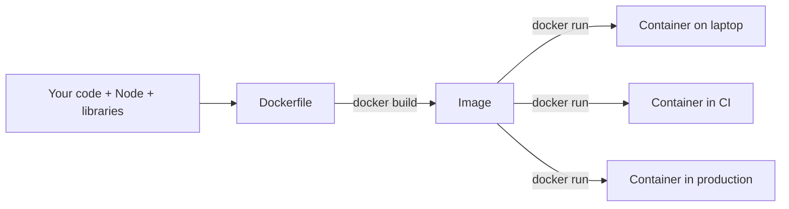
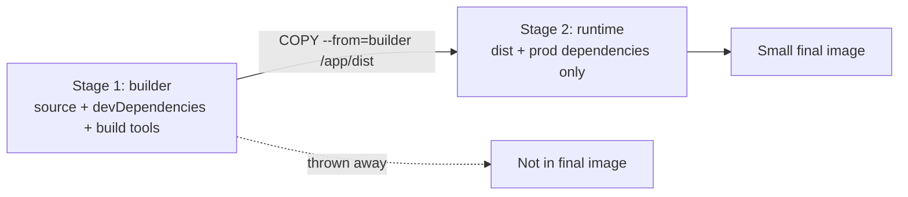
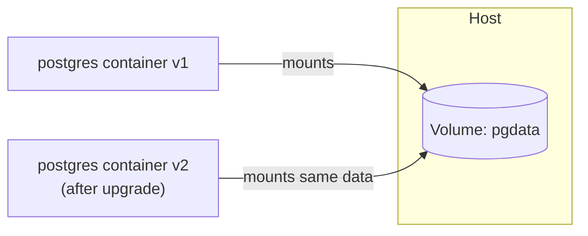
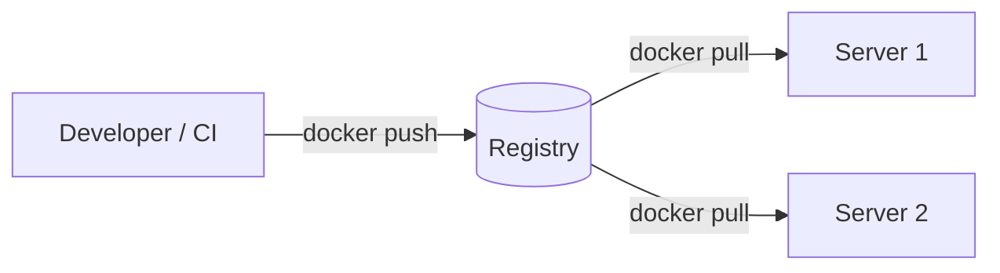

# Docker Interview Questions

---

## What is Docker?

[**Docker**](https://www.docker.com/) is a container platform that developers use to package applications with all their dependencies so they can run smoothly across different environments.

Although containers share the same OS kernel, each one operates in its own isolated environment. This setup minimizes compatibility issues, reduces delays, and improves communication between development, testing, and operations teams.

**The problem it solves:** "It works on my machine." The container carries the app, the runtime, and the libraries, so it runs the same on a laptop, CI, and production.



---

## Image vs Container

- **Image**: a read-only template (a blueprint). Built from a Dockerfile.
- **Container**: a running instance of an image. It adds a thin writable layer on top.

One image can start many containers — like one class creating many objects.

| Image                          | Container                          |
| ------------------------------ | ---------------------------------- |
| Read-only template             | Running (or stopped) instance      |
| Built with `docker build`      | Created with `docker run`          |
| Stored in a registry (Docker Hub, ECR) | Lives on a host machine    |
| Like a **class**               | Like an **object**                 |

```text
          ┌─────────────┐
          │    Image    │   (read-only)
          └──────┬──────┘
       ┌─────────┼─────────┐
       ▼         ▼         ▼
 ┌──────────┐┌──────────┐┌──────────┐
 │Container1││Container2││Container3│  (each has its own writable layer)
 └──────────┘└──────────┘└──────────┘
```

```bash
docker build -t my-app .        # image
docker run -d -p 3000:3000 my-app   # container
docker ps                        # list running containers
docker images                    # list images
```

---

## Container vs Virtual Machine

| Container                               | Virtual Machine                        |
| --------------------------------------- | -------------------------------------- |
| Shares the host OS kernel               | Has its own full guest OS              |
| Starts in seconds (or less)             | Starts in minutes                      |
| Size in MBs                             | Size in GBs                            |
| Process-level isolation                 | Hardware-level isolation (stronger)    |
| Runs on a container runtime (Docker)    | Runs on a hypervisor                   |

```text
        Containers                          Virtual Machines
┌─────┐ ┌─────┐ ┌─────┐            ┌─────────┐ ┌─────────┐
│App A│ │App B│ │App C│            │  App A  │ │  App B  │
│Libs │ │Libs │ │Libs │            │  Libs   │ │  Libs   │
└─────┘ └─────┘ └─────┘            │Guest OS │ │Guest OS │
┌─────────────────────┐            └─────────┘ └─────────┘
│   Docker Engine     │            ┌─────────────────────┐
├─────────────────────┤            │     Hypervisor      │
│     Host OS         │            ├─────────────────────┤
├─────────────────────┤            │     Host OS / HW    │
│     Hardware        │            ├─────────────────────┤
└─────────────────────┘            │     Hardware        │
                                   └─────────────────────┘
```

**Interview line:** containers virtualize the **OS**, VMs virtualize the **hardware**.

---

## What is a Dockerfile?

A text file with step-by-step instructions to build an image.

```dockerfile
FROM node:20-alpine          # base image
WORKDIR /app                 # working directory inside the container
COPY package*.json ./        # copy dependency files first (for caching)
RUN npm ci                   # install dependencies
COPY . .                     # copy the rest of the source code
EXPOSE 3000                  # document the port
CMD ["node", "server.js"]    # default command when the container starts
```

| Instruction | Purpose                                     |
| ----------- | ------------------------------------------- |
| `FROM`      | Base image                                  |
| `WORKDIR`   | Set the working directory                   |
| `COPY`      | Copy files from host into the image         |
| `RUN`       | Run a command **at build time**             |
| `ENV`       | Set an environment variable                 |
| `EXPOSE`    | Document which port the app listens on (does not publish it) |
| `CMD`       | Default command **at run time**             |

---

## Docker Layers and Build Cache

Each instruction in a Dockerfile creates a **layer**. Docker caches layers. If a layer and everything before it did not change, Docker reuses the cache.

**Once one layer changes, every layer after it is rebuilt.** That is why you copy `package.json` and install dependencies **before** copying the source code.

```text
Good order                          Bad order
──────────                          ─────────
FROM node:20-alpine   (cached)      FROM node:20-alpine   (cached)
COPY package*.json    (cached)      COPY . .              (CHANGED - code edited)
RUN npm ci            (cached) ✅    RUN npm ci            (rebuilt) ❌ slow
COPY . .              (rebuilt)     CMD ...               (rebuilt)
CMD ...               (rebuilt)
```

Editing one source file with the bad order reinstalls every dependency.

---

## Multi-Stage Builds

Use one stage to **build** (with compilers, dev dependencies) and a second, small stage to **run** only the output. The final image is much smaller and has less attack surface.

```dockerfile
# Stage 1: build
FROM node:20-alpine AS builder
WORKDIR /app
COPY package*.json ./
RUN npm ci
COPY . .
RUN npm run build

# Stage 2: run
FROM node:20-alpine
WORKDIR /app
COPY package*.json ./
RUN npm ci --omit=dev
COPY --from=builder /app/dist ./dist
CMD ["node", "dist/server.js"]
```



---

## CMD vs ENTRYPOINT

| CMD                                          | ENTRYPOINT                                   |
| -------------------------------------------- | -------------------------------------------- |
| Default command, **easily overridden**       | Fixed executable, **not overridden** by args |
| `docker run img npm test` replaces it        | `docker run img --flag` appends `--flag`     |

When both are used, `CMD` becomes the **default arguments** to `ENTRYPOINT`.

```dockerfile
ENTRYPOINT ["node"]
CMD ["server.js"]
# docker run img            → node server.js
# docker run img worker.js  → node worker.js
```

```text
docker run img [args]
        │
        ▼
ENTRYPOINT  +  (args  OR  CMD if no args)
```

Also: `RUN` executes at **build time**; `CMD`/`ENTRYPOINT` execute at **run time**.

---

## Docker Volumes

A container's filesystem is **lost when the container is removed**. Volumes store data **outside** the container so it survives restarts and removal.

| Type          | Example                                   | Use for                          |
| ------------- | ----------------------------------------- | -------------------------------- |
| Named volume  | `-v pgdata:/var/lib/postgresql/data`      | Databases, persistent data (managed by Docker) |
| Bind mount    | `-v $(pwd):/app`                          | Local development (live code reload) |
| tmpfs         | `--tmpfs /tmp`                            | Temporary in-memory data         |



---

## Docker Networks

Containers on the same user-defined network can reach each other **by container/service name** (built-in DNS).

| Driver   | Meaning                                             |
| -------- | --------------------------------------------------- |
| `bridge` | Default. Private network on one host.               |
| `host`   | Container uses the host's network directly.         |
| `none`   | No networking.                                      |
| `overlay`| Network across multiple hosts (Swarm).              |

```text
          my-network (bridge)
 ┌─────────────────────────────────┐
 │  ┌─────────┐       ┌─────────┐  │
 │  │   api   │──────►│   db    │  │   api connects to "db:5432"
 │  └────┬────┘       └─────────┘  │
 └───────┼─────────────────────────┘
         │ -p 3000:3000
         ▼
   Host port 3000  ◄── browser
```

**Port mapping** `-p 3000:3000` means `hostPort:containerPort`.

---

## Docker Compose

A tool to define and run **multi-container** apps from one YAML file.

```yaml
services:
  api:
    build: .
    ports:
      - "3000:3000"
    environment:
      DATABASE_URL: postgres://postgres:secret@db:5432/app
    depends_on:
      - db
  db:
    image: postgres:16
    environment:
      POSTGRES_PASSWORD: secret
    volumes:
      - pgdata:/var/lib/postgresql/data

volumes:
  pgdata:
```

```bash
docker compose up -d     # start everything
docker compose logs -f   # follow logs
docker compose down      # stop and remove containers
```


**Note:** `depends_on` only controls **start order**, not "database is ready". Use a healthcheck or retry logic for that.

---

## What is .dockerignore?

Like `.gitignore`, but for the build context. Files listed here are **not sent** to Docker during `docker build`.

```text
node_modules
.git
.env
dist
*.log
```

Why it matters:

- **Faster builds** — smaller build context.
- **Smaller images** — no `node_modules` from your machine.
- **Security** — `.env` and secrets never end up in the image.

---

## Docker Registry

A place to store and share images: **Docker Hub**, **AWS ECR**, **GitHub Container Registry**.



---

# Quick Fire Questions

- **Image vs container?** Template vs running instance
- **Does a container have its own kernel?** No, it shares the host kernel
- **RUN vs CMD?** Build time vs run time
- **Where should persistent data go?** A volume
- **How do containers talk to each other?** Same network, by service name
- **Why copy `package.json` first?** Layer caching for dependencies
- **How to make images smaller?** Alpine/slim base, multi-stage build, `.dockerignore`
- **`EXPOSE` publishes the port?** No, only `-p` publishes it
