# AWS Interview Questions

---

## What is AWS?

AWS stands for **Amazon Web Services**. It is a cloud computing platform that provides services like servers, storage, databases, networking, security, monitoring, and machine learning.

| Service | What it does                                                                                       |
| ------- | -------------------------------------------------------------------------------------------------- |
| **EC2** | Provides virtual servers to run your applications                                                  |
| **VPC** | Provides a private virtual network to control traffic, security, and isolation for those servers |

A typical web app on AWS:

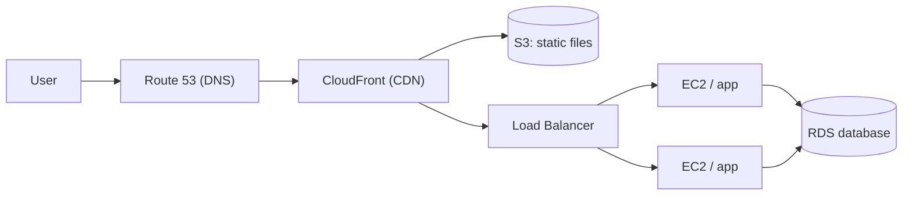

---

## What are Regions and Availability Zones?

- **Region**: a geographic area, for example `us-east-1` (N. Virginia) or `ap-south-1` (Mumbai).
- **Availability Zone (AZ)**: one or more separate data centers inside a region, with their own power and networking.

Deploy across **at least two AZs** so one data center failing does not take your app down.

```text
Region: ap-south-1
┌──────────────────────────────────────────────┐
│  ┌────────────┐  ┌────────────┐  ┌────────────┐
│  │   AZ  a    │  │   AZ  b    │  │   AZ  c    │
│  │ EC2, RDS   │  │ EC2, RDS   │  │   EC2      │
│  │ (primary)  │  │ (standby)  │  │            │
│  └────────────┘  └────────────┘  └────────────┘
└──────────────────────────────────────────────┘
```

---

## What is EC2 (Elastic Compute Cloud)?

1. A service that provides virtual servers in the cloud.
2. These servers are called **instances**.
3. You choose the instance type (CPU/RAM), the OS (via an AMI), storage (EBS), and network (VPC, subnet, security group).

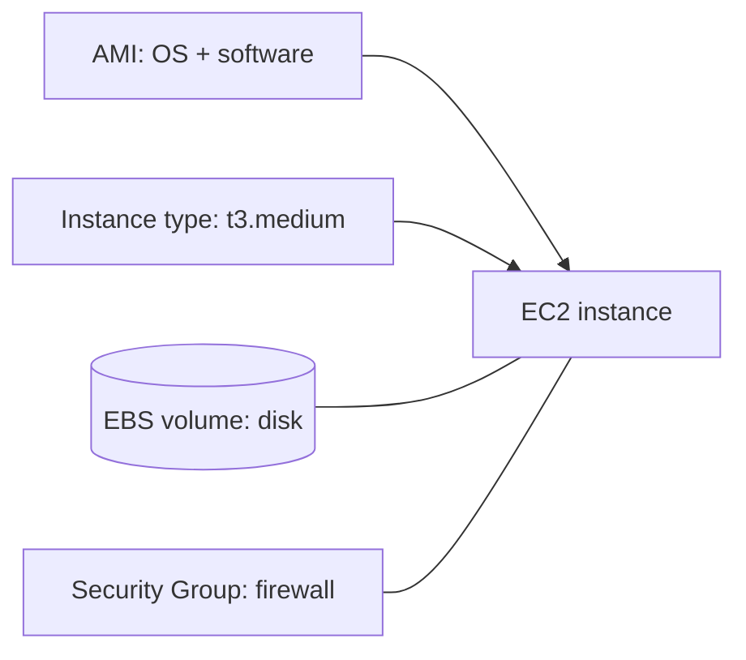

---

## What is an AMI (Amazon Machine Image)?

1. A template used to launch EC2 instances.
2. It contains the operating system, software, configuration, and application setup.

```text
AMI (template) ──launch──► EC2 instance 1
               ──launch──► EC2 instance 2
               ──launch──► EC2 instance 3
```

---

## What is the difference between stopping & terminating an EC2 instance?

1. When you **stop** an EC2 instance, it is shut down but can be started again later. EBS root volume data is kept. Data on **instance store** volumes is lost, and the public IP usually changes (use an Elastic IP to keep it). You are not charged for compute while stopped, but you still pay for EBS storage.
2. When you **terminate** an EC2 instance, it is permanently deleted. By default the EBS root volume is deleted too.

```text
running ──stop──► stopped ──start──► running
   │                 │
   └───terminate─────┴──► terminated (gone for good)
```

---

## What is a Security Group?

1. A **Security Group** acts like a virtual firewall for EC2 instances.
2. It controls inbound and outbound traffic. Security Groups are **stateful**, meaning return traffic is automatically allowed.
3. Security Groups have **allow rules only** (no deny rules).

```text
Internet
   │  port 443 ✅  (rule: allow 443 from 0.0.0.0/0)
   │  port 22  ❌  (only allowed from your IP)
   ▼
┌──────── Security Group ────────┐
│          EC2 instance          │
└────────────────────────────────┘
```

**Security Group vs NACL:** a Security Group works at the **instance** level and is stateful. A Network ACL works at the **subnet** level, is **stateless**, and supports both allow and deny rules.

---

## What is EBS (Elastic Block Store)?

1. A block storage used with EC2 instances.
2. It works like a hard disk attached to a virtual server.
3. An EBS volume lives in **one AZ** and is normally attached to one instance at a time.

---

## What is S3 (Simple Storage Service)?

1. An object storage used to store files such as images, videos, backups, logs, and static website content.
2. Files (objects) are stored in **buckets** and accessed by a **key** (path).
3. Highly durable (designed for 99.999999999%) and practically unlimited in size.

```text
Bucket: my-app-uploads
├── users/42/avatar.png      ← key = "users/42/avatar.png"
├── invoices/2026/01.pdf
└── backups/db-2026-10-01.sql
```

---

## What is the difference between S3 and EBS?

| **S3**                                      | **EBS**                   |
| ------------------------------------------- | ------------------------- |
| Object storage                              | Block storage             |
| Used for files, backups, and static content | Used like a disk drive    |
| Independent storage, accessed over HTTP     | Attached to EC2 instances |
| Regional, practically unlimited             | One AZ, fixed size you choose |

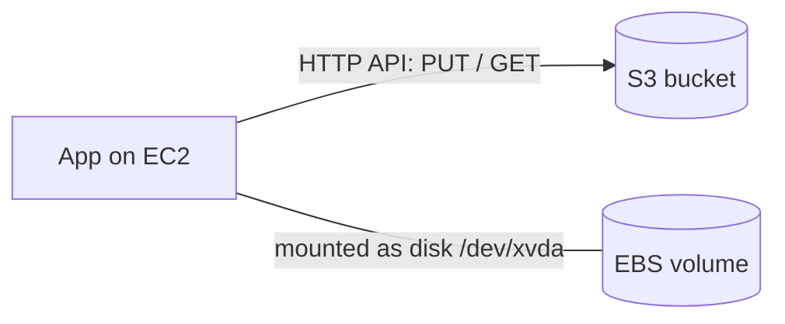

---

## What is a presigned URL in S3?

A **temporary URL** that lets someone upload or download a private S3 object **without AWS credentials**. It expires after a set time.

Common use: let the browser upload a file **directly to S3**, so the file never passes through your server.

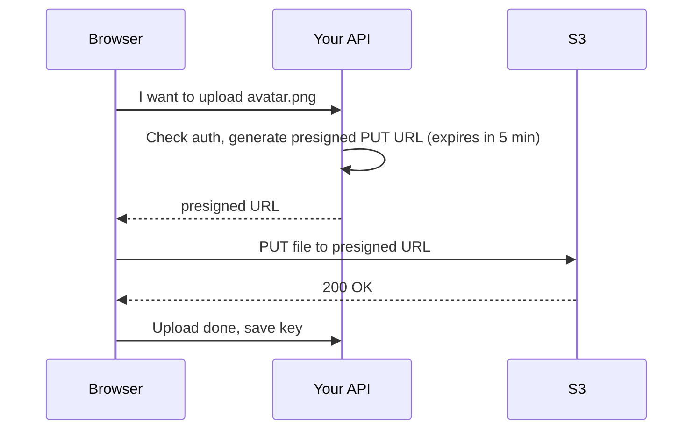

```javascript
import { S3Client, PutObjectCommand } from '@aws-sdk/client-s3';
import { getSignedUrl } from '@aws-sdk/s3-request-presigner';

const s3 = new S3Client({ region: 'ap-south-1' });
const command = new PutObjectCommand({ Bucket: 'my-app-uploads', Key: 'users/42/avatar.png' });
const url = await getSignedUrl(s3, command, { expiresIn: 300 });
```

---

## What is IAM (Identity and Access Management)?

1. Used to manage users, roles, permissions, and access to AWS resources.

| Term       | Meaning                                                                 |
| ---------- | ----------------------------------------------------------------------- |
| **User**   | A person or app with long-term credentials                              |
| **Group**  | A collection of users sharing the same permissions                      |
| **Role**   | A set of permissions that a service or user **assumes** temporarily (no long-term keys) |
| **Policy** | A JSON document that says what is allowed or denied                     |

```json
{
  "Version": "2012-10-17",
  "Statement": [
    {
      "Effect": "Allow",
      "Action": ["s3:GetObject", "s3:PutObject"],
      "Resource": "arn:aws:s3:::my-app-uploads/*"
    }
  ]
}
```

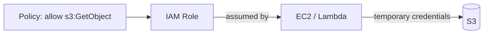

**Best practices:**

- **Least privilege** — grant only what is needed.
- Give EC2/Lambda a **role**, never hardcode access keys in code.
- Enable **MFA**, and don't use the root account for daily work.
- An explicit **Deny** always wins over an Allow.

---

## What is a VPC?

A **VPC**, or Virtual Private Cloud, is a private network inside AWS where you can launch resources like EC2 instances, databases, and load balancers.

---

## What is the difference between a public subnet and private subnet?

1. A **public subnet** has a route to the internet through an **Internet Gateway**.
2. A **private subnet** does not have direct internet access. It is usually used for databases or backend servers. It can reach the internet for updates through a **NAT Gateway** (outbound only).

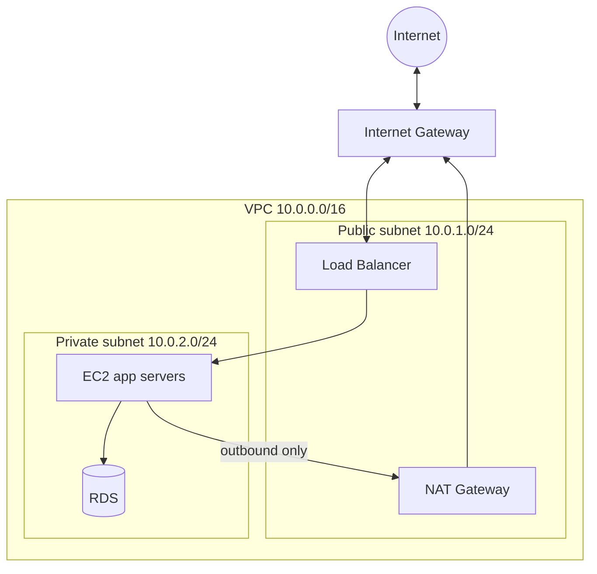

---

## What is the difference between EC2 and VPC?

| <br>          | **Amazon EC2**                                     | **Amazon VPC**                                     |
| ------------- | -------------------------------------------------- | -------------------------------------------------- |
| What it is    | A virtual server (compute resource)                | A virtual network (networking resource)            |
| Primary Job   | Run applications, process data, and host websites. | Control network traffic, security, and isolation.  |
| Configuration | OS, CPU, memory, and storage type.                 | IP addresses, subnets, route tables, and gateways. |

```text
VPC  = the building (network, doors, rooms)
EC2  = the computers placed inside the rooms
```

---

## What is Route 53?

**Route 53** is AWS's DNS service. It is used to register domain names, route traffic, and manage DNS records.

```text
User types myapp.com
      │
      ▼
Route 53:  myapp.com  →  A / ALIAS record  →  Load Balancer / CloudFront
      │
      ▼
Request reaches your app
```

---

## What is CloudFront?

1. **CloudFront** is a Content Delivery Network, or CDN.
2. It delivers content like images, videos, APIs, and websites faster by caching them at edge locations close to users.

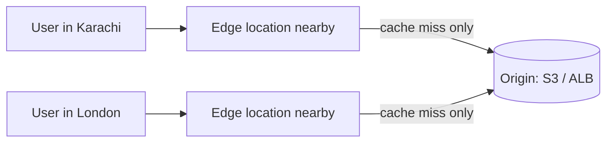

On a **cache hit**, the edge responds directly. On a **miss**, it fetches from the origin once and caches the result.

---

## What is a Load Balancer?

A **Load Balancer** distributes incoming traffic across multiple servers. It improves application availability, performance, and fault tolerance. It also runs **health checks** and stops sending traffic to unhealthy instances.

AWS provides mainly these load balancers:

1. **Application Load Balancer** — used for HTTP and HTTPS traffic (Layer 7, can route by path or host).
2. **Network Load Balancer** — used for high-performance TCP/UDP traffic (Layer 4).
3. **Gateway Load Balancer** — used for security appliances like firewalls.

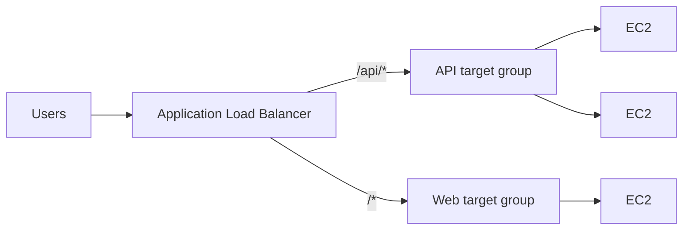

---

## What is Auto Scaling?

**Auto Scaling** automatically increases or decreases the number of EC2 instances based on traffic or demand. It helps maintain performance and reduce cost.

You set **min**, **desired**, and **max** instances, plus a rule such as "keep average CPU at 50%". Auto Scaling registers new instances with the load balancer automatically.

```text
CPU > 70%  →  scale OUT  →  add instance   [EC2][EC2][EC2][+EC2]
CPU < 30%  →  scale IN   →  remove instance [EC2][EC2]

min = 2   desired = 3   max = 10
```

---

## What is the difference between horizontal and vertical scaling?

**Horizontal scaling** means adding more servers.
Example: Adding more EC2 instances behind a Load Balancer.

**Vertical scaling** means increasing the size of one server.
Example: Changing an EC2 instance from t3.medium to t3.large.

```text
Vertical (scale up)          Horizontal (scale out)
┌──────┐      ┌──────────┐   ┌────┐     ┌────┐┌────┐┌────┐
│ 2 CPU│  →   │  8 CPU   │   │ S1 │  →  │ S1 ││ S2 ││ S3 │
└──────┘      └──────────┘   └────┘     └────┘└────┘└────┘
Has a hardware limit,         No hard limit, needs a load
usually needs a restart       balancer and stateless servers
```

---

## What is RDS (Relational Database Service)?

1. A managed relational database service.
2. It supports databases like MySQL, PostgreSQL, MariaDB, Oracle, SQL Server, and Amazon Aurora.
3. AWS manages backups, patching, monitoring, and high availability.

---

## What is Multi-AZ in RDS?

1. **Multi-AZ** means the database has a standby copy in another Availability Zone.
2. If the primary database fails, AWS automatically fails over to the standby database.
3. It is used for high availability. The standby does **not** serve read traffic (in the classic Multi-AZ setup).

## What is a Read Replica?

1. A **Read Replica** is a copy of a database used to handle read traffic.
2. It improves performance by reducing load on the primary database.
3. Replication is **asynchronous**, so replicas can be slightly behind the primary.

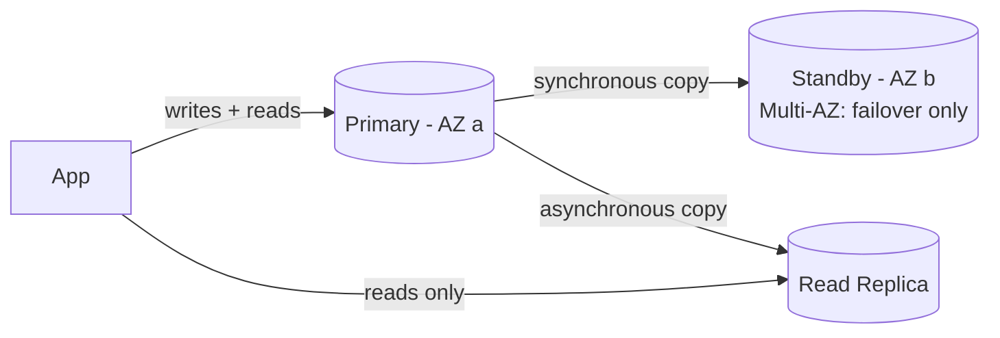

| Multi-AZ                      | Read Replica                     |
| ----------------------------- | -------------------------------- |
| For **availability**          | For **read performance**         |
| Synchronous replication       | Asynchronous replication         |
| Automatic failover            | Manual promotion if needed       |

---

## What is DynamoDB?

1. **DynamoDB** is a fully managed NoSQL database service (key-value and document).
2. It is used for applications that need high performance, low latency, & automatic scaling.
3. Every item needs a **partition key** (and optionally a **sort key**). Queries should be designed around those keys.

---

## What is the difference between RDS and DynamoDB?

| <br>      | **Amazon RDS**                                | **Amazon DynamoDB**                                      |
| --------- | --------------------------------------------- | -------------------------------------------------------- |
| Type      | Relational (SQL)                              | Non-relational (NoSQL)                                   |
| Structure | Tables, rows, columns with a fixed schema     | Items with a required primary key; other attributes are flexible |
| Scaling   | Mostly vertical, plus read replicas           | Horizontal, automatic                                    |
| Queries   | Joins, complex queries, transactions          | Fast lookups by key; no joins                            |
| Use       | Complex queries and relationships             | Fast, scalable key-based access at any scale             |

```text
Need joins / reports / strong relations?   → RDS
Known access patterns, huge scale, low ms? → DynamoDB
```

---

## What is AWS Lambda?

1. **AWS Lambda** is a serverless compute service.
2. You upload code, and AWS runs it automatically when triggered. You do not need to manage servers.
3. You pay per request and per execution time. Max run time is **15 minutes** per invocation.

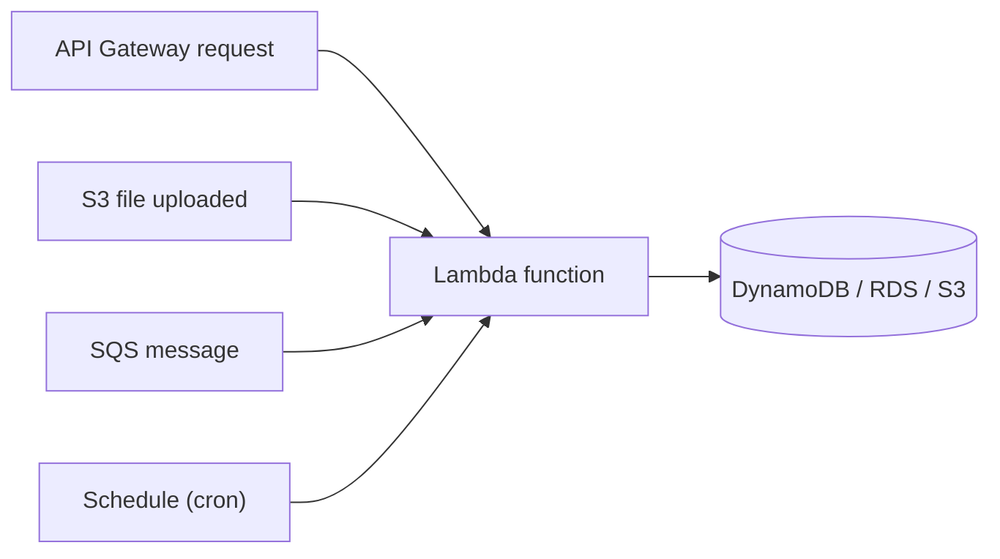

---

## What is the difference between EC2 and Lambda?

| <br>     | **EC2**                                  | **Lambda**                                         |
| -------- | ---------------------------------------- | -------------------------------------------------- |
| Type     | Virtual Machines (IaaS)                  | Serverless Functions (FaaS)                        |
| Control  | Full root access to OS                   | No OS access (code-only)                           |
| Running  | Always on (you pay while it runs)        | Runs only when triggered (pay per use)             |
| Duration | Unlimited                                | Max 15 minutes per invocation                      |
| State    | Disk persists on EBS                     | Stateless — don't rely on local data between calls (`/tmp` is temporary) |

---

## What are Lambda cold starts?

1. A **cold start** happens when Lambda takes extra time to initialize a new execution environment before running the function.
2. It usually happens when the function has not been used recently or when scaling up.
3. Reduce it with smaller bundles, fewer dependencies, initializing clients outside the handler, or **provisioned concurrency**.

```text
Cold:  [create environment][load code][init]  →  [run handler]   (slower)
Warm:                                           [run handler]   (fast, reuses environment)
```

---

## What is the difference between SQS and SNS?

| **SQS** (Simple Queue Service)                  | **SNS** (Simple Notification Service)            |
| ----------------------------------------------- | ------------------------------------------------ |
| Queue — **pull** model                          | Pub/sub — **push** model                         |
| One message is processed by **one** consumer    | One message is delivered to **many** subscribers |
| Messages wait until a worker reads them         | Messages are pushed immediately                  |
| Good for background jobs, buffering spikes      | Good for fan-out, alerts, notifications          |

Common pattern — **fan-out**: SNS sends one event to several SQS queues, each processed independently.

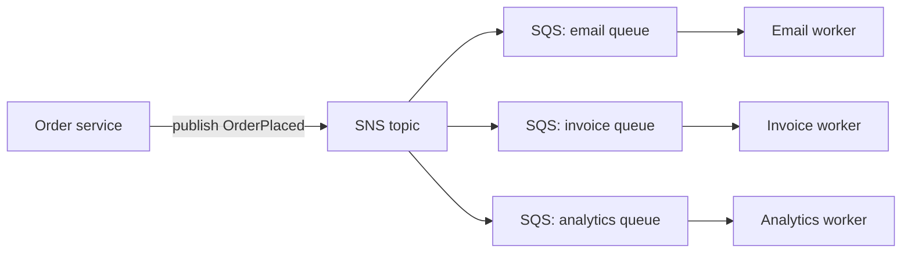

---

## What is CloudWatch?

1. **CloudWatch** is a monitoring service in AWS.
2. It collects metrics, logs, alarms, and events from AWS resources and applications.

```text
EC2 CPU metric ──► CloudWatch ──► Alarm (CPU > 80%) ──► SNS email / Auto Scaling
App logs       ──► CloudWatch Logs ──► search & dashboards
```

---

## What is the difference between CloudWatch and CloudTrail?

**CloudWatch** is used for monitoring performance, logs, and alarms ("**how** is my system doing?").

**CloudTrail** records AWS account activity and API calls. It is mainly used for auditing, compliance, and security investigation ("**who** did **what**, and when?").

---

## How do you manage secrets in AWS?

1. Secrets should be stored in **AWS Secrets Manager** or **Systems Manager Parameter Store**.
2. They should not be hardcoded in code or stored in plain text.
3. **AWS Secrets Manager** stores and manages sensitive information like database passwords, API keys, and credentials. It can also rotate secrets automatically.

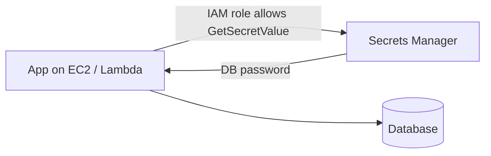

---

## What is blue-green deployment?

Blue-green deployment uses two environments:

- **Blue** is the current production environment.
- **Green** is the new version.

Traffic is shifted from blue to green after testing. This reduces downtime and rollback risk. To roll back, switch traffic back to blue.

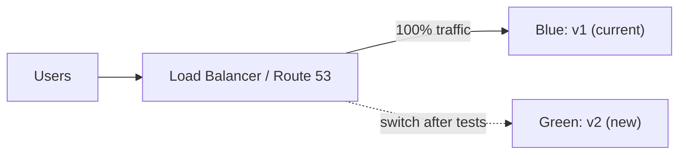

---

## What is CloudFormation?

**CloudFormation** is an Infrastructure as Code service.
It allows you to define AWS resources using YAML or JSON templates.

## What is Terraform?

1. **Terraform** is an Infrastructure as Code tool used to create and manage cloud resources.
2. Unlike CloudFormation, Terraform supports multiple cloud providers, not only AWS.

```text
template.yaml / main.tf  ──apply──►  VPC + EC2 + RDS + S3 created
(versioned in Git)                   (same result every time)
```

---

# Quick Fire Questions

- **Region vs AZ?** Geographic area vs isolated data center inside it
- **Security Group stateful or stateless?** Stateful (NACL is stateless)
- **S3 vs EBS?** Object storage over HTTP vs disk attached to EC2
- **How to give EC2 access to S3?** Attach an IAM role, not access keys
- **Private subnet internet access?** Outbound only via NAT Gateway
- **Multi-AZ vs Read Replica?** Availability vs read scaling
- **Lambda max timeout?** 15 minutes
- **SQS vs SNS?** Queue (one consumer) vs pub/sub (many subscribers)
- **Upload large files from browser?** Presigned S3 URL
- **CloudWatch vs CloudTrail?** Monitoring vs auditing API calls

---

# Rarely Asked (Lower Priority)

## What is KMS?

1. **KMS**, or Key Management Service, is used to create and manage encryption keys.
2. It helps encrypt data stored in services like S3, EBS, RDS, and Secrets Manager.

## What is the difference between KMS and Secrets Manager?

| <br>                    | KMS                               | Secrets Manager                            |
| ----------------------- | --------------------------------- | ------------------------------------------ |
| **What it protects**    | Cryptographic data keys           | Passwords, tokens, credentials             |
| **Data Storage**        | No (only holds mathematical keys) | Yes (stores strings/JSON payload)          |
| **Rotation Capability** | Rotates back-end key material     | Rotates actual application credentials     |
| **Cross-Region Sync**   | Multi-region keys available       | Built-in secret replication across regions |

## What is disaster recovery in AWS?

Disaster recovery means designing systems so they can recover after failure.
Common AWS disaster recovery strategies include (cheapest/slowest → most expensive/fastest):

1. Backup and restore
2. Pilot light
3. Warm standby
4. Multi-site active-active

## What are RTO and RPO?

**RTO**, or Recovery Time Objective, is the maximum acceptable downtime after a failure.
**RPO**, or Recovery Point Objective, is the maximum acceptable data loss measured in time.
Example: If RPO is 15 minutes, the business can tolerate losing up to 15 minutes of data.

```text
 last backup        failure            back online
      │◄──── RPO ────►│◄──── RTO ────►│
      │  (data lost)  │  (downtime)   │
```

## What is CodePipeline?

1. **CodePipeline** is a CI/CD service used to automate software release pipelines.
2. It can connect source code, build, test, and deployment stages.

## What is CodeBuild?

1. **CodeBuild** is a managed build service.
2. It compiles source code, runs tests, and creates deployable artifacts.

## What is CodeDeploy?

**CodeDeploy** automates application deployment to EC2, Lambda, ECS, or on-premises servers.
It supports deployment strategies like rolling and blue-green deployments.

```text
GitHub ──► CodePipeline ──► CodeBuild (build + test) ──► CodeDeploy ──► EC2 / ECS / Lambda
```
