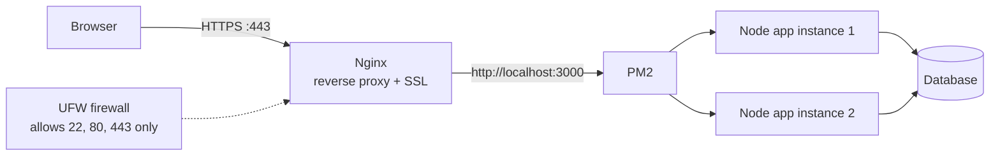
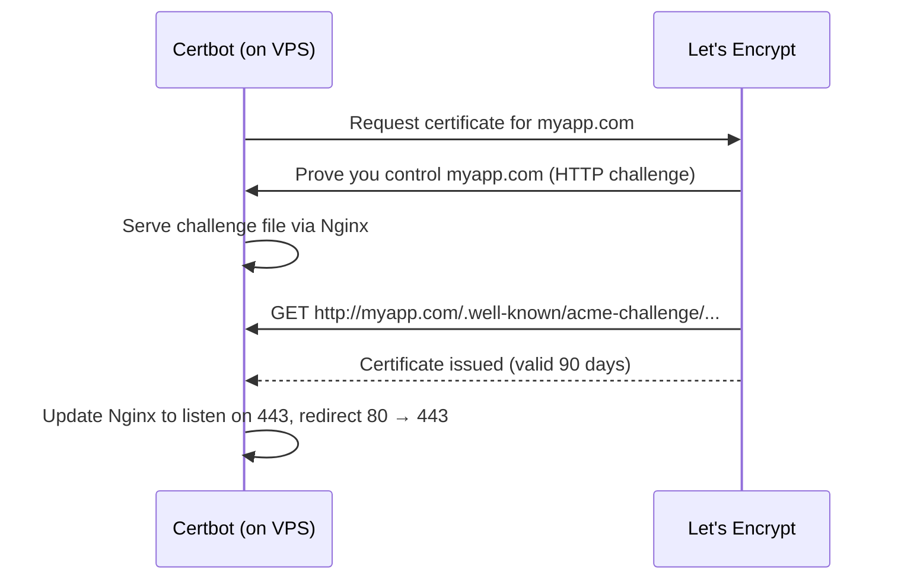
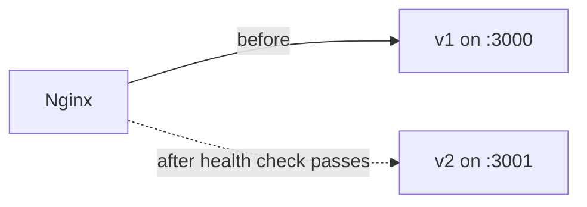

# VPS Interview

## VPS (Virtual Private Server)

A **VPS (Virtual Private Server)** is a virtual server created by dividing a physical server into multiple isolated virtual servers using **virtualization**.

### Key Points

* **Virtual Machine:** A software-based emulation of a physical computer.
* **Runs on Physical Servers:** A VPS runs on underlying physical server hardware.
* **Created by Virtualization:** A **hypervisor** partitions a physical server into multiple virtual servers.
* **Full Control:** You typically get **root access** to configure and manage the server.
* **Resources:** A VPS is allocated resources such as **CPU, RAM, and storage**.

### Simple Architecture

```text
┌──────────────────────────────────────────┐
│           Physical Server               │
│                                          │
│              Hypervisor                  │
│                                          │
│  ┌──────────┐ ┌──────────┐ ┌──────────┐ │
│  │   VPS 1  │ │   VPS 2  │ │   VPS 3  │ │
│  │          │ │          │ │          │ │
│  │ CPU/RAM  │ │ CPU/RAM  │ │ CPU/RAM  │ │
│  │ Storage  │ │ Storage  │ │ Storage  │ │
│  └──────────┘ └──────────┘ └──────────┘ │
│                                          │
└──────────────────────────────────────────┘
```

### Interview Answer

> **A VPS is a virtual server hosted on a physical server. A hypervisor divides the physical server's resources into multiple isolated virtual machines. Each VPS gets its own allocated CPU, RAM, and storage, and usually provides root access so you can install and configure your software and services.**

---

## Shared Hosting vs VPS vs Dedicated Server vs Cloud

| Type               | What you get                                   | Control | Cost   | Good for                         |
| ------------------ | ---------------------------------------------- | ------- | ------ | -------------------------------- |
| Shared hosting     | Space on a server shared with many sites       | Low     | Lowest | Small static/WordPress sites     |
| VPS                | Your own virtual machine with fixed resources  | Full (root) | Low–medium | Node/Next apps, APIs, side projects |
| Dedicated server   | A whole physical machine                       | Full    | High   | Heavy, predictable workloads     |
| Cloud (EC2, etc.)  | VMs plus managed services and auto scaling     | Full    | Pay per use | Apps that need to scale       |

```text
Shared hosting:   [site A | site B | site C | site D]  ← one server, shared everything
VPS:              [ VPS 1 ][ VPS 2 ][ VPS 3 ]          ← one server, isolated slices
Dedicated:        [         your server         ]      ← whole machine is yours
```

---

## How do you deploy a Node.js app on a VPS?

Typical production setup on a single VPS:



Steps:

1. Create the VPS and log in with an **SSH key**.
2. Create a non-root user, update packages, enable the **firewall**.
3. Install Node.js, Git, Nginx, PM2.
4. Clone the repo, install dependencies, build, set environment variables.
5. Start the app with **PM2**.
6. Configure **Nginx** as a reverse proxy to the app's port.
7. Point the domain's DNS **A record** to the VPS IP.
8. Add **SSL** with Let's Encrypt (Certbot).

---

## What is a Reverse Proxy (Nginx)?

A **reverse proxy** sits in front of your app servers and forwards client requests to them. The client only talks to Nginx; it never sees the app directly.

**Why use Nginx in front of Node:**

- **SSL termination** — handles HTTPS so the app stays on plain HTTP internally.
- **Serve static files** fast.
- **Load balancing** across multiple app instances.
- **Hide internal ports** — the app on port 3000 is not exposed to the internet.
- Gzip compression, caching, request size limits, rate limiting.

```nginx
server {
    listen 80;
    server_name myapp.com www.myapp.com;

    location / {
        proxy_pass http://localhost:3000;
        proxy_http_version 1.1;
        proxy_set_header Host $host;
        proxy_set_header X-Real-IP $remote_addr;
        proxy_set_header X-Forwarded-For $proxy_add_x_forwarded_for;
        proxy_set_header X-Forwarded-Proto $scheme;
        proxy_set_header Upgrade $http_upgrade;
        proxy_set_header Connection "upgrade";
    }
}
```

```text
Forward proxy:  Client ──► Proxy ──► Internet      (hides the CLIENT, e.g. VPN)
Reverse proxy:  Internet ──► Proxy ──► App servers (hides the SERVERS, e.g. Nginx)
```

---

## How do you add SSL (HTTPS) with Let's Encrypt?

**Let's Encrypt** is a free certificate authority. **Certbot** gets the certificate, edits the Nginx config, and sets up automatic renewal (certificates last **90 days**).

```bash
sudo apt install certbot python3-certbot-nginx
sudo certbot --nginx -d myapp.com -d www.myapp.com
sudo certbot renew --dry-run   # test auto-renewal
```



The domain's DNS must already point to the VPS, and port 80 must be open, for the HTTP challenge to work.

---

## What is PM2?

**PM2** is a process manager for Node.js in production.

- **Restarts** the app automatically if it crashes.
- **Starts on boot** after a server reboot.
- **Cluster mode** — runs one instance per CPU core.
- Logs and monitoring (`pm2 logs`, `pm2 monit`).
- **Zero-downtime reload** in cluster mode (`pm2 reload`).

```bash
pm2 start dist/server.js --name api -i max   # cluster mode, one per core
pm2 save                                     # remember the process list
pm2 startup                                  # start PM2 on boot
pm2 reload api                               # zero-downtime reload
pm2 logs api
```

```text
            PM2 (cluster mode, 4 cores)
   ┌──────────┬──────────┬──────────┬──────────┐
   │ worker 1 │ worker 2 │ worker 3 │ worker 4 │   all share port 3000
   └──────────┴──────────┴──────────┴──────────┘
   worker crashes → PM2 restarts it automatically
```

---

## How do you secure a VPS?

1. **SSH keys only** — disable password login and root login.
2. **Firewall** — allow only the ports you need (22, 80, 443).
3. Use a **non-root user** with `sudo`.
4. Keep packages **updated** (enable unattended security upgrades).
5. **Fail2ban** — bans IPs after repeated failed logins.
6. Don't expose the database port publicly; bind it to `localhost` or a private network.
7. Store secrets in environment variables or a `.env` file outside the repo, with strict file permissions.

```bash
# /etc/ssh/sshd_config
PasswordAuthentication no
PermitRootLogin no

# Firewall
sudo ufw allow OpenSSH
sudo ufw allow 'Nginx Full'   # 80 + 443
sudo ufw enable
```

```text
Internet
   │
   ▼
┌──────────── UFW firewall ────────────┐
│  22  ✅ (SSH key only)                │
│  80  ✅ → redirect to 443             │
│  443 ✅ → Nginx                        │
│  3000 ❌  5432 ❌  27017 ❌            │
└──────────────────────────────────────┘
```

**How SSH key login works:** you keep the **private key** on your machine; the **public key** is placed in `~/.ssh/authorized_keys` on the server. The server checks that you own the matching private key — no password is sent.

---

## How do you do a zero-downtime deployment on a VPS?

The goal: users never see an error while the new version starts.

**Option 1 — PM2 reload (simple):** `pm2 reload` restarts cluster workers **one at a time**, so some workers always serve traffic.

**Option 2 — release folders + symlink:** build the new version in a new folder, then switch a symlink and reload.

```text
/var/www/app/
├── releases/
│   ├── 2026-09-30/
│   └── 2026-10-01/   ← new build, dependencies installed, tested
└── current -> releases/2026-10-01   ← switch symlink, then pm2 reload
```

**Option 3 — blue-green on two ports:** run the new version on port 3001, health-check it, switch Nginx `proxy_pass`, then `nginx -s reload` (Nginx reloads gracefully without dropping connections).



Typical deploy script (CI or manual):

```bash
git pull
npm ci
npm run build
pm2 reload api   # workers restart one by one
```

Run database migrations in a **backward-compatible** way, so the old and new versions can both run during the switch.
