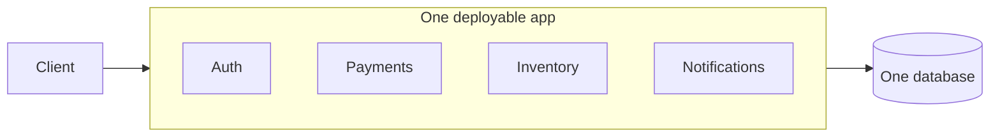
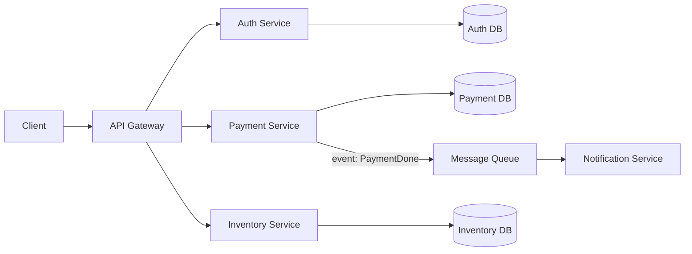
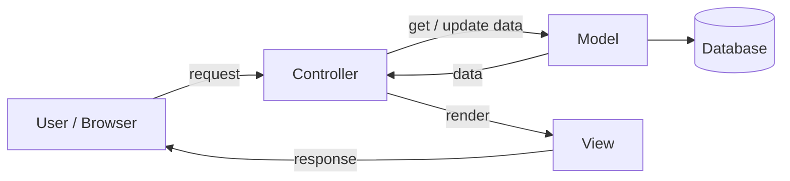
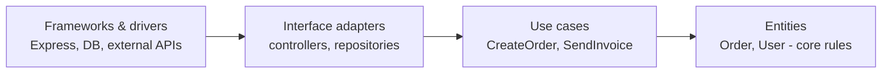
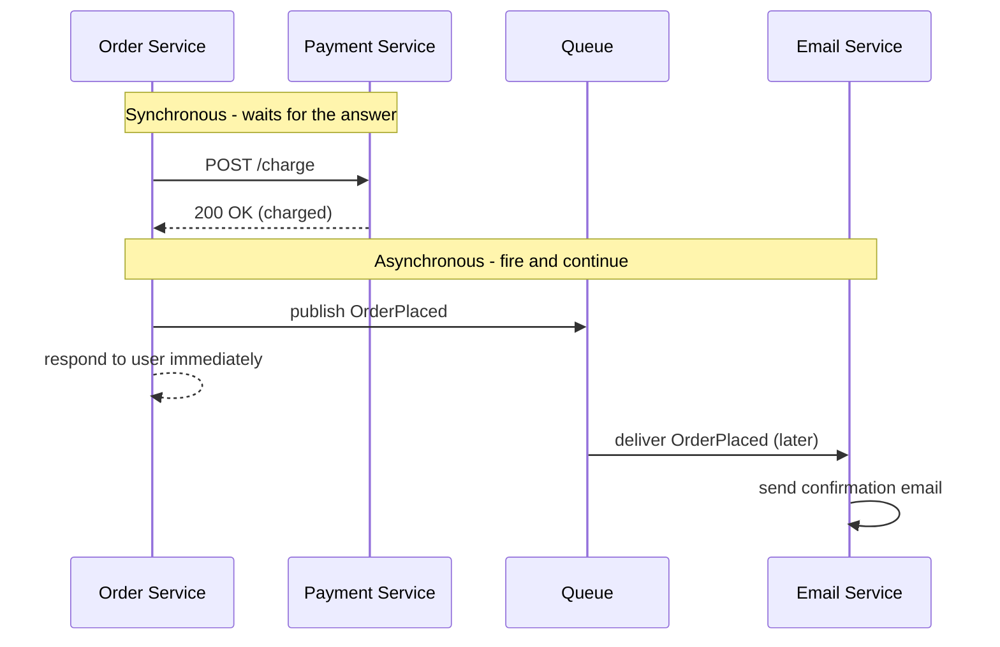
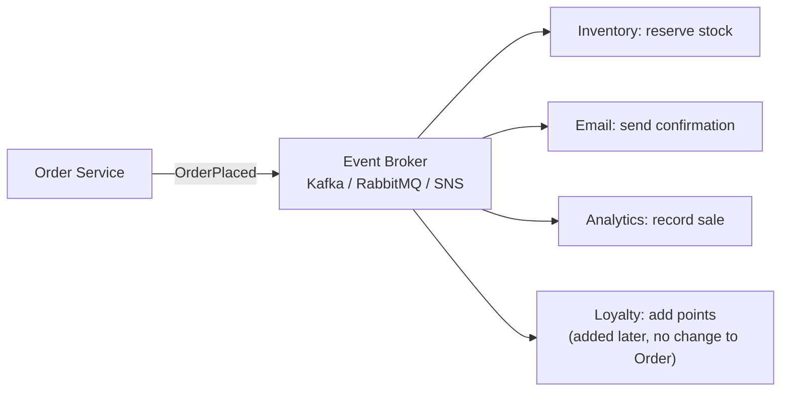
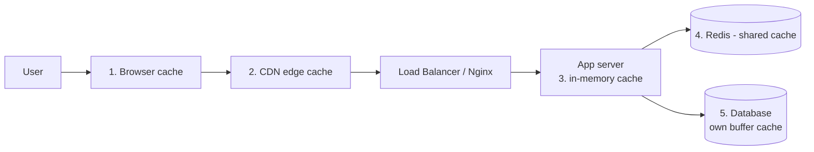

# Architecture Interview Questions

---

# Deployment

## Monolith

**Monolith** means your entire application—the frontend, backend, database logic, and background jobs—is built, compiled, and deployed as **one single unit**.



## Microservices

**Microservices** break a monolith down into a collection of **small, independent applications** that communicate with each other over the network using **HTTP, REST, or message queues**.

Each service typically handles a specific business feature, for example:

* **Auth Service**
* **Payment Service**
* **Inventory Service**
* **Notification Service**

Each service is deployed on its own and usually **owns its own database**.



## Monolith vs Microservices

| Monolith                                   | Microservices                                       |
| ------------------------------------------ | --------------------------------------------------- |
| One codebase, one deployment               | Many small services, deployed independently         |
| Simple to build, test, and debug at first  | More complex: network calls, tracing, many deployments |
| Scale the **whole** app                    | Scale **only** the busy service                     |
| One bug or bad deploy can take down everything | Failures can be isolated to one service         |
| In-process function calls (fast)           | Network calls (slower, can fail)                    |
| One tech stack                             | Each service can use a different stack              |
| Best for small teams and new products      | Best for large teams and large, mature systems      |

**Interview answer:** start with a **well-structured monolith** (a "modular monolith"). Split out a service only when there is a real reason — a part that needs to scale separately, or a team that needs to deploy independently.

---

# Code Management

## Monorepo

**Monorepo** means all projects, services, and shared packages live in **one single Git repository**.

### Example

```text
my-company/
├── apps/
│   ├── frontend/
│   ├── auth-service/
│   ├── payment-service/
│   └── inventory-service/
├── packages/
│   ├── ui/
│   └── shared/
└── package.json
```

## Polyrepo

**Polyrepo** means each project or service has its **own separate Git repository**.

### Example

```text
GitHub
├── frontend-repo
├── auth-service-repo
├── payment-service-repo
├── inventory-service-repo
└── shared-package-repo
```

## Monorepo vs Polyrepo

| Monorepo                                         | Polyrepo                                       |
| ------------------------------------------------ | ---------------------------------------------- |
| Shared code is imported directly                 | Shared code is published as a package and versioned |
| One PR can change several apps at once           | A cross-project change needs several PRs       |
| Needs tooling to build only what changed         | Each repo has its own simple CI                |
| Consistent tooling and versions                  | Each team picks its own setup                  |

## Management Tools

Popular tools for managing monorepos include:

* **Nx**
* **Turborepo**

They build and test **only the affected projects** and cache results.

---

# Code Architecture

## What is MVC?

**MVC (Model–View–Controller)** splits an app into three parts:

- **Model** — data and business rules (e.g. `User`, database access).
- **View** — what the user sees (HTML template, or JSON in an API).
- **Controller** — receives the request, calls the model, returns the view.



Express example:

```javascript
// routes: GET /users/:id → controller
router.get('/users/:id', userController.getUser);

// controller
async function getUser(req, res) {
  const user = await User.findById(req.params.id); // model
  res.json(user); // view (JSON)
}
```

---

## What is Layered (N-Tier) Architecture?

Code is organized into layers. Each layer only talks to the layer directly below it.

| Layer                 | Responsibility                                   |
| --------------------- | ------------------------------------------------ |
| **Route / Controller**| HTTP: parse request, validate, send response     |
| **Service**           | Business logic                                   |
| **Repository / DAO**  | Database queries                                 |
| **Database**          | Storage                                          |

```text
HTTP request
     │
     ▼
┌───────────────┐
│  Controller   │  validate input, call service, shape response
└──────┬────────┘
       ▼
┌───────────────┐
│   Service     │  business rules (no req/res, no SQL)
└──────┬────────┘
       ▼
┌───────────────┐
│  Repository   │  queries only
└──────┬────────┘
       ▼
   Database
```

**Why:** business logic can be tested without HTTP or a real database, and changing the database only affects the repository layer.

---

## What is Clean Architecture?

The core idea: **dependencies point inward**. Business rules (entities, use cases) are in the center and know nothing about frameworks, databases, or HTTP. Outer layers depend on inner layers — never the opposite.



The use case defines an **interface** (e.g. `OrderRepository`), and the outer layer provides the implementation (e.g. `PostgresOrderRepository`). This is **dependency inversion**. You could swap Postgres for MongoDB without touching business logic.

---

# Communication

## REST vs GraphQL

| REST                                              | GraphQL                                          |
| ------------------------------------------------- | ------------------------------------------------ |
| Many endpoints (`/users`, `/users/1/posts`)       | One endpoint (`/graphql`)                        |
| Server decides the response shape                 | Client asks for exactly the fields it needs      |
| Can **over-fetch** (too much data) or **under-fetch** (needs several calls) | One request, exact data           |
| Easy HTTP caching (GET + URL)                     | Caching is harder (usually POST to one URL)      |
| Simple, widely understood                         | Schema + types, more setup, N+1 risk in resolvers |

```text
REST — 3 requests:
  GET /users/1
  GET /users/1/posts
  GET /users/1/followers

GraphQL — 1 request:
  query {
    user(id: 1) {
      name
      posts { title }
      followers { name }
    }
  }
```

**When to choose:** REST for simple CRUD APIs and public APIs. GraphQL when many different clients (web, mobile) need different shapes of the same data.

---

## Synchronous vs Asynchronous Communication

- **Synchronous**: the caller sends a request and **waits** for the response (HTTP/REST, gRPC).
- **Asynchronous**: the caller sends a message to a **queue/broker** and continues; another service processes it later (RabbitMQ, Kafka, SQS).



| Synchronous                                  | Asynchronous                                      |
| -------------------------------------------- | ------------------------------------------------- |
| Simple, immediate result                     | Caller doesn't wait — faster response             |
| If the other service is down, the call fails | Messages wait in the queue until the service is back |
| Services are tightly coupled                 | Services are loosely coupled                      |
| Use when you **need the answer now** (payment check) | Use for work that can happen later (emails, reports) |

---

## What is Event-Driven Architecture?

Services communicate by **publishing events** ("something happened") instead of calling each other directly. Other services **subscribe** to the events they care about.

The publisher doesn't know who listens. Adding a new feature means adding a new subscriber — the publisher doesn't change.



**Pros:** loose coupling, easy to extend, absorbs traffic spikes.
**Cons:** harder to debug and trace, **eventual consistency**, must handle duplicate events (make consumers **idempotent**).

---

# What is an API Gateway?

An **API Gateway** is a single entry point that acts as the **front door** for your entire backend system.

Instead of clients communicating directly with every individual microservice, they communicate with the **API Gateway**, which then routes requests to the appropriate service.

### Example

```text
                    ┌─────────────────┐
                    │     Client      │
                    │ Web / Mobile    │
                    └────────┬────────┘
                             │
                             ▼
                    ┌─────────────────┐
                    │   API Gateway   │
                    └────────┬────────┘
                             │
             ┌───────────────┼───────────────┐
             │               │               │
             ▼               ▼               ▼
      ┌────────────┐  ┌────────────┐  ┌────────────┐
      │Auth Service│  │Payment     │  │Inventory   │
      │            │  │Service     │  │Service     │
      └────────────┘  └────────────┘  └────────────┘
```

## Common Responsibilities of an API Gateway

An API Gateway can handle:

* **Request routing** — sends requests to the correct service.
* **Authentication** — verifies users or access tokens.
* **Authorization** — determines what the user is allowed to access.
* **Rate limiting** — prevents clients from sending too many requests.
* **Load balancing** — distributes traffic across service instances.
* **Logging and monitoring** — tracks requests and errors.
* **Response aggregation** — combines data from multiple services into one response.
* **Caching** — stores frequently requested data to improve performance.

### Simple Example

Without an API Gateway:

```text
Frontend ──► Auth Service
Frontend ──► Payment Service
Frontend ──► Inventory Service
Frontend ──► Notification Service
```

With an API Gateway:

```text
Frontend
   │
   ▼
API Gateway
   │
   ├──► Auth Service
   ├──► Payment Service
   ├──► Inventory Service
   └──► Notification Service
```

## API Gateway vs Load Balancer

| API Gateway                                         | Load Balancer                                   |
| --------------------------------------------------- | ----------------------------------------------- |
| Routes to **different services** by path/rules      | Spreads traffic across **copies of the same** service |
| Auth, rate limiting, request transformation         | Health checks, traffic distribution             |
| Application-level (Layer 7)                         | Layer 4 or Layer 7                              |

They are often used together: Gateway → Load Balancer → service instances.

---

# Caching Layers

Caching stores a copy of data closer to the user so it doesn't have to be fetched or computed again.



| Layer             | Example                              | Caches                                |
| ----------------- | ------------------------------------ | ------------------------------------- |
| Browser           | `Cache-Control` headers              | Static files, API GET responses       |
| CDN               | CloudFront, Cloudflare               | Images, JS/CSS, public pages          |
| App in-memory     | `Map`, LRU cache                     | Small hot data (per server, not shared) |
| Distributed cache | Redis, Memcached                     | Sessions, query results, shared across servers |
| Database          | Postgres buffer cache                | Recently read pages                   |

### Cache-Aside (most common pattern)

```text
read(key):
  value = redis.get(key)
  if value:            → cache HIT  → return it
  else:                → cache MISS
     value = db.query(...)
     redis.set(key, value, TTL)
     return value

write(key):
  db.update(...)
  redis.del(key)       → invalidate so the next read refreshes
```

**Problems to mention:**

- **Stale data** — use a TTL and invalidate on writes.
- **Cache stampede** — many requests miss at the same time and all hit the DB; use a lock or stagger TTLs.
- "There are only two hard things in computer science: cache invalidation and naming things."

---

# Quick Fire Questions

- **Monolith or microservices for a new startup?** Modular monolith first
- **What does each microservice usually own?** Its own database
- **MVC stands for?** Model, View, Controller
- **Where does business logic live in layered architecture?** Service layer
- **Clean architecture rule?** Dependencies point inward
- **REST over-fetching?** Getting more fields than you need
- **Sync vs async?** Wait for response vs send message and continue
- **API Gateway vs Load Balancer?** Routes to different services vs spreads load across copies
- **Most common caching pattern?** Cache-aside with TTL
