# System Design Interview

# Fundamentals (Beginner)

## F1. How do you approach a system design question?

Never jump straight into drawing boxes. Walk the interviewer through a fixed set of steps, out loud.

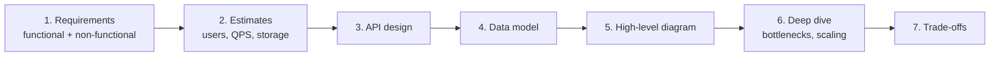

| Step | What you say |
| ---- | ------------ |
| Requirements | "Should users be able to edit? What scale — 1K or 10M users? Is it read-heavy or write-heavy?" |
| Estimates | 10M users × 10 requests/day ≈ 100M/day ≈ **~1,200 requests/sec** (a day has ~86,400 sec — round it to 100K). |
| API | `POST /urls`, `GET /:code` |
| Data model | Tables / collections and their keys |
| Diagram | Client → LB → API → Cache → DB |
| Deep dive | "What breaks first at 10× traffic?" |

**Tip:** asking clarifying questions is part of the score. Interviewers mark you down for designing the wrong thing confidently.

---

## F2. Vertical vs Horizontal Scaling

```text
Vertical (scale UP)                Horizontal (scale OUT)

  ┌──────────┐                      ┌────┐ ┌────┐ ┌────┐ ┌────┐
  │          │                      │ S1 │ │ S2 │ │ S3 │ │ S4 │
  │  BIGGER  │                      └────┘ └────┘ └────┘ └────┘
  │  SERVER  │                          ▲      ▲      ▲      ▲
  │ more CPU │                          └──────┴──┬───┴──────┘
  │ more RAM │                              Load Balancer
  └──────────┘
```

| Vertical | Horizontal |
| -------- | ---------- |
| Add CPU/RAM to one machine | Add more machines |
| Simple, no code change | Needs a load balancer and **stateless** servers |
| Has a hard upper limit | Almost unlimited |
| Single point of failure | One server dies, others keep serving |

Real systems usually start vertical, then go horizontal when one machine is not enough.

---

## F3. What is a Load Balancer?

A load balancer sits in front of your servers and spreads incoming requests across them. It also runs **health checks** and stops sending traffic to a dead server.

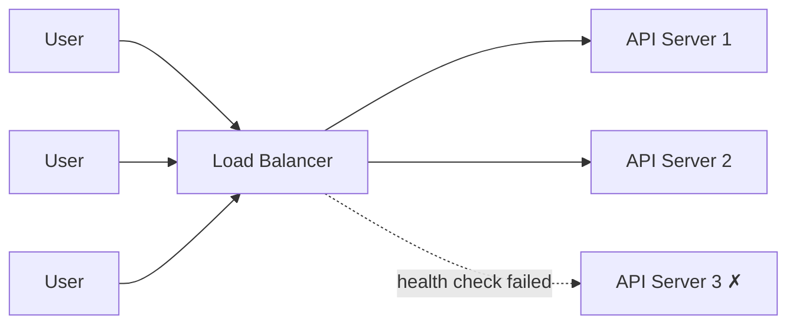

| Algorithm | How it picks a server |
| --------- | --------------------- |
| Round Robin | 1 → 2 → 3 → 1 → 2 ... |
| Least Connections | The server with the fewest active requests |
| IP Hash | Same client IP always goes to the same server |

Examples: Nginx, AWS ALB, HAProxy.

---

## F4. Stateless Servers and Sessions

To scale horizontally, **any** server must be able to handle **any** request. So the server must not keep user data in its own memory.

```text
✗ Stateful                          ✓ Stateless

Request 1 → Server A (saves session in RAM)    Request 1 → Server A ─┐
Request 2 → Server B (session not found!)      Request 2 → Server B ─┤
                                                                      ▼
                                                        Redis / DB / JWT
                                                       (shared session)
```

Store sessions in **Redis**, or use a **JWT** the client sends on every request.

---

## F5. Caching (Cache-Aside Pattern)

A cache keeps frequently read data in fast memory (Redis) so the database is not hit every time.

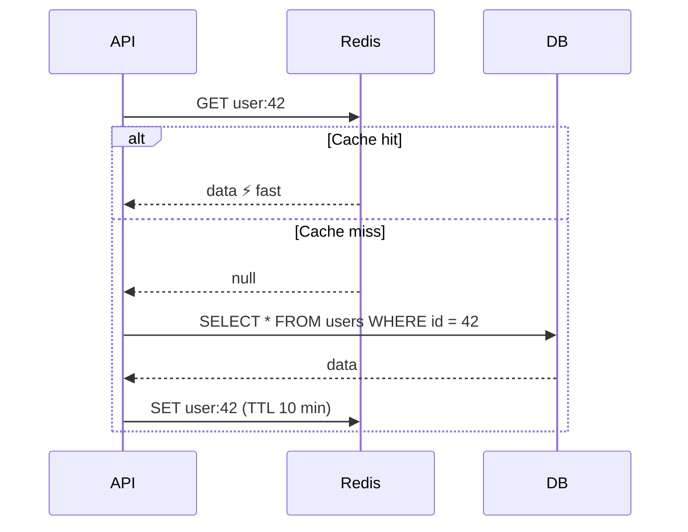

**Where caches live:** Browser → CDN → API memory → Redis → DB buffer.

**Invalidation** (the hard part):

- **TTL** — the entry expires after N seconds.
- **Delete on write** — when the user updates, delete `user:42` so the next read refills it.
- **Write-through** — write to cache and DB together.

**Cache stampede:** a hot key expires and 1,000 requests hit the DB at once. Fix it with a lock so only one request refills the cache, or add random jitter to TTLs.

---

## F6. What is a CDN?

A CDN (Content Delivery Network) stores copies of static files (images, JS, CSS, videos) on servers close to the user.

```text
                 Origin Server (USA)
                        │
         ┌──────────────┼──────────────┐
         ▼              ▼              ▼
   Edge (London)   Edge (Mumbai)   Edge (Tokyo)
         ▲              ▲              ▲
     UK user      Pakistan user    Japan user
      ~20ms           ~30ms          ~25ms
```

- Lower latency (data travels a shorter distance).
- Less load on your origin server.
- Examples: CloudFront, Cloudflare.

---

## F7. Database Replication vs Sharding

**Replication** = copies of the same data. **Sharding** = splitting data across machines.

```text
Replication (read scaling)            Sharding (write + storage scaling)

     Writes                            user_id 1–1M    → Shard A
       │                               user_id 1M–2M   → Shard B
       ▼                               user_id 2M–3M   → Shard C
   ┌────────┐
   │Primary │──copy──┐                  Each shard holds DIFFERENT rows
   └────────┘        ▼
              ┌──────────┐ ┌──────────┐
              │ Replica 1│ │ Replica 2│ ◄── Reads
              └──────────┘ └──────────┘
```

| Replication | Sharding |
| ----------- | -------- |
| Scales **reads** | Scales **writes** and storage |
| Every node has all data | Each node has part of the data |
| Risk: **replication lag** (replica a bit behind) | Risk: picking a bad shard key, cross-shard queries |

Try indexes, caching, and read replicas first. Shard only when you must.

---

## F8. CAP Theorem

In a distributed system, when the network splits (**P**artition), you must choose between **C**onsistency and **A**vailability.

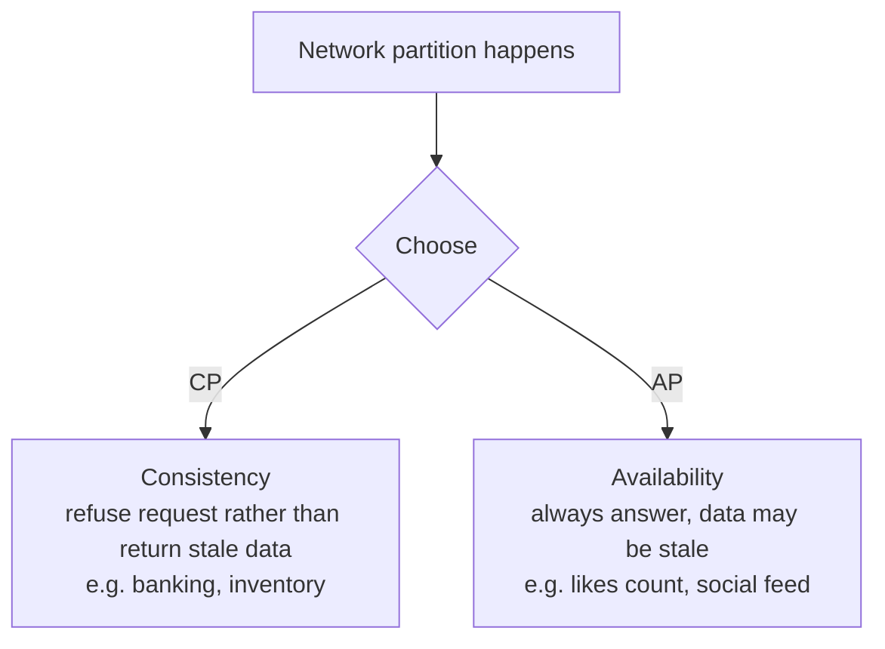

Partitions will happen, so the real choice is **CP vs AP**, and it can differ per feature in the same app.

---

## F9. Why use a Message Queue?

A queue lets one service hand work to another **without waiting** for it to finish.

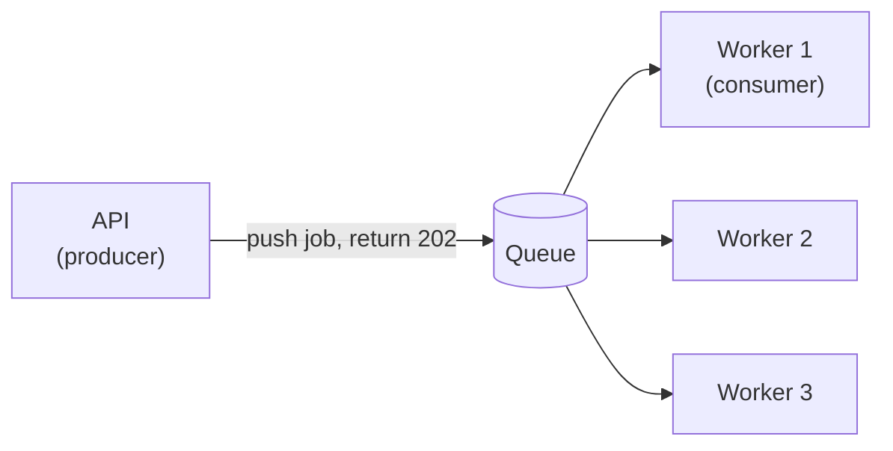

- **Decoupling** — the API doesn't care how the email gets sent.
- **Buffering** — a spike of 10K jobs waits in the queue instead of crashing workers.
- **Retries** — a failed job goes back to the queue.

| Queue (point-to-point) | Pub/Sub |
| ---------------------- | ------- |
| Each message goes to **one** consumer | Each message goes to **all** subscribers |
| SQS, RabbitMQ, BullMQ | SNS, Kafka topics, Redis Pub/Sub |
| "Send this email" | "Order placed" → email, inventory, analytics all react |

---

## F10. Back-of-Envelope Estimation

Interviewers want rough numbers, not exact ones. Round aggressively.

```text
Handy numbers
  1 day          ≈ 86,400 sec  → round to 100,000 (10^5)
  1 million/day  ≈ 12 per second
  100M/day       ≈ 1,200 per second
  Peak traffic   ≈ 2–3× the average

Latency (roughly)
  Read from RAM / Redis      ~ 0.1 ms
  SSD read                   ~ 0.1–1 ms
  DB query with index        ~ 1–10 ms
  Same-region network call   ~ 1 ms
  Cross-continent call       ~ 100–150 ms
```

**Worked example — photo app, 10M daily users, each uploads 1 photo (500 KB):**

```text
Writes:   10M / 100K sec         = 100 uploads/sec   (peak ~300)
Storage:  10M × 500 KB           = 5 TB per day
          5 TB × 365             ≈ 1.8 PB per year   → object storage (S3), not a DB
Reads:    100 reads per upload   = 10,000 reads/sec  → needs CDN + cache
```

The numbers tell you **what the design needs**: here, S3 for files and a CDN for reads.

---

## F11. Consistent Hashing

Problem: you spread keys across cache servers with `hash(key) % N`. Add one server and **almost every key moves**, so the cache is suddenly empty.

```text
hash % 3 (3 servers)      hash % 4 (4 servers)
key 10 → server 1         key 10 → server 2   moved ✗
key 11 → server 2         key 11 → server 3   moved ✗
key 12 → server 0         key 12 → server 0   same
                          ~75% of keys move → cache miss storm
```

**Consistent hashing** puts servers and keys on a ring. A key goes to the next server clockwise.

```text
                 Server A
                 ●
          k1 ·       · k2
       ·                 ·
Server D ●                 ● Server B
       ·                 ·
          k4 ·       · k3
                 ●
                 Server C

Add Server E between A and B → only keys between A and E move to E.
Everything else stays where it was.
```

- Only about `1/N` of the keys move when a server is added or removed.
- **Virtual nodes** (each server appears many times on the ring) spread load evenly.
- Used by: DynamoDB, Cassandra, Redis Cluster–style sharding, CDNs, load balancers.

---

## F12. Single Point of Failure (SPOF) and Redundancy

A SPOF is any one component that takes the whole system down when it fails.

```text
✗ SPOFs everywhere                     ✓ Redundant

User → [1 server] → [1 DB]             User → LB pair ─┬─► Server 1 ─┐
                                                       ├─► Server 2 ─┼─► DB primary
                                                       └─► Server 3 ─┘      │ replicates
                                                                            ▼
                                                                       DB standby (other AZ)
```

| Layer | How to remove the SPOF |
| ----- | ---------------------- |
| Server | Several servers behind a load balancer |
| Load balancer | Managed LB (AWS ALB is already redundant) |
| Database | Primary + standby with automatic failover (Multi-AZ) |
| Region / data center | Run in multiple availability zones |
| Cache | Redis replica or cluster; app still works (slower) if cache dies |

**Interview tip:** after drawing your design, point at each box and ask, "What happens if this dies?"

---

## F13. Strong vs Eventual Consistency

```text
Strong consistency                       Eventual consistency

Write x = 5 ──► all replicas updated     Write x = 5 ──► primary updated
                 before "OK"                              │ replicates in background
Read anywhere → 5 ✓ always               Read replica → 4 (old) for a moment
                                         ... a few ms later → 5 ✓
Slower, less available                   Faster, more available
```

| Use strong | Eventual is fine |
| ---------- | ---------------- |
| Bank balance, payments | Like / view counts |
| Inventory / seat booking | Social feed |
| Username uniqueness | Search index, analytics |

**Read-your-own-writes:** a user edits their profile and immediately sees the old one (read from a lagging replica). Fix: read that user's own data from the primary for a few seconds after they write.

---

## F14. How do you generate unique IDs in a distributed system?

| Approach | Example | Pros | Cons |
| -------- | ------- | ---- | ---- |
| DB auto-increment | `1, 2, 3` | Simple, small, sortable | One DB is the bottleneck; guessable |
| UUID v4 | `f47ac10b-58cc-...` | Generated anywhere, no coordination | 128-bit, random → poor index locality, not sortable |
| UUID v7 / ULID | time-prefixed | Sortable by time, generated anywhere | Still 128-bit |
| Snowflake (Twitter) | 64-bit number | Sortable, compact, no coordination | Needs unique machine IDs, clock care |

```text
Snowflake ID (64 bits)

┌─┬──────────────────────────────┬────────────┬──────────────┐
│0│ timestamp (41 bits, ms)      │ machine(10)│ sequence (12)│
└─┴──────────────────────────────┴────────────┴──────────────┘
     ~69 years of ms              1024 servers  4096 IDs per ms per server
```

Rule of thumb: auto-increment for a single DB, UUID v7 / Snowflake when many servers create IDs.

---

## F15. How do you know your system is down? (Monitoring & Observability)

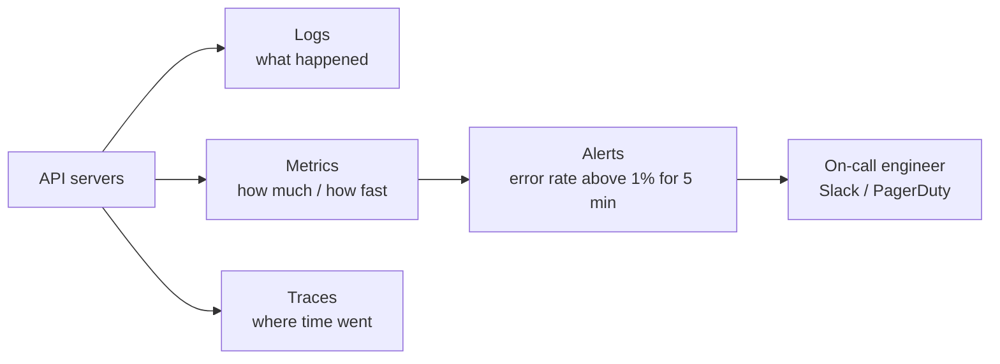

| Signal | Example | Tool examples |
| ------ | ------- | ------------- |
| **Logs** | `ERROR payment failed orderId=91` | CloudWatch Logs, ELK, Loki |
| **Metrics** | requests/sec, p95 latency, error %, CPU | Prometheus + Grafana, Datadog |
| **Traces** | One request: API 20ms → DB 400ms → Stripe 90ms | OpenTelemetry, Jaeger |

**The 4 golden signals** to watch: **latency, traffic, errors, saturation** (how full CPU/memory/connections are).

- Add a **health check** endpoint (`GET /health`) that the load balancer and uptime monitor call.
- Alert on **user-facing symptoms** (error rate, latency), not every CPU spike.
- Put a **request ID** in every log line so you can follow one request across services.

---

# Scenario Questions

## Q1. How would you send an email to 10 million users reliably and efficiently?

Use an **asynchronous queue-based architecture**: a queue + workers + the provider's batch API + retry/dead-letter handling.

Never send 1M emails inside the API request. The API only accepts the job and returns immediately.

```text
Your API
   │
   ▼
Database: 1M recipients
   │
   ▼
Queue (Redis / SQS / RabbitMQ)
   │
   ▼
Email Workers  (scale horizontally)
   │
   ▼
Email Provider (SES / SendGrid / Mailgun)
   │
   ▼
Provider response
   ├── Success           → mark SENT
   ├── Temporary error   → RETRY
   └── Permanent error   → mark FAILED
                            │
                            ▼
              Dead Letter Queue (DLQ)
                            │
                            ▼
                        Update DB
```

After all retries are exhausted, the message is moved to a **Dead Letter Queue (DLQ)** so it can be inspected or replayed later instead of being lost.

### Scaling to 10 Million — Quick Estimate

```text
10,000,000 emails
Provider limit  ≈ 1,000 emails/sec
Time            ≈ 10,000,000 / 1,000 = 10,000 sec ≈ 2.8 hours
Batch API       = 50 recipients per call → only 200 API calls/sec
```

Don't push 10M messages into the queue from one API request. Use a **fan-out producer** that reads recipients page by page:

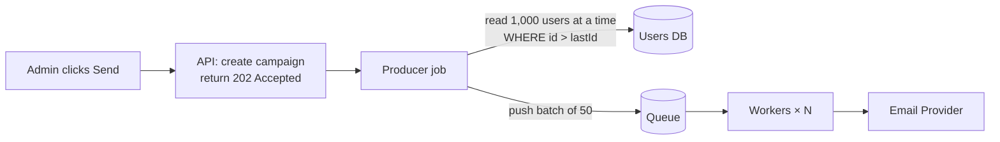

- Read recipients with **cursor pagination** (`WHERE id > lastId LIMIT 1000`), not `OFFSET` (see Q12).
- Track progress on the campaign (`sent / failed / total`) so an admin can watch it.
- Send marketing emails at a lower priority than password resets: use **separate queues**.

### Rate Limiting

Every provider has a sending limit (for example SES gives you a per-second quota). Respect it or the provider will throttle or block you.

- Limit how many messages workers pull per second (token bucket in Redis).
- Control concurrency by the number of workers, not by looping faster.
- Use the provider's **batch/bulk API** to send many recipients in one call.

### Retries

- Retry only temporary failures, with **exponential backoff** (1s, 2s, 4s, 8s...).
- Add **jitter** so all workers don't retry at the same moment.
- Cap the attempts (for example 3–5), then move to the DLQ.

### Temporary vs Permanent Errors

| Type          | Examples                                             | Action                     |
| ------------- | ---------------------------------------------------- | -------------------------- |
| Temporary     | Rate limit (429), timeout, provider down (5xx), soft bounce (mailbox full) | Retry with backoff |
| Permanent     | Invalid email, hard bounce, unsubscribed, blocked domain | Mark FAILED, do not retry |

Retrying permanent errors wastes quota and damages your sender reputation.

### Failed Emails

- Store the status per recipient: `PENDING → PROCESSING → SENT / FAILED`.
- Save the provider error code and message for debugging.
- Handle provider **webhooks** (bounce, complaint, delivered) and update the DB.
- Suppress hard-bounced and complained addresses from future campaigns.

### Duplicate Sends

Queues usually guarantee **at-least-once** delivery, so the same message can be delivered twice. Make the worker **idempotent**:

- Give each job a unique **idempotency key** (for example `campaignId + userId`).
- Before sending, check the status — if it is already `SENT`, skip.
- Use a DB unique constraint on `(campaign_id, user_id)` so a duplicate insert fails.
- Pass the idempotency key to the provider if it supports one.

---

## Q2. Your API normally receives 100 requests/sec, but suddenly receives 10,000 requests/sec. How would you handle it?

```text
Load Balancer
      │
      ▼
Multiple API Servers  (auto-scaling)
      │
      ▼
Queue
      │
      ▼
Workers
      │
      ▼
Database
```

- **Load balancer** spreads traffic across servers.
- **Horizontal auto-scaling** adds more API servers when traffic rises.
- **Queue** absorbs the spike — the API accepts fast and workers process at a steady pace, so the database is never flooded.
- **Caching** (Redis / CDN) serves repeated reads without touching the DB.
- **Rate limiting** blocks abusive clients at the edge.
- **Database**: connection pooling, read replicas, and indexes.

The key idea is **buffering**: never let a traffic spike hit the database directly.

---

## Q3. How would you prevent a user from calling an API 1,000 times per second?

Implement **rate limiting**, usually with Redis, using algorithms such as **Token Bucket** or **Sliding Window**.

Redis is used because it is fast, shared across all API servers, and supports atomic counters with TTL.

| Algorithm       | How It Works                                                        |
| --------------- | ------------------------------------------------------------------- |
| Fixed Window    | Count requests per fixed time window. Simple, but allows bursts at window edges. |
| Sliding Window  | Counts requests in a rolling time window. More accurate.            |
| Token Bucket    | Tokens refill at a fixed rate; each request takes one token. Allows short bursts. |
| Leaky Bucket    | Requests drain at a constant rate. Smooths traffic.                 |

### Notes

- Rate limit per **user / API key / IP**, not globally.
- Return **429 Too Many Requests** with a `Retry-After` header.
- Apply it at the **API Gateway** or a middleware layer.
- Different limits for different tiers (free vs paid users).

```text
Token Bucket (capacity 5, refill 1 token/sec)

t=0s   [● ● ● ● ●]  5 requests arrive → all allowed → [ _ _ _ _ _ ]
t=0s   request #6   → bucket empty     → 429 Too Many Requests
t=1s   [● _ _ _ _]  1 token refilled   → 1 request allowed
```

---

## Q4. Design a URL Shortener (like bit.ly)

**Requirements:** long URL → short code (`sho.rt/aZ3x9`); redirect fast; read-heavy (~100 reads per write).

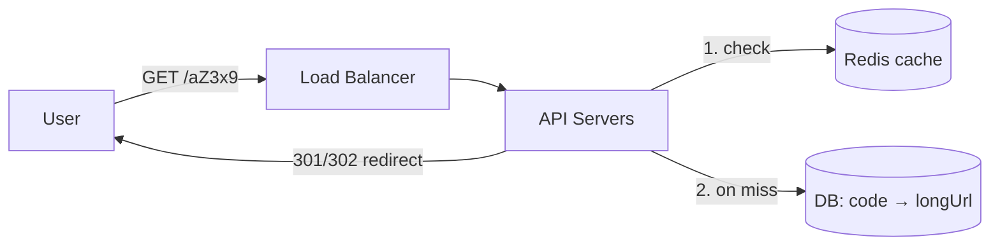

**Generating the short code:**

| Approach | How | Trade-off |
| -------- | --- | --------- |
| Base62 of an auto-increment ID | id `125` → `"21"` | Short and unique, but guessable |
| Random 7 chars + uniqueness check | `aZ3x9Qp` | Not guessable, needs a retry on collision |
| Hash (MD5) of URL, take 7 chars | Same URL → same code | Collisions must be handled |

Base62 with 7 characters = 62⁷ ≈ **3.5 trillion** codes.

- **301** (permanent) lets browsers cache the redirect → less load, but you lose click analytics. **302** keeps every click hitting you.
- Cache hot codes in Redis — a few popular links get most of the traffic.

---

## Q5. Design a Notification System (Email, SMS, Push)

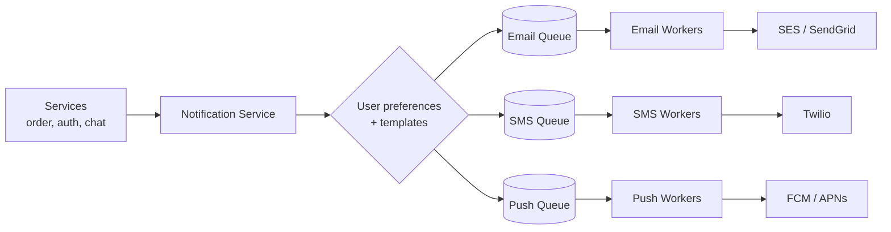

- **One queue per channel** — if SMS is slow, email is not affected.
- Check **user preferences** (opted out of SMS? quiet hours?) before queueing.
- Use **templates** with variables (`Hi {{name}}, your order {{id}} shipped`).
- Priority: OTP/security notifications get their own high-priority queue.
- Same retry, DLQ, and idempotency rules as Q1.

---

## Q6. How would you let users upload large files (images, videos)?

Don't stream big files through your API server. Let the client upload **directly to S3** with a **pre-signed URL**.

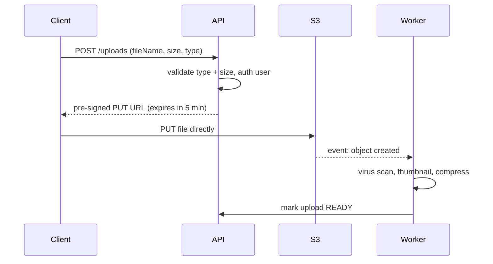

- API servers stay free — no 2GB file passing through Node.
- Use **multipart upload** for large files so a failed chunk can be retried.
- Serve files back through a **CDN**.

---

## Q7. Design a Chat App (like WhatsApp)

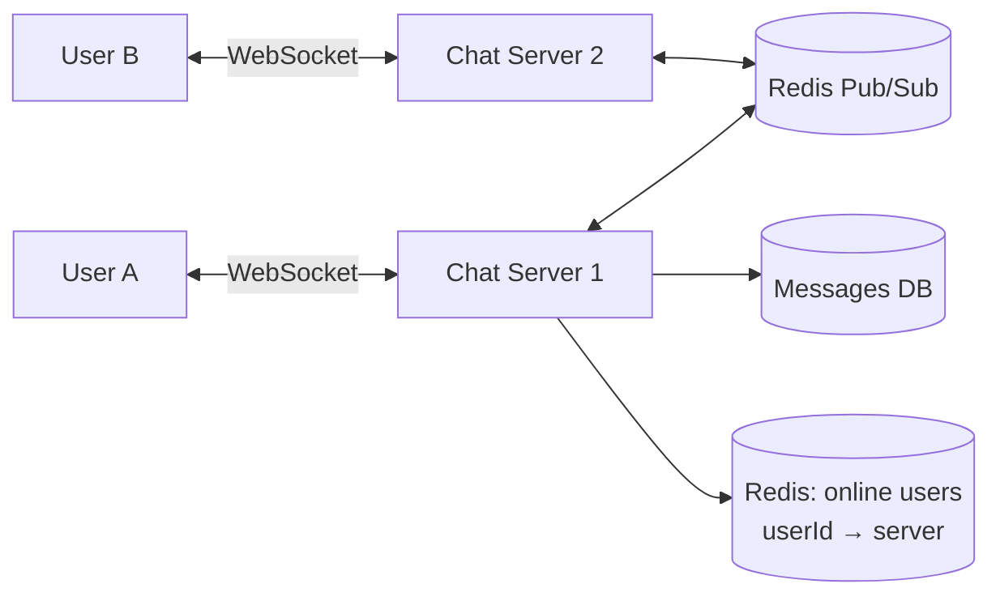

**How a message travels:**

1. A sends a message over its WebSocket to Server 1.
2. Server 1 saves it to the DB (status `SENT`).
3. Server 1 looks up where B is connected → publishes to Server 2 via Pub/Sub.
4. Server 2 pushes it to B → status `DELIVERED`. B opens it → `READ`.
5. If B is **offline**, store it and send a push notification. Deliver it when B reconnects.

- **WebSocket** — a persistent two-way connection (HTTP polling would waste requests).
- **Presence** (online/last seen) — a heartbeat every N seconds, stored in Redis with a TTL.
- Message order — sort by a per-conversation sequence number, not by client clock.

---

## Q8. Design a News Feed (like Instagram / Twitter)

Two strategies:

```text
Fan-out on WRITE (push)                 Fan-out on READ (pull)

User posts                              User opens feed
   │                                       │
   ▼                                       ▼
Copy post ID into every                 Fetch latest posts of everyone
follower's feed list (Redis)            they follow, merge, sort
   │                                       │
Feed read = instant                     Feed read = slow
Post write = slow for many followers    Post write = instant
```

| | Push (on write) | Pull (on read) |
| - | --------------- | -------------- |
| Read speed | Fast | Slow |
| Bad for | Celebrities (10M followers = 10M writes) | Users following thousands of accounts |

**Real answer — hybrid:** push for normal users; for celebrities, pull their posts at read time and merge them in.

---

## Q9. Flash Sale — 100 items, 1 million users clicking Buy. How do you prevent overselling?

The bug: two requests both read `stock = 1`, both buy → stock becomes `-1`.

```text
Request A: read stock = 1 ─┐
Request B: read stock = 1 ─┤  both see 1
Request A: stock = 0  ✓    │
Request B: stock = 0  ✓  ← SOLD TWICE ✗
```

**Fix — make the decrement atomic:**

```sql
UPDATE products
SET stock = stock - 1
WHERE id = 42 AND stock > 0;   -- 0 rows updated = sold out
```

At very high traffic, do it in Redis first:

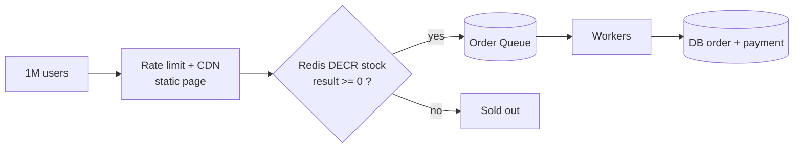

- Redis `DECR` is atomic, so only 100 requests get a value `>= 0`.
- The queue protects the DB; workers create orders at a safe pace.
- Release the stock back if payment is not completed within N minutes.

---

## Q10. How do you prevent a user from being charged twice?

The user double-clicks Pay, or the network times out and the client retries. Use an **idempotency key**.

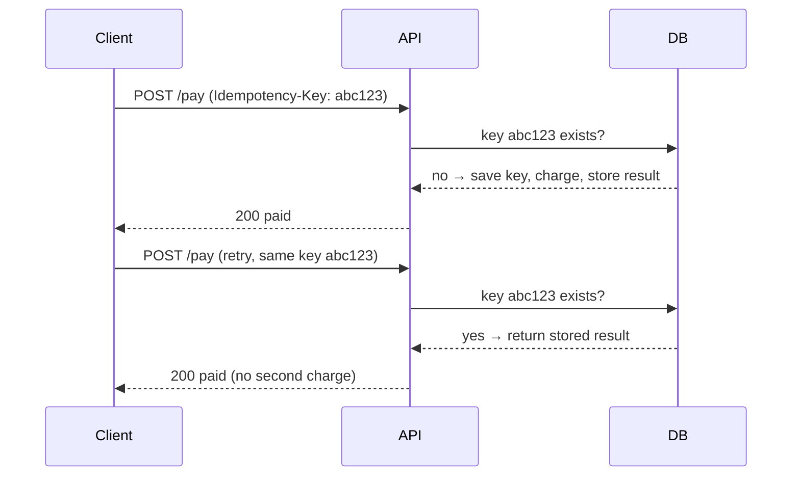

- The client generates the key once per checkout (UUID).
- Store keys with a **unique constraint**, so even two simultaneous requests can't both insert.
- Also disable the Pay button after the first click — but never rely on the frontend alone.

---

## Q11. Design a Real-Time Leaderboard

Use a **Redis Sorted Set** — it keeps members sorted by score automatically.

```text
ZADD leaderboard 1500 "ali"
ZADD leaderboard 2300 "sara"
ZINCRBY leaderboard 100 "ali"      → ali = 1600

ZREVRANGE leaderboard 0 9 WITHSCORES   → top 10

 Rank │ Player │ Score
──────┼────────┼──────
  1   │ sara   │ 2300
  2   │ ali    │ 1600
```

- Updating a score and getting a rank are **O(log N)**, fast even with millions of players.
- Persist scores to the DB too; Redis is the fast view, the DB is the source of truth.

---

## Q12. How do you paginate millions of rows?

`OFFSET` gets slower the deeper you go, because the DB still reads and throws away every skipped row.

```text
OFFSET pagination                        Cursor (keyset) pagination

LIMIT 20 OFFSET 1000000                  WHERE id > 1000020 ORDER BY id LIMIT 20
DB scans 1,000,020 rows,                 DB jumps straight to id 1000020
returns 20 ✗ slow                        via the index ✓ fast
```

```sql
-- Page 1
SELECT * FROM posts ORDER BY id LIMIT 20;
-- Next page: client sends the last id it saw
SELECT * FROM posts WHERE id > :lastId ORDER BY id LIMIT 20;
```

| Offset | Cursor |
| ------ | ------ |
| Can jump to page 50 | Only next / previous |
| Slow on deep pages | Same speed on every page |
| Rows shift if new data is inserted | Stable results |

Use cursors for infinite scroll and feeds; offset is fine for small admin tables.

---

## Q13. Design Search Autocomplete

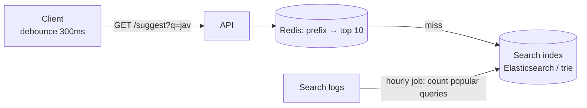

```text
Trie for "ja"
        (root)
          │
          j
          │
          a ──► top: [java, javascript, jamaica]
         / \
        v   m
```

- **Debounce** on the client so typing "javascript" isn't 10 requests.
- Pre-compute the top suggestions per prefix and cache them, rather than ranking on every keystroke.

---

## Q14. Your API is slow. How do you find and fix the problem?

Measure first, then fix the biggest cost.

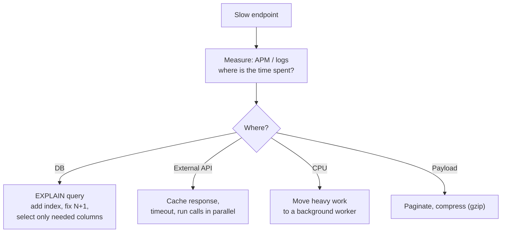

**N+1 problem** — the most common cause:

```text
✗ 1 query for 100 orders + 100 queries for each order's user = 101 queries
✓ 1 query for orders + 1 query: WHERE user_id IN (...)       =   2 queries
```

Also: `Promise.all` for independent calls, connection pooling, and caching repeated reads.

---

## Q15. A user wants to export 5 million rows to CSV. How?

Never build it inside the HTTP request — it will time out and use up the server's memory.

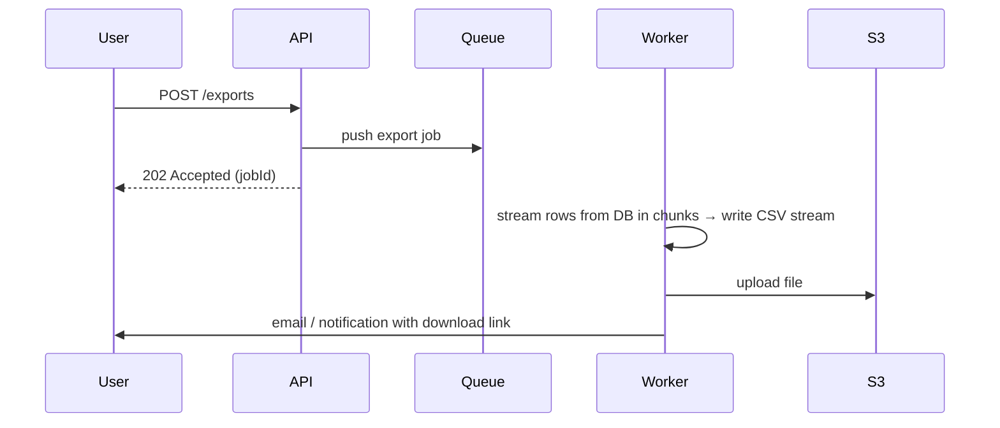

- **Stream** rows with a cursor — never load 5M rows into memory.
- The download link is a pre-signed S3 URL that expires.
- The UI can poll `GET /exports/:jobId` to show progress.

---

## Q16. Polling vs Long Polling vs SSE vs WebSockets

How does the server push live updates (scores, notifications, chat) to the browser?

```text
Short polling     Client: any news? ─► No.   (every 5s, mostly wasted)
Long polling      Client: any news? ─► server HOLDS the request until news, then replies
SSE               Client opens one connection ◄── server streams events (one way)
WebSocket         Client ◄──────────────────► Server (two-way, persistent)
```

| | Direction | Use for |
| - | --------- | ------- |
| Short polling | Client → Server | Simple, low-frequency updates |
| Long polling | Client → Server | Fallback when WebSockets are blocked |
| SSE | Server → Client | Live feeds, notifications, AI token streaming |
| WebSocket | Both | Chat, multiplayer games, collaborative editing |

---

## Q17. Design an OTP Login System

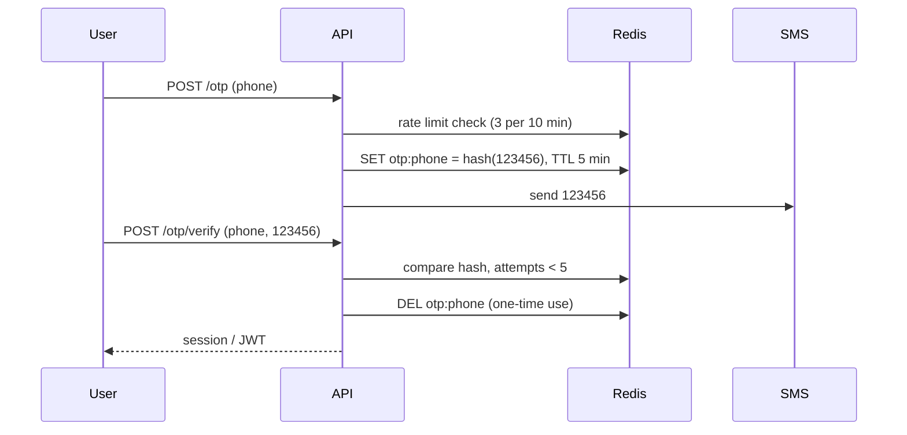

- Store a **hash** of the OTP, never the plain code.
- **TTL** (expire after 5 min) + **one-time use** (delete after success).
- Limit both **sending** (SMS costs money) and **verifying** (stops brute force of 6 digits).

---

## Q18. A cron job runs on 5 servers. How do you make sure it runs only once?

Every server runs the same code, so a 9 AM job would run 5 times.

```text
9:00  Server 1 ─► SET lock:daily-report NX EX 300 → OK      ✓ runs job
9:00  Server 2 ─► SET lock:daily-report NX EX 300 → null    ✗ skips
9:00  Server 3 ─► SET lock:daily-report NX EX 300 → null    ✗ skips
```

- **Distributed lock** in Redis: `SET key value NX EX 300` succeeds for only one caller.
- The `EX` expiry releases the lock even if that server crashes.
- Or run scheduled jobs from **one** dedicated scheduler (e.g. a BullMQ repeatable job, AWS EventBridge) that pushes to a queue.
- Make the job itself **idempotent** in case it runs twice anyway.

---

## Q19. Design a Ticket / Seat Booking System (like BookMyShow)

**Requirements:** users pick seats, have 10 minutes to pay, and no seat is ever sold twice.

```text
Seat states

AVAILABLE ──select──► HELD (10 min, userId) ──pay ✓──► BOOKED
    ▲                        │
    └──── timeout / cancel ──┘
```

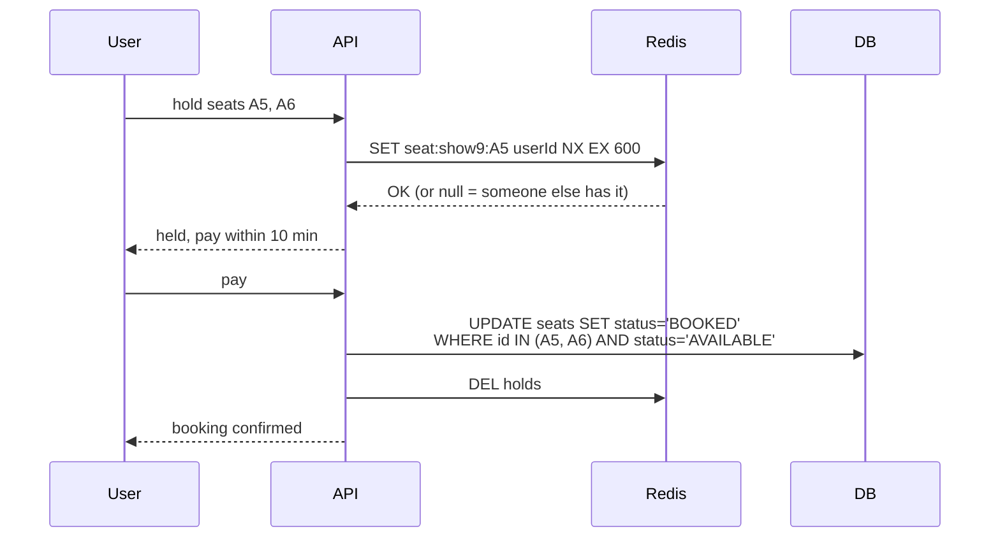

- The **hold** uses Redis `SET NX EX`: only one user gets it, and it expires on its own if they leave.
- The **final booking** is still protected in the DB (conditional `UPDATE` or a unique constraint on `(show_id, seat_id)`), because Redis is not the source of truth.
- Hold **all seats or none**: if A6 fails, release A5.
- Popular shows: put users in a **virtual waiting room** queue so the booking service isn't flooded.

---

## Q20. Design a Ride-Sharing App (like Uber) — finding nearby drivers

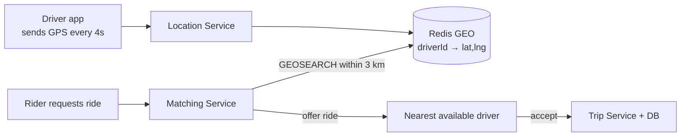

**How do you find "drivers within 3 km" fast?** Don't compare the rider with every driver. Split the map into cells (**geohash**):

```text
Map divided into geohash cells          Rider in cell "tdr1y"
┌──────┬──────┬──────┐                  → search that cell + 8 neighbours
│tdr1v │tdr1y │tdr1z │                    (only a few hundred drivers,
├──────┼──────┼──────┤                     not 1 million)
│tdr1t │ 🧍   │tdr1x │
├──────┼──────┼──────┤
│tdr1s │tdr1u │tdr1w │
└──────┴──────┴──────┘
```

- Driver locations are **write-heavy** and short-lived → keep them in memory (Redis GEO), not the main DB.
- Lock the driver while an offer is pending, so two riders can't get the same driver.
- Live trip tracking: driver location → WebSocket → rider's map.

---

## Q21. Design a Video Streaming Platform (like YouTube)

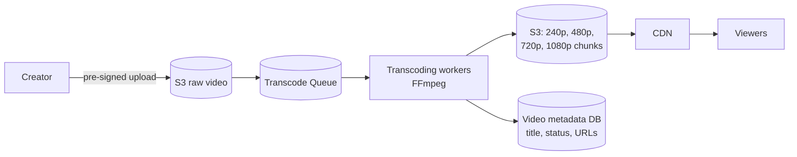

**Adaptive bitrate streaming (HLS / DASH):**

```text
video.mp4 ──transcode──► 1080p: [seg1][seg2][seg3]...   each segment ~4–6 sec
                         720p:  [seg1][seg2][seg3]...
                         480p:  [seg1][seg2][seg3]...
                         + playlist (.m3u8) listing them

Player on fast Wi-Fi  → downloads 1080p segments
Network slows down    → next segment switches to 480p (no buffering)
```

- Upload and transcoding are **async** — status goes `UPLOADING → PROCESSING → READY`.
- Video bytes are served by the **CDN**, never by your API servers.
- View counts use the high-scale counter pattern from Q25.

---

## Q22. Design Food Delivery Order Tracking

The order is a **state machine** — every change is an event the customer can see.

```text
PLACED ─► ACCEPTED ─► PREPARING ─► PICKED_UP ─► DELIVERED
   │          │
   └──────────┴──► CANCELLED (only allowed before PICKED_UP)
```

```mermaid
flowchart LR
    R["Restaurant app"] -->|"status update"| OS["Order Service"]
    D["Rider app GPS"] --> LS["Location Service"]
    OS --> E[("Event bus")]
    LS --> E
    E --> N["Notification Service<br/>push / SMS"]
    E --> WS["WebSocket Gateway"]
    WS --> C["Customer's live map"]
```

- Validate transitions on the server: `DELIVERED → PREPARING` must be rejected.
- Store every status change with a timestamp (an **order history** table) — useful for support and ETAs.
- Live location: push over WebSocket/SSE every few seconds; don't make the client poll.

---

## Q23. E-commerce Checkout — Order, Payment, Inventory (Saga Pattern)

In microservices you can't wrap three services in one DB transaction. A **saga** runs a series of local steps, and if one fails, runs **compensating** steps to undo the earlier ones.

```text
Happy path
  1. Order Service      create order (PENDING)
  2. Inventory Service  reserve stock
  3. Payment Service    charge card
  4. Order Service      mark CONFIRMED

Payment fails at step 3 → compensate backwards
  3 ✗ charge failed
  2 ↩ release reserved stock
  1 ↩ mark order CANCELLED
```

```mermaid
flowchart LR
    O["Create order"] --> I["Reserve stock"]
    I --> P{"Charge card"}
    P -->|success| C["Order CONFIRMED"]
    P -->|fail| RI["Release stock"] --> X["Order CANCELLED"]
```

- **Orchestration:** one coordinator service tells each step what to do (easier to follow).
- **Choreography:** each service listens for events (`StockReserved`) and reacts (looser coupling, harder to trace).
- Every step must be **idempotent**, because messages can be delivered twice.

---

## Q24. How do you handle payment webhooks (e.g. Stripe) safely?

The payment provider calls **your** endpoint when something happens (`payment_intent.succeeded`).

```mermaid
sequenceDiagram
    participant S as Stripe
    participant API as Webhook endpoint
    participant DB
    participant Q as Queue
    S->>API: POST /webhooks/stripe (event evt_123)
    API->>API: verify signature header
    API->>DB: INSERT event evt_123 (unique) — already exists? skip
    API->>Q: push "process evt_123"
    API-->>S: 200 OK (quickly)
    Q->>Q: worker fulfils order
```

- **Verify the signature** — otherwise anyone can POST "payment succeeded".
- **Respond fast (2xx)**, then do the work in a queue. Slow responses get retried by the provider.
- **Store event IDs with a unique constraint** — providers retry, so the same event arrives more than once.
- Events can arrive **out of order** — check the current state instead of assuming the sequence.
- Never trust the client's "payment done" redirect alone; the webhook (or an API check) is the truth.

---

## Q25. Design a Like / View Counter for Millions of Events

Problem: a viral post gets 50,000 likes per second. `UPDATE posts SET likes = likes + 1` 50K times/sec locks the same row → DB melts.

```text
✗ Every like hits the same DB row        ✓ Count in Redis, flush in batches

like ─► UPDATE row 42 ┐                  like ─► INCR likes:42 (Redis, in memory)
like ─► UPDATE row 42 ├─ row lock        like ─► INCR likes:42
like ─► UPDATE row 42 ┘  contention      ...
                                         every 5 sec: worker reads + resets counter
                                         ─► UPDATE posts SET likes = likes + 4,812
```

- **Who liked what** (to stop double likes, show "you liked this") → a `likes(user_id, post_id)` table with a unique key, or a Redis set.
- **The number shown** → a Redis counter, eventually synced to the DB. Being a few seconds behind is fine (eventual consistency, F13).
- For extremely hot keys, split the counter: `likes:42:shard0..9`, sum them when reading.

---

## Q26. Design Analytics Event Ingestion (millions of clicks per minute)

```mermaid
flowchart LR
    B["Browsers / apps"] -->|"batch of events"| C["Collector API<br/>(stateless, validates)"]
    C --> K[("Kafka / Kinesis<br/>event log")]
    K --> S["Stream processor<br/>real-time counts"]
    K --> L["Loader"] --> W[("Data warehouse<br/>BigQuery / ClickHouse")]
    S --> D["Live dashboard"]
    W --> R["Reports / SQL queries"]
```

- The client **batches** events (send every 10 sec or every 50 events), not one request per click.
- The collector only validates and appends to the log — no heavy work in the request.
- **Kafka** keeps events for days, so you can replay them if a consumer had a bug.
- Store raw events in a **column-oriented warehouse**, which is fast for "count by day by country".
- Analytics is not your main DB — never run these heavy queries on the production database.

---

## Q27. How do you keep the cache and the database in sync?

```text
Common bug: update DB, then update cache — two writers race

Writer A: DB = 1 ────────────────────────── cache = 1
Writer B:          DB = 2 ── cache = 2
Final:    DB = 2, cache = 1   ✗ stale forever (until TTL)
```

**Safer default: update the DB, then DELETE the cache key** (the next read refills it).

```mermaid
flowchart LR
    W["Write request"] --> DB[("1. UPDATE DB")]
    DB --> DEL["2. DEL cache key"]
    R["Next read"] --> M{"cache hit?"}
    M -->|miss| RD["read DB → SET cache"]
```

| Strategy | How | Good for |
| -------- | --- | -------- |
| Cache-aside + delete on write | App deletes the key after DB write | Most apps (default) |
| Write-through | Write cache and DB together | Data read right after writing |
| Write-behind | Write cache, flush to DB later | Counters; risk of data loss |
| CDC (change data capture) | DB change log → event → invalidate cache | Many services caching the same data |

- **Always set a TTL** as a safety net, so any stale value eventually expires.
- Accept that a cache gives **eventual** consistency; don't cache data that must be exact (balances).

---

## Q28. A third-party API you depend on is slow or down. What do you do?

```text
Without protection
  Your API ──► Slow provider (30s timeout)
  every request waits 30s → all threads/connections busy → YOUR app goes down too
```

**Layers of defence:**

```mermaid
flowchart LR
    A["Your service"] --> T["Timeout<br/>e.g. 2s"]
    T --> R["Retry<br/>backoff + jitter,<br/>max 2–3"]
    R --> CB{"Circuit breaker"}
    CB -->|closed| P["Provider"]
    CB -->|open| F["Fallback<br/>cached data / default /<br/>queue for later"]
```

**Circuit breaker states:**

```text
CLOSED ──(many failures)──► OPEN ──(after 30s)──► HALF-OPEN
  ▲   calls go through        fail instantly,        let 1 test call through
  │                           don't call provider        │
  └──────────── test succeeds ◄──────────────────────────┘
                test fails ──► back to OPEN
```

- **Timeouts** on every external call — the default is often "wait forever".
- **Fallbacks:** show cached prices, hide the "recommendations" widget, or queue the request and finish it later.
- **Bulkhead:** give each provider its own connection pool, so one slow provider can't use them all.

---

## Q29. How do you handle 1 million concurrent WebSocket connections?

```mermaid
flowchart LR
    U["1M clients"] --> LB["Load Balancer<br/>(supports WebSocket upgrade)"]
    LB --> G1["Gateway 1<br/>~50K connections"]
    LB --> G2["Gateway 2"]
    LB --> GN["Gateway N"]
    G1 <--> PS[("Redis Pub/Sub / Kafka")]
    G2 <--> PS
    GN <--> PS
    PS <--> APP["Business services"]
    G1 --> REG[("Redis: userId → gateway")]
```

- Each connection is long-lived, so the limit is **memory and file descriptors**, not CPU. Node can hold tens of thousands per instance; plan ~20 gateway servers for 1M.
- Gateways only hold connections; business logic lives in other services.
- To message user X: look up which gateway holds X, publish to that gateway.
- **Reconnect storms:** if a gateway restarts, 50K clients reconnect at once → clients reconnect with random **jitter** and backoff.
- Send heartbeats (ping/pong) to detect dead connections and free resources.

---

## Q30. Design Product Search (with filters, typos, ranking)

SQL `LIKE '%phone%'` can't use an index and has no relevance ranking or typo tolerance. Use a **search engine** next to your DB.

```mermaid
flowchart LR
    ADM["Admin edits product"] --> DB[("PostgreSQL<br/>source of truth")]
    DB -->|"change event / CDC"| Q[(Queue)]
    Q --> IDX["Indexer"] --> ES[("Elasticsearch /<br/>OpenSearch / Meilisearch")]
    U["User searches<br/>'iphne 15 case'"] --> API --> ES
    ES -->|"ranked IDs + facets"| API
```

**Inverted index** — why it's fast:

```text
Docs                         Inverted index
1: "red iphone case"         red     → [1]
2: "iphone charger"          iphone  → [1, 2]
3: "red charger"             case    → [1]
                             charger → [2, 3]
Search "red charger" → intersect → doc 3 first (matches both), then 1, 2
```

- The DB stays the source of truth; the search index is a **copy**, updated asynchronously (may lag by seconds).
- Supports fuzzy matching (typos), synonyms, filters (brand, price range), and facets ("Apple (42)").

---

## Q31. How do you log out a JWT user immediately?

A JWT is valid until it expires — the server doesn't store it, so it can't simply "delete" it.

```text
Access token (15 min) + Refresh token (7 days, stored in DB)

Logout / ban user:
  1. Delete or revoke the refresh token in the DB  → no new access tokens
  2. Old access token still works ≤ 15 min         → acceptable for most apps
  3. Need it to stop NOW? → add its ID (jti) to a Redis denylist until it expires
```

```mermaid
flowchart LR
    R["Request with JWT"] --> V{"Signature + expiry valid?"}
    V -->|no| X["401"]
    V -->|yes| D{"jti in Redis denylist?"}
    D -->|yes| X
    D -->|no| OK["Allow"]
```

- Keep access tokens **short-lived**, so the window is small.
- "Log out of all devices": store a `tokenVersion` on the user; bump it, and reject tokens with an older version.
- If you need instant revocation everywhere, **server-side sessions** (Redis) may simply be the better choice.

---

## Q32. How do you change the database schema with zero downtime?

Example: rename column `name` → `full_name` while the app is live. Renaming directly breaks the old code that is still running.

**Expand → Migrate → Contract:**

```text
Step 1 EXPAND     add column full_name (nullable)         old code still works
Step 2 DEPLOY     app writes BOTH name and full_name,
                  reads full_name if present else name
Step 3 BACKFILL   copy name → full_name in small batches  (not one huge UPDATE)
Step 4 DEPLOY     app reads/writes only full_name
Step 5 CONTRACT   drop column name                        after you're sure
```

- Each step is safe to deploy and to **roll back** on its own.
- Backfill in batches (`WHERE id BETWEEN ...`) so you don't lock the table.
- Adding an index on a big Postgres table: use `CREATE INDEX CONCURRENTLY` so writes aren't blocked.

---

## Q33. Multi-Tenant SaaS — how do you keep each customer's data separate?

```text
1. Shared DB, shared tables          2. Shared DB, schema per tenant     3. DB per tenant
┌──────────────────────────┐         ┌──────────────────────────┐        ┌────────┐ ┌────────┐
│ orders                   │         │ schema acme.orders       │        │ acme DB│ │ globex │
│  tenant_id │ id │ total  │         │ schema globex.orders     │        └────────┘ └────────┘
│  acme      │ 1  │ 50     │         └──────────────────────────┘
│  globex    │ 2  │ 90     │
└──────────────────────────┘
```

| | Shared tables + `tenant_id` | Schema per tenant | DB per tenant |
| - | --------------------------- | ----------------- | ------------- |
| Cost | Lowest | Medium | Highest |
| Isolation | Weakest (one missing `WHERE` leaks data) | Medium | Strongest |
| Migrations | One | One per schema | One per DB |
| Good for | Many small customers | Tens to hundreds | Enterprise / compliance |

- With shared tables, **never rely on every developer remembering** `WHERE tenant_id = ?`:
  - put `tenant_id` from the auth token into a request context, and filter in one data-access layer,
  - or use **PostgreSQL Row-Level Security** so the DB enforces it.
- Index on `(tenant_id, ...)`, and watch for one huge tenant slowing others (**noisy neighbour**) — move them to their own DB if needed.
