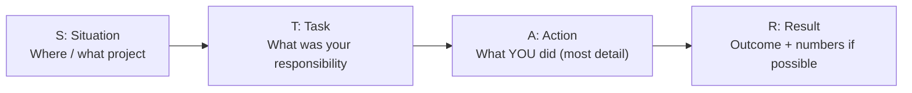

Use **STAR** for every behavioral question (challenge, failure, conflict, deadline).

**Template:**

- **Situation:** In my project at Axtra Studios, `[a page / API was slow, a bug in production, a tight deadline]`.
- **Task:** I was responsible for `[fixing it / delivering it]`.
- **Action:** I `[found the cause using X, added an index / caching / refactored Y, tested it]`.
- **Result:** `[Load time went from X to Y / bug fixed before release / client happy]`.

**Tip:** prepare 2–3 real stories in advance. One story can answer many questions.

---
