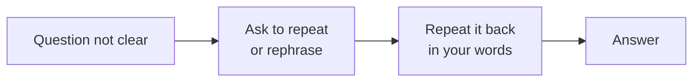

Never guess silently. Asking is normal and professional.

| English                                                  | Urdu                                          |
| -------------------------------------------------------- | --------------------------------------------- |
| Sorry, could you please repeat the question?             | معاف کیجیے، کیا آپ سوال دوبارہ دہرا سکتے ہیں؟     |
| Could you please explain that a little more?             | کیا آپ تھوڑا اور وضاحت کر سکتے ہیں؟              |
| Just to confirm, you are asking about ... , right?       | تصدیق کے لیے، آپ ... کے بارے میں پوچھ رہے ہیں، ٹھیک؟ |
| Do you mean ... or ... ?                                 | آپ کا مطلب ... ہے یا ... ؟                       |

---
