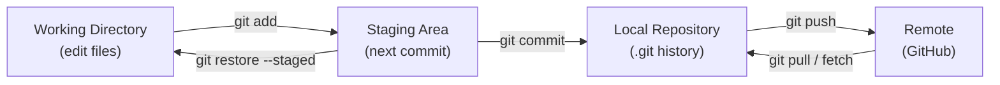

Git has three main areas:

## 1. Working Directory

- Where you create and modify files.
- New files are **untracked** until you `git add` them. Changes to already-tracked files show as **modified**, but they are not part of the next commit until staged.

Example:

```bash
git status
```

---

## 2. Staging Area

- Where you prepare changes before committing.
- Files are added using `git add`.
- Lets you commit only some of your changes.

Example:

```bash
git add file.js
```

---

## 3. Repository

- Where Git permanently stores committed changes (the `.git` folder).

Example:

```bash
git commit -m "Add new feature"
```

---
