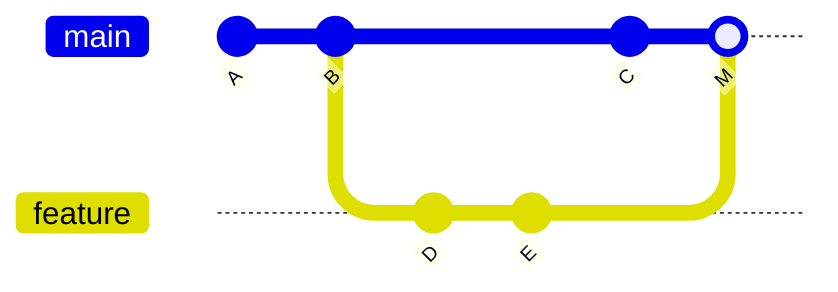

| `git merge` | `git rebase` |
|---|---|
| Combines two branches together. | Moves (replays) your commits on top of another branch. |
| Keeps the original commit history. | Creates a cleaner linear history. |
| Creates a merge commit. | Rewrites commit history (new commit IDs). |
| Safer for shared branches. | Better for cleaning local branches. |

**Before** — `feature` was created from `main` at B, then both moved on:

```text
          D ── E        feature
         /
A ── B ── C             main
```

**After `git merge feature` (on main)** — a new merge commit M joins them:



**After `git rebase main` (on feature)** — D and E are replayed on top of C as new commits D' and E':

```text
A ── B ── C ── D' ── E'     feature
          ↑
         main
```

**Golden rule:** never rebase commits that are already pushed to a shared branch — it rewrites history that others have.

Example:

### Merge

```bash
git checkout main
git merge feature
```

### Rebase

```bash
git checkout feature
git rebase main
```

---
