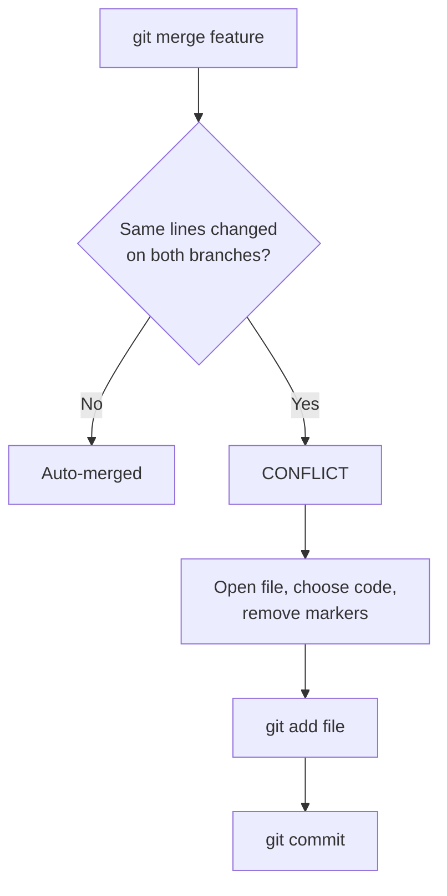

A conflict happens when two branches change **the same lines** of the same file, and Git can't decide which to keep.



Steps:

1. Check conflicted files.

```bash
git status
```

2. Open the conflicted file.

3. Decide which code to keep.

Conflict example:

```text
<<<<<<< HEAD
Your code
=======
Incoming code
>>>>>>> branch-name
```

4. Remove conflict markers:

```text
<<<<<<<
=======
>>>>>>>
```

5. Add the resolved file.

```bash
git add file.js
```

6. Commit changes.

```bash
git commit -m "Resolve merge conflict"
```

To cancel the merge completely: `git merge --abort`.

---
