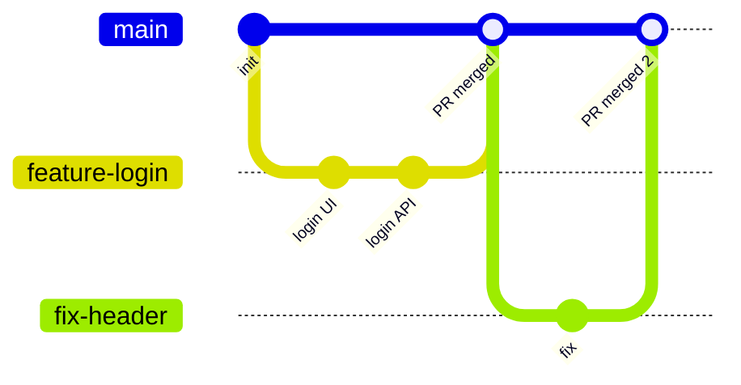

A branching strategy is the team's rule for how branches are created and merged.

### Feature branch workflow (most common)

1. Create a branch from `main` for each feature or fix.
2. Push it and open a **Pull Request**.
3. Code review + CI checks pass.
4. Merge into `main`, then deploy.

| Git Flow | Trunk-Based |
|---|---|
| Long-lived `main`, `develop`, `release/*`, `hotfix/*` branches | One main branch (`main` / trunk) |
| Good for scheduled releases | Good for continuous deployment |
| More process, more merges | Short-lived branches, merged daily |

---
