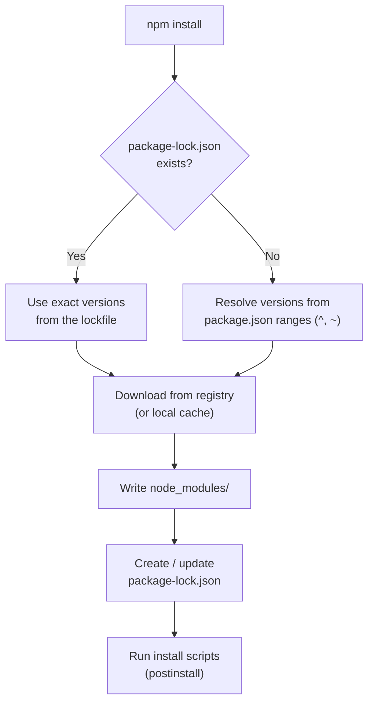

## What is NPM?

**NPM (Node Package Manager)** is a package management tool for JavaScript and Node.js projects. It is used through the **CLI (Command Line Interface)** to:

* Install packages
* Update dependencies
* Remove packages
* Manage project dependencies

It also refers to the **npm registry** — the online database (npmjs.com) where packages are published.

```text
npmjs.com registry  ──npm install──►  node_modules/  (your project)
        ▲
        └────────── npm publish ────  your package
```

---



---
