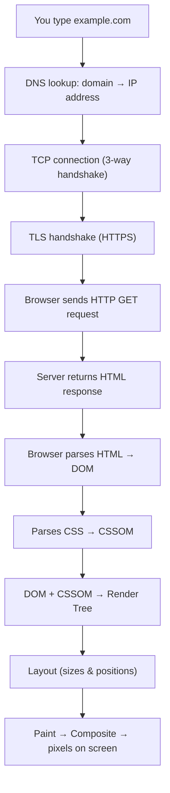

## What is HTML?

HTML (**HyperText Markup Language**) is the standard markup language used to structure web pages. It defines the structure of content using elements and tags.

```text
<p class="intro">Hello</p>
 │    │            │     │
 │    │            │     └── closing tag
 │    │            └──────── content
 │    └───────────────────── attribute (name="value")
 └────────────────────────── opening tag
 └──────────── whole thing = ELEMENT ────────────┘
```

---

One of the most asked web questions. Give the overview, then go deeper where the interviewer pushes.



1. **DNS lookup** — browser cache → OS cache → resolver → finds the IP address.
2. **TCP + TLS** — open a connection and agree on encryption (HTTPS).
3. **HTTP request / response** — the server sends back HTML.
4. **Parsing** — HTML becomes the **DOM**, CSS becomes the **CSSOM**. Scripts may pause parsing (see `async` vs `defer`).
5. **Render** — Render Tree → Layout → Paint → Composite.

This last part is called the **Critical Rendering Path**.

---
