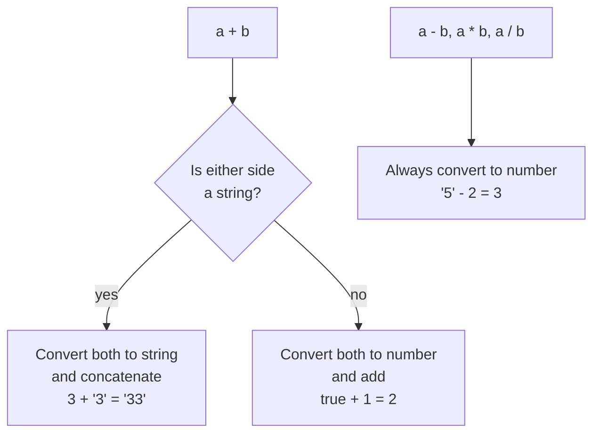

Automatic conversion of value from one data type to another. It handles type coercion in two distinct ways.

- **Implicit coercion:** done automatically by the engine
- **Explicit coercion:** done intentionally by the developer (`Number('5')`, `String(5)`, `Boolean(0)`)



### String Coercion
Occurs most often with the + operator. If any operand is a string, JavaScript converts the others to strings and concatenates them.

```javascript
var x = 3;
var y = '3';
x + y; // Returns "33"
```

### Number Coercion
- Occurs with arithmetic operators like -, *, /, and comparison operators like >.
- JavaScript attempts to convert strings or booleans into numbers.
- Example: "5" - 2 results in 3.

### Boolean Coercion
- Occurs in logical contexts like if statements or logical operators (&&, ||).
- Values are coerced to either "truthy" or "falsy".

There are only **8 falsy values**; everything else is truthy (including `[]`, `{}`, and `'0'`):

```text
false   0   -0   0n   ""   null   undefined   NaN
```

```javascript
var x = 0;
var y = 23;
if (x) {
  console.log(x);
} // Not run (Falsy)
if (y) {
  console.log(y);
} // Runs (Truthy)

// Logical operators return one of the operands, not true/false
x || y; // Returns 23 (first truthy value)
x && y; // Returns 0  (first falsy value — x is falsy so && stops there)
```

### Equality Coercion

```javascript
var a = 12;
var b = '12';
a == b;  // Returns true (coercion happens)
a === b; // Returns false (no coercion)
```

- `==`: Compares values after type coercion
- `===`: Compares values AND types (no coercion) — use this by default

```text
12 == '12'
   │
   ▼  types differ → convert string to number
12 == 12  → true

12 === '12'
   │
   ▼  types differ → stop
false
```
