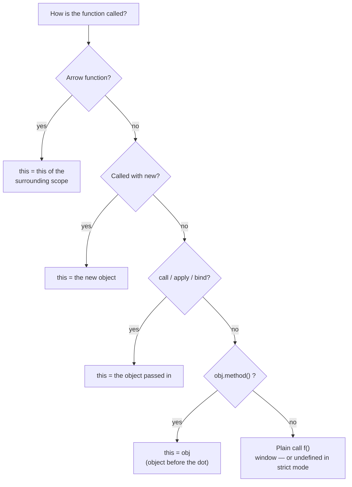

`this` is decided by **how a function is called**, not where it is written (except arrow functions).



```javascript
function doSomething() {
  console.log(this);
}
doSomething(); // window in a browser (undefined in strict mode)
```

**Rule:** Check the object before the dot.

```javascript
var obj = {
  name: 'vivek',
  getName: function () {
    console.log(this.name);
  },
};
obj.getName(); // "vivek"

var getName = obj.getName;
var obj2 = { name: 'akshay', getName };
obj2.getName(); // "akshay"

getName(); // undefined — no object before the dot, `this` is lost
```

---
