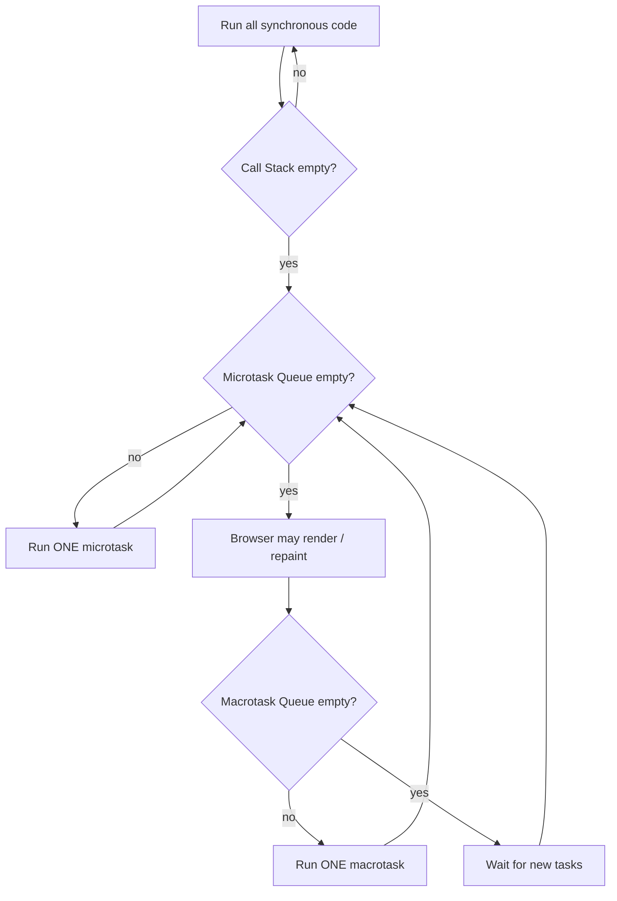

JavaScript is single-threaded. The Event Loop is what lets it handle asynchronous work without blocking.

### Runtime Components

| Component           | Role                                                                          |
| ------------------- | ----------------------------------------------------------------------------- |
| **V8 Engine**       | The brain — contains the single Call Stack and the Heap (memory)              |
| **Web APIs**        | Background workers provided by the browser (timers, fetch, DOM events) that run outside the main thread |
| **Queues**          | Two lines — the high-priority Microtask Queue and low-priority Macrotask (Task) Queue |
| **Event Loop**      | Traffic cop — when the Call Stack is empty, moves tasks from the queues into it |

### The Big Picture

```text
┌──────────────── JS Engine (V8) ────────────────┐      ┌──────── Web APIs ────────┐
│                                                │      │                          │
│   Call Stack            Heap                   │      │  setTimeout timer        │
│  ┌───────────┐                                 │ ───► │  fetch / XHR             │
│  │           │                                 │      │  DOM events (click)      │
│  │           │                                 │      │                          │
│  └───────────┘                                 │      └────────────┬─────────────┘
└───────▲────────────────────────────────────────┘                   │ when done
        │                                                            ▼
        │           ┌─────────────────────────────────────────────────────────┐
        │           │ Microtask Queue  (VIP)  : .then, await, queueMicrotask   │
        │           ├─────────────────────────────────────────────────────────┤
        │           │ Macrotask Queue (normal): setTimeout, setInterval, events│
        │           └─────────────────────────────────────────────────────────┘
        │                                    │
        └────────────  EVENT LOOP  ◄─────────┘
         "Is the stack empty? → run ALL microtasks → then ONE macrotask → repeat"
```

### Execution Phases (Chronological Order)

**1. Synchronous code runs first**

Code runs top to bottom. Synchronous code goes straight onto the Call Stack and executes immediately.

**2. Async work is handed off**

When the engine hits something async it doesn't block — it hands the work elsewhere:

| Async Type                 | Goes To                                                          |
| -------------------------- | ---------------------------------------------------------------- |
| `setTimeout` / `setInterval` | Web API (timer runs) → then → **Macrotask Queue**              |
| `fetch()`                  | Web API (network) → when the response arrives, its `.then` → **Microtask Queue** |
| `Promise.then()` on an already-resolved promise | Directly → **Microtask Queue**                |

**3. Once the Call Stack is empty, the Event Loop takes over**

- **First** → drain the **entire** Microtask Queue, running every microtask one by one until it is completely empty (not just one).
- **Then** → take **ONE** task from the Macrotask Queue, push it to the Call Stack, and run it.
- After that macrotask finishes, check the Microtask Queue again and drain it fully (new microtasks may have been added), then run the next macrotask, and so on.



### Microtasks vs Macrotasks

| Microtasks                                | Macrotasks                                        |
| ----------------------------------------- | ------------------------------------------------- |
| Higher priority                           | Run after microtasks                              |
| Execute right after the current sync code | Execute after the microtask queue is cleared      |
| `Promise.then()`, `queueMicrotask()`, `await` | `setTimeout()`, `setInterval()`, I/O, UI events |
| The Event Loop clears **all** of them     | The Event Loop takes **one**, then rechecks microtasks |

### Example 1 — Step by Step

```javascript
console.log('1');
setTimeout(() => console.log('2'), 0);
Promise.resolve().then(() => console.log('3'));
console.log('4');
// Output: 1, 4, 3, 2
```

```text
STEP 1 — console.log('1')  (sync)
  Call Stack: [ log('1') ]     Micro: [ ]          Macro: [ ]        Output: 1

STEP 2 — setTimeout(cb, 0)  → handed to Web API timer, 0ms later cb moves to Macro
  Call Stack: [ ]              Micro: [ ]          Macro: [ log2 ]   Output: 1

STEP 3 — Promise.then(cb)   → promise is already resolved, cb goes to Micro
  Call Stack: [ ]              Micro: [ log3 ]     Macro: [ log2 ]   Output: 1

STEP 4 — console.log('4')  (sync)
  Call Stack: [ log('4') ]     Micro: [ log3 ]     Macro: [ log2 ]   Output: 1 4

── Sync code finished. Call Stack is empty. Event Loop starts. ──

STEP 5 — drain ALL microtasks
  Call Stack: [ log3 ]         Micro: [ ]          Macro: [ log2 ]   Output: 1 4 3

STEP 6 — run ONE macrotask
  Call Stack: [ log2 ]         Micro: [ ]          Macro: [ ]        Output: 1 4 3 2
```

**Why does `setTimeout(fn, 0)` not run immediately?** `0` means "at least 0ms" — it still has to wait for the stack to empty **and** for all microtasks to finish.

### Example 2 — async/await (very common)

```javascript
console.log('A');

setTimeout(() => console.log('B'), 0);

async function run() {
  console.log('C');
  await null;
  console.log('D');
}
run();

Promise.resolve().then(() => console.log('E'));

console.log('F');
// Output: A C F D E B
```

```text
Sync phase:
  'A'               → printed
  setTimeout        → Macro: [ B ]
  run() → 'C'       → printed (code before await is synchronous)
  await null        → rest of run() goes to Micro: [ D ]
  .then(E)          → Micro: [ D, E ]
  'F'               → printed                       Output: A C F

Microtasks (in order they were queued):
  D → printed
  E → printed                                       Output: A C F D E

Macrotask:
  B → printed                                       Output: A C F D E B
```

**Key rule:** everything inside an `async` function **before** the first `await` runs synchronously.

### Example 3 — microtask inside a macrotask

```javascript
setTimeout(() => {
  console.log('T1');
  Promise.resolve().then(() => console.log('P1'));
}, 0);
setTimeout(() => console.log('T2'), 0);
// Output: T1, P1, T2
```

```text
Macro: [ T1, T2 ]
Run T1 → prints T1, queues P1      Micro: [ P1 ]   Macro: [ T2 ]
Drain micro → prints P1            Micro: [ ]      Macro: [ T2 ]
Run T2 → prints T2
```

Microtasks are drained **after every single macrotask**, not just once at the start.

**Warning:** a microtask that keeps queueing more microtasks blocks the macrotask queue forever — the page freezes.

---
