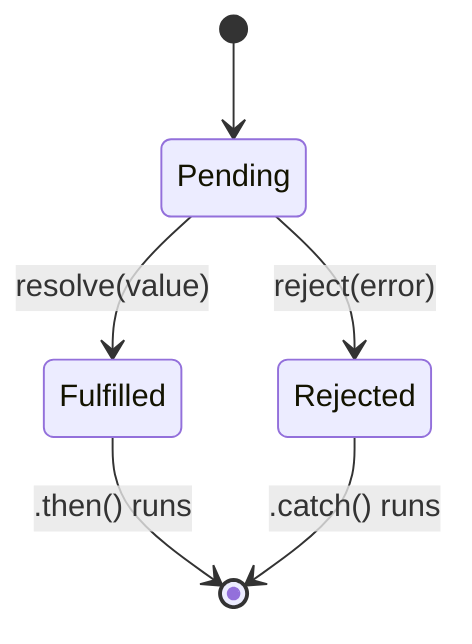

A Promise is an object representing a value that will be available **later** (or an error).

```javascript
function sumOfThreeElements(...elements) {
  return new Promise((resolve, reject) => {
    if (elements.length > 3) {
      reject('Only three elements or less');
    } else {
      let sum = 0;
      elements.forEach(e => (sum += e));
      resolve('Sum: ' + sum);
    }
  });
}

sumOfThreeElements(4, 5, 6)
  .then(result => console.log(result))
  .catch(error => console.log(error));
```

A promise is always in one of three states: **pending**, **fulfilled**, or **rejected**. Once settled, it never changes again.



### Promise chaining

Each `.then()` returns a **new** promise, so you can chain them. Whatever you return goes to the next `.then()`.

```text
fetchUser()
  .then(user  => fetchOrders(user))   ── returns promise ──┐
  .then(orders => orders.length)      ◄────────────────────┘ ── returns 3 ─┐
  .then(count => console.log(count))  ◄───────────────────────────────────┘
  .catch(err  => ...)                 ◄── any error above jumps straight here
```

---
