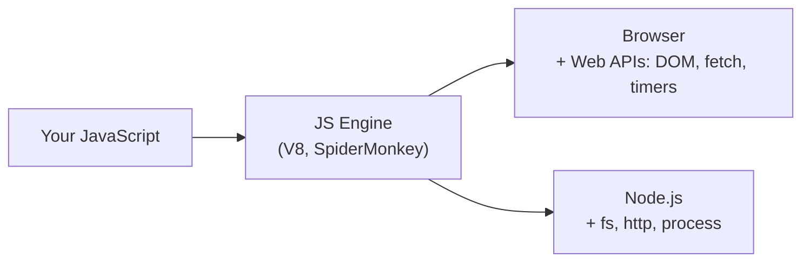

---

JavaScript is a high-level, single-threaded, dynamically typed programming language that adds interactivity, logic, and dynamic behaviors to websites. With Node.js it also runs on the server.

The language is the same; the **runtime** (browser or Node) decides which extra APIs you get.
