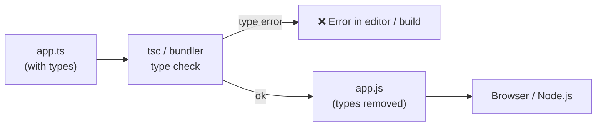

---

**TypeScript** is a superset of JavaScript that adds **static typing** and other features to JavaScript. TypeScript code is compiled into JavaScript before execution.

Types exist **only at compile time**. At runtime it is plain JavaScript — TypeScript cannot validate API responses or user input by itself.

| **JavaScript (JS)**          | **TypeScript (TS)**                               |
| ---------------------------- | ------------------------------------------------- |
| Dynamically typed            | Statically typed                                  |
| Types are checked at runtime | Types are checked during development/compile time |
| No type definitions required | Supports type definitions                         |
| Runs directly in browsers and Node.js | Requires compilation                     |
| Easier to start              | Better for large-scale applications               |
| Uses `.js` files             | Uses `.ts` files                                  |
| Example: `let age = 25`      | Example: `let age: number = 25`                   |

---
