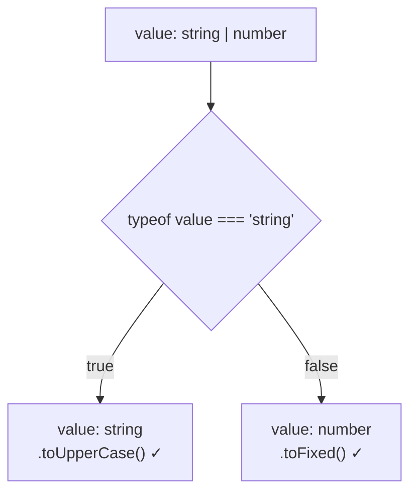

**Type narrowing** means reducing a union type into a more specific type so TypeScript can understand what operations are safe.



Ways to achieve type narrowing:

* `typeof`
* `instanceof`
* `in`
* Equality checks
* Custom type guards
* Discriminated unions

Example:

```ts
function print(value: string | number) {
  if (typeof value === "string") {
    console.log(value.toUpperCase());
  } else {
    console.log(value.toFixed(2));
  }
}
```

### Custom type guard (`is`)

```ts
interface Cat { meow(): void }
interface Dog { bark(): void }

function isCat(animal: Cat | Dog): animal is Cat {
  return "meow" in animal;
}

if (isCat(pet)) {
  pet.meow(); // pet is Cat here
}
```

### Discriminated union (most useful pattern)

Each member has a common literal field (`status`) that tells TypeScript which shape it is.

```ts
type Result =
  | { status: "success"; data: string }
  | { status: "error"; message: string };

function handle(result: Result) {
  switch (result.status) {
    case "success":
      return result.data;    // TS knows: data exists
    case "error":
      return result.message; // TS knows: message exists
    default: {
      const check: never = result; // error if a new status is not handled
      return check;
    }
  }
}
```

---
