React is an open-source JavaScript library developed by Meta (Facebook) for building user interfaces, especially single-page applications (SPAs). It updates only the changed parts of the UI, which improves performance.

### Main Features

- **Virtual DOM** — efficiently updates the UI without reloading the whole page
- **JSX** — write HTML-like UI code inside JavaScript
- **Component-Based Architecture** — the UI is broken into small, isolated, reusable pieces
- **One-Way Data Binding** — unidirectional data flow, so updates are predictable
- **Hooks** — use state and lifecycle features in function components
- **Declarative UI** — describe what the UI should look like, not how to update it

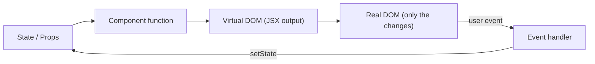

### Virtual DOM

The Virtual DOM is a lightweight, in-memory copy of the actual DOM.

#### How It Works

On state change, React builds a new Virtual DOM tree and, during reconciliation (scheduled by Fiber), diffs it against the previous one to find exactly what changed. Then, in the commit phase, it applies only those minimal changes to the real DOM.

**1. Trigger (State/Props Change)**

Something asks React to update: the first mount, a `setState` call, or a parent re-rendering. React does not mutate the existing Virtual DOM.

**2. Render Phase (Fiber Architecture)**

React calls your components and builds a **brand new** Virtual DOM tree representing the updated UI. At this point there are two trees: the previous one and the new one. **Fiber** is React's internal reconciliation architecture that lets React schedule, prioritize, pause, and resume this work.

**3. Reconciliation (Diffing Engine)**

- **Reconciliation** = the overall process of comparing the previous and new trees to determine what changed, including figuring out component identity using `key`. It is scheduled and prioritized by Fiber.
- **Diffing** = the algorithm used _within_ reconciliation that compares the two trees node by node to find exactly what changed.

**4. Commit (Real DOM Updates)**

Once React knows what changed, it applies only those specific changes to the real DOM, instead of re-rendering the entire UI. Effects run after this.

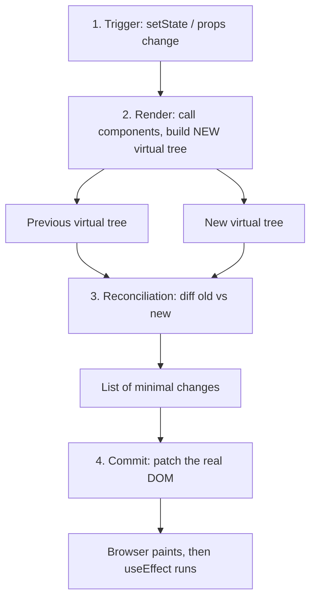

#### Virtual DOM vs Real DOM

| Aspect              | Virtual DOM                                      | Real DOM                                           |
| ------------------- | ------------------------------------------------ | -------------------------------------------------- |
| What it is          | Lightweight JS object copy of the UI             | Actual browser DOM structure                       |
| Update speed        | Fast (in-memory)                                 | Slow (triggers layout / reflow / repaint)          |
| Update process      | Batches changes, then updates only what's needed | Each change applies immediately and can trigger layout/repaint |
| Direct manipulation | Not visible to the user                          | Directly visible to the user                       |
| Cost                | Cheap to create and discard                      | Expensive to manipulate frequently                 |

#### Is the Virtual DOM always faster than direct DOM manipulation?

**No.** Hand-written, targeted DOM updates can beat it. The Virtual DOM's advantage shows up in complex UIs with frequent, unpredictable updates across many elements — and in developer experience, since you describe the result instead of the steps.

#### Does the Virtual DOM eliminate all DOM manipulation?

**No** — it minimizes it, but the final updates still touch the real DOM. It optimizes **how much** and **how often**, not **whether**.

---

### Render Phase vs Commit Phase

React does its work in two phases. Only the commit phase touches the real DOM.

| Render Phase                                   | Commit Phase                                   |
| ---------------------------------------------- | ---------------------------------------------- |
| Calls your component functions                 | Applies changes to the real DOM                |
| Pure — no side effects allowed                 | Side effects are allowed here (refs, effects)  |
| Can be paused, restarted, or thrown away       | Runs synchronously, cannot be interrupted      |
| May run more than once (Strict Mode, concurrent) | Runs once per update                          |

```text
setState()
   │
   ▼
┌──────────── RENDER PHASE (pure, interruptible) ────────────┐
│  call App() → call Child() → build new virtual tree → diff │
└────────────────────────────────────────────────────────────┘
   │
   ▼
┌──────────── COMMIT PHASE (sync, touches DOM) ──────────────┐
│  update DOM → attach refs → useLayoutEffect → paint        │
└────────────────────────────────────────────────────────────┘
   │
   ▼
useEffect runs (after paint)
```

**Why it matters:** because render can run more than once, never put side effects (API calls, subscriptions, mutations) directly in the component body — put them in `useEffect` or event handlers.

---

### JSX

JSX stands for **JavaScript XML**. It lets you write HTML-like elements directly inside JavaScript.

Browsers cannot read JSX directly — a compiler like **Babel** transpiles it into `React.createElement()` calls (or the modern JSX runtime).

```jsx
const el = <h1 className="title">Hello</h1>;

// becomes roughly:
const el = React.createElement('h1', { className: 'title' }, 'Hello');
```

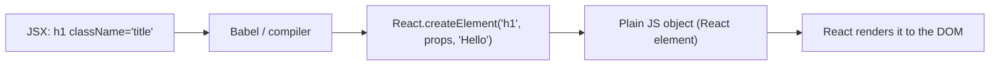

---

### Functional vs Class Components

**Functional Components**

- Plain JS functions
- Manage state with `useState` and handle lifecycle through `useEffect`
- Simpler to read, easier to test, smaller bundle size

**Class Components**

- ES6 class syntax, rely on the `this` keyword
- Require a `render()` method and separate lifecycle methods like `componentDidMount`, `componentDidUpdate`, and `componentWillUnmount`

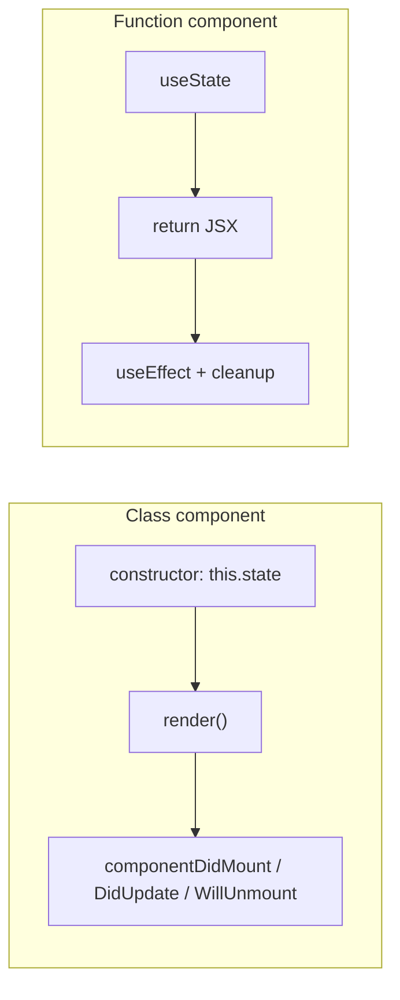

---

### Controlled vs Uncontrolled Components

| Controlled                                           | Uncontrolled                                 |
| ---------------------------------------------------- | -------------------------------------------- |
| Data stored in React state                           | Data stored directly in the DOM              |
| Value read from a state variable                     | Value read via a ref (`useRef`) when needed  |
| Re-renders on every keystroke                        | Typing does not re-render the component      |
| Enables real-time, character-by-character validation | Validation usually happens at submit time    |

```jsx
// Controlled
const [name, setName] = useState('');
<input value={name} onChange={(e) => setName(e.target.value)} />;

// Uncontrolled
const inputRef = useRef(null);
<input ref={inputRef} defaultValue="" />;
```

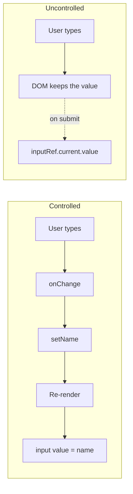

---

### Conditional Rendering

Rendering different UI depending on a condition.

```jsx
// if / else
if (loading) return <Spinner />;

// Ternary
{isLoggedIn ? <Dashboard /> : <Login />}

// Logical &&
{hasError && <ErrorMessage />}
```

**Careful with `&&`:** a number like `0` renders as `0` instead of nothing. Use `count > 0 && <List />` rather than `count && <List />`.

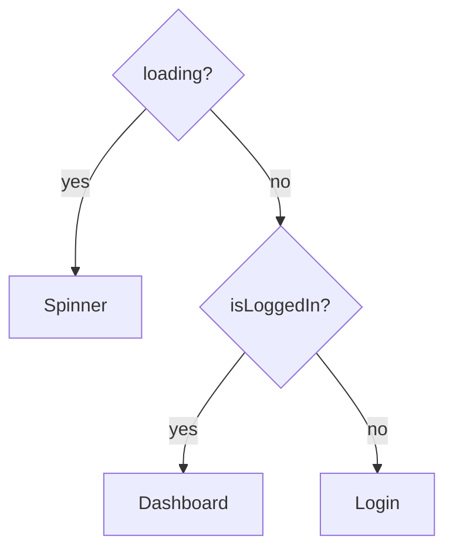

---

### State vs Props

| State                                  | Props                                             |
| -------------------------------------- | ------------------------------------------------- |
| Data managed inside a component        | Data passed from parent → child                   |
| Can be updated by the component itself | Read-only (immutable) for the receiving component |

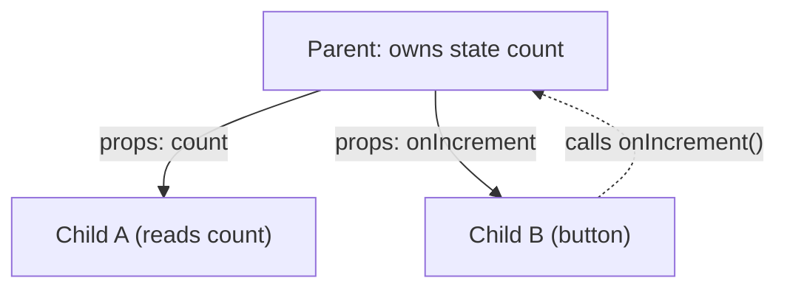

Data flows **down** as props; changes flow **up** as callback calls.

---

### Lists and Keys

Lists are rendered by mapping an array to JSX. Each item needs a stable, unique `key` so React can match old and new items during reconciliation.

```jsx
{todos.map((todo) => (
  <TodoItem key={todo.id} todo={todo} />
))}
```

**Why not use the array index as key?** If items are inserted, deleted, or reordered, the index of each item changes, so React matches the wrong components — state (like an input's text or a checkbox) sticks to the wrong row.

```text
Before:  key=0 "Milk" [✓]   key=1 "Eggs" [ ]
Insert "Bread" at top, keys = index:
After:   key=0 "Bread" [✓]  ← React reused key=0, so the ✓ moved to the wrong item!
         key=1 "Milk"  [ ]
         key=2 "Eggs"  [ ]

With key = todo.id:
After:   key=b "Bread" [ ]  ← new component
         key=m "Milk"  [✓]  ← same component, state kept
         key=e "Eggs"  [ ]
```

Index as key is fine **only** when the list is static (never reordered, filtered, or inserted into).

---

### Fragments

Fragments group several elements without adding an extra DOM node.

```jsx
return (
  <>
    <td>Name</td>
    <td>Age</td>
  </>
);

// Use the long form when you need a key
<React.Fragment key={item.id}>...</React.Fragment>
```

```text
With <div> wrapper:          With Fragment:
<tr>                         <tr>
  <div>   ← invalid in a table <td>Name</td>
    <td>Name</td>              <td>Age</td>
    <td>Age</td>             </tr>
  </div>
</tr>
```

---

### Lifting State Up

Moving local state from child components up to their closest common parent, so multiple children can share, sync, and update the same data.

```jsx
function Parent() {
  const [value, setValue] = useState('');
  return (
    <>
      <SearchInput value={value} onChange={setValue} />
      <ResultsList query={value} />
    </>
  );
}
```

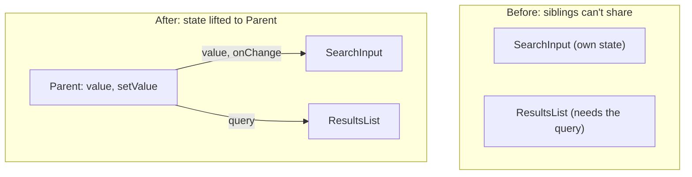

---

### Prop Drilling

Passing data through multiple components that don't actually need the data themselves.

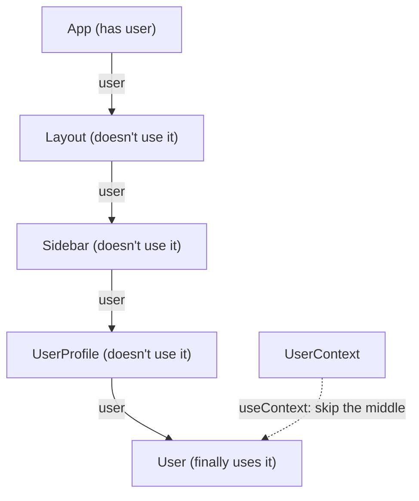

Solutions:

- Component composition (pass JSX as `children`)
- Context
- State-management libraries
- Better component architecture

**Note:** prop drilling isn't automatically bad. Passing props through one or two levels is often perfectly fine.

---

### Client State vs Server State

| Client State (UI State)                      | Server State (Remote State)                                 |
| -------------------------------------------- | ----------------------------------------------------------- |
| Lives in the UI / browser                    | Lives in the database / backend API                         |
| Synchronous and predictable                  | Asynchronous and unpredictable                              |
| Lost on page refresh                         | Persistent across sessions and devices                      |
| Concerns: scoping, re-renders, prop drilling | Concerns: caching, deduplication, revalidation, concurrency |
| `useState`, Zustand, Redux, Jotai            | TanStack Query, SWR, RTK Query                              |

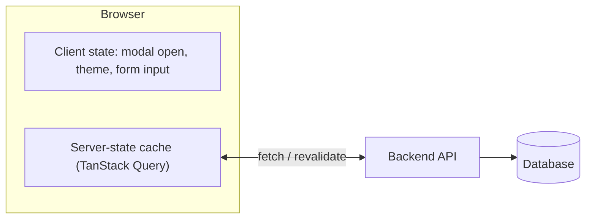

---

### Persisting State

- Browser storage (`localStorage`, `sessionStorage`)
- Cookies
- IndexedDB
- URL / query params (good for filters and pagination)

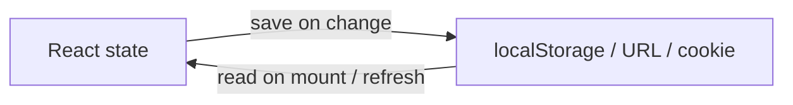

---

### Immutability: Why Not Mutate State Directly?

React decides whether to re-render by comparing the old and new state **by reference** (`Object.is`). If you mutate the same object, the reference doesn't change, so React thinks nothing happened.

```jsx
// ❌ Wrong — same array reference, no re-render
items.push(newItem);
setItems(items);

// ✅ Right — new array reference
setItems([...items, newItem]);

// ✅ Objects
setUser({ ...user, name: 'Ali' });
```

```text
Mutate:     items ──► [a, b, c]  (push d)  ──► [a, b, c, d]
            old ref === new ref  → React: "same" → skips render ❌

Copy:       old ──► [a, b, c]
            new ──► [a, b, c, d]   (different object)
            old ref !== new ref → React re-renders ✅
```

---

### What Happens When a Component Re-renders?

1. The component function runs again (or `render()` for class components)
2. React generates a new Virtual DOM tree
3. React diffs it against the previous tree
4. React calculates the minimal set of changes (reconciliation)
5. Only the changed nodes are updated in the real DOM (commit phase)

**A re-render doesn't always mean the real DOM changes.** If the output is identical, React skips the DOM update.

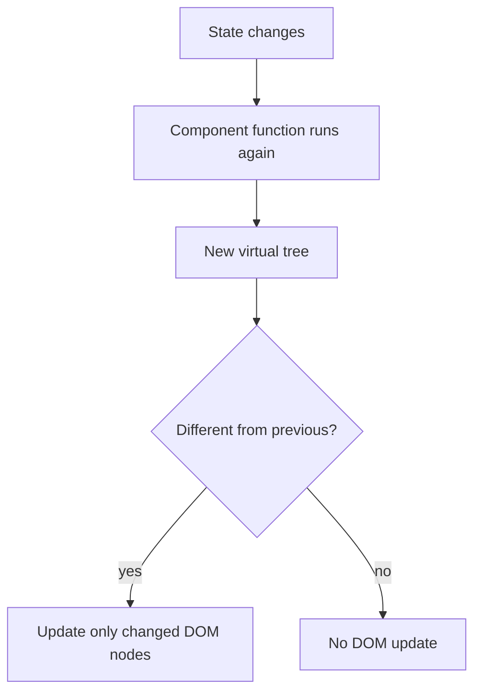

#### Does a state change always update the real DOM?

**No.**

- State change → triggers a re-render (Virtual DOM recalculated)
- The real DOM is updated **only if** diffing detects an actual difference

React also **bails out entirely** if you set state to the same value it already has (compared with `Object.is`), so sometimes not even the re-render happens.

---
