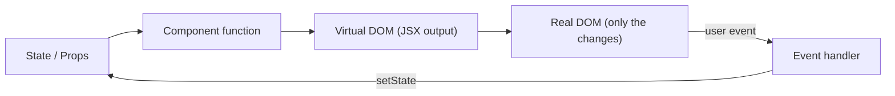

React is an open-source JavaScript library developed by Meta (Facebook) for building user interfaces, especially single-page applications (SPAs). It updates only the changed parts of the UI, which improves performance.

## Main Features

- **Virtual DOM** — efficiently updates the UI without reloading the whole page
- **JSX** — write HTML-like UI code inside JavaScript
- **Component-Based Architecture** — the UI is broken into small, isolated, reusable pieces
- **One-Way Data Binding** — unidirectional data flow, so updates are predictable
- **Hooks** — use state and lifecycle features in function components
- **Declarative UI** — describe what the UI should look like, not how to update it



## Why is React used?

React is used to build fast, interactive UIs with reusable components, predictable one-way data flow, and efficient rendering through Virtual DOM.

## Advantages of React

- Fast updates
- Reusable components
- Clean declarative code
- Strong ecosystem and tooling
- Easy integration with other libraries

## Declarative vs Imperative UI

- **Imperative:** you write the steps — find the element, change its text, add a class.
- **Declarative (React):** you describe what the UI should look like for a given state, and React works out the steps.

```text
Imperative:  btn.textContent = 'Liked'; btn.classList.add('active');
Declarative: <button className={liked ? 'active' : ''}>{liked ? 'Liked' : 'Like'}</button>
```

---
