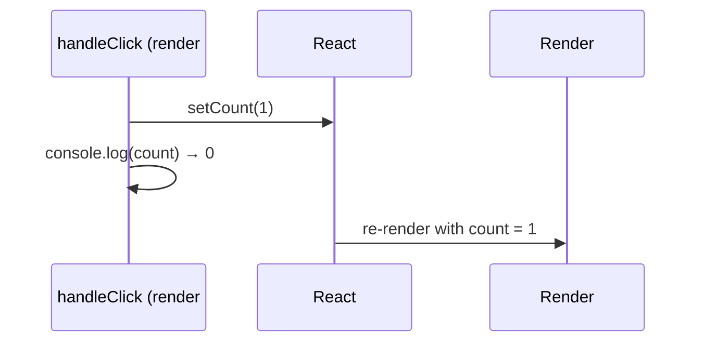
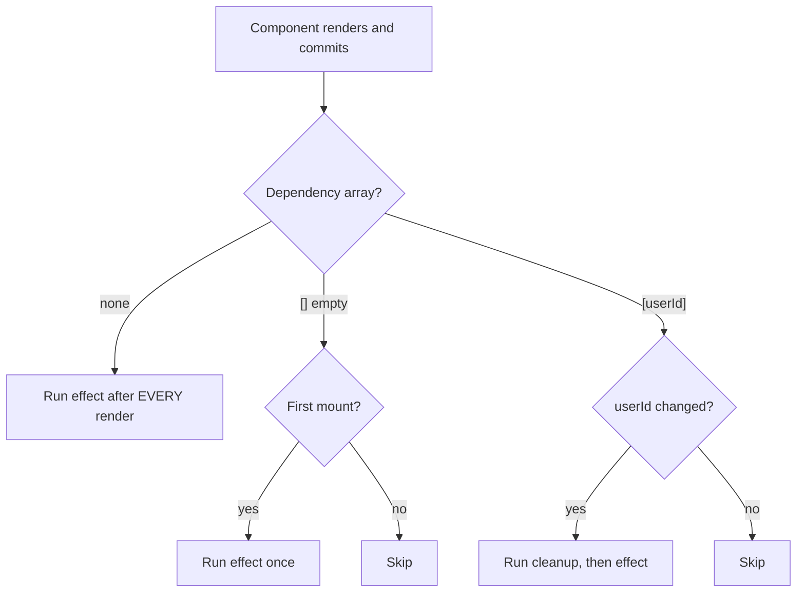
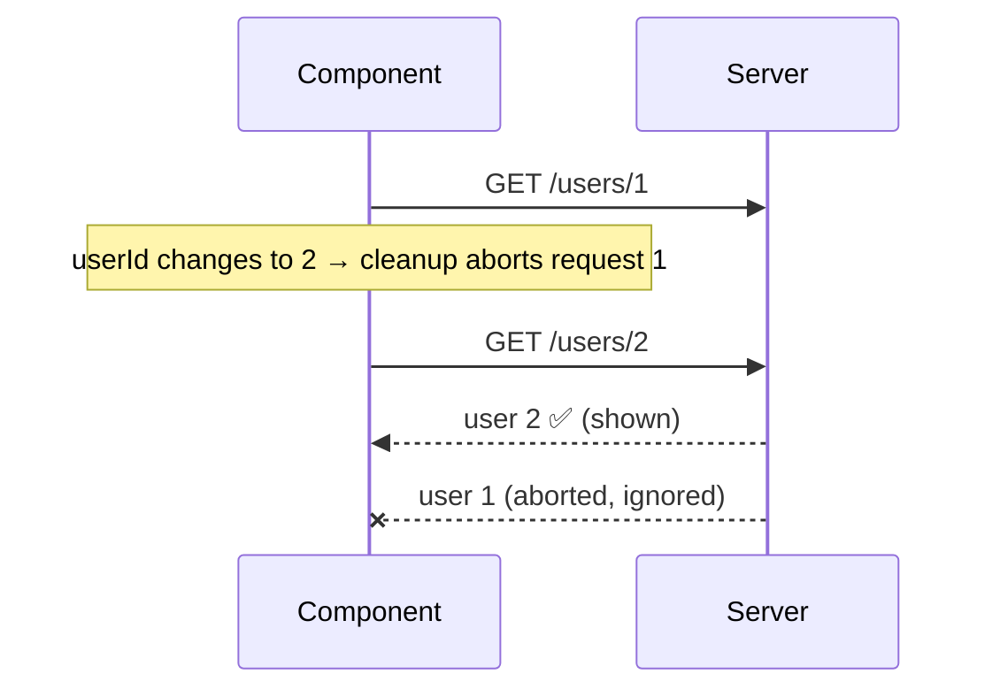
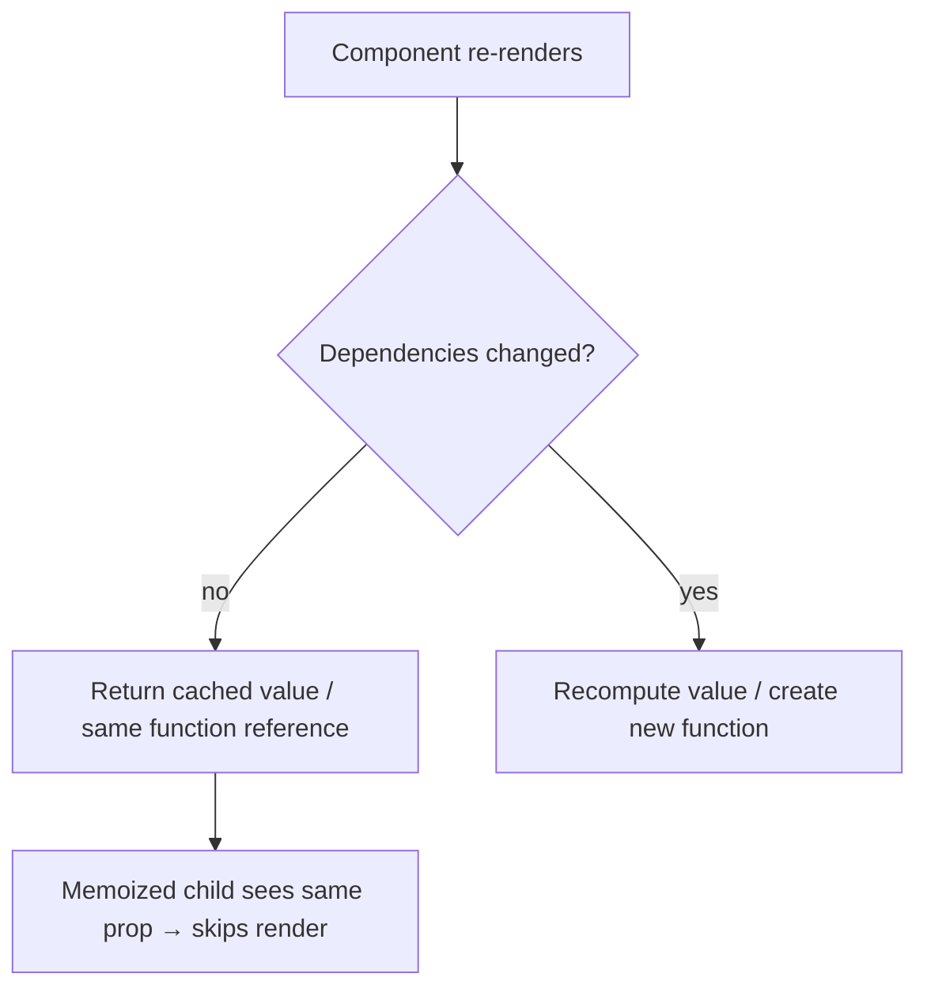
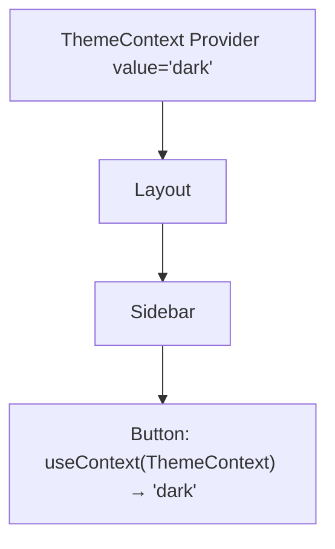
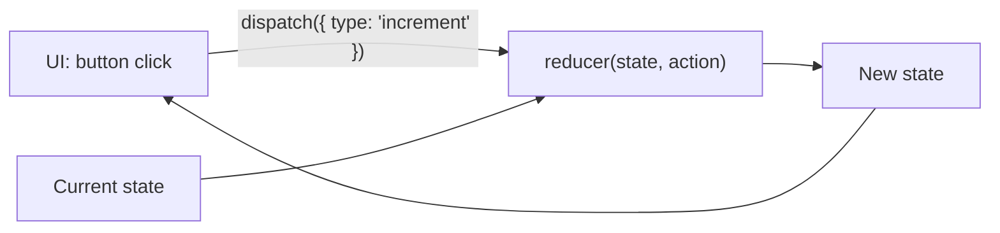
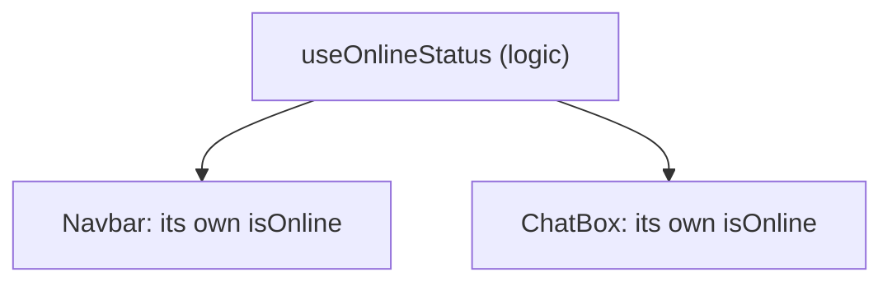

### What are Hooks, and what are the Rules of Hooks?

Hooks are functions that let function components use state, lifecycle, refs, context, and other React features.

**Rules:**

1. Call hooks only at the **top level** — never inside conditions, loops, or nested functions.
2. Call hooks only from **React components or custom hooks**.

**Why?** React doesn't store hooks by name. It stores them in a list, in call order, per component. If a hook is skipped on one render, every hook after it reads the wrong slot.

```text
Render 1 (isLoggedIn = true)     Render 2 (isLoggedIn = false)
slot 0: useState('Ali')          slot 0: useState('Ali')
slot 1: useState(0)  ← in if     slot 1: useEffect(...)   ← reads count's slot! 💥
slot 2: useEffect(...)
```

```jsx
// ❌ Breaks the order
if (isLoggedIn) {
  const [count, setCount] = useState(0);
}

// ✅ Always call the hook, put the condition inside
const [count, setCount] = useState(0);
```

---

### useState

Lets a function component store state.

```jsx
const [count, setCount] = useState(0);
```

For updates based on the previous state, prefer the updater form:

```jsx
setCount((prev) => prev + 1);
```

Each render sees a **snapshot** of state. Inside one event handler, `count` is a fixed value, so calling `setCount(count + 1)` twice queues "set to 1" twice — it only increments once. The updater form receives the latest queued value instead.

```text
count = 0

setCount(count + 1);   // queue: "replace with 0 + 1"
setCount(count + 1);   // queue: "replace with 0 + 1"
→ result: 1

setCount(p => p + 1);  // queue: 0 → 1
setCount(p => p + 1);  // queue: 1 → 2
→ result: 2
```

#### Why doesn't state update immediately?

`setState` doesn't change the variable in the current render — it schedules a re-render. The new value is visible in the **next** render.

```jsx
const handleClick = () => {
  setCount(count + 1);
  console.log(count); // still the old value
};
```



---

### Automatic Batching

React groups multiple state updates into **one re-render**. Since React 18 this happens everywhere — event handlers, `setTimeout`, promises, and native event handlers.

```jsx
function handleClick() {
  setCount((c) => c + 1);
  setFlag((f) => !f);
  setName('Ali');
  // → only ONE re-render, not three
}
```

```text
Without batching:  setCount → render   setFlag → render   setName → render   (3 renders)
With batching:     setCount ┐
                   setFlag  ├─► one render
                   setName  ┘
```

---

### useEffect

Lets a component synchronize with external systems: API subscriptions, event listeners, timers, browser APIs, WebSocket connections.

```jsx
useEffect(() => {
  document.title = `Count: ${count}`;
}, [count]);
```

#### Dependency Array

```jsx
useEffect(() => {
  // after every render
});

useEffect(() => {
  // after the initial mount only
}, []);

useEffect(() => {
  // whenever userId changes
}, [userId]);
```

React compares dependencies between renders (with `Object.is`) and re-runs the effect when one changes.



#### Cleanup

Effects can return a cleanup function.

```jsx
useEffect(() => {
  const handleResize = () => console.log(window.innerWidth);

  window.addEventListener('resize', handleResize);

  return () => {
    window.removeEventListener('resize', handleResize);
  };
}, []);
```

Cleanup runs when:

- The component unmounts
- Before the effect runs again because a dependency changed

It prevents memory leaks, duplicate subscriptions, stray listeners, and timers that keep firing after unmount.

```text
Mount              → effect(userId=1)
userId changes 1→2 → cleanup(userId=1) → effect(userId=2)
userId changes 2→3 → cleanup(userId=2) → effect(userId=3)
Unmount            → cleanup(userId=3)
```

**Note:** in Strict Mode during development, React mounts, unmounts, and remounts components once — so effects run twice. This is intentional, to surface missing cleanup.

#### Fetching data in useEffect (race conditions)

If `userId` changes quickly, an older request can finish **after** a newer one and overwrite the correct data. Ignore or abort stale responses in the cleanup.

```jsx
useEffect(() => {
  const controller = new AbortController();

  fetch(`/api/users/${userId}`, { signal: controller.signal })
    .then((res) => res.json())
    .then(setUser)
    .catch((err) => {
      if (err.name !== 'AbortError') setError(err);
    });

  return () => controller.abort();
}, [userId]);
```



In real apps, a data library (TanStack Query, SWR) or framework loader handles this for you.

---

### useEffect vs useLayoutEffect

| useEffect                                  | useLayoutEffect                                       |
| ------------------------------------------ | ----------------------------------------------------- |
| Runs **after** the browser paints          | Runs **before** the browser paints                    |
| Does not block the screen update           | Blocks paint until it finishes                        |
| Default choice: fetching, subscriptions    | Measuring the DOM (size/position) to avoid a flicker  |

```text
render → commit DOM → useLayoutEffect → 🖌️ paint → useEffect
```

Use `useLayoutEffect` only when the user would otherwise see a flicker (for example, positioning a tooltip based on its measured size).

---

### useMemo vs useCallback

```jsx
// useMemo → memoize a VALUE
const expensiveValue = useMemo(() => calculateSomething(data), [data]);

// useCallback → memoize a FUNCTION reference
const handleClick = useCallback(() => doSomething(id), [id]);
```

`useCallback(fn, deps)` is just shorthand for `useMemo(() => fn, deps)`.



**When to use them:** for genuinely expensive calculations, or to keep a stable reference for a `React.memo` child or an effect dependency. Wrapping everything adds cost without benefit.

---

### useRef

Stores a mutable value that persists between renders **without** causing a re-render when changed.

```jsx
const inputRef = useRef(null);

<input ref={inputRef} />;

inputRef.current.focus();
```

Unlike state, `ref.current = value` does not trigger a render. Use it for DOM nodes, timer IDs, and previous values.

#### useRef vs useState

| useState                         | useRef                                  |
| -------------------------------- | --------------------------------------- |
| Changing it re-renders           | Changing it does **not** re-render      |
| Value shown in the UI            | Value kept "behind the scenes"          |
| Updated via setter (scheduled)   | Updated directly (`ref.current = x`)     |

```text
state:  setCount(5)        → 🔄 re-render → UI shows 5
ref:    ref.current = 5    → no render    → UI unchanged, value saved for later
```

---

### useContext

Lets a component consume data from React Context without passing props through every intermediate level.

Common use cases: theme, authentication info, locale, app configuration.



---

### useReducer

Useful for more complex state transitions.

```jsx
const [state, dispatch] = useReducer(reducer, initialState);

function reducer(state, action) {
  switch (action.type) {
    case 'increment':
      return { ...state, count: state.count + 1 };
    default:
      return state;
  }
}
```

Think: **State + Action → Reducer → New State**



**useState vs useReducer:** use `useState` for simple independent values; use `useReducer` when the next state depends on several values or many actions update the same state.

---

### Custom Hooks

A reusable function that uses React Hooks to share **stateful logic** between components.

```jsx
function useOnlineStatus() {
  const [isOnline, setIsOnline] = useState(navigator.onLine);

  useEffect(() => {
    const goOnline = () => setIsOnline(true);
    const goOffline = () => setIsOnline(false);
    window.addEventListener('online', goOnline);
    window.addEventListener('offline', goOffline);
    return () => {
      window.removeEventListener('online', goOnline);
      window.removeEventListener('offline', goOffline);
    };
  }, []);

  return isOnline;
}
```

Custom hooks share logic, **not state** — each component that calls one gets its own independent state.



---
