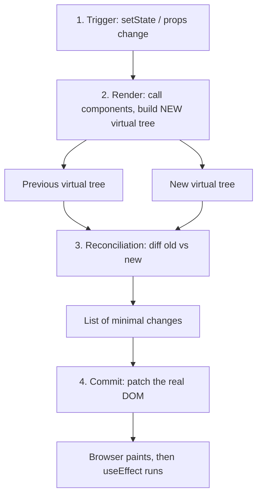

The Virtual DOM is a lightweight, in-memory copy of the actual DOM.

## How It Works

On state change, React builds a new Virtual DOM tree and, during reconciliation (scheduled by Fiber), diffs it against the previous one to find exactly what changed. Then, in the commit phase, it applies only those minimal changes to the real DOM.

**1. Trigger (State/Props Change)**

Something asks React to update: the first mount, a `setState` call, or a parent re-rendering. React does not mutate the existing Virtual DOM.

**2. Render Phase (Fiber Architecture)**

React calls your components and builds a **brand new** Virtual DOM tree representing the updated UI. At this point there are two trees: the previous one and the new one. **Fiber** is React's internal reconciliation architecture that lets React schedule, prioritize, pause, and resume this work.

**3. Reconciliation (Diffing Engine)**

- **Reconciliation** = the overall process of comparing the previous and new trees to determine what changed, including figuring out component identity using `key`. It is scheduled and prioritized by Fiber.
- **Diffing** = the algorithm used _within_ reconciliation that compares the two trees node by node to find exactly what changed.

**4. Commit (Real DOM Updates)**

Once React knows what changed, it applies only those specific changes to the real DOM, instead of re-rendering the entire UI. Effects run after this.

## Virtual DOM vs Real DOM

| Aspect              | Virtual DOM                                      | Real DOM                                           |
| ------------------- | ------------------------------------------------ | -------------------------------------------------- |
| What it is          | Lightweight JS object copy of the UI             | Actual browser DOM structure                       |
| Update speed        | Fast (in-memory)                                 | Slow (triggers layout / reflow / repaint)          |
| Update process      | Batches changes, then updates only what's needed | Each change applies immediately and can trigger layout/repaint |
| Direct manipulation | Not visible to the user                          | Directly visible to the user                       |
| Cost                | Cheap to create and discard                      | Expensive to manipulate frequently                 |

## Is the Virtual DOM always faster than direct DOM manipulation?

**No.** Hand-written, targeted DOM updates can beat it. The Virtual DOM's advantage shows up in complex UIs with frequent, unpredictable updates across many elements — and in developer experience, since you describe the result instead of the steps.

## Does the Virtual DOM eliminate all DOM manipulation?

**No** — it minimizes it, but the final updates still touch the real DOM. It optimizes **how much** and **how often**, not **whether**.

---
