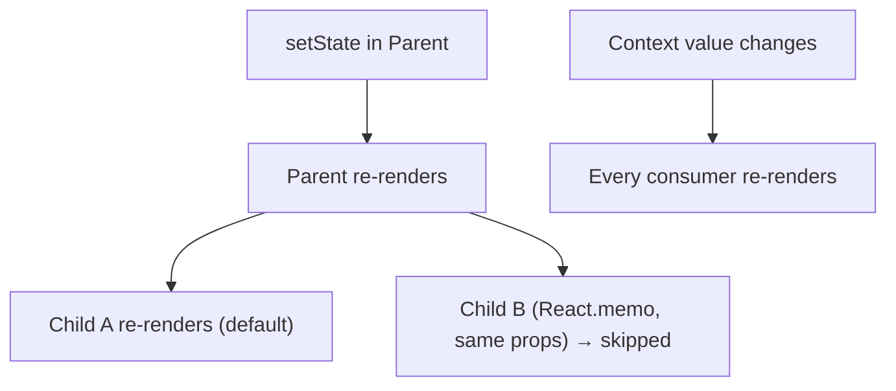
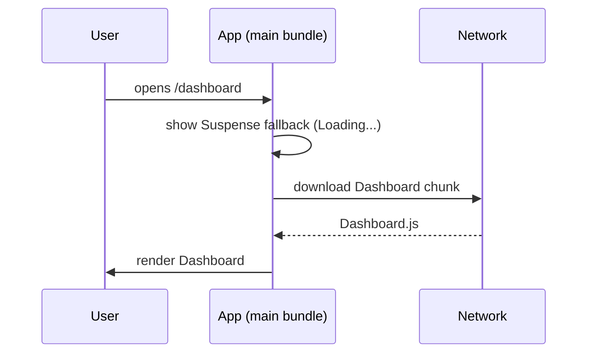

### Why Does a Component Re-render?

A component re-renders when:

- Its **state** changes
- Its **parent re-renders** — by default every child re-renders too, even if its props are the same
- A consumed **context** value changes

Props changing is not a separate trigger — new props only arrive because the parent re-rendered. To skip a child's re-render when its props are unchanged, wrap it in `React.memo`.



Optimization techniques:

- `React.memo`, `useMemo`, `useCallback`
- Proper component structure
- Avoiding unnecessary state
- Keeping state close to where it's used
- Virtualizing very large lists
- Code splitting
- Avoiding unnecessary effects

**Profile first, then optimize.** Identify the actual bottleneck with React DevTools before adding memoization.

---

### React.memo

Prevents a component from re-rendering when its props haven't changed, according to a shallow comparison.

```jsx
const UserCard = React.memo(function UserCard({ user }) {
  return <div>{user.name}</div>;
});
```

It can still re-render when:

- Its own state changes
- A consumed context value changes
- Its parent passes a different prop value (a new object or inline function counts as different)

```text
Parent renders:
  <UserCard user={user} />                   same reference → skip ✅
  <UserCard user={{ name: 'Ali' }} />        new object each render → re-render ❌
  <UserCard onClick={() => select(id)} />    new function each render → re-render ❌
  <UserCard onClick={handleSelect} />        handleSelect from useCallback → skip ✅
```

Don't use it everywhere — it's an optimization tool, and the comparison itself has a cost.

---

### Code Splitting / Lazy Loading

Loading JavaScript only when it's needed, instead of shipping the whole app up front.

```jsx
const Dashboard = lazy(() => import('./Dashboard'));

<Suspense fallback={<Loading />}>
  <Dashboard />
</Suspense>;
```

This reduces the initial bundle and improves first load.



---
