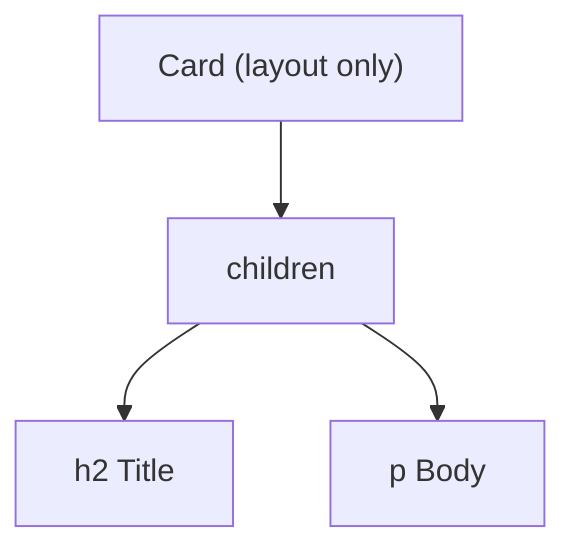

### Q2. Why is ReactJS used?
React is used to build fast, interactive UIs with reusable components, predictable one-way data flow, and efficient rendering through Virtual DOM.

### Q6. What are the advantages of ReactJS?
- Fast updates
- Reusable components
- Clean declarative code
- Strong ecosystem and tooling
- Easy integration with other libraries

### Q15. Explain React Fragments.
Fragments group elements without adding extra DOM nodes. See [Fragments](#fragments).

### Q18. What is state in React?
State is component-local data that changes over time and triggers re-renders when updated.

```text
state changes → component re-renders → UI shows new value
```

### Q21. What are props in React?
Props are read-only inputs passed from parent to child components.

```text
<Greeting name="Ali" />   →   function Greeting({ name }) { ... }   // name = "Ali"
```

### Q91. Declarative vs Imperative UI?

- **Imperative:** you write the steps — find the element, change its text, add a class.
- **Declarative (React):** you describe what the UI should look like for a given state, and React works out the steps.

```text
Imperative:  btn.textContent = 'Liked'; btn.classList.add('active');
Declarative: <button className={liked ? 'active' : ''}>{liked ? 'Liked' : 'Like'}</button>
```

### Q92. What is the `children` prop / component composition?

`children` is whatever you put between a component's opening and closing tags. Composition (passing components as children) is a common way to avoid prop drilling.

```jsx
function Card({ children }) {
  return <div className="card">{children}</div>;
}

<Card>
  <h2>Title</h2>
  <p>Body</p>
</Card>
```



### Q93. Should you copy props into state (derived state)?

Usually **no**. If a value can be calculated from props or other state, calculate it during render. Copying it into state creates two sources of truth that drift apart.

```jsx
// ❌ Goes stale when items changes
const [count, setCount] = useState(items.length);

// ✅ Derive during render
const count = items.length;
```

```text
props.items changes → ❌ state copy still holds old value
props.items changes → ✅ derived value recalculated on render
```

---
