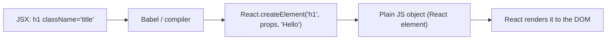

JSX stands for **JavaScript XML**. It lets you write HTML-like elements directly inside JavaScript.

Browsers cannot read JSX directly — a compiler like **Babel** transpiles it into `React.createElement()` calls (or the modern JSX runtime).

```jsx
const el = <h1 className="title">Hello</h1>;

// becomes roughly:
const el = React.createElement('h1', { className: 'title' }, 'Hello');
```



---
