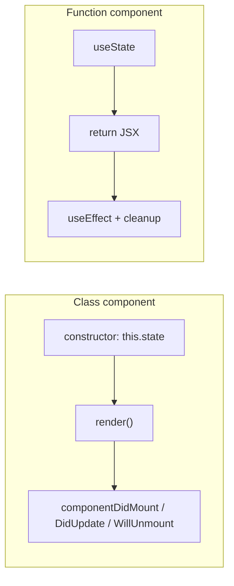

**Functional Components**

- Plain JS functions
- Manage state with `useState` and handle lifecycle through `useEffect`
- Simpler to read, easier to test, smaller bundle size

**Class Components**

- ES6 class syntax, rely on the `this` keyword
- Require a `render()` method and separate lifecycle methods like `componentDidMount`, `componentDidUpdate`, and `componentWillUnmount`

---
