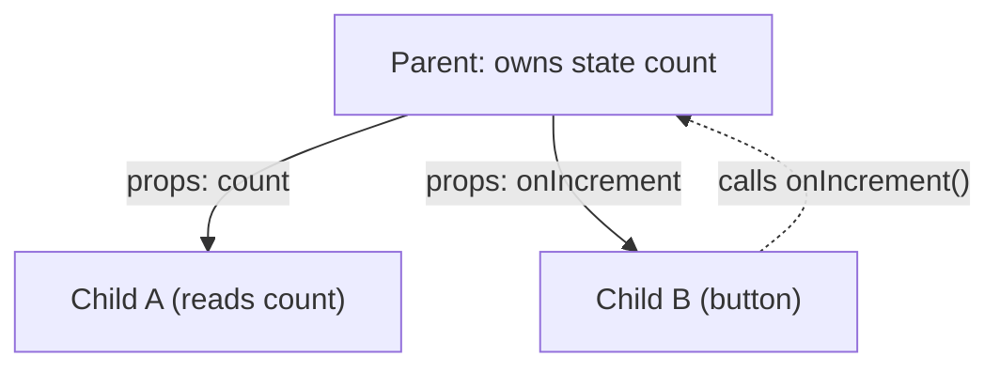

| State                                  | Props                                             |
| -------------------------------------- | ------------------------------------------------- |
| Data managed inside a component        | Data passed from parent → child                   |
| Can be updated by the component itself | Read-only (immutable) for the receiving component |



Data flows **down** as props; changes flow **up** as callback calls.

## What is state?

State is component-local data that changes over time and triggers re-renders when updated.

```text
state changes → component re-renders → UI shows new value
```

## What are props?

Props are read-only inputs passed from parent to child components.

```text
<Greeting name="Ali" />   →   function Greeting({ name }) { ... }   // name = "Ali"
```

---
