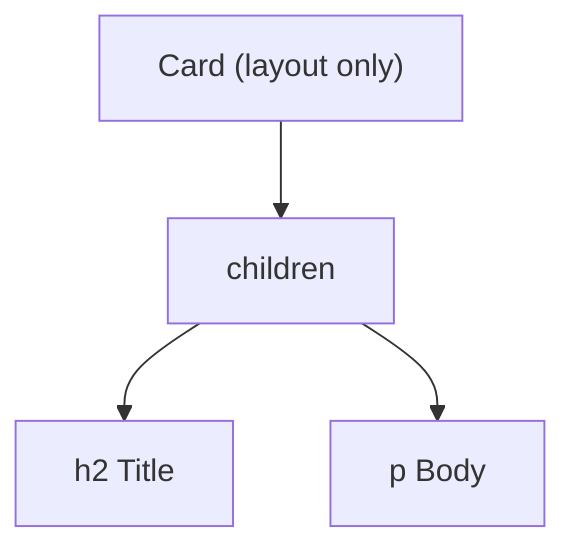

`children` is whatever you put between a component's opening and closing tags. Composition (passing components as children) is a common way to avoid prop drilling.

```jsx
function Card({ children }) {
  return <div className="card">{children}</div>;
}

<Card>
  <h2>Title</h2>
  <p>Body</p>
</Card>
```



---
