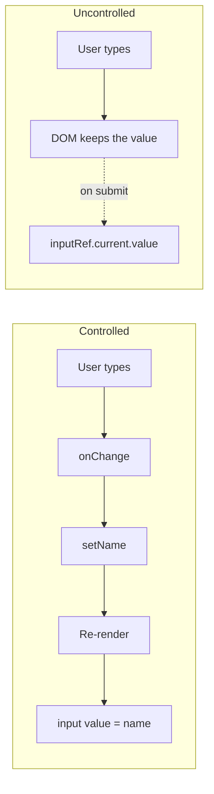

| Controlled                                           | Uncontrolled                                 |
| ---------------------------------------------------- | -------------------------------------------- |
| Data stored in React state                           | Data stored directly in the DOM              |
| Value read from a state variable                     | Value read via a ref (`useRef`) when needed  |
| Re-renders on every keystroke                        | Typing does not re-render the component      |
| Enables real-time, character-by-character validation | Validation usually happens at submit time    |

```jsx
// Controlled
const [name, setName] = useState('');
<input value={name} onChange={(e) => setName(e.target.value)} />;

// Uncontrolled
const inputRef = useRef(null);
<input ref={inputRef} defaultValue="" />;
```



---
