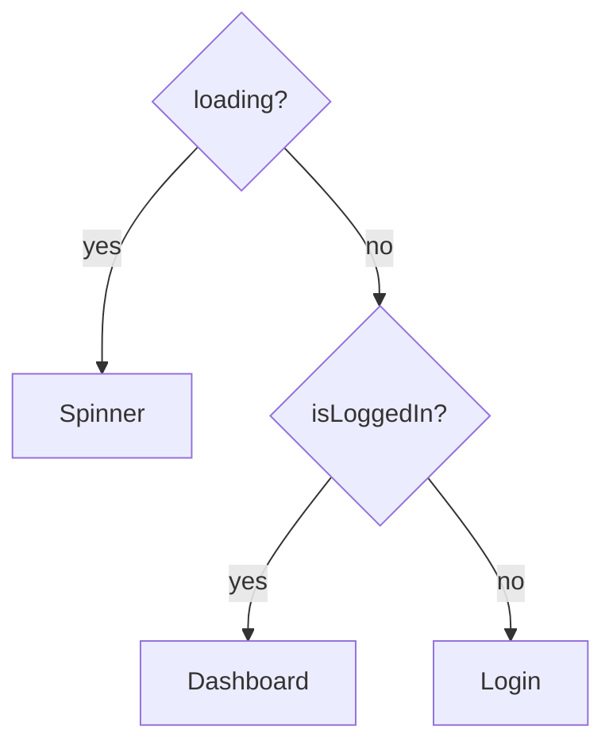

Rendering different UI depending on a condition.

```jsx
// if / else
if (loading) return <Spinner />;

// Ternary
{isLoggedIn ? <Dashboard /> : <Login />}

// Logical &&
{hasError && <ErrorMessage />}
```

**Careful with `&&`:** a number like `0` renders as `0` instead of nothing. Use `count > 0 && <List />` rather than `count && <List />`.



---
