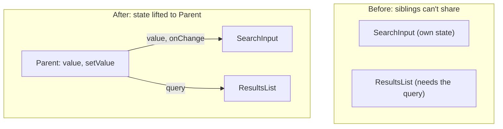

Moving local state from child components up to their closest common parent, so multiple children can share, sync, and update the same data.

```jsx
function Parent() {
  const [value, setValue] = useState('');
  return (
    <>
      <SearchInput value={value} onChange={setValue} />
      <ResultsList query={value} />
    </>
  );
}
```



---
