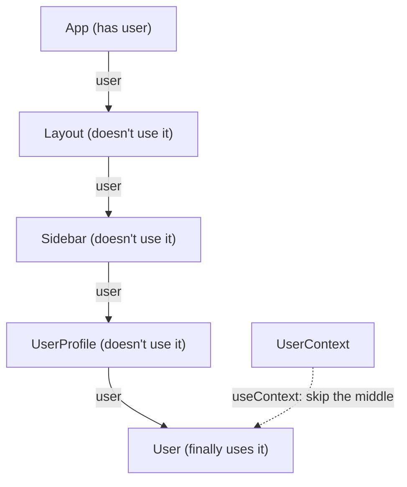

Passing data through multiple components that don't actually need the data themselves.

Solutions:

- Component composition (pass JSX as `children`)
- Context
- State-management libraries
- Better component architecture

**Note:** prop drilling isn't automatically bad. Passing props through one or two levels is often perfectly fine.

---
