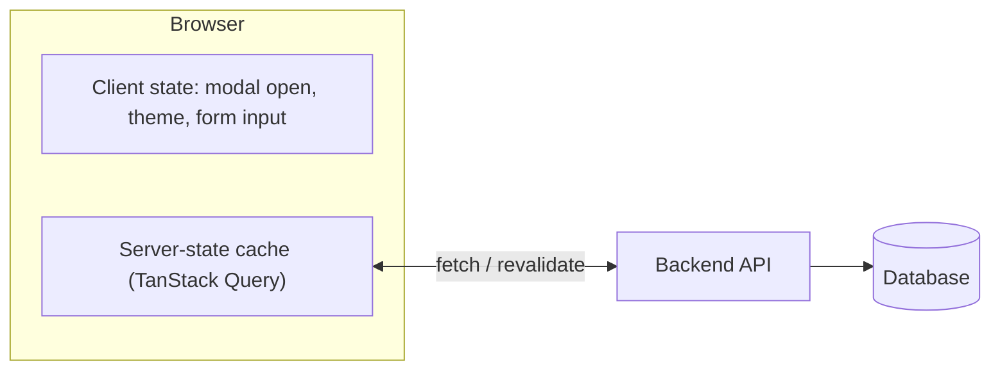

| Client State (UI State)                      | Server State (Remote State)                                 |
| -------------------------------------------- | ----------------------------------------------------------- |
| Lives in the UI / browser                    | Lives in the database / backend API                         |
| Synchronous and predictable                  | Asynchronous and unpredictable                              |
| Lost on page refresh                         | Persistent across sessions and devices                      |
| Concerns: scoping, re-renders, prop drilling | Concerns: caching, deduplication, revalidation, concurrency |
| `useState`, Zustand, Redux, Jotai            | TanStack Query, SWR, RTK Query                              |

---
