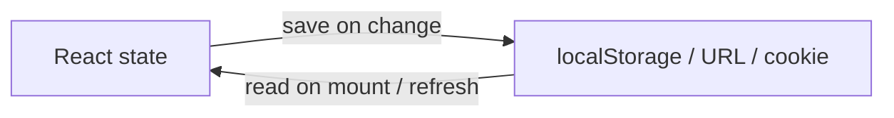

- Browser storage (`localStorage`, `sessionStorage`)
- Cookies
- IndexedDB
- URL / query params (good for filters and pagination)

```mermaid
flowchart LR
    S["React state"] -->|"save on change"| L["localStorage / URL / cookie"]
    L -->|"read on mount / refresh"| S
```

---
