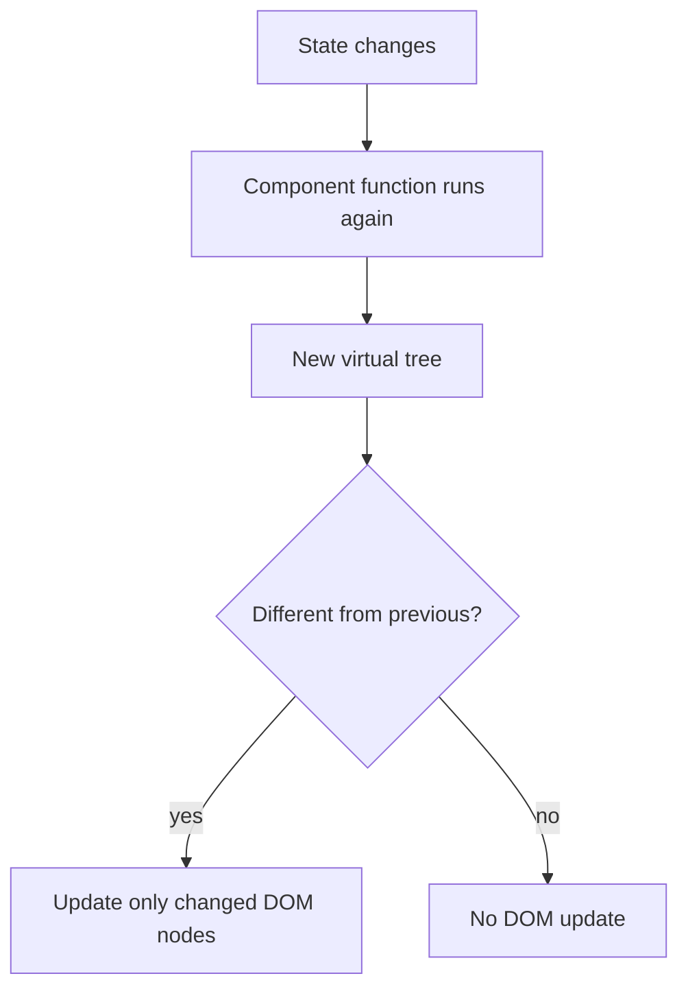

1. The component function runs again (or `render()` for class components)
2. React generates a new Virtual DOM tree
3. React diffs it against the previous tree
4. React calculates the minimal set of changes (reconciliation)
5. Only the changed nodes are updated in the real DOM (commit phase)

**A re-render doesn't always mean the real DOM changes.** If the output is identical, React skips the DOM update.

## Does a state change always update the real DOM?

**No.**

- State change → triggers a re-render (Virtual DOM recalculated)
- The real DOM is updated **only if** diffing detects an actual difference

React also **bails out entirely** if you set state to the same value it already has (compared with `Object.is`), so sometimes not even the re-render happens.

---
